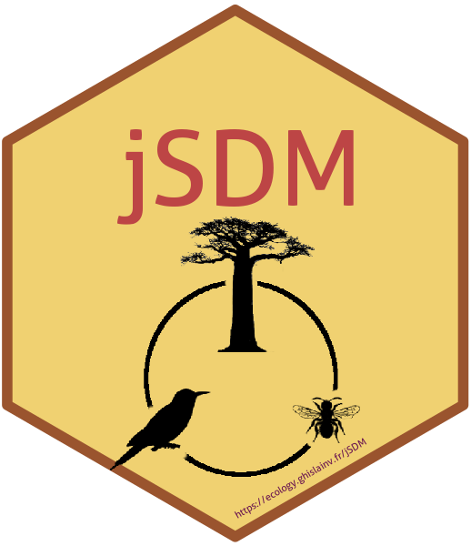

<!-- README.md is generated from README.Rmd. Please edit that file -->

```{r, echo = FALSE}
knitr::opts_chunk$set(
  collapse = TRUE,
  comment = "#>",
  fig.path = "man/figures/"
)
```

# jSDM R Package 

[](https://travis-ci.org/ghislainv/jSDM)
[](https://cran.r-project.org/package=jSDM)
[](https://doi.org/10.5281/zenodo.3253460)
[](https://cran.r-project.org/package=jSDM)

Package for fitting joint species distribution models (jSDM) in a hierarchical Bayesian framework [@Warton2015]. The Gibbs sampler is written in C++. It uses Rcpp, Armadillo and GSL to maximize computation efficiency.

## System requirements

Make sure the GNU Scientific Library ([GSL](https://www.gnu.org/software/gsl/)) is installed on your system.

## Installation

Install the latest stable version of **jSDM** from [CRAN](https://cran.r-project.org/) with:

```{r cran, eval=FALSE}
install.packages("jSDM")
```

Or install the development version of **jSDM** from [GitHub](https://github.com/ghislainv/jSDM) with:

```{r github, eval=FALSE}
devtools::install_github("ghislainv/jSDM")
```

## References