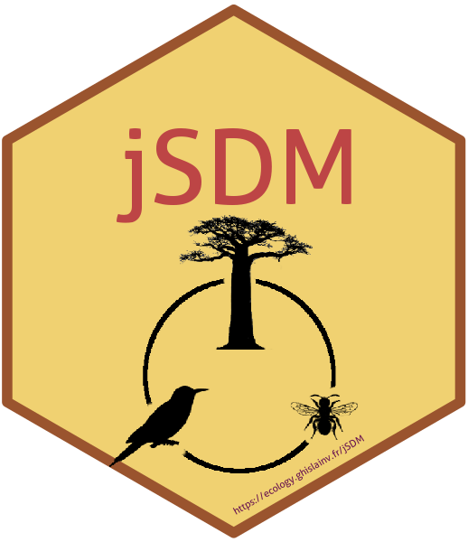

<!-- README.md is generated from README.Rmd. Please edit that file -->

# jSDM R Package 

[](https://travis-ci.org/ghislainv/jSDM)
[](https://cran.r-project.org/package=jSDM)
[](https://doi.org/10.5281/zenodo.3253460)
[](https://cran.r-project.org/package=jSDM)

Package for fitting joint species distribution models (jSDM) in a
hierarchical Bayesian framework (Warton *et al.*
[2015](#ref-Warton2015)). The Gibbs sampler is written in C++. It uses
Rcpp, Armadillo and GSL to maximize computation efficiency.

## System requirements

Make sure the GNU Scientific Library
([GSL](https://www.gnu.org/software/gsl/)) is installed on your system.

## Installation

Install the latest stable version of **jSDM** from
[CRAN](https://cran.r-project.org/) with:

``` r
install.packages("jSDM")
```

Or install the development version of **jSDM** from
[GitHub](https://github.com/ghislainv/jSDM) with:

``` r
devtools::install_github("ghislainv/jSDM")
```

## References

<div id="refs" class="references">

<div id="ref-Warton2015">

Warton, D.I., Blanchet, F.G., O’Hara, R.B., Ovaskainen, O., Taskinen,
S., Walker, S.C. & Hui, F.K. (2015) So many variables: Joint modeling in
community ecology. *Trends in Ecology & Evolution*, **30**, 766–779.

</div>

</div>
