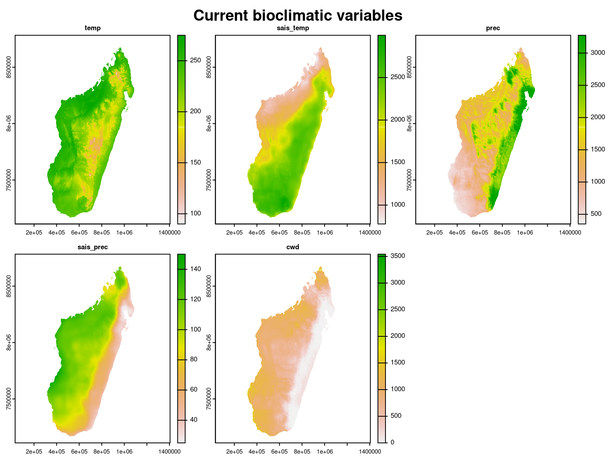
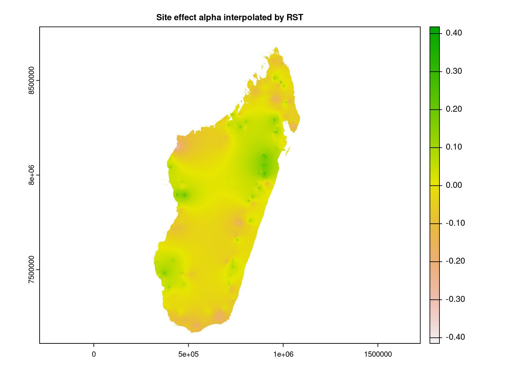
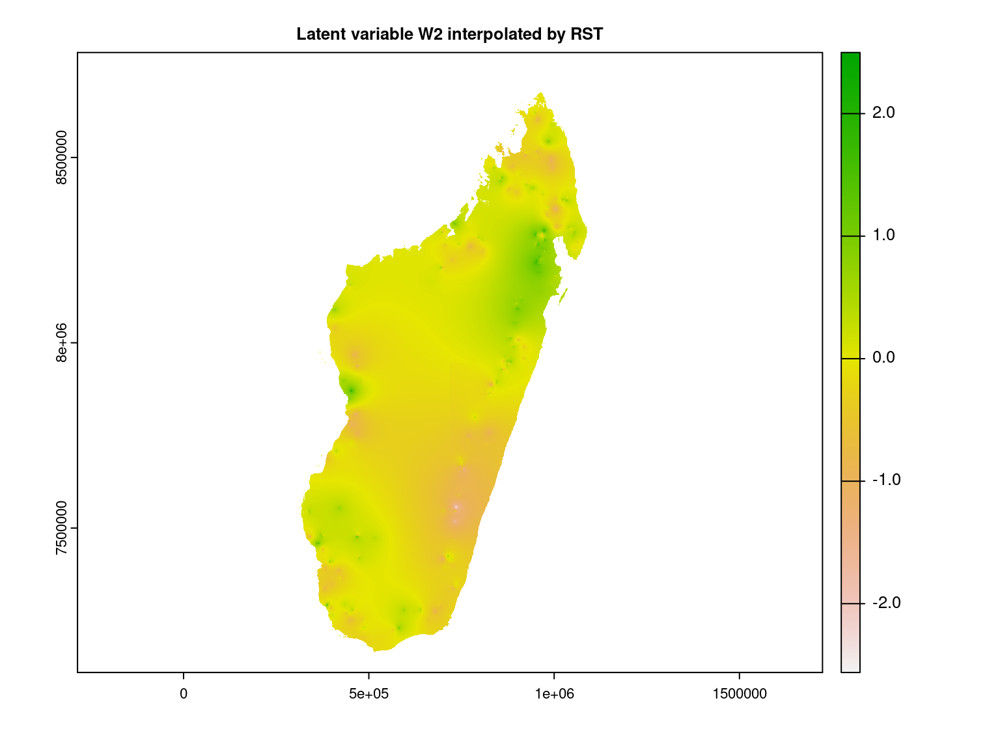
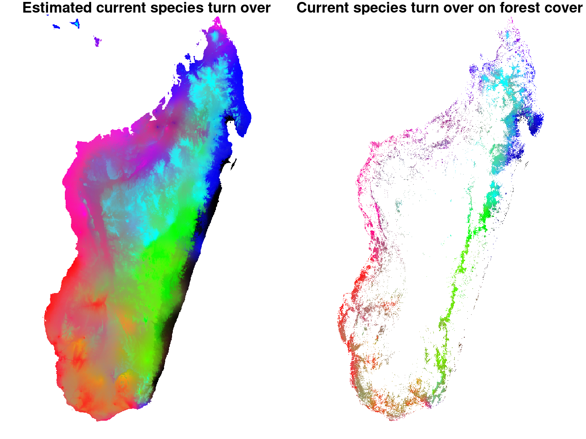
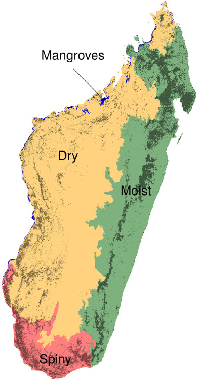

```{r setup, include=FALSE}
knitr::opts_chunk$set(
  fig.align="center",
  fig.width=8, fig.height=6,
  cache=TRUE,
  collapse=TRUE,
  comment="#>",
  highlight=TRUE,
  eval=FALSE
)
```

We want to identify biodiversity refuge zones in Madagascar

# Load librairies

```{r load-librairies, echo=FALSE}
library(ade4)
library(parallel)
library(doParallel)
#library(readr)
#library(dplyr)
library(raster)
#library(rgdal)
library(jSDM)
library(kableExtra)
```

# Datasets

## Forest inventory 

National forest inventories carried out on $753$ sites on the island of Madagascar are available, listing the presence or absence of $555$ plant species on each of these sites between 1994 and 1996.
We use these forest inventories to calculate a matrix indicating the presence by a $1$ and the absence by a $0$ of the species at each site by removing observations for which the species is not identified. This matrix therefore records the occurrences of $483$ species at $751$ sites.

```{r forest-inventory}
# forest inventory
trees <- read.csv("~/Documents/projet_BioSceneMada/forest_inventory_Madagascar.csv")
trees <- trees[-which(is.na(trees$sp)),]
trees$plot <- as.character(trees$plot)
plots <- unique(trees$plot)
nplot <- length(plots)
sp <- unique(trees$taxize)
nsp <- length(sp)
# presence/absence of each species on each plot
nplot <- length(unique(trees$plot))
species <- unique(trees$taxize)
nsp <- length(species)
# presence/absence of each species on each plot
PA <- matrix(0,nplot,nsp)
rownames(PA) <- paste(sort(as.numeric(unique(trees$plot))))
colnames(PA) <- species
for (i in 1:nplot){    
  for (j in 1:nsp){
    idx <- which(trees$taxize == species[j])
    PA[paste(trees$plot[idx]),j] <- 1 
  }
}
# save presence/absence at inventory sites matrix
save(PA, file="~/Documents/projet_BioSceneMada/Report/data/PA.RData")
```

## Current environmental variables

Among the climatic and environmental data available on the site \url{https://madaclim.cirad.fr} concerning the whole island of Madagascar at present (interpolations of representative observed data from the years 1950-2000).
We choose to use the following variables because they have an ecological meaning which makes them easily interpretable and are little correlated between them according to the article @Vieilledent2013 : 
the average annual precipitation (mm)

- **temp**: the average annual temperature ($^\circ C\times 10$).
- **prec**: the average annual precipitation (mm).
- **sais_temp**: the seasonality of temperatures corresponds to the standard deviation of monthly temperatures multiplied by $100$.
- **sais_prec**: the seasonality of precipitation as a coefficient of variation.
- **cwd**: the annual climatic water deficit (mm) is based on monthly precipitation ($prec$) and potential evapotranspiration ($pet$) which is defined as the amount of evaporation that would occur in a month if a sufficient water source were available: $\mathrm{cwd}= \sum_{m=1}^{12}\min(0, \ \mathrm{prec}_m-\ \mathrm{pet}_m)$.

We consider also the quadratic effects of these climate variables to perform a quadratic regression, which is more suitable for fitting a niche model than a linear regression. 

```{r current-environmental-variables}
# climatic variables 
s <- stack("~/Documents/projet_BioSceneMada/Report/data/current.tif")
names(s) <- c(paste("tmin",1:12,sep=""),paste("tmax",1:12,sep=""),
              paste("prec",1:12,sep=""),paste("bio",1:19,sep=""),
              paste("pet",1:12,sep=""),"pet","cwd","ndm")
# get interesting covariates
clim_var <- dropLayer(s, c(1:36,38,39,41:47,49,50,52:68,70))
names(clim_var) <- c("temp","prec","sais_temp","sais_prec","cwd")
# representation
par(oma=c(0,0,2,1))
plot(clim_var)
title("Current bioclimatic variables", outer=TRUE, cex=0.8)

# spatial points of each plot
coords <- unique(cbind(trees$long,trees$lat, as.numeric(trees$plot)))
coords <- coords[sort(coords[,3], index.return=TRUE)$ix,]
longlat <- SpatialPoints(coords[,1:2])
proj4string(longlat) <- CRS("+proj=longlat +ellps=clrk66")

# lat long to UTM38S projection 
xy <- spTransform(longlat, CRS("+proj=utm +zone=38 +south +datum=WGS84 +units=m +no_defs +ellps=WGS84 +towgs84=0,0,0"))

# extract climatic data on each plot
clim <-  raster::extract(clim_var,xy)
clim2 <- clim^2
colnames(clim2)<-paste(colnames(clim),rep("2",ncol(clim)),sep="")
pos <- coords
colnames(pos) <- c("long","lat","site")

# Add squared data
data_clim2 <- data.frame(cbind(clim,clim2,pos))
nparam <- ncol(data_clim2) -3
library(tidyverse)

# reduced centered data
scaled_data_clim2 <- scale(data_clim2[,1:nparam])
means <- attr(scaled_data_clim2,"scaled:center")
sds <- attr(scaled_data_clim2,"scaled:scale")
scaled_data_clim2 <- as_tibble(cbind(site=data_clim2$site,scaled_data_clim2,lat=data_clim2$lat,long=data_clim2$long))

## Design matrix
X <- data.frame(intercept=rep(1,nplot),dplyr::select(scaled_data_clim2,-lat,-long, -site))
np <- ncol(X)
write.csv(X, file = "~/Documents/projet_BioSceneMada/Report/data/X.csv",row.names = F)

# save climatic data at inventory sites
save(scaled_data_clim2, means, sds, xy,
     file="~/Documents/projet_BioSceneMada/Report/data/scaled_data_clim.RData")

# save raster in .tif format
# Add squared data
clim_var <- stack(clim_var,clim_var^2)
# Center and reduce climatic variables 
# using means and standard deviations of climatic variables at inventory sites
scaled_clim_var <- (clim_var-means)/sds
writeRaster(scaled_clim_var,"~/Documents/projet_BioSceneMada/Report/data/scaled_clim.tif",
            format="GTiff", options=c("COMPRESS=LZW", "PREDICTOR=2"), overwrite=TRUE)
```

```{r current-environmental-variables2, echo=FALSE, out.width=800, eval=TRUE}

```

The values of these climate variables corresponding to the coordinates of the inventory plots are extracted and scaled to obtain the following data-set where coordinates of the sites will then be used for spatial interpolation and to spatially represent the results.

```{r current-environmental-data, echo=FALSE, out.width=800}
load("~/Documents/projet_BioSceneMada/Report/data/scaled_data_clim.RData")
kable(head(scaled_data_clim2), digits=3) %>%
  kable_styling(bootstrap_options = "striped", 
                latex_options= c("HOLD_position","striped"),
                full_width = FALSE)
```

# Fitting joint species distribution model (JSDM) 

## Model definition

Referring to the models used in the articles @Warton2015 and @Albert1993, we define the following latent variable model (LVM) to account for species co-occurrence on all sites :

$$ \mathrm{probit}(\theta_{ij}) =\alpha_i + \beta_{0j}+X_i.\beta_j+ W_i.\lambda_j $$

- Link function probit: $\mathrm{probit}: q \rightarrow \Phi^{-1}(q)$ where $\Phi$ correspond to the distribution function of the reduced centered normal distribution.

- Response variable: $Y=(y_{ij})^{i=1,\ldots, n_{site}}_{j=1,\ldots,n_{species}}$ with:

$$y_{ij}=\begin{cases}
0 & \text{ if species $j$ is absent on the site $i$}\\
1 &  \text{ if species  $j$ is present on the site $i$}.
\end{cases}$$

- Latent variable $z_{ij} = \alpha_i + \beta_{0j} + X_i.\beta_j + W_i.\lambda_j + \epsilon_{i,j}$, with $\forall (i,j) \ \epsilon_{ij} \sim \mathcal{N}(0,1)$ and such that:

$$y_{ij}=\begin{cases}
1 & \text{if} \ z_{ij} > 0 \\
0 &  \text{otherwise.}
\end{cases}$$

It can be easily shown that: $y_{ij} \sim \mathcal{B}ernoulli(\theta_{ij})$. 

- Latent variables: $W_i=(W_i^1,\ldots,W_i^q)$ where $q$ is the number of latent variables considered, which has to be fixed by the user (by default $q=2$).
We assume that $W_i \sim \mathcal{N}(0,I_q)$ and we define the associated coefficients  $\lambda_j=(\lambda_j^1,\ldots, \lambda_j^q)'$, also known as "factor loadings" [@Warton2015]. We use a prior distribution $\mathcal{N}(0,1)$ for all lambda not concerned by constraints to $0$ on upper diagonal and to strictly positive values on diagonal. 

- Explanatory variables: bioclimatic data about each site. $X=(X_i)_{i=1,\ldots,n_{site}}$ with $X_i=(x_i^1,\ldots,x_i^p)\in \mathbb{R}^p$ where $p$ is the number of bioclimatic variables considered.
The corresponding regression coefficients for each species $j$ are noted : $\beta_j=(\beta_j^1,\ldots,\beta_j^p)'$. We use a prior distribution $\mathcal{N}(0,1)$ for all beta.  

- $\beta_{0j}$ correspond to the intercept for species $j$ which is assumed to be a fixed effect. We use a prior distribution $\mathcal{N}(0,10)$ for the species intercept. 

- $\alpha_i$ represents the random effect of site $i$ such as $\alpha_i \sim \mathcal{N}(0,V_{\alpha})$ and we assume that $V_{\alpha} \sim \mathcal {IG}(\text{shape}=0.1, \text{rate}=0.1)$ as prior distribution by default. 

This model is equivalent to a multivariate GLMM $\mathrm{g}(\theta_{ij}) = \alpha_i + X_i.\beta_j + u_{ij}$, where $u_{ij} \sim \mathcal{N}(0, \Sigma)$ with the constraint that the variance-covariance matrix $\Sigma = \Lambda \Lambda^{\prime}$, where $\Lambda$ is the full matrix of factor loadings, with the $\lambda_j$ as its columns. 

## Parameters inference

We fit a binomial joint species distribution model, including two latent variables and random site effect using the `jSDM_binomial_probit()` function to perform binomial probit regression considering all the species from the data described above, by performing $100 000$ iterations including $40 000$ of burn-in and we retain $N_{samp}=1 000$ values for each parameter of the model.
We use species's prevalence as starting values for species intercept $\beta_0$. 

```{r fit-jSDM-Mada-data, echo=TRUE, eval=FALSE}
load("~/Documents/projet_BioSceneMada/Report/data/scaled_data_clim.RData")
load("~/Documents/projet_BioSceneMada/Report/data/PA.RData")
# Prevalence of species 
np <- ncol(dplyr::select(scaled_data_clim2, -site, -lat, -long)) +1
prevalence <- colSums(PA)/nrow(PA)
beta_start <- matrix(0,np,ncol(PA))
beta_start[1,] <- qnorm(prevalence)
# 
T1<- Sys.time()
mod_all <- jSDM::jSDM_binomial_probit(
  # Response variable 
  presence_data = PA, 
  # Explanatory variables 
  site_formula = ~ temp + prec + sais_temp + sais_prec + cwd + temp2 + prec2 + sais_temp2 + sais_prec2 + cwd2,   
  site_data=scaled_data_clim2, 
  n_latent=2,
  site_effect="random", 
  # Chains
  burnin= 40000, mcmc=40000, thin=40,
  # Starting values
  alpha_start=0, beta_start=beta_start,
  lambda_start=0, W_start=0,
  V_alpha=1, 
  # Priors
  shape=0.1, rate=0.1,
  mu_beta=0, V_beta=c(10,rep(1,np-1)),
  mu_lambda=0, V_lambda=1,
  # Various 
  seed=1234, verbose=1)
T2 <- Sys.time()
T_all <- difftime(T2,T1)
save(mod_all,T_all,file="~/Documents/projet_BioSceneMada/Report/data/mada_mod.RData")
```

```{r fit-JSDM-Mada-table, echo=FALSE, include=TRUE}
load("~/Documents/projet_BioSceneMada/Report/data/mada_mod.RData")
nsp<-ncol(mod_all$model_spec$presence_data)
nplot<-nrow(mod_all$model_spec$presence_data)
p <- ncol(mod_all$model_spec$beta_start)
T_all <- as.numeric(T_all,units="hours")
results <- data.frame(nsp,nplot,n_obs=nsp*nplot,n_param=(p+1)*nsp+2*nsp-1+2*nplot+nplot+1, ngibbs="80000","Time"= T_all, dev=mean(mod_all$mcmc.Deviance))
colnames(results)<- c("Number of species", "Number of sites", "Number of observations","Number of estimated parameters", "Iterations performed","Compilation time (hours)","Deviance")
knitr::kable(results, row.names=F, digits=1, booktabs=TRUE, align = 'c') %>%
		kableExtra::kable_styling(latex_options=c("HOLD_position","striped"), full_width=FALSE)
```


The MCMC algorithm is used to obtain draws from the posterior distribution of the parameters. We use as estimator for each parameter the mean of the $N_{samp}$ values estimated in corresponding MCMC chain and we save the estimated parameters in .csv format.

```{r save-params, echo=TRUE, eval=FALSE}
load("~/Documents/projet_BioSceneMada/Report/data/mada_mod.RData")
load("~/Documents/projet_BioSceneMada/Report/data/scaled_data_clim.RData")

species <- colnames(mod_all$model_spec$presence_data)
nplot <- nrow(mod_all$model_spec$presence_data)
nsp <- ncol(mod_all$model_spec$presence_data)
n_latent <- mod_all$model_spec$n_latent
np <- nrow(mod_all$model_spec$beta_start)

## Save parameters 
### alphas
alphas <- apply(mod_all$mcmc.alpha,2,mean)
### V_alpha
V_alpha <- mean(mod_all$mcmc.V_alpha)
### latent variables 
W1 <- colMeans(mod_all$mcmc.latent[["lv_1"]])
W2 <- colMeans(mod_all$mcmc.latent[["lv_2"]])

params_sites <- data.frame(plot = scaled_data_clim2$site,
                           lat = scaled_data_clim2$lat,
                           long = scaled_data_clim2$long,
                           alphas, V_alpha = rep(V_alpha,nplot),W1,W2)
write.csv(params_sites, file = "~/Documents/projet_BioSceneMada/Report/data/params_sites.csv",row.names = F)

### fixed species effect lambdas and betas 
lambdas <- matrix(0,nsp,n_latent)
betas <- matrix(0,nsp,np)

for (j in 1:nsp){
  for (l in 1:n_latent){
    lambdas[j,l] <- mean(mod_all$mcmc.sp[[j]][,np+l])
  }
  for (p in 1:np){
    betas[j,p] <- mean(mod_all$mcmc.sp[[j]][,p])
  }
}
colnames(betas) <- colnames(mod_all$mcmc.sp[[1]])[1:np]
params_species <- data.frame(species=species, Id_species = c(1:nsp),
                             betas, lambda_1 = lambdas[,1], lambda_2 = lambdas[,2])
write.csv(params_species, file ="~/Documents/projet_BioSceneMada/Report/data/params_species.csv",row.names = F)

## probit_theta_latent
write.csv(mod_all$probit_theta_latent, file = "~/Documents/projet_BioSceneMada/Report/data/probit_theta_latent.csv", row.names = F)
## theta_latent
write.csv(mod_all$theta_latent, file = "~/Documents/projet_BioSceneMada/Report/data/theta_latent.csv", row.names = F)
```

## Evaluation of MCMC convergence 

We visually evaluate the convergence of MCMCs by representing the trace and density *a posteriori* of the estimated parameters.

```{r results-Mada}
load("~/Documents/projet_BioSceneMada/Report/data/mada_mod.RData")
np <- nrow(mod_all$model_spec$beta_start)
species <- colnames(mod_all$model_spec$presence_data)
## alpha_i of the first site
par(mfrow=c(1,2),oma=c(1, 0, 1.4, 0))
coda::traceplot(mod_all$mcmc.alpha[,1],main="Trace of alpha_1",cex.main=1.6)
coda::densplot(mod_all$mcmc.alpha[,1],main="Density of alpha_1", cex.main=1.6)
abline(v=mean(mod_all$mcmc.alpha[,1]),col="blue")
title(main="Random site effect alpha_1",outer=T,cex.main=1.8)
## V_alpha
coda::traceplot(mod_all$mcmc.V_alpha,main="Trace of V_alpha",cex.main=1.6)
coda::densplot(mod_all$mcmc.V_alpha,main="Density of V_alpha", cex.main=1.6)
abline(v=mean(mod_all$mcmc.V_alpha),col="blue")
title(main=" Variance of random site effects",outer=T, cex.main=1.8)

## beta_j of the first two species
for (j in 1:2) {
  par(mfrow=c(2,2),oma=c(1, 0, 1.4, 0))
  for (p in 1:np) {
    coda::traceplot(mod_all$mcmc.sp[[j]][,p],
                    main=paste("Trace of", colnames(mod_all$mcmc.sp[[j]])[p]),cex.main=1.3)
    coda::densplot(mod_all$mcmc.sp[[j]][,p], 
                   main=paste("Density of", colnames(mod_all$mcmc.sp[[j]])[p]),cex.main=1.3)
    abline(v=mean(mod_all$mcmc.sp[[j]][,p]),col="blue")
    if(p==1) title(main=paste("Fixed species effect beta for species", species[j]), outer=T, cex.main=1.6)
  }
}

## lambda_j of the first two species
n_latent <- mod_all$model_spec$n_latent
par(mfrow=c(n_latent,2),oma=c(1, 0, 1.4, 0))
for (j in 1:2) {
  for (l in 1:n_latent) {
    coda::traceplot(mod_all$mcmc.sp[[j]][,np+l],
                    main = paste("Trace of", colnames(mod_all$mcmc.sp[[j]])[np+l]),cex.main=1.6)
    coda::densplot(mod_all$mcmc.sp[[j]][,np+l],
                   main = paste("Density of", colnames(mod_all$mcmc.sp[[j]])[np+l]),cex.main=1.6)
    abline(v=mean(mod_all$mcmc.sp[[j]][,np+l]),col="blue")
  }
  title(main=paste("Factor loadings lambda for species ", species[j]),outer=T,cex.main=1.8)
}

## Latent variables W_i for one site
par(mfrow=c(2,2),oma=c(1, 0, 1.4, 0))
for (l in 1:n_latent) {
  coda::traceplot(mod_all$mcmc.latent[[paste0("lv_",l)]][,1],
                  main = paste0(" Trace of W_1", l),cex.main=1.6)
  coda::densplot(mod_all$mcmc.latent[[paste0("lv_",l)]][,1],
                 main = paste0(" Density of W_1", l),cex.main=1.6)
  abline(v=mean(mod_all$mcmc.latent[[paste0("lv_",l)]][,1]),col="blue")
}
title(main="Latentes variables W_1", outer=T,cex.main=1.8)
## Deviance
par(mfrow=c(1,2),oma=c(1, 0, 1.5, 0))
coda::traceplot(mod_all$mcmc.Deviance,main="Trace",cex.main=1.6)
coda::densplot(mod_all$mcmc.Deviance,main="Density",cex.main=1.6)
abline(v=mean(mod_all$mcmc.Deviance),col="blue")
title(main = "Deviance",outer=T,cex.main=1.8)
# theta
par(mfrow=c(1,2))
hist(mod_all$probit_theta_latent,col="light blue",  main = "probit(theta) estimated")
hist(mod_all$theta_latent, breaks=pretty, col="light blue", main = "theta estimated")
```

```{r results-Mada2, echo=FALSE, out.width=700, eval=TRUE}
knitr::include_graphics(paste0("Madagascar_files/figure-html/results-Mada-"
                               , 1:18, ".png"))
```

Overall, the traces and densities of the parameters indicate the convergence of the algorithm. Indeed, we observe on the traces that the values oscillate around averages without showing any upward or downward trend and we see that the densities are quite smooth and for most of them of Gaussian form.

# Representation of results at inventory sites

## Presence probabilities 

```{r proba_representation}
theta_latent <- read.csv("~/Documents/projet_BioSceneMada/Report/data/theta_latent.csv")
load("~/Documents/projet_BioSceneMada/Report/data/scaled_data_clim.RData")
load("~/Documents/projet_BioSceneMada/Report/data/PA.RData")

# Madagascar borders
TA <- CRS("+init=epsg:32738 +units=m")
MADA <- readRDS("~/Documents/projet_BioSceneMada/Report/data/MADA.rds")
MADA <- sp::spTransform(MADA, TA)
# define groups for mapping
cuts <- c(0,0.1,0.2,0.3,0.4,0.5,0.7,0.8,0.9)
col <- c('red3','red','orange','yellow', 'yellow green', 'green3', 'forest green','dark green')
pols <- list("sp.polygons", MADA, fill = "lightgray")

# Observed presence absence
id_pres <- which(PA[,"Ocotea laevis"]==1)
id_abs <- which(PA[,"Ocotea laevis"]==0)
obs_pres <- data.frame(obs_pres=PA[id_pres,"Ocotea laevis"])
obs_abs <- data.frame(obs_abs=PA[id_abs,"Ocotea laevis"])
obs_pres <-  sp::SpatialPointsDataFrame(xy[id_pres,], obs_pres)
obs_abs <-  sp::SpatialPointsDataFrame(xy[id_abs,], obs_abs)
# Representation
par(mfrow=c(1,1))
sp::plot(MADA, main ="Observed occurences of Ocotea laevis",cex.main=1.4) 
points(obs_pres,pch=16,cex=1.2)
points(obs_abs,pch=1,cex=1.2)
legend("right",legend=c("presence","absence") ,pch=c(16,1))

# Estimated probabilities of presence
theta_latent_sp <- SpatialPointsDataFrame(xy,theta_latent)
names(theta_latent_sp) <- make.names(colnames(PA))
# Representation
sp::spplot(theta_latent_sp, 'Ocotea.laevis', cuts=cuts, col.regions=col, sp.layout=pols, pch=20, cex=1.6, key.space
           ="right", main ="Estimated probabilities of presence for Ocotea laevis",cex.main=5)
```

```{r proba-representation2, echo=FALSE,  fig.show = "hold", out.width = "50%",  fig.align = "default", eval=TRUE}
knitr::include_graphics(c("Madagascar_files/figure-html/proba_representation-1.png","Madagascar_files/figure-html/proba_representation-2.png"))
```

It can be observed that the inventory sites where this species was observed match those for which a high probability of presence was estimated by the JSDM.

## Species richness 

Species richness also called diversity $\alpha$ reflects the number of species coexisting in a given environment and is computed by summing the number of species present on each site.  

We spatially represent the species richness observed at each inventory site defined by $R_i=\sum\limits_ {j=1}^{n_{species}} y_{ij}$ and the species richness estimated, following @Scherrer2020, by summing the estimated occurrence probabilities of all species on each site: $\widehat{R}_i=\sum\limits_ {j=1}^{n_{species}} \widehat{\theta}_{ij}$.

```{r species-richness-representation}
par(mfrow=c(1,1))
species_richness <- data.frame(species_richness= apply(theta_latent,1,sum))
species_richness_sp <- SpatialPointsDataFrame(xy, species_richness)
cuts <- c(0,2,4,8,12,16,20,24,ncol(theta_latent))
col <- c('red4','red','orange','yellow', 'yellow green', 'green3', 'forest green','dark green')
pols <- list("sp.polygons", MADA, fill = "lightgray")
spplot(species_richness_sp, 'species_richness', cuts=cuts, col.regions=col, sp.layout=pols, pch=20, cex=1.6, key.space="right", main ="Estimated species richness")

species_richness_obs <- data.frame(species_richness_obs=rowSums(PA))
species_richness_obs_sp <- SpatialPointsDataFrame(xy, species_richness_obs)
spplot(species_richness_obs_sp, 'species_richness_obs', cuts=cuts, col.regions=col, sp.layout=pols, pch=20, cex=1.6, key.space="right", main ="Observed species richness")
plot(species_richness_obs$species_richness_obs,species_richness$species_richness, main="Species richness", xlab="observed", ylab="estimated", cex.main=1.4, cex.lab=1.3)
abline(a=0,b=1,col='red')
```

```{r species-richness-representation2, echo=FALSE, fig.show = "hold", out.width = "50%", fig.align = "default", eval=TRUE}
knitr::include_graphics(c("Madagascar_files/figure-html/species-richness-representation-2.png","Madagascar_files/figure-html/species-richness-representation-1.png"))
```

```{r species-richness-representation3, echo=FALSE, fig.show = "hold", out.width = "50%", fig.align = "center", eval=TRUE}
knitr::include_graphics("Madagascar_files/figure-html/species-richness-representation-3.png")
```

It can be seen that the observed species richness on the inventory sites corresponds fairly well to that estimated by summing the estimated probabilities of occurrence of all species on each site.    

Moreover, we can see that the observed species richness is greater in the moist forest of the north-east of the island, particularly in the Masoala peninsula. 

## Residual correlation 

 After fitting the JSDM with latent variables, the **full species residual correlation matrix** $R=(R_{ij})^{i=1,\ldots, n_{site}}_{j=1,\ldots, n_{species}}$ can be derived from the covariance in the latent variables such as : 
 $$\Sigma_{ij} = \begin{cases}
 \lambda_i .\lambda_j^T & \text{ if } i \neq j \\
  \lambda_i .\lambda_j^T + 1 & \text{ if } i=j
 \end{cases}$$, then we compute correlations from covariances :
  $$R_{i,j} = \frac{\Sigma_{ij}}{\sqrt{\Sigma _{ii}\Sigma _{jj}}}$$.
  
```{r residual-correlation, eval=FALSE}
load("~/Documents/projet_BioSceneMada/Report/data/mada_mod.RData")
n.species <- ncol(mod_all$model_spec$presence_data)
n.mcmc <- nrow(mod_all$mcmc.latent[[1]])
Tau.cor.arr <- matrix(NA,n.mcmc,n.species^2)

for(t in 1:n.mcmc) { 
  lv.coefs <- t(sapply(mod_all$mcmc.sp, "[", t, grep("lambda",colnames(mod_all$mcmc.sp[[1]]))))
  Tau.mat <- lv.coefs %*% t(lv.coefs) + diag(n.species)
  Tau.cor.mat <- cov2cor(Tau.mat)
  Tau.cor.arr[t,] <- as.vector(Tau.cor.mat) 
}
## Average over the MCMC samples
R <- matrix(apply(Tau.cor.arr,2,mean),n.species,byrow=F)
write.csv(R, file ="~/Documents/projet_BioSceneMada/Report/data/R.csv", row.names = F)
```

We plot the top 100 estimated residual correlations between species based on their number of observed occurrences and environmental preferences. 

```{r plot-associations, echo=TRUE, fig.dim=c(6,6)}
# Forest inventory 
load("~/Documents/projet_BioSceneMada/Report/data/PA.RData")
# Species parameters 
params_species <- read.csv(file = "~/Documents/projet_BioSceneMada/Report/data/params_species.csv")
# Residual correlation matrix R
R <- read.csv("~/Documents/projet_BioSceneMada/Report/data/R.csv")
colnames(R) <- rownames(R) <- make.names(params_species$species)
R <- as.matrix(R)
library(viridis)
jSDM::plot_associations(R, circleBreak=TRUE, occ=PA, top=50,
                  main="Species-species association sorted after their frequency",
                  cols_association=viridis::viridis(10),
                  cols_occurrence=viridis::magma(10),
                  species_order="frequency")
# Average of MCMC samples of species effect beta except the intercept
effects = params_species[,grep("beta", colnames(params_species))[-1]]
np <- ncol(effects)
# Add absolute quadratic and linear effects of each environmental variable
effects <- abs(effects[,1:(np/2)]) + abs(effects[,(np/2 +1):np])
colnames(effects) <-  gsub("beta_", "",colnames(effects))
jSDM::plot_associations(R, env_effect=effects, top=50,
                  main="Species-species association sorted after their main environmental effect",
                  cols_association=viridis::viridis(10),
                  species_order="main env_effect")
```

```{r plot-associations2, echo=FALSE, out.width=500, out.height=555, eval=TRUE}
knitr::include_graphics("Madagascar_files/figure-html/plot-associations-1.png")
```

The figure above shows the correlations between species, with the 483 species sorted according to the number of sites where they occur out of the 751 inventoried.

```{r plot-associations3,  echo=FALSE, out.width=500, out.height=555, eval=TRUE}

```

The figure above shows the same covariance structure but with the species sorted according to their largest environmental coefficients ($\beta$) (the outer ring shows the distribution of
environmental effect for species within the sample).

This representation of associations between species allows us to observe the positive or negative correlations between species which can be interpreted in terms of positive or negative influence of the presence of a species on the on the probability of occurrence of another.

# Intrapolation of parameters between inventory sites 

The presence of a spatial structure where observations close to each other are more similar than those far away (spatial auto-correlation) is a prerequisite for the application of geostatistics and from the previous spatial representations it seems to be satisfied.  

Thus, it is possible to interpolate sites' parameters for the whole island from those estimated for the inventory plots using the spatial interpolation method called regularized spline with tension (**RST**) from [`GRASS GIS`](https://grass.osgeo.org/) software via `rgrass7` R package.
This method is described in the article [@Mitasova1993].

## Random site effect $\alpha$

```{r initialize-GRASS}
## Initialize GRASS
setwd("~/Documents/jSDM/vignettes")
Sys.setenv(LD_LIBRARY_PATH=paste("/usr/lib/grass78/lib", Sys.getenv("LD_LIBRARY_PATH"),sep=":"))
library(rgrass7)
# use a georeferenced raster
system('grass -c ~/Documents/projet_BioSceneMada/Report/data/scaled_clim.tif grassdata/interpolation')
# connect to grass database
initGRASS(gisBase="/usr/lib/grass78", 
          gisDbase="grassdata",
          location="interpolation", mapset="PERMANENT",
          override=TRUE)
```

We interpolate the random site effect at Madagascar scale using RST method.

```{r RST_alpha}
library(rgrass7)
# Import sites parameters
params_sites <- read.csv("~/Documents/projet_BioSceneMada/Report/data/params_sites.csv")
longlat <- SpatialPoints(params_sites[,c("long","lat")])
proj4string(longlat) <- CRS("+proj=longlat +ellps=clrk66 +units=m")
# lat-long to UTM38S projection 
xy = spTransform(longlat, CRS("+proj=utm +zone=38 +south +datum=WGS84 +units=m +no_defs +ellps=WGS84 +towgs84=0,0,0"))
# alpha 
alpha_sp <- SpatialPointsDataFrame(xy, data.frame(alpha=params_sites$alphas))
use_sp()
rgrass7::writeVECT(alpha_sp, "alpha", v.in.ogr_flags="overwrite")
# Import Madagascar shape file
clim <- stack("~/Documents/projet_BioSceneMada/Report/data/current.tif")
Madagascar <- as(clim[[1]], 'SpatialGridDataFrame')
rgrass7::writeRAST(Madagascar, "Madagascar", flags="overwrite")
# Re-sample with RST
# Note: use maskmap=Madagascar to save computation time
# for punctual data use function v.surf.rst
system("v.surf.rst --overwrite --verbose -t tension=3 input=alpha zcolumn=alpha \\
       smooth=0.0 elevation=alpha_rst mask=Madagascar")
# Export
system("r.out.gdal --overwrite input=alpha_rst \\
			 output=Madagascar_cache/alpha_rst.tif type=Float32 \\
			 createopt='compress=lzw,predictor=2'")
# Representation
test_in <- raster("Madagascar_cache/alpha_rst.tif")
plot(test_in, main="Site effect alpha interpolated by RST")
test_xy <- raster::extract(test_in, xy)
plot(test_xy, params_sites$alphas, xlab="alpha interpolated by RST", ylab="alpha estimated by JSDM",
          main="Random site effect")
abline(a=0, b=1, col='red')
```

We represent the random site effect interpolated at Madagascar scale. 

```{r plot-RST-alpha, echo=FALSE, out.width=800, eval=TRUE}

```

## Latent variables $W$

We interpolate the first axis of latent variables at the Madagascar scale using the RST method.

```{r RST-W1}
# W1 
W1_sp <- SpatialPointsDataFrame(xy, data.frame(W1=params_sites$W1))
rgrass7::writeVECT(W1_sp, "W1", v.in.ogr_flags="overwrite")
# Re-sample with RST
# Note: use maskmap=Madagascar to save computation time
# for punctual data use function v.surf.rst
system("v.surf.rst --overwrite --verbose -t tension=3 input=W1 zcolumn=W1 \\
       smooth=0.0 elevation=W1_rst mask=Madagascar")
# Export
system("r.out.gdal --overwrite input=W1_rst \\
			 output=Madagascar_cache/W1_rst.tif type=Float32 \\
			 createopt='compress=lzw,predictor=2'")
# Representation
test_in <- raster("Madagascar_cache/W1_rst.tif")
plot(test_in, main="Latent variable W1 interpolated by RST")
test_xy <- raster::extract(test_in, xy)
plot(test_xy, params_sites$W1,xlab="W1 nterpolated by RST", ylab="W1 estimated by JSDM", 
     main="First latent axe")
abline(a=0, b=1, col='red')
```

We represent the first latent variable interpolated at Madagascar scale. 

```{r plot-RST-W1, echo=FALSE, out.width=800, eval=TRUE}
knitr::include_graphics("Madagascar_files/figure-html/RST-W1-1.png")
```


We interpolate the second axis of latent variables at the Madagascar scale using the RST method.

```{r RST-W2}
# W2 
W2_sp <- SpatialPointsDataFrame(xy, data.frame(W2=params_sites$W2))
rgrass7::writeVECT(W2_sp, "W2", v.in.ogr_flags="overwrite")
# Re-sample with RST
# Note: use maskmap=Madagascar to save computation time
# for punctual data use function v.surf.rst
system("v.surf.rst --overwrite --verbose -t tension=3 input=W2 zcolumn=W2 \\
       smooth=0.0 elevation=W2_rst mask=Madagascar")
# Export
system("r.out.gdal --overwrite input=W2_rst \\
			 output=Madagascar_cache/W2_rst.tif type=Float32 \\
			 createopt='compress=lzw,predictor=2'")
# Representation
test_in <- raster("Madagascar_cache/W2_rst.tif")
plot(test_in, main="Latent variable W2 interpolated by RST")
test_xy <- raster::extract(test_in, xy)
plot(test_xy, params_sites$W2, xlab="W2 nterpolated by RST", ylab="W2 estimated by JSDM",
     main="Second latent axe")
abline(a=0, b=1, col='red')
```

We represent the second latent variable interpolated at Madagascar scale. 

```{r plot-RST-W2, echo=FALSE, out.width=800, eval=TRUE}

```

# Representation of results at the Madagascar scale

## Predictives maps of presence probabilities 

We calculate the probabilities of species presences between inventory sites using interpolated site's parameters.

```{r calcul-theta, eval=FALSE, echo=FALSE}
remove(list = ls())
# RST interpolation of sites parameters 
rst_alpha <- stack("~/Documents/jSDM/vignettes/Madagascar_cache/alpha_rst.tif")
rst_W1 <- stack("~/Documents/jSDM/vignettes/Madagascar_cache/W1_rst.tif")
rst_W2 <- stack("~/Documents/jSDM/vignettes/Madagascar_cache/W2_rst.tif")

# Species parameters 
params_species <- read.csv(file = "~/Documents/projet_BioSceneMada/Report/data/params_species.csv")
nsp <- nrow(params_species)
# Current climatic variables 
X <- read.csv(file = "~/Documents/projet_BioSceneMada/Report/data/X.csv")
scaled_clim_var <- stack("~/Documents/projet_BioSceneMada/Report/data/scaled_clim.tif")
names(scaled_clim_var) <- colnames(X[,-1])
extent(scaled_clim_var) <- extent(rst_alpha)
proj4string(scaled_clim_var) <- proj4string(rst_alpha)

# Function to compute probit_theta at Madagascar scale 
predfun <- function(scaled_clim_var, params_species, rst_alpha, rst_W1, rst_W2, species.range){
  lambda_1 <- as.matrix(params_species[,"lambda_1"])
  lambda_2 <- as.matrix( params_species[,"lambda_2"])
  beta <- as.matrix(params_species[,3:13])
  
  ## Xbeta_1
  np <- nlayers(scaled_clim_var)
  Xbeta_1 <- raster(ncols=ncol(rst_alpha), nrows=nrow(rst_alpha))
  extent(Xbeta_1) <- extent(rst_alpha)
  proj4string(Xbeta_1) <- proj4string(rst_alpha)
  values(Xbeta_1) <- rep(beta[1,1][[1]], ncell(Xbeta_1))
  for (p in 1:np) {
    Xbeta_1 <- Xbeta_1 + scaled_clim_var[[p]]*beta[1,p+1] 
  }
  ## Wlambda_1
  Wlambda_1 <- rst_W1*lambda_1[1] + rst_W2*lambda_2[1]
  ## probit_theta_1
  probit_theta_1 <- Xbeta_1 + Wlambda_1 + rst_alpha
  probit_theta <- probit_theta_1
  remove(list=c("probit_theta_1","Wlambda_1"))
  ## Other species
  for (j in (species.range[1]+1):species.range[2]) {
    ## Xbeta_j
    Xbeta_j <- Xbeta_1
    values(Xbeta_j) <- rep(beta[j,1][[1]], ncell(Xbeta_j))
    for (p in 1:np) {
      Xbeta_j <- Xbeta_j + scaled_clim_var[[p]]*beta[j,p+1] 
    }
    ## Wlambda_j
    Wlambda_j <- rst_W1*lambda_1[j] + rst_W2*lambda_2[j]  
    ## probit_theta_j
    probit_theta_j <- Xbeta_j + Wlambda_j + rst_alpha
    probit_theta <- stack(probit_theta, probit_theta_j)
    remove(list=c("probit_theta_j", "Xbeta_j", "Wlambda_j"))
  }
  names(probit_theta) <- make.names(params_species$species[species.range[1]:species.range[2]])
  return(probit_theta)
}

# Compute theta in ten parts because it's too large
npart <- 10
first.species <- seq(1, nsp, by=floor(nsp/npart)+1)
for (n in 1:npart){
  probit_theta <- predfun(scaled_clim_var, params_species, rst_alpha, rst_W1, rst_W2,
                          species.range=c(first.species[n],min(nsp,first.species[n]+floor(nsp/npart))))
  writeRaster(probit_theta,
              file=paste0("~/Documents/projet_BioSceneMada/Report/data/RST_probit_theta_", n, ".tif"),
              format="GTiff", options=c("COMPRESS=LZW", "PREDICTOR=2"), overwrite=TRUE)
  # Compute probabilities of presence theta
  theta <- probit_theta
  remove(probit_theta)
  for (j in 1:nlayers(theta)){
    values(theta[[j]]) <- pnorm(values(theta[[j]]))
  }
  writeRaster(theta, 
              file=paste0("~/Documents/projet_BioSceneMada/Report/data/RST_theta_",n,".tif"),
              format="GTiff", options=c("COMPRESS=LZW", "PREDICTOR=2"), overwrite=TRUE)
  remove(theta)
}
```

We represent the presence probabilities of two species interpolated at the scale of Madagascar as well as their observed occurrences at the inventory sites represented by black crosses.

```{r plot-theta, eval=FALSE}
params_species <- read.csv(file = "~/Documents/projet_BioSceneMada/Report/data/params_species.csv")
nsp <- nrow(params_species)
load("~/Documents/projet_BioSceneMada/Report/data/scaled_data_clim.RData")
load("~/Documents/projet_BioSceneMada/Report/data/PA.RData")
# Observed presence absence
id_pres_Ocotea <- which(PA[,"Ocotea laevis"]==1)
obs_pres_Ocotea <- data.frame(obs_pres=PA[id_pres_Ocotea,"Ocotea laevis"])
obs_pres_Ocotea <-  sp::SpatialPointsDataFrame(xy[id_pres_Ocotea,],
                                               obs_pres_Ocotea)
id_pres_Manilkara <- which(PA[,6]==1)
obs_pres_Manilkara <- data.frame(obs_pres=PA[id_pres_Manilkara,6])
obs_pres_Manilkara <-  sp::SpatialPointsDataFrame(xy[id_pres_Manilkara,], obs_pres_Manilkara)
# Representation
npart <- 10
first.species <- seq(1,nsp,by=floor(nsp/npart)+1)
theta <- stack("~/Documents/projet_BioSceneMada/Report/data/RST_theta_1.tif")
names(theta) <- make.names(params_species$species[first.species[1]:(first.species[1]+floor(nsp/npart))])
par(mfrow=c(1,2), oma=c(1, 0, 2, 1), mar=c(5, 4, 3, 2))
plot(theta[[1]], main=names(theta)[[1]])
points(obs_pres_Ocotea, pch=3, cex=0.7)
plot(theta[[6]], main=names(theta)[[6]])
points(obs_pres_Manilkara, pch=3, cex=0.7)
title(main="Interpolated current probabilities of presence",
      outer=T, cex.main=1.3)
```

```{r plot-theta2, echo=FALSE, out.width=800, eval=TRUE}
knitr::include_graphics("Madagascar_files/figure-html/plot-theta-1.png")
```

We can see that the areas with high estimated probabilities of occurrence for these species correspond well to the inventory sites where these species have been observed. 

## Predictive maps of species richness (diversity $\alpha$)

Species richness also called diversity $\alpha$ reflects the number of species coexisting in a given environment and is computed by summing the number of species present on each site.  

### Current species richness

We compute at Madagascar scale the species richness by summing the interpolated probabilities of occurrence for each map's cell $i$ :  $\widehat{R}_i=\sum\limits_ {j=1}^{n_{species}} \widehat{\theta}_{ij}$.

```{r species-richness, eval=FALSE}
theta <- stack("~/Documents/projet_BioSceneMada/Report/data/RST_theta_1.tif")
species_richness <- sum(theta)
npart <- 10
for(n in 2:npart){
theta <- stack(paste0("~/Documents/projet_BioSceneMada/Report/data/RST_theta_", n, ".tif"))
species_richness <- species_richness + sum(theta)
}
writeRaster(species_richness,
            file=paste0("~/Documents/projet_BioSceneMada/Report/data/species_richness.tif"), 
            format="GTiff", options=c("COMPRESS=LZW", "PREDICTOR=2"), overwrite=TRUE)
```

### Current species richness restricted to forest cover

However, the model used does not take into account human presence, which is manifested in particular by the deforestation of the island, so we use data on remaining forest cover in 2000 from the article @Vieilledent2018 in order to replace with zero values the interpolated species richness at locations where forest is known to have been removed. 

```{r species-richness-deforest, eval=FALSE}
library(glue)
# raster of Madagascar's forest cover in 2000
forest <- stack("~/Documents/projet_BioSceneMada/Report/data/for2000.tif")
# change resolution of species richness raster from 1000x1000m to 30x30m
in_f <- "~/Documents/projet_BioSceneMada/Report/data/species_richness.tif"
out_f <- "~/Documents/projet_BioSceneMada/Report/data/species_richness_30m.tif"
cmd <- glue('gdalwarp -tr 30 30 -te {xmin(forest)} {ymin(forest)} {xmax(forest)} {ymax(forest)} -r near -co "COMPRESS=LZW" -co "PREDICTOR=2" -overwrite {in_f} {out_f}')
system(cmd)
# remove species richness values where there was no forest in 2000s
species_richness <- stack("~/Documents/projet_BioSceneMada/Report/data/species_richness_30m.tif")
species_richness_deforest <- mask(species_richness,forest)
writeRaster(species_richness_deforest,file="~/Documents/projet_BioSceneMada/Report/data/species_richness_deforest.tif",
                format="GTiff", options=c("COMPRESS=LZW", "PREDICTOR=2"), overwrite=TRUE)
```

```{r plot-species-richness-deforest, echo=FALSE, eval=FALSE}

# raster of Madagascar's forest cover in 2000
forest <- stack("~/Documents/projet_BioSceneMada/Report/data/for2000.tif")
par(mfrow=c(1,1))
plot(forest, main="Forest cover in 2000", legend=F)
# Representation of species richness restricted to forest cover in 2000's 
species_richness <- raster("~/Documents/projet_BioSceneMada/Report/data/species_richness_30m.tif")
species_richness_deforest <- raster("~/Documents/projet_BioSceneMada/Report/data/species_richness_deforest.tif")
par(oma=c(0,0,1,1))
plot(stack(species_richness, species_richness_deforest),
     breaks=c(0,2,4,6,8,10,12,14,16,20,24,28,32,36,40,45,50,55,60,65), 
     col=terrain.colors(200)[seq.int(from=200, to=1, length.out=20)],
     main=c("Estimated current species richness",
            "Current species richness restricted to forest cover"),
     cex.main=0.85)
```

```{r plot-species-richness-deforest2, echo=FALSE, out.width=800, eval=TRUE}

knitr::include_graphics("Madagascar_files/figure-html/plot-species-richness-deforest-1.png")
knitr::include_graphics("Madagascar_files/figure-html/plot-species-richness-deforest-2.png")
```

We can see that the species richness, computed from interpolated occurrence probabilities, is greater in the moist forest of the north-east of the island, particularly in the Masoala peninsula as expected given the observed species richness on inventory sites.  
It can be explained by the fact that this area is located close to the
Equator and is receiving the highest level of precipitation in
Madagascar. As a consequence, this area benefits from high levels of
resources (light and water) and is characterized by a low environmental
stress and a long growing season [@Vieilledent2013].    

Note that the estimated species richness does not necessarily stand for
a 'true' number of present species but represent a relative species
richness between sites (one site is richer in species than another site).

## Predictive maps of species turnover (diversity $\beta$)

Diversity $\beta$ is a measure of biodiversity that compares the diversity of species between ecosystems or along environmental gradients, using the number of taxa that are unique to each ecosystem.  

In order to estimate this indicator, we proceed in the same way as in the @Allnutt2008 article by performing a standard PCA on the interpolated probabilities of occurrence of species for each pixel of the displayed image. We use the coordinates obtained for the first three axes of the PCA that reflect the composition of the species community likely to occupy the corresponding pixel. These coordinates are scaled $[0.255]$ so that they can be represented by red color levels for the first axis, green for the second and blue for the third. The combination of these three color levels determines the coloring of each pixel in the displayed $\beta$ diversity map. Therefore, a color difference between two pixels indicates that the species present are not the same, while pixels of identical color host communities of similar species. 

### Current species turn-over

```{r diversity-beta, eval=FALSE}
# Sample 10000 cells of presence probabilities raster
npart <- 10
theta <- stack("~/Documents/projet_BioSceneMada/Report/data/RST_theta_1.tif")
samp_theta <- raster::sampleRandom(theta, size=10000, ext=extent(theta), na.rm=TRUE, cells=TRUE)
samp_cells <- samp_theta[,"cell"]
samp_theta <- samp_theta[,-1]
for(n in 2:npart){
  theta <- stack(paste0("~/Documents/projet_BioSceneMada/Report/data/RST_theta_", n, ".tif"))
  samp_theta <- cbind(samp_theta, theta[samp_cells])
}
params_species <- read.csv(file = "~/Documents/projet_BioSceneMada/Report/data/params_species.csv")
colnames(samp_theta) <- params_species$species

# Data frame to compute PCA on pixels dissimilarity 
theta_df <- data.frame(samp_theta)
pca_theta <- ade4::dudi.pca(theta_df, center=TRUE, scale=TRUE, nf=3, scannf = FALSE)
save(pca_theta, samp_cells, file="~/Documents/projet_BioSceneMada/Report/data/PCA_theta.RData")
str(pca_theta)

# Perform projections of PCA results on all raster's rows in parallel
# Coordinates on the 3 axes retained in the PCA
coords <- theta[[c(1,2,3)]]
values(coords) <- 0 
names(coords) <- colnames(pca_theta$li)
for(k in 1:nrow(theta)){
  cat(k, "/", nrow(theta),"\n")
  theta <- raster::stack("~/Documents/projet_BioSceneMada/Report/data/RST_theta_1.tif")
  ## Make a cluster for parallel computation
  # detect the number of CPU cores on the current host
  ncores <- parallel::detectCores()
  clust <- makeCluster(ncores)
  registerDoParallel(clust)
  theta_k <- foreach(n=1:npart, .combine = "cbind") %dopar%{
    theta <- raster::stack(paste0("~/Documents/projet_BioSceneMada/Report/data/RST_theta_",
                                  n, ".tif"))
    theta_k <- raster::getValues(theta, row=k)
    return(theta_k)
  }
  stopCluster(clust)
  colnames(theta_k) <- params_species$species
  theta_k <- data.frame(theta_k)
  coords[k,] <- as.matrix(ade4::suprow(pca_theta,theta_k)$lisup)
}
writeRaster(coords,file="~/Documents/projet_BioSceneMada/Report/data/coords.tif",
                format="GTiff", options=c("COMPRESS=LZW", "PREDICTOR=2"), overwrite=TRUE)

# Change the coordinate scale for [0.255]. 
## Min reduced to 0
Min <- minValue(coords)
Min
coords_RGB <- coords
for (l in 1:3) {
  coords_RGB[[l]] <- coords[[l]] - Min[l]
}

Min2 <- minValue(coords_RGB)
Min2
## Max at 255
remove(coords)
Max <- maxValue(coords_RGB)
Max
for (l in 1:3) {
  coords_RGB[[l]] <- (coords_RGB[[l]] / Max[l])*255
}
Max2 <- maxValue(coords_RGB)
Max2

# Coloration RGB
writeRaster(coords_RGB,file=paste0("~/Documents/projet_BioSceneMada/Report/data/species_turnover.tif"),
                format="GTiff", options=c("COMPRESS=LZW", "PREDICTOR=2"), overwrite=TRUE)
```

### Current species turn over restricted to forest cover

In the same way as above, we restrict the values obtained for diversity $\beta$ to the forest cover remaining in 2000.

```{r species-turnover-deforest, eval=FALSE}
library(glue)
# raster of Madagascar's forest cover in 2000
forest <- stack("~/Documents/projet_BioSceneMada/Report/data/for2000.tif")
# current species turnover
# change resolution of species richness raster from 1000x1000m to 30x30m
in_f <- "~/Documents/projet_BioSceneMada/Report/data/species_turnover.tif"
out_f <- "~/Documents/projet_BioSceneMada/Report/data/species_turnover_30m.tif"
cmd <- glue('gdalwarp -tr 30 30 -te {xmin(forest)} {ymin(forest)} {xmax(forest)} {ymax(forest)} -r near -co "COMPRESS=LZW" -co "PREDICTOR=2" -overwrite {in_f} {out_f}')
system(cmd)
# remove species richness values where there was no forest in 2000s
species_turnover <- stack("~/Documents/projet_BioSceneMada/Report/data/species_turnover_30m.tif")
species_turnover_deforest <- mask(species_turnover,forest)
writeRaster(species_turnover_deforest,file="~/Documents/projet_BioSceneMada/Report/data/species_turnover_deforest.tif",
                format="GTiff", options=c("COMPRESS=LZW", "PREDICTOR=2"), overwrite=TRUE)
```


```{r plot-diversity-beta}
# Representation of species turn over restricted to forest cover in 2000's
species_turnover_current <- stack("~/Documents/projet_BioSceneMada/Report/data/species_turnover_30m.tif")
species_turnover_deforest <- stack("~/Documents/projet_BioSceneMada/Report/data/species_turnover_deforest.tif")
par(mfrow=c(1,2), mar=c(1,1,2,1))
plotRGB(species_turnover_current, margins=T, stretch="hist",
        main="Estimated current species turn over")
plotRGB(species_turnover_deforest,margins=T, stretch="hist")
title(main="Current species turn over restricted to forest cover",
      cex.main=0.85)
```

```{r plot-diversity-beta2, echo=FALSE, out.width=800, eval=TRUE}

```

(ref:cap-forest-type) **_Forest types in Madagascar_** [@Vieilledent2018].

```{r plot-forest-type, echo=FALSE, out.width=280, fig.cap="(ref:cap-forest-type)", eval=TRUE}

```

We can see that the estimated map of $\beta$-diversity agrees with the map of Madagascar’s forest types from @Vieilledent2018.     

Indeed, communities of species represented by shades of blue and green
correspond to the eastern moist forest, communities represented by
shades of red match the western dry forest and communities in magenta
correspond to the southern spiny forest.    

Moreover, the $\beta$-diversity map we obtain allows to identify substantially different species communities within these three forest types. For example, we can clearly identify three different tree communities (in blue, green, and black) within the eastern moist forest.

# References

