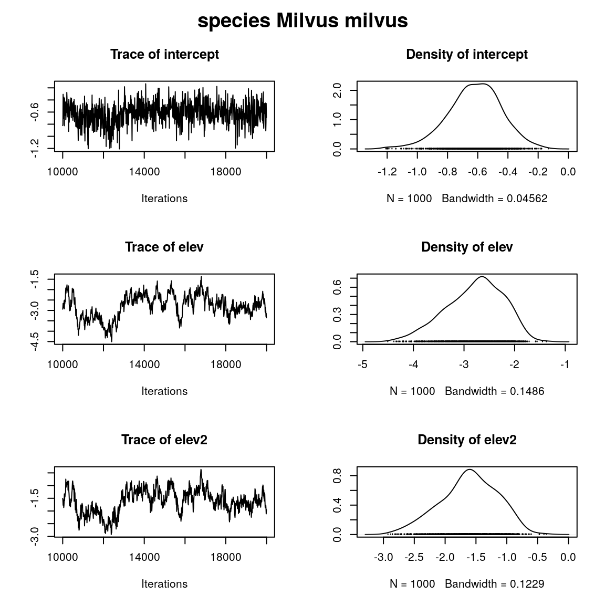
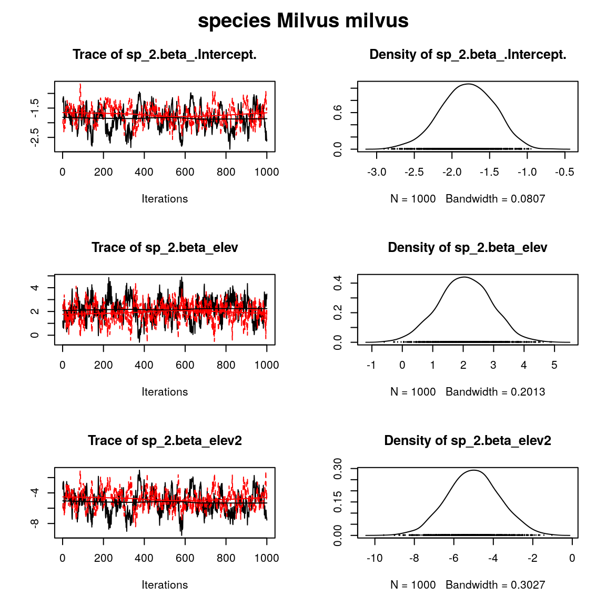
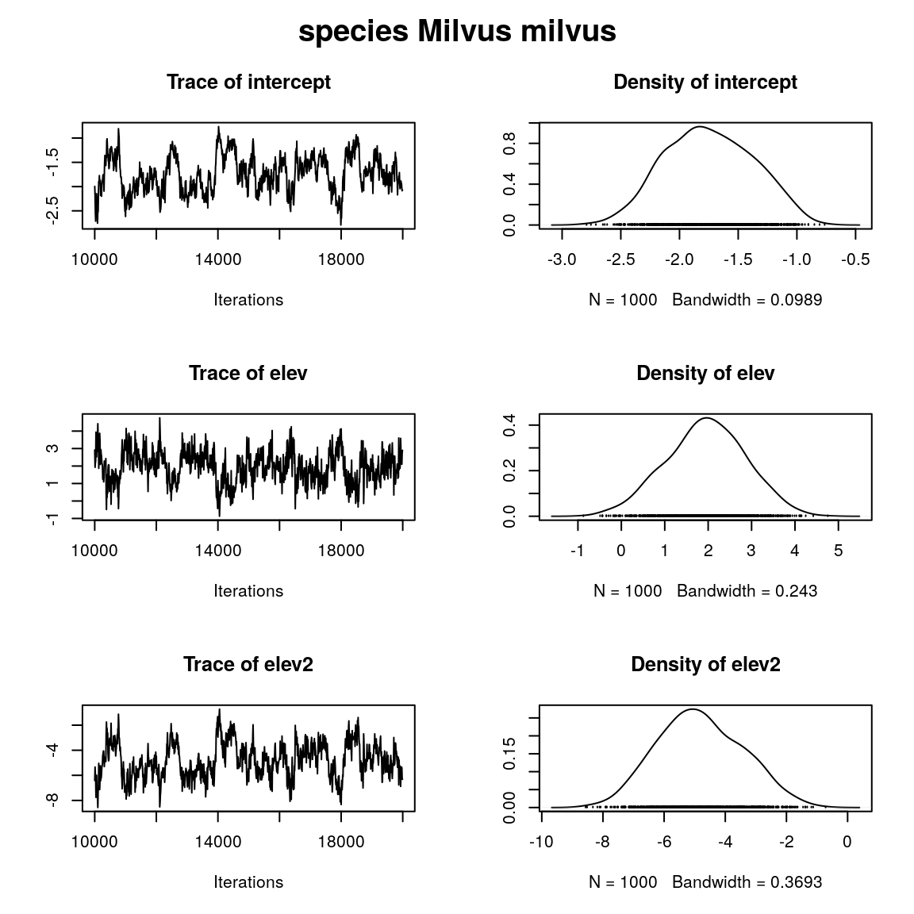
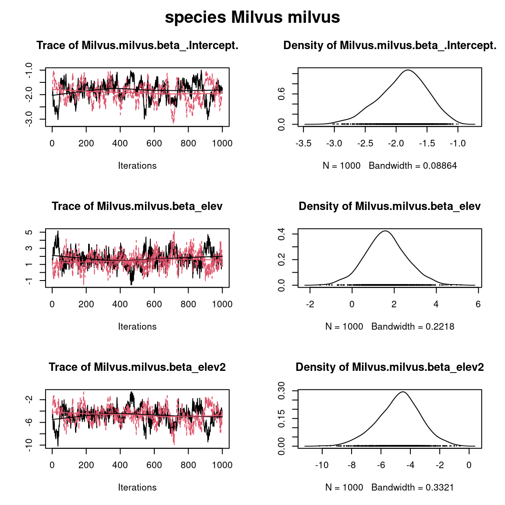
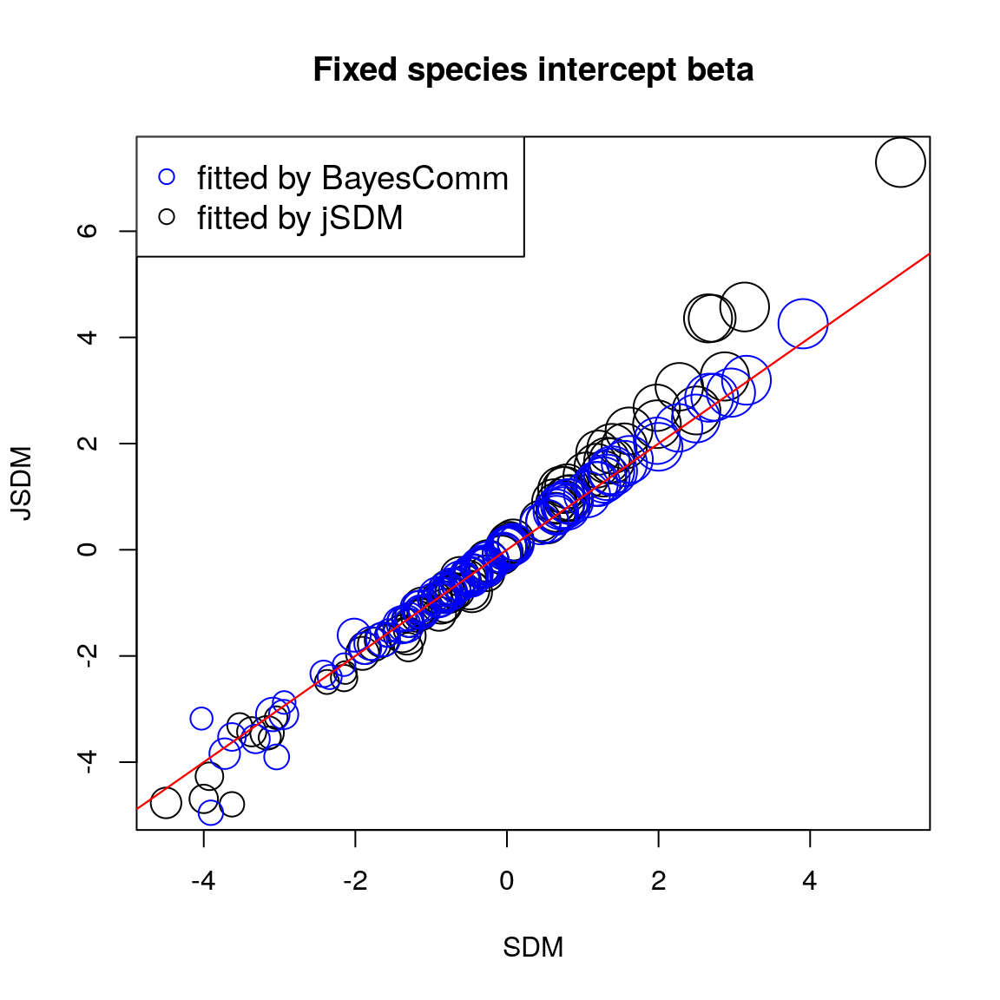
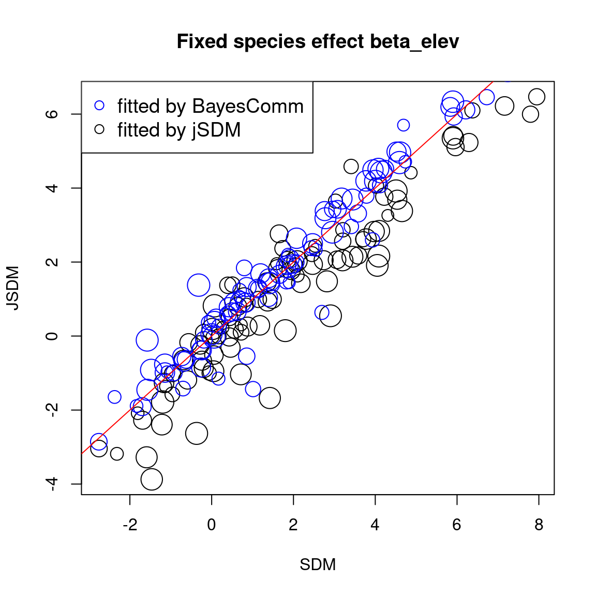
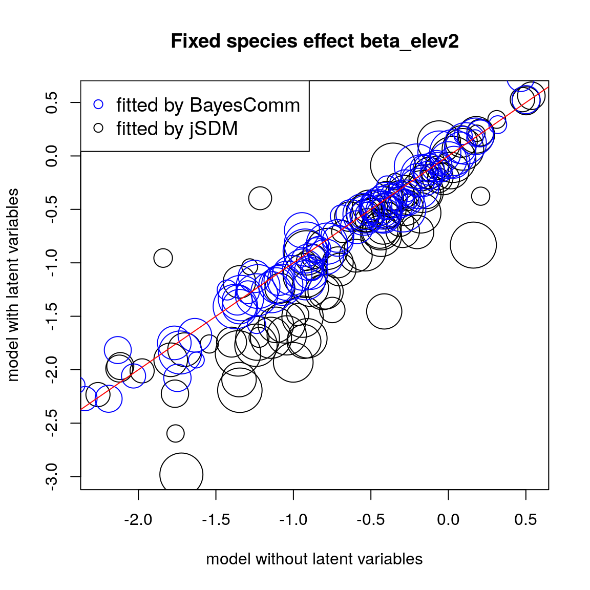
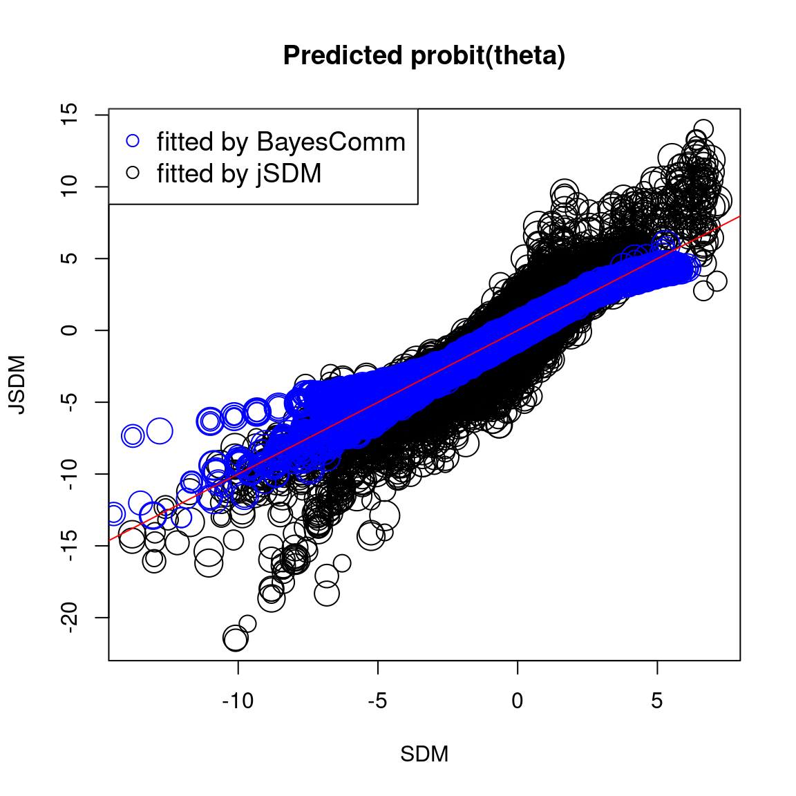
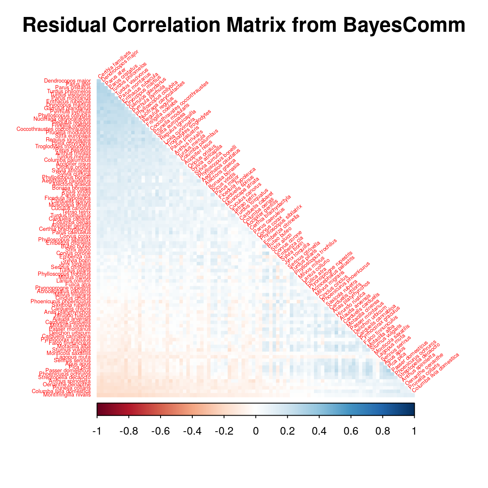
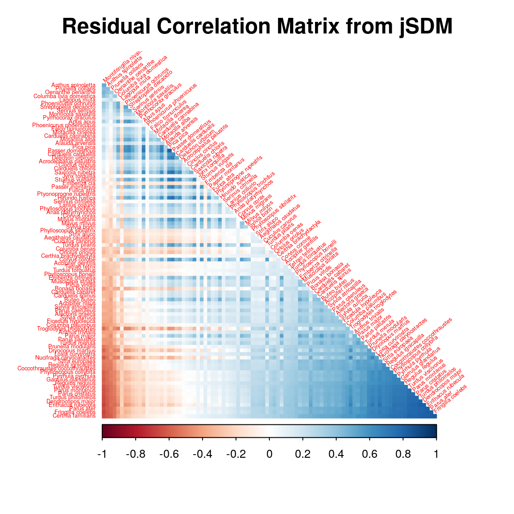

  
```{r setup, include=FALSE}
library(knitr)
library(kableExtra)
knitr::opts_chunk$set(
  fig.align = "center",
  fig.width = 6, fig.height = 6,
  cache = TRUE,
  collapse = TRUE,
  comment = "#>",
  eval=TRUE,
  highlight = TRUE
)
```

# Dataset

## Presence-absence of Swiss breeding birds


(ref:cap-birds) **_Swiss Breeding Birds Atlas_** [@Kery2006].

```{r birds-picture, echo=FALSE, out.width=600, out.height=300, fig.cap="(ref:cap-birds)"}

```

This data-set is available in the [`jSDM-package`](https://ecology.ghislainv.fr/jSDM/reference/jSDM-package.html). It can be loaded with the `data()` command. The [`birds`](https://ecology.ghislainv.fr/jSDM/reference/birds.html) data-set is in "wide" format: each line is a site and the occurrence data are in columns.

The Swiss breeding bird survey ("Monitoring Häufige Brutvögel" MHB) has monitored the populations of 158 common species since 1999. The MHB sample consists of 267 1-km squares that are laid out as a grid across Switzerland. Fieldwork is conducted by about 200 skilled birdwatchers, most of them volunteers. Avian populations are monitored using a simplified territory mapping protocol, where each square is surveyed up to three times during the breeding season (only twice above the tree line). 
Surveys are conducted along a transect that does not change over the years. 

The data-set contains the 2014 data, except for one quadrat not surveyed in 2014. 
It lists 158 bird species named in Latin and whose occurrences are expressed as the number of visits during which the species was observed on each site , with the exception of 13 species not surveyed in 2014 :

```{r birds}
library("jSDM")
# Import center and reduce birds dataset
data(birds, package="jSDM")
# data.obs
PA_Birds <- birds[,1:158]
```

We transform abundance into presence-absence data and remove species with less than 10 presences to facilitate MCMC convergence. We also look at the number of observations per site.

```{r presence-data}
# Transform abundance into presence-absence
PA_Birds[PA_Birds>0] <- 1
# Remove species with less than 10 presences
rare_sp <- which(apply(PA_Birds, 2, sum) < 10)
PA_Birds <- PA_Birds[, -rare_sp]
# Number of sites and species
nsite <- dim(PA_Birds)[1]
nsite
nsp <- dim(PA_Birds)[2]
nsp
# Number of observations per site
nobs_site <- apply(PA_Birds, 1, sum)
nobs_site
# Number of observations per species
nobs_sp <- apply(PA_Birds, 2, sum)
nobs_sp
```

## Environmental variables

The environmental variables are:

- **elev**: the mean elevation of the quadrat (m).
- **forest**: the percentage of forest cover in the quadrat.
- **rlength**: the length of the route walked in the quadrat (km).

As a first approach, we just select the "elev" variable considering a quadratic orthogonal polynomial.

```{r env-data}
# Normalized continuous variables
Env_Birds <- scale(data.frame(elev=birds[,"elev"]))
mf.suit <- model.frame(formula= ~ elev + I(elev^2) -1, data=as.data.frame(Env_Birds))
X <- model.matrix(attr(mf.suit,"terms"), data=mf.suit)
colnames(X) <- c("elev","elev2")
head(X)
# Number of environmental variables plus intercept
np <- ncol(X) + 1
np
```

# Fitting species distribution models (SDM) 

We consider a simple generalized linear multivariate model (GLMM) to estimate the occurrence probabilities on sites for each species such as :

$$y_{ij} \sim \mathcal{B}ernoulli(\theta_{ij})$$
  
  $$ \mathrm{g}(\theta_{ij}) = X_i\beta_j $$
  
- $\mathrm{g}(\cdot)$: Link function (probit or logit).
- $X_i$: Vector of explanatory variables for site $i$ (including intercept).
- $\beta_j$: Effects of the explanatory variables on the probability of presence of species $j$.

We consider below binomial models with a probit link.

## Using `BayesComm`

In a first step, we use the package `BayesComm` described in the article [@Golding2015] to fit binomial models with a probit link function. 
The package `BayesComm` fits Bayesian multivariate binary (probit) regression models for analysis of ecological communities. These models can be used to make inference about underlying inter-species interactions in communities and to separate the effects of environmental covariates and inter-species interactions on community assembly. 
We want to compare the parameters of the models fitted with `BayesComm` and `jSDM`. 

We estimate the parameters of the SDM with the function `BC()` and the argument `model="environment"`.  

```{r BayesComm, eval=FALSE}
library(BayesComm)
T1 <- Sys.time()
mod_BC <- BayesComm::BC(Y=as.matrix(PA_Birds), X=as.matrix(X), model="environment", its=20000, thin=10, burn=10000)
# Estimates
beta_est_BC <- data.frame(sp=names(PA_Birds), intercept=NA, elev=NA,  elev2=NA)
for (j in 1:nsp) {
  beta_est_BC[j, 2:(np+1)] <- as.numeric(summary(mod_BC, chain=paste0("B$", names(PA_Birds)[j]))$statistics[, "Mean"])
}
#Z_BC <- apply(mod_BC$trace$z,c(2,3), mean)
T2 <- Sys.time()
T_BC <- difftime(T2,T1)

# Deviance BayesComm
X1 <- cbind(rep(1,nsite), as.matrix(X))
probit_theta_pred_BC <- X1 %*% t(as.matrix(beta_est_BC[,2:4]))
# Deviance
logL=0
for (i in 1:nsite){
  for (j in 1:nsp){
    theta <- pnorm(probit_theta_pred_BC[i,j])
    logL = logL + dbinom(PA_Birds[i,j],1,theta,1)  
  }
}
deviance_BC <- -2*logL

save(mod_BC, file="SDM_JSDM_cache/BC.rda")
save(beta_est_BC, T_BC, deviance_BC, probit_theta_pred_BC, file="SDM_JSDM_files/BC.rda")
```

We visually evaluate the convergence of MCMCs by representing the trace and density a posteriori of the estimated parameters.

```{r plot-BayesComm, eval=FALSE}
library(BayesComm)
load("SDM_JSDM_cache/BC.rda")

par(mfrow=c(1,1), oma=c(0,0,2,0))
plot(mod_BC, chain=paste0("B$",names(PA_Birds)[2]))
title(main=paste0("species ", names(PA_Birds)[2]), outer=TRUE)
```


```{r plot2-BayesComm, out.width=600, echo=FALSE, eval=TRUE}

```

## Using `jSDM`

In a second step, we use the package `jSDM` to fit binomial models with a probit link. 

We estimate the parameters of the SDM with the function `jSDM_binomial_probit_block()` and the argument `n_latent=0` set by default. 

```{r chains-probit, eval=FALSE}
## Load libraries
require(doParallel)
require(foreach)

## Make a cluster for parallel MCMCs
nchains <- 2
ncores <- nchains ## One core for each MCMC chains
clust <- makeCluster(ncores)
registerDoParallel(clust)

# Starting values for two chains
beta_start <- c(-1,1)
#formatting of starting parameters generated by the function 
# Seeds
seed_mcmc <- c(1234, 4321)
```


```{r mod-probit, eval=FALSE}
library(jSDM)
# Model with foreach and doPar call
mod_probit <-
  foreach (i = 1:nchains) %dopar% {
    # Infering model parameters
    T1 <- Sys.time()
    mod <- jSDM::jSDM_binomial_probit_block(
      # Iterations
      mcmc = 10000,
      thin = 10,
      burnin = 10000,
      # Data
      presence_site_sp = PA_Birds,
      site_data = X,
      site_suitability=~.,
      # Priors
      mu_beta = 0,
      V_beta = 10,
      # Starting values
      beta_start = beta_start[i],
      # Other
      seed = seed_mcmc[i],
      verbose = 0
    )
    T2 <- Sys.time()
    mod$T_jSDM <- difftime(T2,T1)
    return(mod)
  }

# Stop cluster
stopCluster(clust)
```

Overview of the results :

```{r output-jSDM-probit, eval=FALSE}
# Output
n_chains <- length(mod_probit)
mod_jSDM <- mod_probit[[1]]
str_jSDM <- paste(capture.output(str(mod_jSDM, max.level = 1)), collapse="\n")

# Fitted values
beta_jSDM <- lapply(mod_jSDM$mcmc.sp, colMeans)
#Z_latent_jSDM <- mod_jSDM$Z_latent
probit_theta_jSDM <- mod_jSDM$probit_theta_pred
deviance_jSDM <- mean(mod_jSDM$mcmc.Deviance)
T_jSDM <- mod_jSDM$T_jSDM 
save(T_jSDM, n_chains, str_jSDM, beta_jSDM, probit_theta_jSDM, deviance_jSDM, 
     file="SDM_JSDM_files/jSDM.rda")
```

```{r output-probit, eval=TRUE, echo=FALSE}
load("SDM_JSDM_files/jSDM.rda")
cat("number of chains :", n_chains,"\n")
cat("content of each chain :", str_jSDM,"\n")
```

We evaluate the convergence of the MCMC output in which two parallel chains are run with starting values that are overdispersed relative to the posterior distribution.
Convergence is diagnosed when the chains have ‘forgotten’ their initial values, and the output from all chains is indistinguishable.
If the convergence diagnostic gives values of potential scale reduction factor or psrf
substantially above 1, its indicates lack of convergence.

```{r MCMC-convergence, eval=FALSE}
require(coda)
arr2mcmc <- function(x) {
  return(mcmc(as.data.frame(x)))
}

# MCMC lists
mcmc_list_beta <- mcmc.list(lapply(lapply(mod_probit,"[[","mcmc.sp"), arr2mcmc))
# psrf gelman indice 
psrf_beta <- mean(gelman.diag(mcmc_list_beta)$psrf[,1])
save(psrf_beta, file="SDM_JSDM_files/psrf.rda")
```

```{r psrf, echo=FALSE, eval=TRUE}
load("SDM_JSDM_files/psrf.rda")
cat("psrf beta:", psrf_beta, "\n")
```

We can also visually evaluate the convergence of MCMCs by representing the trace and density a posteriori of the estimated parameters.

```{r plot-jSDM, eval=FALSE}
par(mfrow=c(1,1), oma=c(0,0,2,0))

plot(mcmc_list_beta[,grep("sp_2.beta",colnames(mcmc_list_beta[[1]]))])
title(main=paste0("species ", names(PA_Birds)[2]), outer=TRUE)
```


```{r plot2-jSDM, out.width=600, echo=FALSE, eval=TRUE}

```

# Fitting joint species distribution models (JSDM)

We consider a latent variable model (LVM) to account for species co-occurrence on all sites [@Warton2015] in the `jSDM` package, such as :

$$y_{ij} \sim \mathcal{B}ernoulli(\theta_{ij})$$
  
  $$ \mathrm{g}(\theta_{ij}) = X_i\beta_j + W_i\lambda_j $$
  
- $\mathrm{g}(\cdot)$: Link function (probit or logit).
- $X_i$: Vector of explanatory variables for site $i$ (including intercept).
- $\beta_j$: Effects of the explanatory variables on the probability of presence of species $j$.
- $W_i$: Vector of random latent variables for site $i$. $W_i \sim N(0, 1)$. The number of latent variables must be fixed by the user (default to 2).
- $\lambda_j$: Effects of the latent variables on the probability of presence of species $j$. Also known as "factor loadings" [@Warton2015].

This model is equivalent to the generalized linear multivariate model (GLMM) $\mathrm{g}(\theta_{ij}) =\alpha_i + X_i.\beta_j + u_{ij}$, where $u_{ij} \sim \mathcal{N}(0, \Sigma)$ considered in the `BayesComm` package, with the constraint that the variance-covariance matrix $\Sigma = \Lambda \Lambda^{\prime}$, where $\Lambda$ is the full matrix of factor loadings, with the $\lambda_j$ as its columns. 

We consider below binomial models with a probit link.

## Using `BayesComm`

We estimate the parameters of the JSDM with the function `BC()` and the argument `model="full"` (intercept, covariates and community matrix).  

```{r BayesComm_community, eval=FALSE}
T1 <- Sys.time()
mod_BC_comm <- BayesComm::BC(Y=as.matrix(PA_Birds), X=as.matrix(X), model="full", its=20000, thin=10, burn=10000)
# Estimates
beta_est_BC_comm <- data.frame(sp=names(PA_Birds), intercept=NA, elev=NA, elev2=NA)
for (j in 1:nsp) {
  beta_est_BC_comm[j, 2:(np+1)] <- as.numeric(summary(mod_BC_comm, chain=paste0("B$", names(PA_Birds)[j]))$statistics[, "Mean"])
}
#Z_BayesComm_com <- apply(mod_BC_comm$trace$z,c(2,3), mean)
T2 <- Sys.time()
T_BC_comm <- difftime(T2,T1)

# Deviance BayesComm
X1 <- cbind(rep(1,nsite), as.matrix(X))
e <- residuals(mod_BC_comm)
probit_theta_pred_BC_comm <- X1 %*% t(as.matrix(beta_est_BC_comm[,2:4])) + e
# Deviance
logL=0
for (i in 1:nsite){
  for (j in 1:nsp){
    theta <- pnorm(probit_theta_pred_BC_comm[i,j])
    logL = logL + dbinom(PA_Birds[i,j],1,theta,1)  
  }
}
deviance_BC_comm <- -2*logL

# Correlation matrix
R <- apply(mod_BC_comm$trace$R,2,mean)
R_mat <- matrix(1,nsp,nsp)
species <-  colnames(PA_Birds)
colnames(R_mat) <- rownames(R_mat) <- species
for(j in 1:nsp){
  for(jprim in 1:nsp){
    if(length(grep(paste0(species[j],"_",species[jprim]), names(R)))!=0){
      R_mat[j,jprim] <- R_mat[jprim,j] <-  R[grep(paste0(species[j],"_",species[jprim]), names(R)) ]  
    }
  }
}
save(mod_BC_comm, file="SDM_JSDM_cache/BC_comm.rda")
save(beta_est_BC_comm, T_BC_comm, R_mat,
     deviance_BC_comm, probit_theta_pred_BC_comm,
     file="SDM_JSDM_files/BC_comm.rda")
```

We visually evaluate the convergence of MCMCs by representing the trace and density a posteriori of the estimated parameters.

```{r plot-BC_comm, eval=FALSE}
load("SDM_JSDM_cache/BC_comm.rda")
par(mfrow=c(1,1), oma=c(0,0,2,0))

plot(mod_BC_comm, chain=paste0("B$", names(PA_Birds)[2]))
title(main=paste0("species ", names(PA_Birds)[2]), outer=TRUE)
```

```{r plot2-BC_comm, out.width=600, echo=FALSE, eval=TRUE}

```

## Using `jSDM`

We estimate the latent variables model parameters with the function `jSDM_binomial_probit_block()` and the argument `n_latent=2`. 

```{r chains-probit-lv, eval=FALSE}
library(parallel)
library(doParallel)
## Make a cluster for parallel MCMCs
nchains <- 2
ncores <- nchains ## One core for each MCMC chains
clust <- makeCluster(ncores)
registerDoParallel(clust)

# Number of latent variables
nl <- 2

# Starting parameters 
lambda_start <- c(-1, 1)
beta_start <- c(-1,1)
W_start <- c(0.1,-0.1)
#formatting of starting parameters
#and constraints on lambda generated by the function 
# Seeds
seed_mcmc <- c(1234, 4321)
```


```{r mod-probit-lv, eval=FALSE}
# Model
mod_probit_lv <-
  foreach (i = 1:nchains) %dopar% {
    # Infering model parameters
    T1 <- Sys.time()
    mod <- jSDM::jSDM_binomial_probit_block(
      # Iterations
      burnin=10000, mcmc=10000, thin=10,
      # Data
      presence_site_sp=PA_Birds,
      site_data = X,
      site_suitability = ~.,
      # Model specification 
      n_latent=2,
      site_effect="none",
      # Priors
      V_beta = 10,
      mu_beta = 0,
      mu_lambda = 0,
      V_lambda= 10,
      # Starting values
      beta_start = beta_start[i],
      lambda_start = lambda_start[i],
      W_start = W_start[i],
      # Other
      seed = seed_mcmc[i],
      verbose = 0
    )
    T2 <- Sys.time()
    mod$T_jSDM <- difftime(T2,T1)
    return(mod)
  }
# Stop cluster
stopCluster(clust)
```

Overview of the results :

```{r output-jSDM-probit-lv, eval=FALSE}
# Output
n_chains <- length(mod_probit_lv)
mod_jSDM_lv <- mod_probit_lv[[1]]
str_jSDM_lv <- paste(capture.output(str(mod_jSDM_lv, max.level = 1)), collapse="\n")
# Fitted values
param_jSDM_lv <- lapply(mod_jSDM_lv$mcmc.sp, colMeans)
#Z_latent_jSDM_lv <- mod_jSDM_lv$Z_latent
probit_theta_jSDM_lv <- mod_jSDM_lv$probit_theta_pred
deviance_jSDM_lv <- mean(mod_jSDM_lv$mcmc.Deviance)
T_jSDM_lv <- mod_jSDM_lv$T_jSDM
residual_corr_mat <- get_residual_cor(mod_jSDM_lv)$cor.mean

save(T_jSDM_lv, n_chains, str_jSDM_lv, param_jSDM_lv, probit_theta_jSDM_lv, deviance_jSDM_lv, residual_corr_mat, 
     file="SDM_JSDM_files/jSDM_lv.rda")
```

```{r outputjSDM-probit-lv, eval=TRUE}
load("SDM_JSDM_files/jSDM_lv.rda")
cat("number of chains :", n_chains,"\n")
cat("content of each chain :", str_jSDM_lv,"\n")
```

We then evaluate if the chains have ‘forgotten’ their initial values, and if the output from all chains is indistinguishable.

```{r MCMC-convergence-probit-lv, eval=FALSE}
# psrf
mcmc_list_param <- mcmc.list(lapply(lapply(mod_probit_lv,"[[","mcmc.sp"), arr2mcmc))
mcmc_list_centered_lambda <- mcmc.list(lapply(lapply(
  mcmc_list_param[,grep("lambda", grep("sp_1.lambda_2", colnames(mcmc_list_param[[1]]),
                                       invert=TRUE, value=TRUE),value=TRUE)],
  scale, scale=FALSE),arr2mcmc))
mcmc_list_lv <- mcmc.list(lapply(lapply(mod_probit_lv,
                                        "[[","mcmc.latent"), arr2mcmc))
mcmc_list_centered_lv <- mcmc.list(lapply(lapply(mcmc_list_lv, scale, scale=FALSE),arr2mcmc))
psrf_beta <- mean(gelman.diag(mcmc_list_param[,1:np])$psrf[,1])
psrf_lv <- mean(gelman.diag(mcmc_list_centered_lv)$psrf[,1])
psrf_lambda <- mean(gelman.diag(mcmc_list_centered_lambda)$psrf[,1])
save(psrf_beta, psrf_lv, psrf_lambda, file="SDM_JSDM_files/psrf_lv.rda")
```

```{r psrf_lv, echo=FALSE, eval=TRUE}
load("SDM_JSDM_files/psrf_lv.rda")
cat("psrf latent variables W :", psrf_lv, "\n")
cat("psrf lambda:", psrf_lambda, "\n")
cat("psrf beta:", psrf_beta, "\n")
```

The convergence diagnostic gives values of potential scale reduction factor or psrf
not substantially above 1, its indicates some convergence.


We visually evaluate the convergence of MCMCs by representing the trace and density a posteriori of the estimated parameters.

```{r plot-jSDM-lv, eval=FALSE}
par(mfrow=c(1,1), oma=c(0,0,2,0))

plot(mcmc_list_param[,grep("sp_2.beta",colnames(mcmc_list_param[[1]]))])
title(main=paste0("species ", names(PA_Birds)[2]), outer=TRUE)
```


```{r plot2-jSDM-lv, out.width=600, echo=FALSE, eval=TRUE}

```

# Comparison of results

## Deviance and compilation time

(ref:cap-comp-dev) **Deviance and compilation time**. of SDM and JSDM fitted by `jSDM` or `BayesComm`. \vspace{0.5cm}

```{r comp-dev, echo=FALSE, eval=FALSE}
load("SDM_JSDM_files/BC.rda")
load("SDM_JSDM_files/BC_comm.rda")
load("SDM_JSDM_files/jSDM.rda")
load("SDM_JSDM_files/jSDM_lv.rda")

# Deviance
df <- data.frame(package=c("BayesComm","jSDM","BayesComm","jSDM"),
                 model=c("SDM", "SDM","JSDM (GLMM)", "JSDM (LVM)"),
                 Time=c(T_BC, T_jSDM, T_BC_comm, T_jSDM_lv),
                 Deviance=c(deviance_BC, deviance_jSDM,
                            deviance_BC_comm, deviance_jSDM_lv))
knitr::kable(df, caption="(ref:cap-comp-dev)", booktabs=TRUE, digits=c(0,0,1,0)) %>%
  kable_styling(position="center", full_width = FALSE)
```


## Parameter values  

The sizes of the dots on the following graphs are proportional to the number of observations per species. Parameters related to abundant species are represented by larger dots than those associated with rare species. 

First, we compare the intercept for each species between classical or joint species distribution model that takes into account co-occurrences between species, fitted using `BayesComm` or `jSDM`. 

```{r comp-intercept, eval=FALSE}
# Intercepts
## jSDM
plot(lapply(beta_jSDM,"[", 1) , lapply(param_jSDM_lv, "[", 1), cex=nobs_sp^(1/4),
     main="Fixed species intercept beta",
     xlab="SDM", ylab="JSDM")
# BayesComm
points(beta_est_BC$intercept, beta_est_BC_comm$intercept,
       cex=rep(nobs_sp^(1/4),75), col='blue')
abline(a=0, b=1, col="red")
legend("topleft",c("fitted by BayesComm","fitted by jSDM"), pch=1, cex=1.2, col=c('blue','black'))
abline(a=0, b=1, col="red")
```

```{r comp-intercept-plot, echo=FALSE, out.width=600, eval=TRUE}

```

We compare the effect of the environmental variables for each species between the four models.

```{r comp-env-effect, eval=FALSE}
# Environmental variable effects
for(k in 2:np){
## jSDM
plot(lapply(beta_jSDM, "[", k), lapply(param_jSDM_lv,"[", k), cex=nobs_sp^(1/4),
          main=paste0("Fixed species effect ", names(beta_jSDM[[1]][k])),
     xlab="SDM", ylab="JSDM")
## BayesComm
points(beta_est_BC[,k+1], beta_est_BC_comm[,k+1],
       cex=rep(nobs_sp^(1/4),75), col='blue')
abline(a=0, b=1, col="red")
legend("topleft",c("fitted by BayesComm","fitted by jSDM"), pch=1, cex=1.2, col=c('blue','black'))
}
```

```{r comp-env-effect-plot, echo=FALSE, out.width=600, eval=TRUE}


```

## Predictions

We compare the probit of occurence probabilities predicted by the classical or joint species distribution, fitted using `BayesComm` or `jSDM`.

```{r comp-pred, eval=FALSE}
# Predictions
## jSDM
plot(probit_theta_jSDM, probit_theta_jSDM_lv,
     cex=rep(nobs_sp^(1/4), 75),
     main="Predicted probit(theta)",
     xlab="SDM",
     ylab="JSDM")
## BayesComm
points(probit_theta_pred_BC, probit_theta_pred_BC_comm,
       cex=rep(nobs_sp^(1/4),75), col='blue')
abline(a=0, b=1, col="red")
legend("topleft",c("fitted by BayesComm","fitted by jSDM"), pch=1, cex=1.2, col=c('blue','black'))
```


```{r comp-pred-plot, echo=FALSE, out.width=600, eval=TRUE}

```

## Residual correlaton matrix 

 After fitting the jSDM with latent variables, the **full species residual correlation matrix** $R=(R_{ij})^{i=1,\ldots, nspecies}_{j=1,\ldots, nspecies}$ can be derived from the covariance in the latent variables such as : 
 $$\Sigma_{ij} = \begin{cases}
 \lambda_i .\lambda_j^T & \text{ if } i \neq j \\
  \lambda_i .\lambda_j^T + 1 & \text{ if } i=j
 \end{cases}$$, then we compute correlations from covariances :
  $$R_{i,j} = \frac{\Sigma_{ij}}{\sqrt{\Sigma _{ii}\Sigma _{jj}}}$$.


```{r residual_correlation_matrix, eval=FALSE}
# Residual correlation matrix obtained with BayesComm
reorder.cor.mean <- corrplot::corrMatOrder(R_mat, order = "FPC", hclust.method = "average")
par(cex=1, cex.main=1.5)
corrplot::corrplot(R_mat[reorder.cor.mean,reorder.cor.mean], title = "Residual Correlation Matrix from BayesComm", diag = F, type = "lower", method = "color",  mar = c(1,1,3,1), tl.srt = 40, tl.cex = 0.4)

# Residual correlation matrix obtained with jSDM
reorder.cor.mean <- corrplot::corrMatOrder(residual_corr_mat, order = "FPC", hclust.method = "average")
rownames(residual_corr_mat) <- colnames(residual_corr_mat) <-  colnames(PA_Birds)
par(cex=1, cex.main=1.5)
corrplot::corrplot(residual_corr_mat[reorder.cor.mean,reorder.cor.mean], title = "Residual Correlation Matrix from jSDM", diag = F, type = "lower", method = "color",  mar = c(1,1,3,1), tl.srt = 40, tl.cex = 0.4)
```

```{r residual_correlation_matrix-plot, echo=FALSE, out.width=600, eval=TRUE}


```

# References
