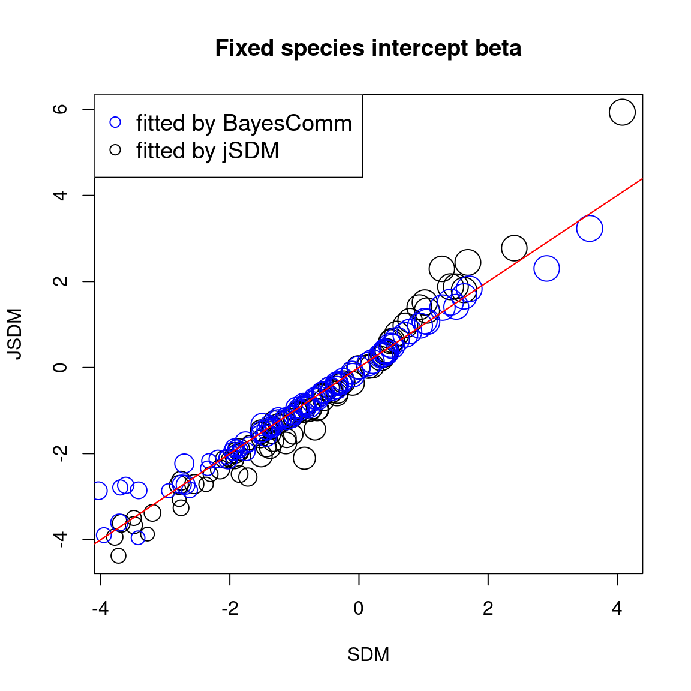
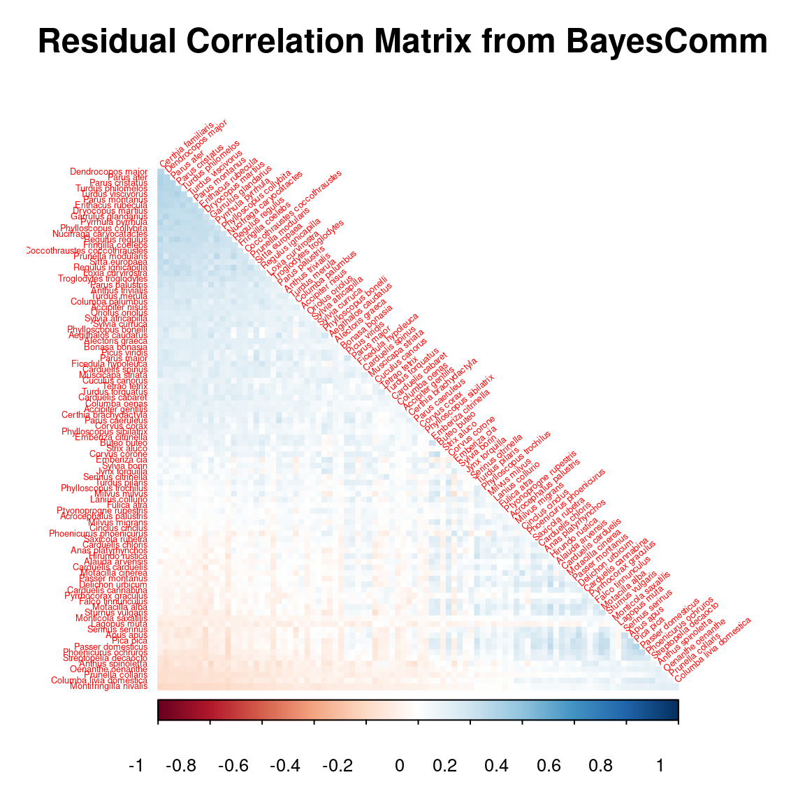
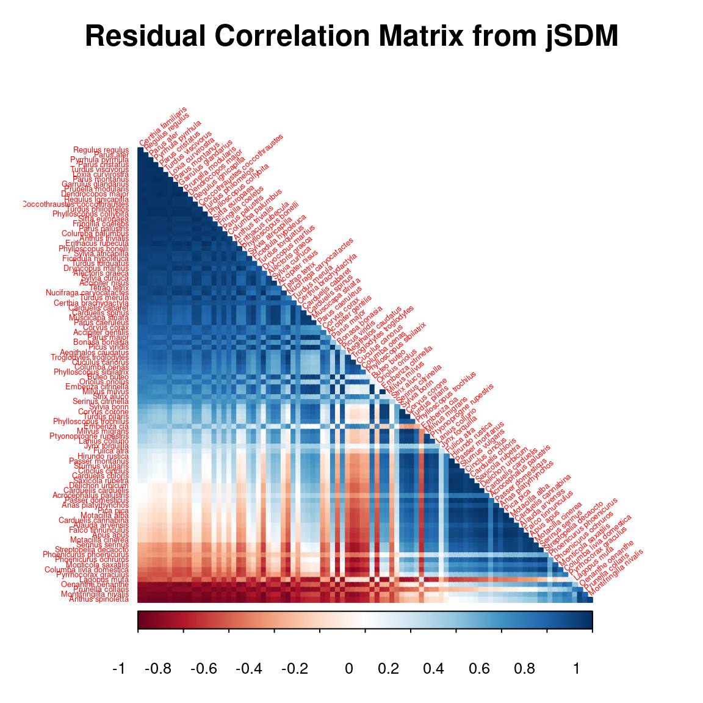

  
```{r setup, include=FALSE}
library(knitr)
library(kableExtra)
knitr::opts_chunk$set(
  fig.align = "center",
  fig.width = 6, fig.height = 6,
  cache = TRUE,
  collapse = TRUE,
  comment = "#>",
  eval=TRUE,
  highlight = TRUE
)
```

# Dataset

## Presence-absence of Swiss breeding birds


(ref:cap-birds) **_Swiss Breeding Birds Atlas_** [@Kery2006].

```{r birds-picture, echo=FALSE, out.width=600, out.height=300, fig.cap="(ref:cap-birds)"}
knitr::include_graphics("figures/swiss_breeding_birds_atlas.jpg")
```

This data-set is available in the [`jSDM-package`](https://ecology.ghislainv.fr/jSDM/reference/jSDM-package.html). It can be loaded with the `data()` command. The [`birds`](https://ecology.ghislainv.fr/jSDM/reference/birds.html) data-set is in "wide" format: each line is a site and the occurrence data are in columns.

The Swiss breeding bird survey ("Monitoring Häufige Brutvögel" MHB) has monitored the populations of 158 common species since 1999. The MHB sample consists of 267 1-km squares that are laid out as a grid across Switzerland. Fieldwork is conducted by about 200 skilled birdwatchers, most of them volunteers. Avian populations are monitored using a simplified territory mapping protocol, where each square is surveyed up to three times during the breeding season (only twice above the tree line). 
Surveys are conducted along a transect that does not change over the years. 

The data-set contains the 2014 data, except for one quadrat not surveyed in 2014. 
It lists 158 bird species named in Latin and whose occurrences are expressed as the number of visits during which the species was observed on each site , with the exception of 13 species not surveyed in 2014 :

```{r birds}
library(jSDM)
# Import center and reduce birds dataset
data(birds, package="jSDM")
# data.obs
PA_Birds <- birds[,1:158]
```

We transform abundance into presence-absence data and remove species with less than 10 presences to facilitate MCMC convergence. We also look at the number of observations per site.

```{r presence-data}
# Transform abundance into presence-absence
PA_Birds[PA_Birds>0] <- 1
# Remove species with less than 10 presences
rare_sp <- which(apply(PA_Birds, 2, sum) < 10)
PA_Birds <- PA_Birds[, -rare_sp]
# Number of sites and species
nsite <- dim(PA_Birds)[1]
nsite
nsp <- dim(PA_Birds)[2]
nsp
# Number of observations per site
nobs_site <- apply(PA_Birds, 1, sum)
nobs_site
# Number of observations per species
nobs_sp <- apply(PA_Birds, 2, sum)
nobs_sp
```

## Environmental variables

The environmental variables are:

- **elev**: the mean elevation of the quadrat (m).
- **forest**: the percentage of forest cover in the quadrat.
- **rlength**: the length of the route walked in the quadrat (km).

As a first approach, we just select the "elev" variable considering a quadratic orthogonal polynomial.

```{r env-data}
# Normalized continuous variables
Env_Birds <- data.frame(scale(birds[,"elev"]))
colnames(Env_Birds) <- c("elev")
mf.suit <- model.frame(formula= ~ elev + I(elev^2) -1, data=as.data.frame(Env_Birds))
X <- model.matrix(attr(mf.suit,"terms"), data=mf.suit)
colnames(X) <- c("elev", "elev2")
head(X)
# Number of environmental variables plus intercept
np <- ncol(X) + 1
np
```

# Fitting joint species distribution model for presence-absence data

We consider a latent variable model (LVM) to account for species co-occurrence on all sites [@Warton2015]. 

$$y_{ij} \sim \mathcal{B}ernoulli(\theta_{ij})$$
  
  $$ \mathrm{g}(\theta_{ij}) = X_i\beta_j + W_i\lambda_j $$
  
- $\mathrm{g}(\cdot)$: Link function (probit or logit).
- $X_i$: Vector of explanatory variables for site $i$ (including intercept).
- $\beta_j$: Effects of the explanatory variables on the probability of presence of species $j$.
- $W_i$: Vector of random latent variables for site $i$. $W_i \sim N(0, 1)$. The number of latent variables must be fixed by the user (default to 2).
- $\lambda_j$: Effects of the latent variables on the probability of presence of species $j$. Also known as "factor loadings" [@Warton2015].

This model is equivalent to a multivariate GLMM $\mathrm{g}(\theta_{ij}) =\alpha_i + X_i.\beta_j + u_{ij}$, where $u_{ij} \sim \mathcal{N}(0, \Sigma)$ with the constraint that the variance-covariance matrix $\Sigma = \Lambda \Lambda^{\prime}$, where $\Lambda$ is the full matrix of factor loadings, with the $\lambda_j$ as its columns. 

We consider below binomial models with a probit link.

## Using `BayesComm`

In a first step, we use the package `BayesComm` described in the article [@Golding2015] to fit binomial models with a probit link function. 
The package `BayesComm` fits Bayesian multivariate binary (probit) regression models for analysis of ecological communities. These models can be used to make inference about underlying inter-species interactions in communities and to separate the effects of environmental covariates and inter-species interactions on community assembly. 
We want to compare the parameters of the models fitted with `BayesComm` and `jSDM`. 

### Model **without** latent variables

We estimate the without latent variables model parameters with the function `BC()` and the argument `model="environment"`.  

```{r BayesComm, eval=FALSE}
# R is diagonal
library(BayesComm)
T1 <- Sys.time()
mod_BayesComm <- BayesComm::BC(Y=as.matrix(PA_Birds), X=as.matrix(X), model="environment", its=20000, thin=10, burn=10000)
# Estimates
beta_est_bayescomm <- data.frame(sp=names(PA_Birds), intercept=NA, elev=NA,  elev2=NA)
for (j in 1:nsp) {
  beta_est_bayescomm[j, 2:(np+1)] <- as.numeric(summary(mod_BayesComm, chain=paste0("B$", names(PA_Birds)[j]))$statistics[, "Mean"])
}
Z_BayesComm <- apply(mod_BayesComm$trace$z,c(2,3), mean)
T2 <- Sys.time()
T_BayesComm <- difftime(T2,T1)

# Deviance BayesComm
X1 <- cbind(rep(1,nsite), as.matrix(X))
probit_theta_pred_BayesComm <- X1 %*% t(as.matrix(beta_est_bayescomm[,2:4]))
# Deviance
logL=0
for (i in 1:nsite){
  for (j in 1:nsp){
    theta <- pnorm(probit_theta_pred_BayesComm[i,j])
    logL = logL + dbinom(PA_Birds[i,j],1,theta,1)  
  }
}
deviance_BC1 <- -2*logL

save(mod_BayesComm, file="SDM_JSDM_cache/BayesComm.rda")
save(beta_est_bayescomm, Z_BayesComm, T_BayesComm, deviance_BC1, probit_theta_pred_BayesComm, file="SDM_JSDM_files/BayesComm.rda")
```

```{r plot-BayesComm, eval=FALSE}
library(BayesComm)
load("SDM_JSDM_cache/BayesComm.rda")
par(mfrow=c(1,1), oma=c(0,0,2,0))
plot(mod_BayesComm, chain=paste0("B$",names(PA_Birds)[2]))
title(main=paste0("species ", names(PA_Birds)[2]), outer=TRUE)
```


```{r plot2-BayesComm, out.width=600, echo=FALSE, eval=TRUE}
knitr::include_graphics("SDM_JSDM_files/figure-html/plot-BayesComm-1.png")
```

### Model **with** latent variables 

We estimate the latent variables model parameters with the function `BC()` and the argument `model="full"` (intercept, covariates and community matrix).  

```{r BayesComm_community, eval=FALSE}
T1 <- Sys.time()
mod_BayesComm_lv <- BayesComm::BC(Y=as.matrix(PA_Birds), X=as.matrix(X), model="full", its=20000, thin=10, burn=10000)
# Estimates
beta_est_bayescomm_lv <- data.frame(sp=names(PA_Birds), intercept=NA, elev=NA, elev2=NA)
for (j in 1:nsp) {
  beta_est_bayescomm_lv[j, 2:(np+1)] <- as.numeric(summary(mod_BayesComm_lv, chain=paste0("B$", names(PA_Birds)[j]))$statistics[, "Mean"])
}
Z_BayesComm_lv <- apply(mod_BayesComm_lv$trace$z,c(2,3), mean)
T2 <- Sys.time()
T_BayesComm_lv <- difftime(T2,T1)

# Deviance BayesComm
X1 <- cbind(rep(1,nsite), as.matrix(X))
e <- residuals(mod_BayesComm_lv)
probit_theta_pred_BayesComm_lv <- X1 %*% t(as.matrix(beta_est_bayescomm_lv[,2:4])) + e
# Deviance
logL=0
for (i in 1:nsite){
  for (j in 1:nsp){
    theta <- pnorm(probit_theta_pred_BayesComm_lv[i,j])
    logL = logL + dbinom(PA_Birds[i,j],1,theta,1)  
  }
}
deviance_BC2 <- -2*logL

# Correlation matrix
R <- apply(mod_BayesComm_lv$trace$R,2,mean)
R_mat <- matrix(1,nsp,nsp)
species <-  colnames(PA_Birds)
colnames(R_mat) <- rownames(R_mat) <- species
for(j in 1:nsp){
  for(jprim in 1:nsp){
    if(length(grep(paste0(species[j],"_",species[jprim]), names(R)))!=0){
      R_mat[j,jprim] <- R_mat[jprim,j] <-  R[grep(paste0(species[j],"_",species[jprim]), names(R)) ]  
    }
  }
}
save(mod_BayesComm_lv, file="SDM_JSDM_cache/BayesComm_lv.rda")
save(beta_est_bayescomm_lv, Z_BayesComm_lv, T_BayesComm_lv, R_mat,  
     deviance_BC2, probit_theta_pred_BayesComm_lv,
     file="SDM_JSDM_files/BayesComm_lv.rda")
```

```{r plot-BayesComm_lv, eval=FALSE}
load("SDM_JSDM_cache/BayesComm_lv.rda")
par(mfrow=c(1,1), oma=c(0,0,2,0))
plot(mod_BayesComm_lv, chain=paste0("B$", names(PA_Birds)[2]))
title(main=paste0("species ", names(PA_Birds)[2]), outer=TRUE)
```

```{r plot2-BayesComm_lv, out.width=600, echo=FALSE, eval=TRUE}
knitr::include_graphics("SDM_JSDM_files/figure-html/plot-BayesComm_lv-1.png")
```

## Using `jSDM`

In a second step, we use the package `jSDM` to fit binomial models with a probit link. 
We want to compare models that include or not latent variables. 

### Model **without** latent variables 

We estimate the without latent variables model parameters with the function `jSDM_binomial_probit_block()`. 

```{r chains-probit, eval=FALSE}
## Load libraries
require(doParallel)
require(foreach)

## Make a cluster for parallel MCMCs
nchains <- 2
ncores <- nchains ## One core for each MCMC chains
clust <- makeCluster(ncores)
registerDoParallel(clust)

# Starting values for two chains
beta_start <- c(-1,1)
#formatting of starting parameters generated by the function 
# Seeds
seed_mcmc <- c(1234, 4321)
```


```{r mod-probit, eval=FALSE}
library(jSDM)
# Model with foreach and doPar call
mod_probit <-
  foreach (i = 1:nchains) %dopar% {
    # Infering model parameters
    T1 <- Sys.time()
    mod <- jSDM::jSDM_binomial_probit_block(
      # Iterations
      mcmc = 10000,
      thin = 10,
      burnin = 10000,
      # Data
      presence_site_sp = PA_Birds,
      site_data = X,
      site_suitability=~.,
      # Priors
      mu_beta = 0,
      V_beta = 10,
      # Starting values
      beta_start = beta_start[i],
      # Other
      seed = seed_mcmc[i],
      verbose = 1
    )
    T2 <- Sys.time()
    mod$T_jSDM <- difftime(T2,T1)
    return(mod)
  }

# Stop cluster
stopCluster(clust)
```

```{r output-jSDM-probit, eval=FALSE}
# Output
n_chains <- length(mod_probit)
m1 <- mod_probit[[1]]
str_m1 <- paste(capture.output(str(m1, max.level = 1)), collapse="\n")
# Fitted values
beta_m1 <- lapply(m1$mcmc.sp, colMeans)
Z_latent_m1 <- m1$Z_latent
probit_theta_m1 <- m1$probit_theta_pred
deviance_m1 <- mean(m1$mcmc.Deviance)
T_jSDM <- m1$T_jSDM 
save(T_jSDM, n_chains, str_m1, beta_m1, probit_theta_m1, deviance_m1, Z_latent_m1,
     file="SDM_JSDM_files/jSDM.rda")
```

```{r output-probit, eval=TRUE}
load("SDM_JSDM_files/jSDM.rda")
cat("number of chains :", n_chains,"\n")
cat("content of each chain :", str_m1,"\n")
```

We evaluate the convergence of the MCMC output in which two parallel chains are run with starting values that are overdispersed relative to the posterior distribution.
Convergence is diagnosed when the chains have ‘forgotten’ their initial values, and the output from all chains is indistinguishable.
If the convergence diagnostic gives values of potential scale reduction factor or psrf
substantially above 1, its indicates lack of convergence.

```{r MCMC-convergence, eval=FALSE}
require(coda)
arr2mcmc <- function(x) {
  return(mcmc(as.data.frame(x)))
}
# MCMC lists
mcmc_list_beta <- mcmc.list(lapply(lapply(mod_probit,"[[","mcmc.sp"), arr2mcmc))
# psrf gelman indice 
psrf_beta <- mean(gelman.diag(mcmc_list_beta)$psrf[,1])
save(psrf_beta, file="SDM_JSDM_files/psrf.rda")
```

```{r psrf, echo=FALSE, eval=TRUE}
load("SDM_JSDM_files/psrf.rda")
cat("psrf beta:", psrf_beta, "\n")
```

### Model **with** latent variables 

We estimate the latent variables model parameters with the function `jSDM_binomial_probit_block()` and the argument `n_latent=2`. 

```{r chains-probit-lv, eval=FALSE}
library(parallel)
library(doParallel)
## Make a cluster for parallel MCMCs
nchains <- 2
ncores <- nchains ## One core for each MCMC chains
clust <- makeCluster(ncores)
registerDoParallel(clust)

# Number of latent variables
nl <- 2

# Starting parameters 
lambda_start <- c(-1, 1)
beta_start <- c(-1,1)
W_start <- c(0.1,-0.1)
#formatting of starting parameters
#and constraints on lambda generated by the function 
# Seeds
seed_mcmc <- c(1234, 4321)
```


```{r mod-probit-lv, eval=FALSE}
# Model
mod_probit_lv <-
  foreach (i = 1:nchains) %dopar% {
    # Infering model parameters
    T1 <- Sys.time()
    mod <- jSDM::jSDM_binomial_probit_block(
      # Iterations
      burnin=10000, mcmc=10000, thin=10,
      # Data
      presence_site_sp=PA_Birds,
      site_data = X,
      site_suitability = ~.,
      # Model specification 
      n_latent=2,
      site_effect="none",
      # Priors
      V_beta = 10,
      mu_beta = 0,
      mu_lambda = 0,
      V_lambda= 10,
      # Starting values
      beta_start = beta_start[i],
      lambda_start = lambda_start[i],
      W_start = W_start[i],
      # Other
      seed = seed_mcmc[i],
      verbose = 1
    )
    T2 <- Sys.time()
    mod$T_jSDM <- difftime(T2,T1)
    return(mod)
  }


# Stop cluster
stopCluster(clust)
```


```{r output-jSDM-probit-lv, eval=FALSE}
# Output
n_chains <- length(mod_probit_lv)
m2 <- mod_probit_lv[[1]]
str_m2 <- paste(capture.output(str(m2, max.level = 1)), collapse="\n")
# Fitted values
param_m2 <- lapply(m2$mcmc.sp, colMeans)
Z_latent_m2 <- m2$Z_latent
probit_theta_m2 <- m2$probit_theta_pred
deviance_m2 <- mean(m2$mcmc.Deviance)
T_jSDM_lv <- m2$T_jSDM
residual_corr_mat <- get_residual_cor(m2)$cor.mean

save(T_jSDM_lv, n_chains, str_m2, param_m2, probit_theta_m2, deviance_m2, residual_corr_mat, Z_latent_m2,
     file="SDM_JSDM_files/jSDM_lv.rda")
```

```{r outputjSDM-probit-lv, eval=TRUE}
load("SDM_JSDM_files/jSDM_lv.rda")
cat("number of chains :", n_chains,"\n")
cat("content of each chain :", str_m2,"\n")
```

```{r MCMC-convergence-probit-lv, eval=FALSE}
# psrf
mcmc_list_param <- mcmc.list(lapply(lapply(mod_probit_lv,"[[","mcmc.sp"), arr2mcmc))
mcmc_list_centered_lambda <- mcmc.list(lapply(lapply(
  mcmc_list_param[,grep("lambda", grep("sp_1.lambda_2", colnames(mcmc_list_param[[1]]),
                                       invert=TRUE, value=TRUE),value=TRUE)],
  scale, scale=FALSE),arr2mcmc))
mcmc_list_lv <- mcmc.list(lapply(lapply(mod_probit_lv,
                                        "[[","mcmc.latent"), arr2mcmc))
mcmc_list_centered_lv <- mcmc.list(lapply(lapply(mcmc_list_lv, scale, scale=FALSE),arr2mcmc))
psrf_beta <- mean(gelman.diag(mcmc_list_param[,1:np])$psrf[,1])
psrf_lv <- mean(gelman.diag(mcmc_list_centered_lv)$psrf[,1])
psrf_lambda <- mean(gelman.diag(mcmc_list_centered_lambda)$psrf[,1])
save(psrf_beta, psrf_lv, psrf_lambda, file="SDM_JSDM_files/psrf_lv.rda")
```

```{r psrf_lv, echo=FALSE, eval=TRUE}
load("SDM_JSDM_files/psrf_lv.rda")
cat("psrf latent variables:", psrf_lv, "\n")
cat("psrf lambda:", psrf_lambda, "\n")
cat("psrf beta:", psrf_beta, "\n")
```

# Comparison of results

## Deviance and compilation time

(ref:cap-comp-dev) **Deviance and compilation time**. of probit models without and with latent variables fitted by `jSDM` or `BayesComm`. \vspace{0.5cm}

```{r comp-dev, echo=FALSE, eval=TRUE}
load("SDM_JSDM_files/BayesComm.rda")
load("SDM_JSDM_files/BayesComm_lv.rda")
load("SDM_JSDM_files/jSDM.rda")
load("SDM_JSDM_files/jSDM_lv.rda")

# Deviance
df <- data.frame(package=c("BayesComm","jSDM","BayesComm","jSDM"),
                 model=c("GLM", "GLM","LVM", "LVM"),
                 Time=c(T_BayesComm, T_jSDM, T_BayesComm_lv, T_jSDM_lv),
                 Deviance=c(deviance_BC1, deviance_m1,
                            deviance_BC2, deviance_m2))
knitr::kable(df, caption="(ref:cap-comp-dev)", booktabs=TRUE, digits=c(0,0,1,0)) %>%
  kable_styling(position="center", full_width = FALSE)
```


## Parameter values  

We compare the intercept for each species between models with and without latent variables fitted using `BayesComm` or `jSDM`. 

```{r comp-intercept, eval=FALSE}
# Intercepts
plot(lapply(beta_m1,"[", 1) , lapply(param_m2, "[", 1), cex=nobs_sp^(1/3),
     main="Fixed species intercept beta",
     xlab="model without latent variables", ylab="model with latent variables")
points(beta_est_bayescomm$intercept, beta_est_bayescomm_lv$intercept,
       cex=rep(nobs_sp^(1/3),75), col='blue')
abline(a=0, b=1, col="red")
legend("topleft",c("fitted by BayesComm","fitted by jSDM"), pch=1, cex=1.2, col=c('blue','black'))
abline(a=0, b=1, col="red")
```

```{r comp-intercept-plot, echo=FALSE, out.width=600, eval=TRUE}

```

We compare the effect of the environmental variables for each species between the four models.

```{r comp-env-effect, eval=FALSE}
# Environmental variable effects
for(k in 2:np){
plot(lapply(beta_m1, "[", k), lapply(param_m2,"[", k), cex=nobs_sp^(1/3),
          main=paste0("Fixed species effect ", names(beta_m1[[1]][k])),
     xlab="model without latent variables", ylab="model with latent variables")
points(beta_est_bayescomm[,k+1], beta_est_bayescomm_lv[,k+1],
       cex=rep(nobs_sp^(1/3),75), col='blue')
abline(a=0, b=1, col="red")
legend("topleft",c("fitted by BayesComm","fitted by jSDM"), pch=1, cex=1.2, col=c('blue','black'))
}
```

```{r comp-env-effect-plot, echo=FALSE, out.width=600, eval=TRUE}
knitr::include_graphics("SDM_JSDM_files/figure-html/comp-env-effect-1.png")
knitr::include_graphics("SDM_JSDM_files/figure-html/comp-env-effect-2.png")
```

## Predictions

We compare the probit of occurence probabilities predicted by the models with and without latent variables fitted using `BayesComm` or `jSDM`.

```{r comp-pred, eval=FALSE}
require(scales)
# Z_true 
plot(Z_latent_m1, Z_latent_m2, main="Latent variable Z",
     cex=rep(nobs_sp^(1/3), 75),
     xlab="model without latent variables (SDM)",
     ylab="model with latent variables (JSDM)")
points(Z_BayesComm, Z_BayesComm_lv,
       cex=rep(nobs_sp^(1/3), 75), col=alpha('blue',0.2))
abline(a=0, b=1, col="red")
legend("topleft",c("fitted by BayesComm","fitted by jSDM"), pch=1, cex=1.2, col=c('blue','black'))

# Predictions
plot(probit_theta_m1, probit_theta_m2,
     cex=rep(nobs_sp^(1/3), 75),
     main="Predicted probit(theta)",
     xlab="model without latent variables (SDM)",
     ylab="model with latent variables (JSDM)")
points(probit_theta_pred_BayesComm, probit_theta_pred_BayesComm_lv,
       cex=rep(nobs_sp^(1/3),75), col=alpha('blue',0.2))
abline(a=0, b=1, col="red")
legend("topleft",c("fitted by BayesComm","fitted by jSDM"), pch=1, cex=1.2, col=c('blue','black'))
```


```{r comp-pred-plot, echo=FALSE, out.width=600, eval=TRUE}
knitr::include_graphics("SDM_JSDM_files/figure-html/comp-pred-1.png")
knitr::include_graphics("SDM_JSDM_files/figure-html/comp-pred-2.png")
```

## Residual correlaton matrix 

```{r residual_correlation_matrix, eval=FALSE}
# Residual correlation matrix obtained with BayesComm
reorder.cor.mean <- corrplot::corrMatOrder(R_mat, order = "FPC", hclust.method = "average")
par(cex=1, cex.main=1.5)
corrplot::corrplot(R_mat[reorder.cor.mean,reorder.cor.mean], title = "Residual Correlation Matrix from BayesComm", diag = F, type = "lower", method = "color",  mar = c(1,1,3,1), tl.srt = 40, tl.cex = 0.4)
# Residual correlation matrix obtained with jSDM
reorder.cor.mean <- corrplot::corrMatOrder(residual_corr_mat, order = "FPC", hclust.method = "average")
rownames(residual_corr_mat) <- colnames(residual_corr_mat) <-  colnames(PA_Birds)
par(cex=1, cex.main=1.5)
corrplot::corrplot(residual_corr_mat[reorder.cor.mean,reorder.cor.mean], title = "Residual Correlation Matrix from jSDM", diag = F, type = "lower", method = "color",  mar = c(1,1,3,1), tl.srt = 40, tl.cex = 0.4)
```

```{r residual_correlation_matrix-plot, echo=FALSE, out.width=600, eval=TRUE}


```

# References
