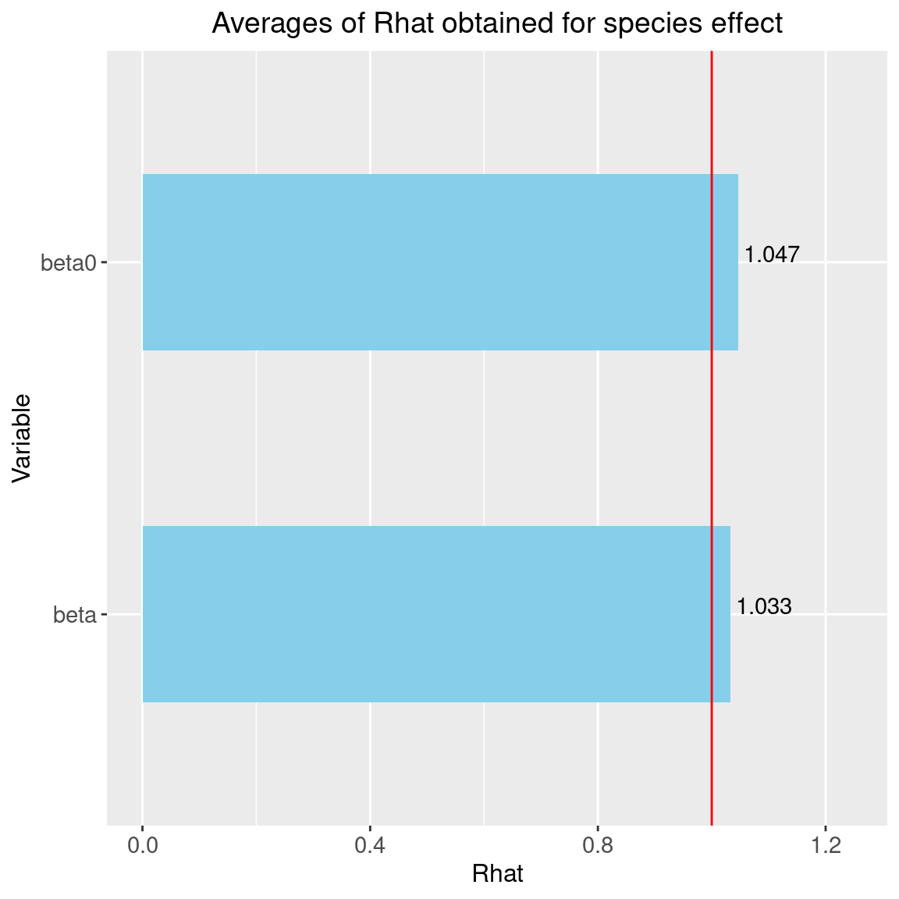
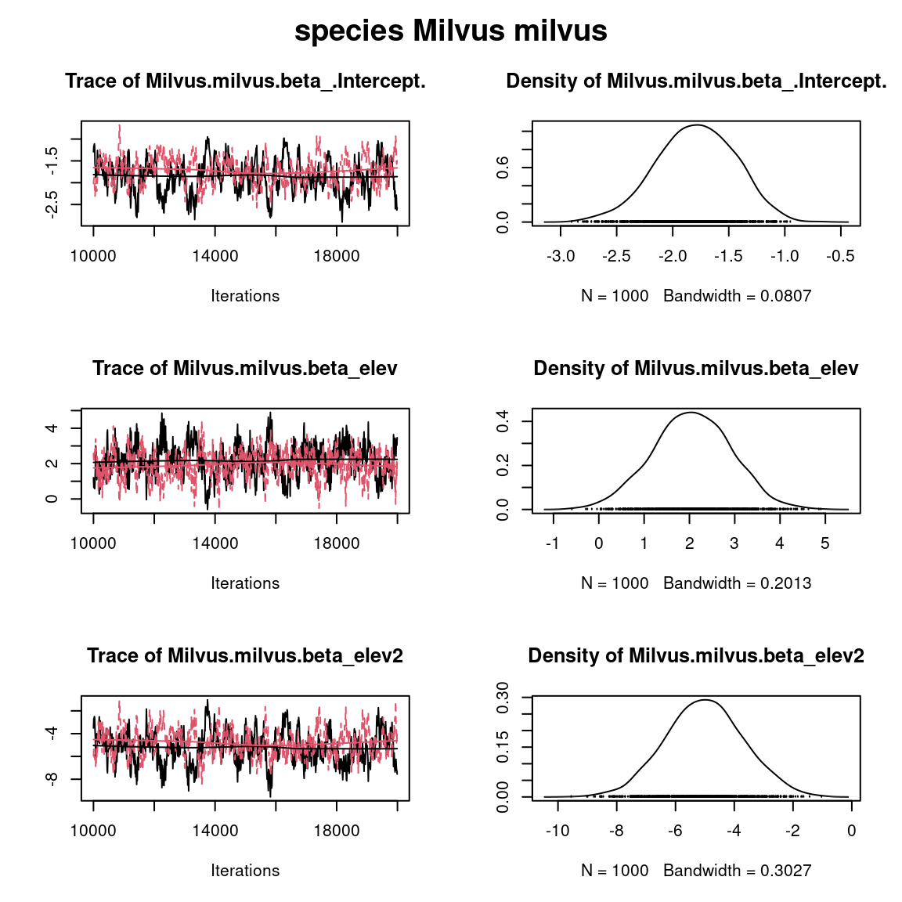
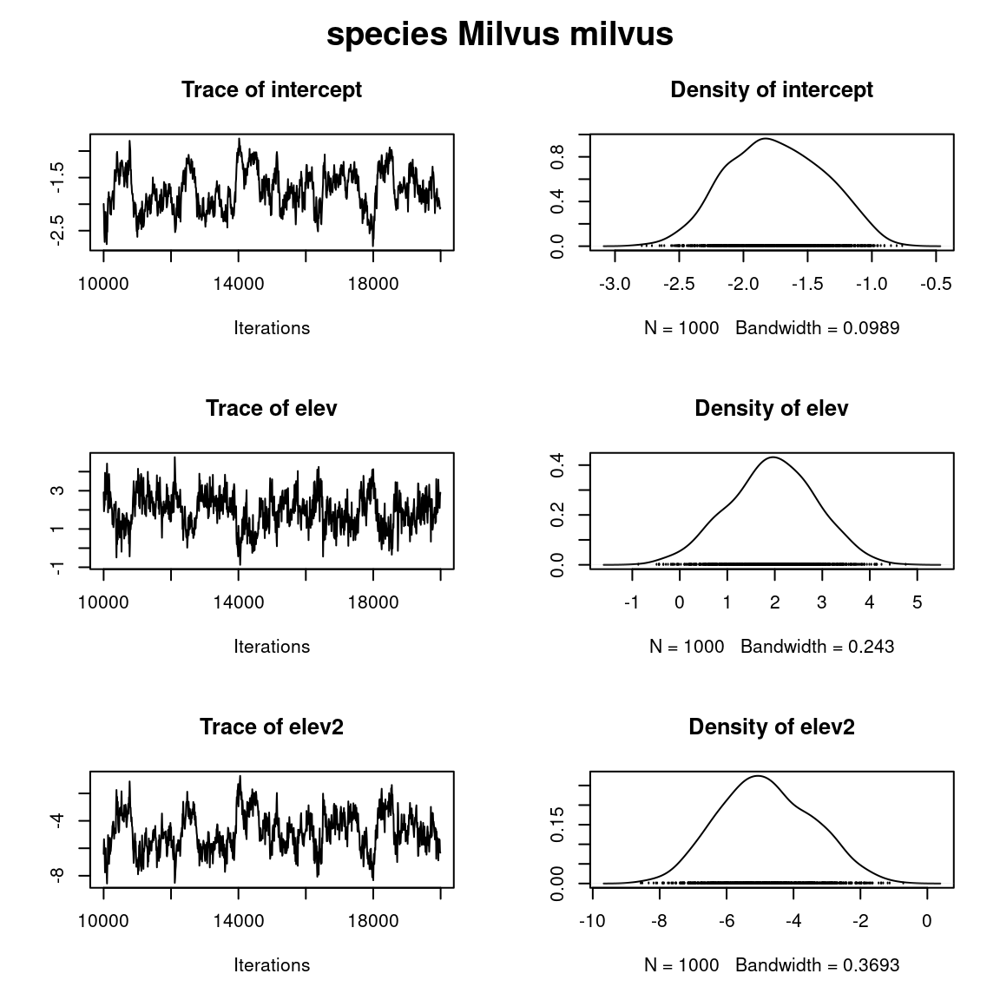
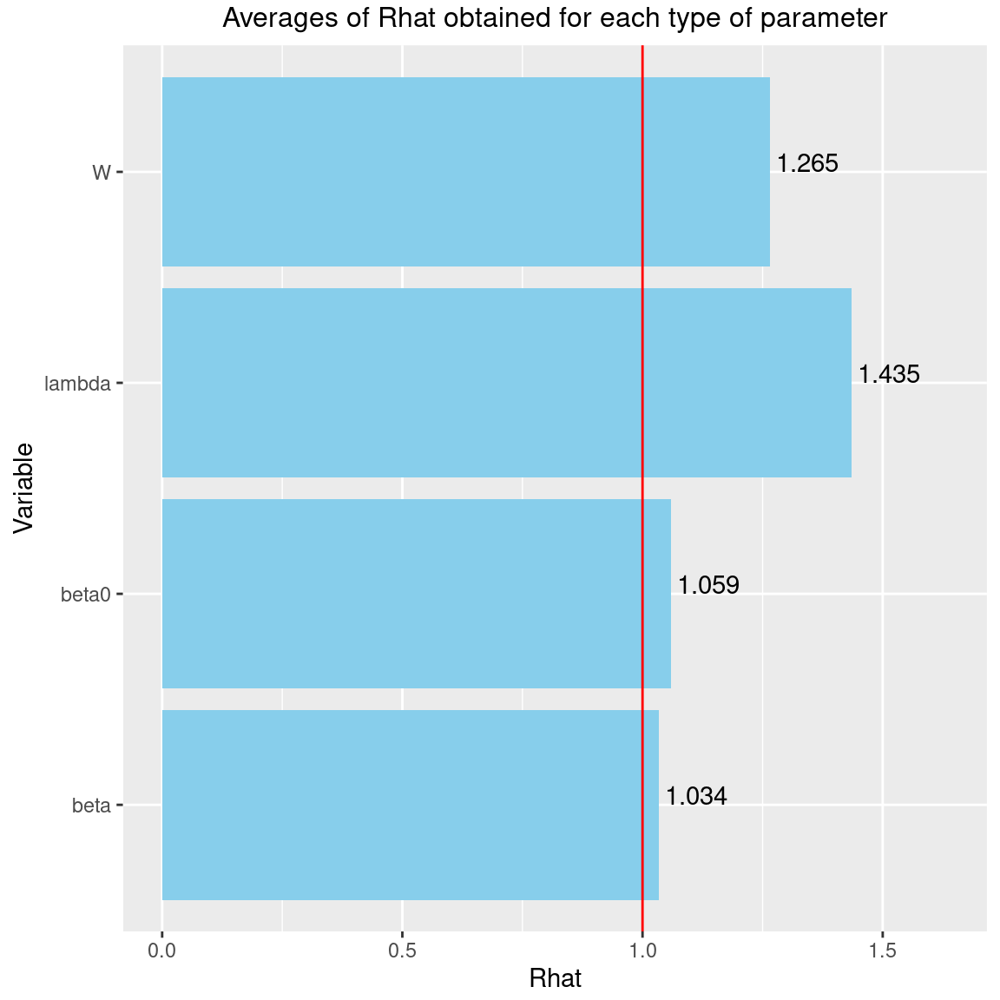

  
```{r setup, include=FALSE}
library(knitr)
library(kableExtra)
knitr::opts_chunk$set(
  fig.align = "center",
  fig.width = 6, fig.height = 6,
  cache = TRUE,
  collapse = TRUE,
  comment = "#>",
  eval=FALSE,
  highlight = TRUE
)
```

# Dataset

## Presence-absence of Swiss breeding birds


(ref:cap-birds) **_Swiss Breeding Birds Atlas_** [@Kery2006].

```{r birds-picture, echo=FALSE, eval=TRUE, out.width=600, out.height=300, fig.cap="(ref:cap-birds)"}
knitr::include_graphics("figures/swiss_breeding_birds_atlas.jpg")
```

This data-set is available in the [`jSDM-package`](https://ecology.ghislainv.fr/jSDM/reference/jSDM-package.html). It can be loaded with the `data()` command. The [`birds`](https://ecology.ghislainv.fr/jSDM/reference/birds.html) data-set is in "wide" format: each line is a site and the occurrence data are in columns.

The Swiss breeding bird survey ("Monitoring Häufige Brutvögel" MHB) has monitored the populations of 158 common species since 1999. The MHB sample consists of 267 1-km squares that are laid out as a grid across Switzerland. Fieldwork is conducted by about 200 skilled birdwatchers, most of them volunteers. Avian populations are monitored using a simplified territory mapping protocol, where each square is surveyed up to three times during the breeding season (only twice above the tree line). 
Surveys are conducted along a transect that does not change over the years. 

The data-set contains the 2014 data, except for one quadrat not surveyed in 2014. 
It lists 158 bird species named in Latin and whose occurrences are expressed as the number of visits during which the species was observed on each site , with the exception of 13 species not surveyed in 2014 :

```{r birds, eval=TRUE}
library("jSDM")
# Import center and reduce birds dataset
data(birds, package="jSDM")
# data.obs
PA_Birds <- birds[,1:158]
```

We transform abundance into presence-absence data and remove species with less than 10 presences to facilitate MCMC convergence. We also look at the number of observations per site.

```{r presence-data, eval=TRUE,}
# Transform abundance into presence-absence
PA_Birds[PA_Birds>0] <- 1
# Remove species with less than 10 presences
rare_sp <- which(apply(PA_Birds, 2, sum) < 10)
PA_Birds <- PA_Birds[, -rare_sp]
# Number of sites and species
nsite <- dim(PA_Birds)[1]
nsite
nsp <- dim(PA_Birds)[2]
nsp
# Number of observations per site
nobs_site <- apply(PA_Birds, 1, sum)
nobs_site
# Number of observations per species
nobs_sp <- apply(PA_Birds, 2, sum)
nobs_sp
```

## Environmental variables

The environmental variables are:

- **elev**: the mean elevation of the quadrat (m).
- **forest**: the percentage of forest cover in the quadrat.
- **rlength**: the length of the route walked in the quadrat (km).

As a first approach, we just select the "elev" variable considering a quadratic orthogonal polynomial.

```{r env-data, eval=TRUE}
# Normalized continuous variables
Env_Birds <- data.frame(elev=scale(birds[,"elev"]),elev2=scale(birds[,"elev"]^2))
# Number of environmental variables plus intercept
np <- ncol(Env_Birds) + 1
np
```

# Fitting species distribution models (SDM) 

## Definition of model

We consider a simple generalized linear multivariate model (GLMM) to estimate the occurrence probabilities on sites for each species such as :

$$y_{ij} \sim \mathcal{B}ernoulli(\theta_{ij})$$
  
  $$ \mathrm{g}(\theta_{ij}) = X_i\beta_j $$
  
- $\mathrm{g}(\cdot)$: Link function (probit or logit).
- $X_i$: Vector of explanatory variables for site $i$ (including intercept).
- $\beta_j$: Effects of the explanatory variables on the probability of presence of species $j$.

We consider below binomial models with a probit link. We want to compare the parameters of the SDMs fitted using `BayesComm` and `jSDM` packages. 

## Using `BayesComm`

In a first step, we use the package `BayesComm` described in the article [@Golding2015] to fit binomial models with a probit link function. 
The package `BayesComm` fits Bayesian multivariate binary (probit) regression models for analysis of ecological communities. These models can be used to make inference about underlying inter-species interactions in communities and to separate the effects of environmental covariates and inter-species interactions on community assembly. 

### Parameters inference

We estimate the parameters of the species distribution model (SDM) with the function `BC()` and the argument `model="environment"`.  

```{r BayesComm, eval=FALSE}
library(BayesComm)
T1 <- Sys.time()
mod_BC <- BayesComm::BC(Y=as.matrix(PA_Birds), X=as.matrix(Env_Birds), model="environment", its=20000, thin=10, burn=10000)
# Estimates
beta_est_BC <- data.frame(sp=names(PA_Birds), intercept=NA, elev=NA,  elev2=NA)
for (j in 1:nsp) {
  beta_est_BC[j, 2:(np+1)] <- as.numeric(summary(mod_BC, chain=paste0("B$", names(PA_Birds)[j]))$statistics[, "Mean"])
}
#Z_BC <- apply(mod_BC$trace$z,c(2,3), mean)
T2 <- Sys.time()
T_BC <- difftime(T2,T1)

# Deviance BayesComm
X1 <- cbind(rep(1,nsite), as.matrix(Env_Birds))
probit_theta_latent_BC <- X1 %*% t(as.matrix(beta_est_BC[,2:4]))
# Deviance
logL=0
for (i in 1:nsite){
  for (j in 1:nsp){
    theta <- pnorm(probit_theta_latent_BC[i,j])
    logL = logL + dbinom(PA_Birds[i,j],1,theta,1)  
  }
}
deviance_BC <- -2*logL

save(mod_BC, file="SDM_JSDM_cache/BC.rda")
save(beta_est_BC, T_BC, deviance_BC,
     probit_theta_latent_BC,
     file="SDM_JSDM_files/BC.rda")
```

### Evaluation of MCMC convergence 

#### Representation of results

We visually evaluate the convergence of MCMCs by representing the trace and density *a posteriori* of the estimated parameters.

```{r plot-BayesComm}
library(BayesComm)
load("SDM_JSDM_cache/BC.rda")
par(mfrow=c(1,1), oma=c(0,0,2,0))
plot(mod_BC, chain=paste0("B$",names(PA_Birds)[2]))
title(main=paste0("species ", names(PA_Birds)[2]), outer=TRUE)
```

```{r plot2-BayesComm, out.width=600, echo=FALSE}
knitr::include_graphics("SDM_JSDM_files/figure-html/plot-BayesComm-1.png")
```

Overall, the traces and the densities of the parameters indicate the convergence of the algorithm. Indeed, we observe on the traces that the values oscillate around averages without showing an upward or downward trend and we see that the densities are quite smooth and for the most part of Gaussian form.

## Using `jSDM`

In a second step, we use the package `jSDM` to fit binomial models with a probit link. 

### Parameters inference 

We estimate the parameters of the SDM with the function `jSDM_binomial_probit()` and the argument `n_latent=0` set by default. 

```{r chains-probit}
## Load libraries
require(doParallel)
require(foreach)

## Make a cluster for parallel MCMCs
nchains <- 2
ncores <- nchains ## One core for each MCMC chains
clust <- makeCluster(ncores)
registerDoParallel(clust)

# Starting values for two chains
beta_start <- c(-1,1)
#formatting of starting parameters generated by the function 
# Seeds
seed_mcmc <- c(1234, 4321)
```


```{r mod-probit}
library(jSDM)
# Model with foreach and doPar call
mod_probit <-
  foreach (i = 1:nchains) %dopar% {
    # Infering model parameters
    T1 <- Sys.time()
    mod <- jSDM::jSDM_binomial_probit(
      # Iterations
      mcmc = 10000,
      thin = 10,
      burnin = 10000,
      # Data
      presence_data = PA_Birds,
      site_data = Env_Birds,
      site_formula=~.,
      # Priors
      V_beta =10,
      mu_beta = 0,
      # Starting values
      beta_start = beta_start[i],
      # Other
      seed = seed_mcmc[i],
      verbose = 0
    )
    T2 <- Sys.time()
    mod$T_jSDM <- difftime(T2,T1)
    return(mod)
  }

# Stop cluster
#stopCluster(clust)
```

### Evaluation of MCMC convergence 

#### The Gelman–Rubin convergence diagnostic

**Definition**:

The Gelman–Rubin diagnostic evaluates MCMC convergence by analyzing the difference between multiple Markov chains. The convergence is assessed by comparing the estimated between-chains and within-chain variances for each model parameter. Large differences between these variances indicate non-convergence. See @Gelman1992 and @Brooks1998 for the detailed description of the method.

Suppose we have $M$ chains, each of length $N$, although the chains may be of different lengths. The same-length assumption simplifies the formulas and is used for convenience. For a model parameter $\theta$, let $\left(\theta_{𝑚t}\right)_{t=1}^N$ be the $𝑚$th simulated chain, $𝑚=1,\dots,𝑀$. Let $\hat{\theta}_𝑚=\frac{1}{N}\sum\limits_{t=1}^N \hat{\theta}_{mt}$ and $\hat{\sigma}^2_𝑚=\frac{1}{N-1}\sum\limits_{t=1}^N (\hat{\theta}_{mt}-\hat{\theta}_𝑚)^2$ be the sample posterior mean and variance of the $𝑚$th chain, and let the overall sample posterior mean be $\hat{\theta}=\frac{1}{𝑀}\sum\limits_{m=1}^𝑀 \hat{\theta}_m$.

The between-chains and within-chain variances are given by
$$B=\frac{N}{M-1}\sum\limits_{m=1}^𝑀 (\hat{\theta}_m - \hat{\theta})^2$$
$$W=\frac{1}{M}\sum\limits_{m=1}^𝑀\hat{\sigma}^2_m$$

 Under certain stationarity conditions, the pooled variance : 
 
 $$\hat{V}=\frac{N-1}{N}W + \frac{M+1}{MN}B$$
 
is an unbiased estimator of the marginal posterior variance of $\theta$ (@Gelman1992). The potential scale reduction factor (PSRF) is defined to be the ratio of $\hat{𝑉}$ and $𝑊$. If the $𝑀$ chains have converged to the target posterior distribution, then PSRF should be close to 1. The article @Brooks1998 corrected the original PSRF by accounting for sampling variability as follows:
$$ \hat{R}= \sqrt{\frac{\hat{d}+3}{\hat{d}+1}\frac{\hat{V}}{W}}$$

where $\hat{d}$  is the degrees of freedom estimate of a $𝑡$ distribution.

PSRF estimates the potential decrease in the between-chains variability $𝐵$ with respect to the within-chain variability $𝑊$. If $\hat{R}$ is large, then longer simulation sequences are expected to either decrease $𝐵$ or increase $𝑊$ because the simulations have not yet explored the full posterior distribution. As the article @Brooks1998 have suggested, if $\hat{R} < 1.2$ for all model parameters, one can be fairly confident that convergence has been reached. Otherwise, longer chains or other means for improving the convergence may be needed. Even more reassuring is to apply the more stringent condition $\hat{R} < 1.1$.

**Compute $\hat{R}$**:

We evaluate the convergence of the MCMC output in which two parallel chains are run (with starting values that are over dispersed relative to the posterior distribution).
Convergence is diagnosed when the four chains have ‘forgotten’ their initial values, and the output from all chains is indistinguishable.
If the convergence diagnostic gives values of potential scale reduction factor (PSRF) or $\hat{R}$ substantially above 1, its indicates lack of convergence.


```{r MCMC-convergence-SDM, echo=TRUE}

burnin <- mod_probit[[1]]$model_spec$burnin
ngibbs <- burnin + mod_probit[[1]]$model_spec$mcmc
thin <-  mod_probit[[1]]$model_spec$thin
require(coda)
arr2mcmc <- function(x) {
  return(mcmc(as.data.frame(x),
              start=burnin+1 , end=ngibbs, thin=thin))
}
# MCMC lists
mcmc_list_param <- mcmc.list(lapply(lapply(mod_probit,"[[","mcmc.sp"), arr2mcmc))
mcmc_list_beta0 <- mcmc.list(lapply(mcmc_list_param[,grep("Intercept", 
                                                           colnames(mcmc_list_param[[1]]),
                                                           value=TRUE)], arr2mcmc))
# psrf gelman indice 
psrf_beta <- mean(gelman.diag(mcmc_list_param[, grep("Intercept",
                                                     colnames(mcmc_list_param[[1]]),
                                                     invert=TRUE)],
                              multivariate=FALSE)$psrf[,2])
psrf_beta0 <- mean(gelman.diag(mcmc_list_beta0, multivariate=FALSE)$psrf[,2])

Rhat <- data.frame(Rhat=c(psrf_beta, psrf_beta0),
                   Variable=c("beta", "beta0"))
# Barplot
library(ggplot2)
ggplot(Rhat, aes(x=Variable, y=Rhat)) + 
  ggtitle("Averages of Rhat obtained for species effect") +
  theme(plot.title = element_text(hjust = 0.5, size=14)) +
  geom_bar(fill="skyblue", stat = "identity", width=0.5) +
  geom_text(aes(label=round(Rhat,3)), vjust=0, hjust=-0.1) +
  geom_hline(yintercept=1, color='red') +
  ylim(0, max(Rhat$Rhat)+0.2) +
  theme(axis.title.y = element_text(size=12),
        axis.title.x = element_text(size=12)) +
  theme(axis.text.y = element_text(size=11),
        axis.text.x = element_text(size=11)) +
  theme() +
  coord_flip() 
```

```{r Rhat-plot, echo=FALSE, out.width=700, eval=TRUE}

```

We can see that the $\hat{R}$ are very close to 1 for the species effects $\beta$ and the species intercept $\beta_0$. We can therefore be fairly confident that convergence has been achieved for these parameters.    

#### Representation of results 

Overview of the results :

```{r output-jSDM-probit}

# Output
n_chains <- length(mod_probit)
mod_jSDM <- mod_probit[[1]]
str_jSDM <- paste(capture.output(str(mod_jSDM, max.level = 1)), collapse="\n")
# Fitted values
beta_jSDM <- lapply(mod_jSDM$mcmc.sp, colMeans)
#Z_latent_jSDM <- mod_jSDM$Z_latent
probit_theta_jSDM <- mod_jSDM$probit_theta_latent
deviance_jSDM <- mean(mod_jSDM$mcmc.Deviance)
T_jSDM <- mod_jSDM$T_jSDM 
save(T_jSDM, n_chains, str_jSDM, beta_jSDM, probit_theta_jSDM, deviance_jSDM, 
     file="SDM_JSDM_files/jSDM.rda")
```

```{r output-probit, eval=TRUE, echo=FALSE}

load("SDM_JSDM_files/jSDM.rda")
cat("number of chains :", n_chains,"\n")
cat("content of each chain :", str_jSDM,"\n")
```

We can also visually evaluate the convergence of MCMCs by representing the trace and density *a posteriori* of the estimated parameters.

```{r plot-jSDM}

par(mfrow=c(1,1), oma=c(0,0,2,0))
plot(mcmc_list_param[,grep("Milvus.milvus.beta",colnames(mcmc_list_param[[1]]))])
title(main=paste0("species ", names(PA_Birds)[2]), outer=TRUE)
```


```{r plot2-jSDM, out.width=600, echo=FALSE, eval=TRUE}

```

Overall, the traces and the densities of the parameters indicate the convergence of the algorithm. Indeed, we observe on the traces that the values oscillate around averages without showing an upward or downward trend and we see that the densities are quite smooth and for the most part of Gaussian form.

# Fitting joint species distribution models (JSDM)

We consider a latent variable model (LVM) to account for species co-occurrence on all sites [@Warton2015] in the `jSDM` package, such as :

$$y_{ij} \sim \mathcal{B}ernoulli(\theta_{ij})$$
  
  $$ \mathrm{g}(\theta_{ij}) = X_i\beta_j + W_i\lambda_j $$
  
- $\mathrm{g}(\cdot)$: Link function (probit or logit).
- $X_i$: Vector of explanatory variables for site $i$ (including intercept).
- $\beta_j$: Effects of the explanatory variables on the probability of presence of species $j$.
- $W_i$: Vector of random latent variables for site $i$. $W_i \sim N(0, 1)$. The number of latent variables must be fixed by the user (default to 2).
- $\lambda_j$: Effects of the latent variables on the probability of presence of species $j$. Also known as "factor loadings" [@Warton2015].

This model is equivalent to the generalized linear multivariate model (GLMM) $\mathrm{g}(\theta_{ij}) =\alpha_i + X_i.\beta_j + u_{ij}$, where $u_{ij} \sim \mathcal{N}(0, \Sigma)$ considered in the `BayesComm` package, with the constraint that the variance-covariance matrix $\Sigma = \Lambda \Lambda^{\prime}$, where $\Lambda$ is the full matrix of factor loadings, with the $\lambda_j$ as its columns. 

We consider below binomial models with a probit link.

## Using `BayesComm`

### Parameters inference 

We estimate the parameters of the JSDM with the function `BC()` and the argument `model="full"` (intercept, covariates and community matrix).  

```{r BayesComm_community, eval=FALSE}
T1 <- Sys.time()
mod_BC_comm <- BayesComm::BC(Y=as.matrix(PA_Birds), X=as.matrix(Env_Birds), 
                             model="full", its=20000, thin=10, burn=10000)
# Estimates
beta_est_BC_comm <- data.frame(sp=names(PA_Birds), intercept=NA, elev=NA, elev2=NA)
for (j in 1:nsp) {
  beta_est_BC_comm[j, 2:(np+1)] <- as.numeric(summary(mod_BC_comm,
                                                      chain=paste0("B$", 
                                                                   names(PA_Birds)[j]))$statistics[, "Mean"])
}
#Z_BayesComm_com <- apply(mod_BC_comm$trace$z,c(2,3), mean)
T2 <- Sys.time()
T_BC_comm <- difftime(T2,T1)

# Deviance BayesComm
X1 <- cbind(rep(1,nsite), as.matrix(Env_Birds))
e <- residuals(mod_BC_comm)
probit_theta_latent_BC_comm <- X1 %*% t(as.matrix(beta_est_BC_comm[,2:4])) + e
# Deviance
logL=0
for (i in 1:nsite){
  for (j in 1:nsp){
    theta <- pnorm(probit_theta_latent_BC_comm[i,j])
    logL = logL + dbinom(PA_Birds[i,j],1,theta,1)  
  }
}
deviance_BC_comm <- -2*logL

# Correlation matrix
R <- apply(mod_BC_comm$trace$R,2,mean)
R_mat <- matrix(1,nsp,nsp)
species <-  colnames(PA_Birds)
colnames(R_mat) <- rownames(R_mat) <- species
for(j in 1:nsp){
  for(jprim in 1:nsp){
    if(length(grep(paste0(species[j],"_",species[jprim]), names(R)))!=0){
      R_mat[j,jprim] <- R_mat[jprim,j] <-  R[grep(paste0(species[j],"_",species[jprim]), names(R)) ]  
    }
  }
}
save(mod_BC_comm, file="SDM_JSDM_cache/BC_comm.rda")
save(beta_est_BC_comm, T_BC_comm, R_mat,
     deviance_BC_comm, probit_theta_latent_BC_comm,
     file="SDM_JSDM_files/BC_comm.rda")
```

### Evaluation of MCMC convergence 

#### Representation of results 

We visually evaluate the convergence of MCMCs by representing the trace and density *a posteriori* of the estimated parameters.

```{r plot-BC_comm}
load("SDM_JSDM_cache/BC_comm.rda")
par(mfrow=c(1,1), oma=c(0,0,2,0))

plot(mod_BC_comm, chain=paste0("B$", names(PA_Birds)[2]))
title(main=paste0("species ", names(PA_Birds)[2]), outer=TRUE)
```

```{r plot2-BC_comm, out.width=600, echo=FALSE, eval=TRUE}

```

Overall, the traces and the densities of the parameters indicate the convergence of the algorithm. Indeed, we observe on the traces that the values oscillate around averages without showing an upward or downward trend and we see that the densities are quite smooth and for the most part of Gaussian form.

## Using `jSDM`

### Parameters inference 

We estimate the latent variables model parameters with the function `jSDM_binomial_probit()` and the argument `n_latent=2`. 

```{r chains-probit-lv}
library(parallel)
library(doParallel)
## Make a cluster for parallel MCMCs
nchains <- 2
ncores <- nchains ## One core for each MCMC chains
clust <- makeCluster(ncores)
registerDoParallel(clust)

# Starting parameters 
n_latent <- 2 
beta_start <- c(1, -1)
lambda_start <- c(-1, 1)
W_start <- list(matrix(rnorm(n_latent*nsite), nsite),
                matrix(rnorm(n_latent*nsite), nsite))
#formatting of starting parameters
#and constraints on lambda generated by the function 
# Seeds
seed_mcmc <- c(1234, 4321)
```


```{r mod-probit-lv}
# Model
mod_probit_lv <-
  foreach (i = 1:nchains) %dopar% {
    # Infering model parameters
    T1 <- Sys.time()
    mod <- jSDM::jSDM_binomial_probit(
      # Iterations
      burnin=10000, mcmc=10000, thin=10,
      # Data
      presence_data=PA_Birds,
      site_data = Env_Birds,
      site_formula = ~.,
      # Model specification 
      n_latent=2,
      site_effect="none",
      # Priors
      V_beta =10,
      mu_beta = 0,
      mu_lambda = 0,
      V_lambda= 10,
      # Starting values
      beta_start = beta_start[[i]],
      lambda_start = lambda_start[[i]],
      W_start = W_start[[i]],
      # Other
      seed = seed_mcmc[i],
      verbose = 0
    )
    T2 <- Sys.time()
    mod$T_jSDM <- difftime(T2,T1)
    return(mod)
  }
# Stop cluster
#stopCluster(clust)
```

### Evaluation of MCMC convergence 

#### The Gelman–Rubin convergence diagnostic

**Compute $\hat{R}$**:

We evaluate the convergence of the MCMC output in which two parallel chains are run (with starting values that are over dispersed relative to the posterior distribution).
Convergence is diagnosed when the four chains have ‘forgotten’ their initial values, and the output from all chains is indistinguishable.
If the convergence diagnostic gives values of potential scale reduction factor (PSRF) or $\hat{R}$ substantially above 1, its indicates lack of convergence.

```{r MCMC-convergence-JSDM}
burnin <- mod_probit_lv[[1]]$model_spec$burnin
ngibbs <- burnin + mod_probit_lv[[1]]$model_spec$mcmc
thin <-  mod_probit_lv[[1]]$model_spec$thin
require(coda)
arr2mcmc <- function(x) {
  return(mcmc(as.data.frame(x),
              start=burnin+1 , end=ngibbs, thin=thin))
}
# MCMC lists
mcmc_list_param <- mcmc.list(lapply(lapply(mod_probit_lv,"[[","mcmc.sp"), arr2mcmc))
mcmc_list_lambda <- mcmc.list(lapply(mcmc_list_param[, grep("lambda",
                                                            varnames(mcmc_list_param),
                                                            value=TRUE)], arr2mcmc))
mcmc_list_lv <- mcmc.list(lapply(lapply(mod_probit_lv,
                                        "[[","mcmc.latent"), arr2mcmc))
mcmc_list_beta <- mcmc.list(lapply(mcmc_list_param[, grep("beta",
                                                          varnames(mcmc_list_param),
                                                          value=TRUE)], arr2mcmc))
mcmc_list_beta0 <- mcmc.list(mcmc_list_beta[, grep("Intercept", 
                                                   varnames(mcmc_list_beta),
                                                   value=TRUE)])
# psrf gelman indice 
psrf_beta <- mean(gelman.diag(mcmc_list_beta[, grep("Intercept",
                                                     varnames(mcmc_list_beta),
                                                     invert=TRUE)],
                              multivariate=FALSE)$psrf[,2])
psrf_beta0 <- mean(gelman.diag(mcmc_list_beta0, multivariate=FALSE)$psrf[,2])

psrf_lambda <- mean(gelman.diag(mcmc_list_lambda,
                                multivariate=FALSE)$psrf[,2], na.rm=TRUE)
psrf_lv <- mean(gelman.diag(mcmc_list_lv,
                            multivariate=FALSE)$psrf[,2 ])
Rhat <- data.frame(Rhat=c(psrf_beta0, psrf_beta, psrf_lambda, psrf_lv),
                   Variable=c("beta0", "beta", "lambda", "W"))
# Barplot
library(ggplot2)
ggplot(Rhat, aes(x=Variable, y=Rhat)) + 
  ggtitle("Averages of Rhat obtained for each type of parameter") +
  theme(plot.title = element_text(hjust = 0.5, size=12)) +
  geom_bar(fill="skyblue", stat = "identity") +
  geom_text(aes(label=round(Rhat,3)), vjust=0, hjust=-0.1) +
  geom_hline(yintercept=1, color='red') +
  ylim(0, max(Rhat$Rhat)+0.2) +
  theme(plot.margin = margin(t = 0.1, r = 0.2, b = 0.1, l = 0.2,"cm")) +
  coord_flip() 
```

```{r Rhat-plot-JSDM, echo=FALSE, out.width=700, eval=TRUE}

```

We can see that the $\hat{R}$ are very close to 1 for the species effects $\beta$ and the species intercept $\beta_0$. We can therefore be fairly confident that convergence has been achieved for these parameters.    
The $\hat{R}$ obtained for the latent variables $W$ and the factor loadings $\lambda$ are also pretty close to 1, indicating that convergence has been reached for these parameters.  

#### Representation of results 

Overview of the results :

```{r output-jSDM-probit-lv}

# Output
n_chains <- length(mod_probit_lv)
mod_jSDM_lv <- mod_probit_lv[[1]]
str_jSDM_lv <- paste(capture.output(str(mod_jSDM_lv, max.level = 1)), collapse="\n")
# Fitted values
param_jSDM_lv <- lapply(mod_jSDM_lv$mcmc.sp, colMeans)
#Z_latent_jSDM_lv <- mod_jSDM_lv$Z_latent
probit_theta_jSDM_lv <- mod_jSDM_lv$probit_theta_latent
deviance_jSDM_lv <- mean(mod_jSDM_lv$mcmc.Deviance)
T_jSDM_lv <- mod_jSDM_lv$T_jSDM
residual_corr_mat <- get_residual_cor(mod_jSDM_lv)$cor.mean
save(T_jSDM_lv, n_chains, str_jSDM_lv, param_jSDM_lv, probit_theta_jSDM_lv, deviance_jSDM_lv, residual_corr_mat, 
     file="SDM_JSDM_files/jSDM_lv.rda")
```

```{r outputjSDM-probit-lv, eval=TRUE}

load("SDM_JSDM_files/jSDM_lv.rda")
cat("number of chains :", n_chains,"\n")
cat("content of each chain :", str_jSDM_lv,"\n")
```

We visually evaluate the convergence of MCMCs by representing the trace and density *a posteriori* of the estimated parameters.

```{r plot-jSDM-lv}
par(mfrow=c(1,1), oma=c(0,0,2,0))
plot(mcmc_list_param[,grep("Milvus.milvus.beta",colnames(mcmc_list_param[[1]]))])
title(main=paste0("species ", names(PA_Birds)[2]), outer=TRUE)
```


```{r plot2-jSDM-lv, out.width=600, echo=FALSE, eval=TRUE}
knitr::include_graphics("SDM_JSDM_files/figure-html/plot-jSDM-lv-1.png")
```

Overall, the traces and the densities of the parameters indicate the convergence of the algorithm. Indeed, we observe on the traces that the values oscillate around averages without showing an upward or downward trend and we see that the densities are quite smooth and for the most part of Gaussian form.
# Comparison of results

We want to compare the deviance, computation time and parameters of the SDM and the JSDM fitted using `jSDM` or `BayesComm` packages for fitting.

## Deviance and compilation time

(ref:cap-comp-dev) **Deviance and computation time**. of SDM and JSDM fitted by `jSDM` or `BayesComm`. \vspace{0.5cm}

```{r comp-dev, echo=FALSE, eval=TRUE}
load("SDM_JSDM_files/BC.rda")
load("SDM_JSDM_files/BC_comm.rda")
load("SDM_JSDM_files/jSDM.rda")
load("SDM_JSDM_files/jSDM_lv.rda")
# Deviance
df <- data.frame(package=c("BayesComm","jSDM","BayesComm","jSDM"),
                 model=c("SDM", "SDM","JSDM (GLMM)", "JSDM (LVM)"),
                 Time=c(T_BC, T_jSDM, T_BC_comm, T_jSDM_lv),
                 Deviance=c(deviance_BC, deviance_jSDM,
                            deviance_BC_comm, deviance_jSDM_lv))
knitr::kable(df, caption="(ref:cap-comp-dev)", booktabs=TRUE, digits=c(0,0,1,0)) %>%
  kable_styling(position="center", full_width = FALSE)
```


## Parameter values  

The sizes of the dots on the following graphs are proportional to the number of observations per species. Parameters related to abundant species are represented by larger dots than those associated with rare species. 

First, we compare the intercept for each species between classical or joint species distribution model that takes into account co-occurrences between species, fitted using `BayesComm` or `jSDM`. 

```{r comp-intercept}

# Intercepts
## jSDM
plot(lapply(beta_jSDM,"[", 1) , lapply(param_jSDM_lv, "[", 1), cex=nobs_sp^(1/5),
     main="Fixed species intercept beta",
     xlab="SDM", ylab="JSDM")
# BayesComm
points(beta_est_BC$intercept, beta_est_BC_comm$intercept,
       cex=rep(nobs_sp^(1/5),75), col='blue')
abline(a=0, b=1, col="red")
legend("topleft",c("fitted by BayesComm","fitted by jSDM"), pch=1, cex=1.2, col=c('blue','black'))
abline(a=0, b=1, col="red")
```

```{r comp-intercept-plot, echo=FALSE, out.width=600, eval=TRUE}
knitr::include_graphics("SDM_JSDM_files/figure-html/comp-intercept-1.png")
```

We compare the effect of the environmental variables for each species between the four models.

```{r comp-env-effect}

# Environmental variable effects
for(k in 2:np){
## jSDM
plot(lapply(beta_jSDM, "[", k), lapply(param_jSDM_lv,"[", k), cex=nobs_sp^(1/5),
          main=paste0("Fixed species effect ", names(beta_jSDM[[1]][k])),
     xlab="SDM", ylab="JSDM")
## BayesComm
points(beta_est_BC[,k+1], beta_est_BC_comm[,k+1],
       cex=rep(nobs_sp^(1/5),75), col='blue')
abline(a=0, b=1, col="red")
legend("topleft",c("fitted by BayesComm","fitted by jSDM"), pch=1, cex=1.2, col=c('blue','black'))
}
```

```{r comp-env-effect-plot, echo=FALSE, out.width=600, eval=TRUE}

knitr::include_graphics("SDM_JSDM_files/figure-html/comp-env-effect-2.png")
```

## Predictions

We compare the probit of occurrence probabilities predicted by the classical or joint species distribution, fitted using `BayesComm` or `jSDM`.

```{r comp-pred}

# Predictions
## jSDM
plot(probit_theta_jSDM, probit_theta_jSDM_lv,
     cex=rep(nobs_sp^(1/5), 75),
     main="Predicted probit(theta)",
     xlab="SDM",
     ylab="JSDM")
## BayesComm
points(probit_theta_latent_BC, probit_theta_latent_BC_comm,
       cex=rep(nobs_sp^(1/5),75), col='blue')
abline(a=0, b=1, col="red")
legend("topleft",c("fitted by BayesComm","fitted by jSDM"), pch=1, cex=1.2, col=c('blue','black'))
```


```{r comp-pred-plot, echo=FALSE, out.width=600, eval=TRUE}
knitr::include_graphics("SDM_JSDM_files/figure-html/comp-pred-1.png")
```

In one hand, the results obtained with `jSDM` and `BayesComm` are quite similar and therefore the use of a latent variable model (LVM) rather than a classical GLMM has only a minimal influence on the estimated values of the species effects ($\beta$). 

On the other hand, the estimated values of the species intercept are quite similar using a classical species distribution model (SDM) or a joint species distribution model (JSDM), but the estimated values of the other species effects differ slightly. 

## Residual correlaton matrix 

 After fitting the jSDM with latent variables, the **full species residual correlation matrix** $R=(R_{ij})^{i=1,\ldots, n_{species}}_{j=1,\ldots, n_{species}}$ can be derived from the covariance in the latent variables such as : 
$$\Sigma_{ij} = \lambda_i^T .\lambda_j $$, then we compute correlations from covariances :
  $$R_{i,j} = \frac{\Sigma_{ij}}{\sqrt{\Sigma _{ii}\Sigma _{jj}}}$$.


```{r residual_correlation_matrix}

# Residual correlation matrix obtained with BayesComm
reorder.cor.mean <- corrplot::corrMatOrder(R_mat, order = "FPC", hclust.method = "average")
par(cex=1, cex.main=1.5)
corrplot::corrplot(R_mat[reorder.cor.mean,reorder.cor.mean], title = "Residual Correlation Matrix from BayesComm", diag = F, type = "lower", method = "color",  mar = c(1,1,3,1), tl.srt = 40, tl.cex = 0.4)

# Residual correlation matrix obtained with jSDM
reorder.cor.mean <- corrplot::corrMatOrder(residual_corr_mat, order = "FPC", hclust.method = "average")
rownames(residual_corr_mat) <- colnames(residual_corr_mat) <-  colnames(PA_Birds)
par(cex=1, cex.main=1.5)
corrplot::corrplot(residual_corr_mat[reorder.cor.mean,reorder.cor.mean], title = "Residual Correlation Matrix from jSDM", diag = F, type = "lower", method = "color",  mar = c(1,1,3,1), tl.srt = 40, tl.cex = 0.4)
```

```{r residual_correlation_matrix-plot, echo=FALSE, out.width=600, eval=TRUE}
knitr::include_graphics("SDM_JSDM_files/figure-html/residual_correlation_matrix-1.png")
knitr::include_graphics("SDM_JSDM_files/figure-html/residual_correlation_matrix-2.png")
```

# References
