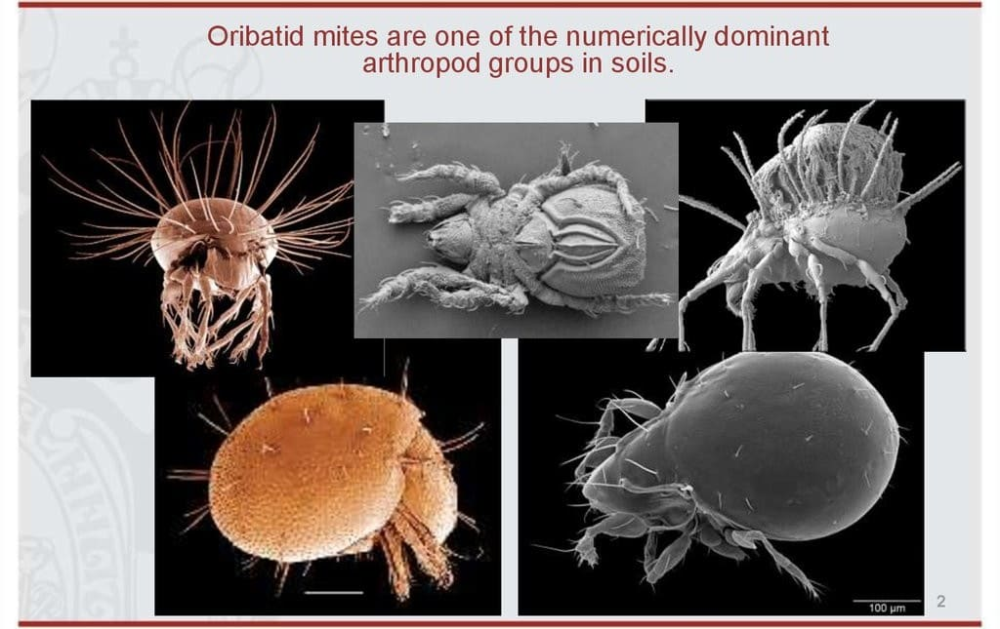

```{r setup, include=FALSE}
knitr::opts_chunk$set(
	fig.align = "center",
	fig.width = 6, fig.height = 6,
	cache = FALSE,
	collapse = TRUE,
	comment = "#>",
	highlight = TRUE
)
```

Joint Species distribution models (jSDM) are useful tools to explain or predict species range and abundance from various environmental factors and species correlations [@Warton2015]. jSDM is becoming an increasingly popular statistical method in conservation biology. 

In this vignette, we illustrate the use of the `jSDM` R package wich aims at providing user-friendly statistical functions using field observations (occurence or abundance data) to fit jSDMs models.

Package's functions are developped in a hierarchical Bayesian framework and use adaptive rejection Metropolis sampling algorithms or conjugate priors within Gibbs sampling to estimate model's parameters. Using compiled C++ code for the Gibbs sampler reduce drastically the computation time. By making these new statistical tools available to the scientific community, we hope to democratize the use of more complex, but more realistic, statistical models for increasing knowledge in ecology and conserving biodiversity. 

Model types available in `jSDM` are not limited to those described in this example. `jSDM` includes various model types for occurrence and abundance data: 

We first load the `jSDM` library.

```{r libraries}
# Load libraries
library(jSDM)
```

# Bernoulli probit regression 
 
Below, we show an example of the use of `jSDM` for fitting species distribution model to occurence data for 9 frog's species.

## Definition of the model 

Referring to the models used in the articles @Warton2015 and @Albert1993, we define the following model :

$$ \mathrm{probit}(\theta_{ij}) =\alpha_i + \beta_{0j}+X_i.\beta_j+ W_i.\lambda_j $$
     
- Link function probit: $\mathrm{probit}: q \rightarrow \Phi^{-1}(q)$ where $\Phi$ correspond to the repartition function of the reduced centred normal distribution.

- Response variable: $Y=(y_{ij})^{i=1,\ldots,nsite}_{j=1,\ldots,nsp}$ with:

$$y_{ij}=\begin{cases}
    0 & \text{ if species $j$ is absent on the site $i$}\\
    1 &  \text{ if species  $j$ is present on the site $i$}.
    \end{cases}$$
    
- Latent variable $z_{ij} = \alpha_i + \beta_{0j} + X_i.\beta_j + W_i.\lambda_j + \epsilon_{i,j}$, with $\forall (i,j) \ \epsilon_{ij} \sim \mathcal{N}(0,1)$ and such that:

$$y_{ij}=\begin{cases}
    1 & \text{if} \ z_{ij} > 0 \\
    0 &  \text{otherwise.}
    \end{cases}$$
    
It can be easily shown that: $y_{ij} \sim \mathcal{B}ernoulli(\theta_{ij})$. 

- Latent variables: $W_i=(W_i^1,\ldots,W_i^q)$ where $q$ is the number of latent variables considered, which has to be fixed by the user (by default q=2).
We assume that $W_i \sim \mathcal{N}(0,I_q)$ and we define the associated coefficients: $\lambda_j=(\lambda_j^1,\ldots, \lambda_j^q)'$. We use a prior distribution $\mathcal{N}(0,10)$ for all lambdas not concerned by constraints to $0$ on upper diagonal and to strictly positive values on diagonal. 

- Explanatory variables: bioclimatic data about each site. $X=(X_i)_{i=1,\ldots,nsite}$ with $X_i=(x_i^1,\ldots,x_i^p)\in \mathbb{R}^p$ where $p$ is the number of bioclimatic variables considered.
The corresponding regression coefficients for each species $j$ are noted : $\beta_j=(\beta_j^1,\ldots,\beta_j^p)'$.

- $\beta_{0j}$ correspond to the intercept for species $j$ which is assume to be a fixed effect. We use a prior distribution $\mathcal{N}(0,10^6)$ for all betas. 

- $\alpha_i$ represents the random effect of site $i$ such as $\alpha_i \sim \mathcal{N}(0,V_{\alpha})$ and we assumed that $V_{\alpha} \sim \mathcal {IG}(\text{shape}=0.5, \text{rate}=0.005)$ as prior distribution by default. 


## Data-set

(ref:cap-frog) **_Litoria ewingii_** [@Wilkinson2019].

```{r frog-picture, echo=FALSE, out.width=400, out.height=300, fig.cap="(ref:cap-frog)"}

```

This data-set is available in the `jSDM` R package. It can be loaded with the `data` command. The \link{\code{frogs}} dataset is in "wide" format: each line is a site and the occurrence data (from Species_1 to Species_9) are in columns. A site is characterized by its x-y geographical coordinates, one discrete covariate and two other continuous covariates. 

```{r frogs-data}
# frogs data
data(frogs, package="jSDM")
head(frogs)
```

We rearrange the data in two data-sets: a first one for the presence-absence observations for each species (columns) at each site (rows), and a second one for the site characteristics.

We also normalize the continuous explicative variables to facilitate MCMC convergence. 

```{r arranging-frogs-data}
# data.obs
PA_frogs <- frogs[,4:12]

# Normalized continuous variables
Env_frogs <- cbind(scale(frogs[,1]),frogs[,2],scale(frogs[,3]))
colnames(Env_frogs) <- colnames(frogs[,1:3])
```

## Parameter inference

We use the `jSDM_binomial_probit_block()` function to fit the jSDM (increase the number of iterations to achieve convergence). 

```{r jSDM-probit, cache=TRUE}
T1<- Sys.time()
mod_frogs_jSDM_probit <- jSDM_binomial_probit_block(
  # Chains
  burnin=100, mcmc=100, thin=1,
  # Response variable 
  presence_site_sp = PA_frogs, 
  # Explanatory variables 
  site_suitability = ~.,   
  site_data = Env_frogs,
  # Model specification 
  n_latent=2, site_effect="random",
  # Starting values
  alpha_start=0, beta_start=0,
  lambda_start=0, W_start=0,
  V_alpha=1, 
  # Priors
  shape=0.5, rate=0.0005,
  mu_beta=0, V_beta=1.0E6,
  mu_lambda=0, V_lambda=10,
  # Various 
  seed=1234, verbose=1)
T2 <- Sys.time()
```

## Analysis of the results

```{r plot-results-probit}
## alpha_i of the first two sites
plot(coda::as.mcmc(mod_frogs_jSDM_probit$mcmc.alpha[,1:2]))

## V_alpha
par(mfrow=c(1,2))
coda::traceplot(mod_frogs_jSDM_probit$mcmc.V_alpha, main="V_alpha")
coda::densplot(mod_frogs_jSDM_probit$mcmc.V_alpha, main="V_alpha")

np <- nrow(mod_frogs_jSDM_probit$model_spec$beta_start)

## beta_j of the first two species
par(mfrow=c(np,2))
for (j in 1:2) {
  for (p in 1:np) {
      coda::traceplot(coda::as.mcmc(mod_frogs_jSDM_probit$mcmc.sp[[paste0("sp_",j)]][,p]))
      coda::densplot(coda::as.mcmc(mod_frogs_jSDM_probit$mcmc.sp[[paste0("sp_",j)]][,p]), 
main = paste(colnames(mod_frogs_jSDM_probit$mcmc.sp[[paste0("sp_",j)]])[p],
", species : ",j))
  }
}

## lambda_j of the first two species
n_latent <- mod_frogs_jSDM_probit$model_spec$n_latent
par(mfrow=c(n_latent*2,2))
for (j in 1:2) {
  for (l in 1:n_latent) {
      coda::traceplot(coda::as.mcmc(mod_frogs_jSDM_probit$mcmc.sp[[paste0("sp_",j)]][,np+l]))
      coda::densplot(coda::as.mcmc(mod_frogs_jSDM_probit$mcmc.sp[[paste0("sp_",j)]][,np+l]), 
      main = paste(colnames(mod_frogs_jSDM_probit$mcmc.sp[[paste0("sp_",j)]])[np+l],
      ", species : ",j))
    }
  }

## Latent variables W_i for the first two sites
par(mfrow=c(1,2))
for (l in 1:n_latent) {
  plot(mod_frogs_jSDM_probit$mcmc.latent[[paste0("lv_",l)]][,1:2], main = paste0("Latent variable W_", l))
}

## probit_theta
par (mfrow=c(2,1))
hist(mod_frogs_jSDM_probit$probit_theta_pred, main = "Predicted probit theta", xlab ="predicted probit theta")
hist(pnorm(mod_frogs_jSDM_probit$probit_theta_pred), main = "Predicted theta", xlab ="predicted theta")


## Deviance
plot(mod_frogs_jSDM_probit$mcmc.Deviance,main = "Deviance")

```

## Matrice of correlations 

 After fitting the jSDM with latent variables, the **fullspecies residual correlation matrix** $R=(R_{ij})^{i=1,\ldots, nspecies}_{j=1,\ldots, nspecies}$ can bederived from the covariance in the latent variables such as : 
 $$\Sigma_{ij} = \begin{cases}
 \lambda_i .\lambda_j^T & \text{ if } i \neq j \\
  \lambda_i .\lambda_j^T + 1 & \text{ if } i=j
 \end{cases}$$, then we compute correlations from covariances :
  $$R_{i,j} = \frac{\Sigma_{ij}}{\sqrt{\Sigma _{ii}\Sigma _{jj}}}$$.

```{r correlation-matrix-probit}
plot_residual_cor(mod_frogs_jSDM_probit)
```

## Predictions 

We use the `predict()` S3 method on the `mod_frogs_jSDM_probit` object of class `jSDM` to compute the mean (or expectation) of the posterior distributions obtained and get the expected values of model's parameters.

```{r predictions-probit}
# Sites and species concerned by predictions :
## 50 sites among the 104
Id_sites <- sample.int(nrow(PA_frogs), 50)
## All species 
Id_species <- colnames(PA_frogs)
# Simulate new observations of covariates on those sites 
simdata <- matrix(nrow=50, ncol = ncol(mod_frogs_jSDM_probit$model_spec$site_data))
colnames(simdata) <- colnames(mod_frogs_jSDM_probit$model_spec$site_data)
rownames(simdata) <- Id_sites
simdata <- as.data.frame(simdata)
simdata$Covariate_1 <- rnorm(50)
simdata$Covariate_3 <- rnorm(50)
simdata$Covariate_2 <- rbinom(50,1,0.5)

# Predictions 
theta_pred <- predict(mod_frogs_jSDM_probit, newdata=simdata, Id_species=Id_species,
						   Id_sites=Id_sites, type="mean")
hist(theta_pred, main="Predicted theta with simulated data", xlab="predicted theta")
```


# Binomial logistic regression 

## Definition of the model 

$$ \mathrm{logit}(\theta_{ij}) =\alpha_i + \beta_{0j}+X_i.\beta_j+ W_i.\lambda_j $$
     
- Link function logit: $\mathrm{logit}: p \rightarrow \log(\frac{p}{1-p})$. 

- Response variable: $Y=(y_{ij})^{i=1,\ldots,nsite}_{j=1,\ldots,nsp}$ with:

$$y_{ij} \sim \mathcal{B}inomial(t_i, \theta_{ij})$$. 

$$y_{ij}=\begin{cases}
    0 & \text{if species $j$ has been observed as absent during each visits at site $i$}\\
    n &  \text{if species $j$ has been observed as present during $n$ visits at site $i$ ($n \leq t_i$)}.
    \end{cases}$$
    
- Latent variables: $W_i=(W_i^1,\ldots,W_i^q)$ where $q$ is the number of latent variables considered, which has to be fixed by the user (by default q=2).
We assume that $W_i \sim \mathcal{N}(0,I_q)$ and we define the associated coefficients: $\lambda_j=(\lambda_j^1,\ldots, \lambda_j^q)'$. We use a prior distribution $\mathcal{N}(0,10)$ for all lambdas not concerned by constraints to $0$ on upper diagonal and to strictly positive values on diagonal. 

- Explanatory variables: bioclimatic data about each site. $X=(X_i)_{i=1,\ldots,nsite}$ with $X_i=(x_i^1,\ldots,x_i^p)\in \mathbb{R}^p$ where $p$ is the number of bioclimatic variables considered.
The corresponding regression coefficients for each species $j$ are noted : $\beta_j=(\beta_j^1,\ldots,\beta_j^p)'$.

- $\beta_{0j}$ correspond to the intercept for species $j$ which is assume to be a fixed effect. We use a prior distribution $\mathcal{N}(0,10^6)$ for all betas. 

- $\alpha_i$ represents the random effect of site $i$ such as $\alpha_i \sim \mathcal{N}(0,V_{\alpha})$ and we assumed that $V_{\alpha} \sim \mathcal {IG}(\text{shape}=0.5, \text{rate}=0.005)$ as prior distribution by default. 


## Data-set

(ref:cap-birds) **_Swiss Breeding Bird Atlas_** [@Kery2006].

```{r birds-picture, echo=FALSE, out.width=600, out.height=300, fig.cap="(ref:cap-birds)"}

```

This data-set is available in the `jSDM` R package. It can be loaded with the `data` command. The data is in "wide" format: each line is a site and the occurrence data are in columns.

The Swiss breeding bird survey ("Monitoring Häufige Brutvögel" MHB) has monitored the populations of 158 common species since 1999. The MHB sample consists of 267 1-km squares that are laid out as a grid across Switzerland. Fieldwork is conducted by about 200 skilled birdwatchers, most of them volunteers. Avian populations are monitored using a simplified territory mapping protocol, where each square is surveyed up to three times during the breeding season (only twice above the tree line). Surveys are conducted along a transect that does not change over the years. 

The data set \link{\code{\birds}} contains the 2014 data, except for one quadrat not surveyed in 2014. 
It lists 158 bird species named in Latin and whose occurrences are expressed as the number of visits during which the species was observed on each site , with the exception of 13 species not surveyed in 2014 :


```{r birds-data}
# frogs data
data(birds, package="jSDM")
# Too large to display
#head(birds) 
```

We rearrange the data in two data-sets: a first one for the presence-absence observations for each species (columns) at each site (rows), and a second one for the site characteristics.

We also normalize the continuous explicative variables to facilitate MCMC convergence. 

```{r arranging-birds-data}
# data.obs
PA_birds <- birds[,1:158]

# Normalized continuous variables
Env_birds <- data.frame(cbind(scale(birds[,c("elev","rlength","forest")]), birds[,"nsurvey"]))
colnames(Env_birds) <- c("elev","rlength","forest","nsurvey")
```

## Parameter inference

We use the `jSDM_binomial_logit()` function to fit the jSDM (increase the number of iterations to achieve convergence). 

```{r jSDM-logit, cache=TRUE}
T1<- Sys.time()
mod_birds_jSDM_logit <- jSDM_binomial_logit(
  # Chains
  burnin=100, mcmc=100, thin=1,
  # Response variable 
  presence_site_sp=PA_birds, 
  trials=Env_birds$nsurvey,
  # Explanatory variables 
  site_suitability = ~ elev+rlength+forest,   
  site_data = Env_birds,
  # Model specification 
  n_latent=2, site_effect="random",
  # Starting values
  alpha_start=0, beta_start=0,
  lambda_start=0, W_start=0,
  V_alpha=1, 
  # Priors
  shape=0.5, rate=0.0005,
  mu_beta=0, V_beta=1.0E6,
  mu_lambda=0, V_lambda=10,
  # Various 
  ropt=0.44,
  seed=1234, verbose=1)
T2 <- Sys.time()
```

## Analysis of the results

```{r plot-results-logit}
## alpha_i of the first two sites
plot(coda::as.mcmc(mod_birds_jSDM_logit$mcmc.alpha[,1:2]))

## V_alpha
par(mfrow=c(1,2))
coda::traceplot(mod_birds_jSDM_logit$mcmc.V_alpha, main="V_alpha")
coda::densplot(mod_birds_jSDM_logit$mcmc.V_alpha, main="V_alpha")

np <- nrow(mod_birds_jSDM_logit$model_spec$beta_start)

## beta_j of the first two species
par(mfrow=c(np,2))
for (j in 1:2) {
  for (p in 1:np) {
      coda::traceplot(coda::as.mcmc(mod_birds_jSDM_logit$mcmc.sp[[paste0("sp_",j)]][,p]))
      coda::densplot(coda::as.mcmc(mod_birds_jSDM_logit$mcmc.sp[[paste0("sp_",j)]][,p]), 
main = paste(colnames(mod_birds_jSDM_logit$mcmc.sp[[paste0("sp_",j)]])[p],
", species : ",j))
  }
}

## lambda_j of the first two species
n_latent <- mod_birds_jSDM_logit$model_spec$n_latent
par(mfrow=c(n_latent*2,2))
for (j in 1:2) {
  for (l in 1:n_latent) {
      coda::traceplot(coda::as.mcmc(mod_birds_jSDM_logit$mcmc.sp[[paste0("sp_",j)]][,np+l]))
      coda::densplot(coda::as.mcmc(mod_birds_jSDM_logit$mcmc.sp[[paste0("sp_",j)]][,np+l]), 
      main = paste(colnames(mod_birds_jSDM_logit$mcmc.sp[[paste0("sp_",j)]])[np+l],
      ", species : ",j))
    }
  }

## Latent variables W_i for the first two sites
par(mfrow=c(1,2))
for (l in 1:n_latent) {
  plot(mod_birds_jSDM_logit$mcmc.latent[[paste0("lv_",l)]][,1:2], main = paste0("Latent variable W_", l))
}

## theta
par (mfrow=c(2,1))
hist(logit(mod_birds_jSDM_logit$theta_latent), main = "Predicted logit theta", xlab ="predicted logit theta")
hist(mod_birds_jSDM_logit$theta_latent, main = "Predicted theta", xlab ="predicted theta")

## Deviance
plot(mod_birds_jSDM_logit$mcmc.Deviance,main = "Deviance")

```

## Matrice of correlations 

 After fitting the jSDM with latent variables, the **fullspecies residual correlation matrix** $R=(R_{ij})^{i=1,\ldots, nspecies}_{j=1,\ldots, nspecies}$ can bederived from the covariance in the latent variables such as : 
 $$\Sigma_{ij} = \begin{cases}
 \lambda_i .\lambda_j^T & \text{ if } i \neq j \\
  \lambda_i .\lambda_j^T + 1 & \text{ if } i=j
 \end{cases}$$, then we compute correlations from covariances :
  $$R_{i,j} = \frac{\Sigma_{ij}}{\sqrt{\Sigma _{ii}\Sigma _{jj}}}$$.

```{r correlation-matrix-logit}
plot_residual_cor(mod_birds_jSDM_logit, tl.cex=0.3)
```

## Predictions 

We use the `predict()` S3 method on the `mod_birds_jSDM_logit` object of class `jSDM` to compute the mean (or expectation) of the posterior distributions obtained and get the expected values of model's parameters.

```{r predictions-logit}
# Sites and species concerned by predictions :
## 50 sites among the 104
Id_sites <- sample.int(nrow(PA_birds), 100)
## All species 
Id_species <- colnames(PA_birds)
# Simulate new observations of covariates on those sites 
simdata <- matrix(nrow=100, ncol = ncol(mod_birds_jSDM_logit$model_spec$site_data))
colnames(simdata) <- colnames(mod_birds_jSDM_logit$model_spec$site_data)
rownames(simdata) <- Id_sites
simdata <- as.data.frame(simdata)
simdata$forest <- rnorm(100)
simdata$rlength <- rnorm(100)
simdata$elev <- rnorm(100)

# Predictions 
theta_pred <- predict(mod_birds_jSDM_logit, newdata=simdata, Id_species=Id_species,
						   Id_sites=Id_sites, type="mean")
hist(theta_pred, main="Predicted theta with simulated data", xlab="predicted theta")
```

# Poisson log-linear regression 

## Definition of the model 

$$ \mathrm{log}(\theta_{ij}) =\alpha_i + \beta_{0j}+X_i.\beta_j+ W_i.\lambda_j $$
     
- Link function logarithm : $\mathrm{log}: p \rightarrow \log(p)$. 

- Response variable: $Y=(y_{ij})^{i=1,\ldots,nsite}_{j=1,\ldots,nsp}$ with:

$$y_{ij} \sim \mathcal{P}oisson(\theta_{ij})$$. 

$$y_{ij}=\begin{cases}
    0 & \text{if species $j$ has been observed as absent at site $i$}\\
    n &  \text{if $n$ individuals of the species $j$ have been observed at the site $i$}.
    \end{cases}$$
    
- Latent variables: $W_i=(W_i^1,\ldots,W_i^q)$ where $q$ is the number of latent variables considered, which has to be fixed by the user (by default q=2).
We assume that $W_i \sim \mathcal{N}(0,I_q)$ and we define the associated coefficients: $\lambda_j=(\lambda_j^1,\ldots, \lambda_j^q)'$. We use a prior distribution $\mathcal{N}(0,10)$ for all lambdas not concerned by constraints to $0$ on upper diagonal and to strictly positive values on diagonal. 

- Explanatory variables: bioclimatic data about each site. $X=(X_i)_{i=1,\ldots,nsite}$ with $X_i=(x_i^1,\ldots,x_i^p)\in \mathbb{R}^p$ where $p$ is the number of bioclimatic variables considered.
The corresponding regression coefficients for each species $j$ are noted : $\beta_j=(\beta_j^1,\ldots,\beta_j^p)'$.

- $\beta_{0j}$ correspond to the intercept for species $j$ which is assume to be a fixed effect. We use a prior distribution $\mathcal{N}(0,10^6)$ for all betas. 

- $\alpha_i$ represents the random effect of site $i$ such as $\alpha_i \sim \mathcal{N}(0,V_{\alpha})$ and we assumed that $V_{\alpha} \sim \mathcal {IG}(\text{shape}=0.5, \text{rate}=0.005)$ as prior distribution by default. 

## Data-set

(ref:cap-mites) **_Oribatid mites_** [@Borcard1994].

```{r mites-picture, echo=FALSE, out.width=500, out.height=400, fig.cap="(ref:cap-mites)"}

```

This data-set is available in the `jSDM` R package. It can be loaded with the `data` command. The \link{\code{mites}} data-set is in "wide" format: each line is a site and the abundance data are in columns.

This example data set is composed of 70 cores of mostly Sphagnum mosses collected on the territory of the Station de biologie des Laurentides of Université de Montréal, Québec, Canada in June 1989. 

The whole sampling area was 2.5 m x 10 m in size and thirty-five taxa were recognized as species, though many were not given a species name, owing to the incomplete stage of systematic knowledge of the North American Oribatid fauna.

The data set comprises the abundances of 35 morphospecies, 5 substrate and micritopographic variables, and the x-y Cartesian coordinates of the 70 sampling sites. 

See Borcard et al. (1992, 1994) for details.


```{r mites-data}
# frogs data
data(mites, package="jSDM")
head(mites)
```

We rearrange the data in two data-sets: a first one for the abundance observations for each species (columns) at each site (rows), and a second one for the site characteristics.

We also normalize the continuous explicative variables to facilitate MCMC convergence. 

```{r arranging-mites-data}
# data.obs
PA_mites <- mites[,1:35]

# Normalized continuous variables
Env_mites  <- cbind(scale(mites[,c("density","water")]), mites[,c("substrate", "shrubs", "topo")])
str(Env_mites)
```

## Parameter inference

We use the `jSDM_poisson_log()` function to fit the jSDM (increase the number of iterations to achieve convergence). 

```{r jSDM-log, cache=TRUE}
T1<- Sys.time()
mod_mites_jSDM_log <- jSDM_poisson_log(
  # Chains
  burnin=100, mcmc=100, thin=1,
  # Response variable 
  presence_site_sp=PA_mites, 
  # Explanatory variables 
  site_suitability = ~.,   
  site_data = Env_mites,
  # Model specification 
  n_latent=2, site_effect="random",
  # Starting values
  alpha_start=0, beta_start=0,
  lambda_start=0, W_start=0,
  V_alpha=1, 
  # Priors
  shape=0.5, rate=0.0005,
  mu_beta=0, V_beta=1.0E6,
  mu_lambda=0, V_lambda=10,
  # Various 
  ropt=0.44,
  seed=1234, verbose=1)
T2 <- Sys.time()
```

## Analysis of the results

```{r plot-results-log}
## alpha_i of the first two sites
plot(coda::as.mcmc(mod_mites_jSDM_log$mcmc.alpha[,1:2]))

## V_alpha
par(mfrow=c(1,2))
coda::traceplot(mod_mites_jSDM_log$mcmc.V_alpha, main="V_alpha")
coda::densplot(mod_mites_jSDM_log$mcmc.V_alpha, main="V_alpha")

np <- nrow(mod_mites_jSDM_log$model_spec$beta_start)

## beta_j of the first two species
par(mfrow=c(3,2))
  for (p in 1:np) {
      coda::traceplot(coda::as.mcmc(mod_mites_jSDM_log$mcmc.sp[[paste0("sp_",1)]][,p]))
      coda::densplot(coda::as.mcmc(mod_mites_jSDM_log$mcmc.sp[[paste0("sp_",1)]][,p]), 
main = paste(colnames(mod_mites_jSDM_log$mcmc.sp[[paste0("sp_",1)]])[p],
", species : ",1))
  }

## lambda_j of the first two species
n_latent <- mod_mites_jSDM_log$model_spec$n_latent
par(mfrow=c(n_latent*2,2))
for (j in 1:2) {
  for (l in 1:n_latent) {
      coda::traceplot(coda::as.mcmc(mod_mites_jSDM_log$mcmc.sp[[paste0("sp_",j)]][,np+l]))
      coda::densplot(coda::as.mcmc(mod_mites_jSDM_log$mcmc.sp[[paste0("sp_",j)]][,np+l]), 
      main = paste(colnames(mod_mites_jSDM_log$mcmc.sp[[paste0("sp_",j)]])[np+l],
      ", species : ",j))
    }
  }

## Latent variables W_i for the first two sites
par(mfrow=c(1,2))
for (l in 1:n_latent) {
  plot(mod_mites_jSDM_log$mcmc.latent[[paste0("lv_",l)]][,1:2], main = paste0("Latent variable W_", l))
}

## probit_theta
par (mfrow=c(2,1))
hist(log(mod_mites_jSDM_log$theta_latent), main = "Predicted log theta", xlab ="predicted log theta")
hist(mod_mites_jSDM_log$theta_latent, main = "Predicted theta", xlab ="predicted theta")

## Deviance
plot(mod_mites_jSDM_log$mcmc.Deviance,main = "Deviance")

```

## Matrice of correlations 

 After fitting the jSDM with latent variables, the **fullspecies residual correlation matrix** $R=(R_{ij})^{i=1,\ldots, nspecies}_{j=1,\ldots, nspecies}$ can bederived from the covariance in the latent variables such as : 
 $$\Sigma_{ij} = \begin{cases}
 \lambda_i .\lambda_j^T & \text{ if } i \neq j \\
  \lambda_i .\lambda_j^T + 1 & \text{ if } i=j
 \end{cases}$$, then we compute correlations from covariances :
  $$R_{i,j} = \frac{\Sigma_{ij}}{\sqrt{\Sigma _{ii}\Sigma _{jj}}}$$.

```{r correlation-matrix-log}
plot_residual_cor(mod_mites_jSDM_log, tl.cex=0.5)
```

## Predictions 

We use the `predict()` S3 method on the `mod_mites_jSDM_log` object of class `jSDM` to compute the mean (or expectation) of the posterior distributions obtained and get the expected values of model's parameters.

```{r predictions-log}
# Sites and species concerned by predictions :
## 50 sites among the 104
Id_sites <- sample.int(nrow(PA_mites), 40)
## All species 
Id_species <- colnames(PA_mites)
# Simulate new observations of covariates on those sites 
simdata <- matrix(nrow=40, ncol = ncol(mod_mites_jSDM_log$model_spec$site_data))
colnames(simdata) <- colnames(mod_mites_jSDM_log$model_spec$site_data)
rownames(simdata) <- Id_sites
simdata <- as.data.frame(simdata)
simdata$density <- rnorm(40)
simdata$water <- rnorm(40)
simdata$substrate <- sample(c("inter", "litter", "peat", "sph1", "sph2", "sph3", "sph4"), 40, replace=T)
simdata$shrubs <- sample(c("none","many", "few"), 40, replace=T)
simdata$topo <- sample(c("blanket","hummock"), 40, replace=T)

# Predictions 
theta_pred <- predict(mod_mites_jSDM_log, newdata=simdata, Id_species=Id_species,
						   Id_sites=Id_sites, type="mean")
hist(theta_pred, main="Predicted theta with simulated data", xlab="predicted theta")
```

# References
