```{r setup, include=FALSE}
knitr::opts_chunk$set(
  fig.align="center",
  fig.width=8, fig.height=6,
  cache=TRUE,
  collapse=TRUE,
  comment="#>",
  highlight=TRUE,
  eval=FALSE
)
```

# Models definition 

## Binomial model for presence-absence data 

We consider a latent variable model (LVM) to account for species co-occurrence [@Warton2015] on all sites . 

$$y_{ij} \sim \mathcal{B}iniomial(t_i, \theta_{ij})$$
  
  $$ \mathrm{g}(\theta_{ij}) = X_i\beta_j + W_i\lambda_j $$
- $\theta_{ij}: occurence probability of the species $j$ on site $i$. 
- $t_i$: number of visits at site $i$ 
- $\mathrm{g}(\cdot)$: Link function (eg. logit or probit).

The inference method is able to handle only one visit by site with a **probit** link function so $\forall i, \ t_i=1$ and $y_{ij} \sim \mathcal{B}ernoulli(\theta_{ij})$.

- $X_i$: Vector of explanatory variables for site $i$ (including intercept).
- $\beta_j$: Effects of the explanatory variables on the probability of presence of species $j$.
- $W_i$: Vector of random latent variables for site $i$. $W_i \sim N(0, 1)$. The number of latent variables must be fixed by the user (default to 2).
- $\lambda_j$: Effects of the latent variables on the probability of presence of species $j$. Also known as "factor loadings" [@Warton2015].

This model is equivalent to a multivariate GLMM $\mathrm{g}(\theta_{ij}) = X_i.\beta_j + u_{ij}$, where $u_{ij} \sim \mathcal{N}(0, \Sigma)$ with the constraint that the variance-covariance matrix $\Sigma = \Lambda \Lambda^{\prime}$, where $\Lambda$ is the full matrix of factor loadings, with the $\lambda_j$ as its columns. 

Using this model we can compute the **full species residual correlation matrix** $R=(R_{ij})^{i=1,\ldots, nspecies}_{j=1,\ldots, nspecies}$ from the covariance in the latent variables such as : 
 $$\Sigma_{ij} = \begin{cases}
 \lambda_i .\lambda_j^T & \text{ if } i \neq j \\
  \lambda_i .\lambda_j^T + 1 & \text{ if } i=j
 \end{cases}$$, then we compute correlations from covariances :
  $$R_{i,j} = \frac{\Sigma_{ij}}{\sqrt{\Sigma _{ii}\Sigma _{jj}}}$$.

## Poisson model for abundance data

Referring to the models used in the articles [@Hui2016], we define the following model to account for species abundances on all sites. 

$$y_{ij} \sim \mathcal{P}oisson(\theta_{ij})$$. 

$$ \mathrm{log}(\theta_{ij}) = \beta_{0j} + X_i\beta_j + W_i\lambda_j $$

# Data-sets
 
Among the following datasets, the presence-absence data are from the [@Wilkinson2019] article in which they are used to compare joint species distribution models for presence-absence data, the dataset that records the presence or absence of `birds` is from the [@Kery2006] article and the `mites` abundance data-set is from the [@Borcard1994] article.
 
```{r data-sets, echo=FALSE, eval=TRUE}
library(knitr)
library(kableExtra)
library(jSDM)
library(Hmsc)
# Mosquitos dataset
data("mosquitos")
PA_Mosquitos <- mosquitos[,1:16]
Env_Mosquitos <- mosquitos[,17:29]
mf.suit <- model.frame(formula=~., data=as.data.frame(Env_Mosquitos))
X_Mosquitos <- model.matrix(attr(mf.suit,"terms"), data=mf.suit)
# Eucalypts dataset
data("eucalypts")
PA_Eucalypts <- eucalypts[,1:12]
Env_Eucalypts <- cbind(scale(eucalypts[,c("Rockiness","VallyBotFlat","PPTann", "cvTemp","T0")]),eucalypts[,c("Sandiness","Loaminess")])
Env_Eucalypts <- Env_Eucalypts[rowSums(PA_Eucalypts) != 0,]
# Remove sites where none species was recorded
PA_Eucalypts<- PA_Eucalypts[rowSums(PA_Eucalypts) != 0,]
mf.suit <- model.frame(formula=~., data=as.data.frame(Env_Eucalypts))
X_Eucalypts <- model.matrix(attr(mf.suit,"terms"), data=mf.suit)
# Frogs dataset
data("frogs")
PA_Frogs <- frogs[,4:12]
Env_Frogs <- cbind(scale(frogs[,"Covariate_1"]),frogs[,"Covariate_2"],scale(frogs[,"Covariate_3"]))
mf.suit <- model.frame(formula=~., data=as.data.frame(Env_Frogs))
X_Frogs <- model.matrix(attr(mf.suit,"terms"), data=mf.suit)
# Fungi dataset
data(fungi, package="jSDM")
Env_Fungi <- cbind(scale(fungi[,c("diam","epi","bark")]),
                   fungi[,c("dc1","dc2","dc3","dc4","dc5",
                            "quality3","quality4","ground3","ground4")])
colnames(Env_Fungi) <- c("diam","epi","bark","dc1","dc2","dc3","dc4","dc5",
                         "quality3","quality4","ground3","ground4")
PA_Fungi <- fungi[,c("antser","antsin","astfer","fompin","hetpar","junlut",
                     "phefer","phenig","phevit","poscae","triabi")]
Env_Fungi <- Env_Fungi[rowSums(PA_Fungi) != 0,]
# Remove sites where none species was recorded
PA_Fungi<- PA_Fungi[rowSums(PA_Fungi) != 0,]
mf.suit <- model.frame(formula=~., data=as.data.frame(Env_Fungi))
X_Fungi <- model.matrix(attr(mf.suit,"terms"), data=mf.suit)
# Birds dataset
data("birds")
PA_Birds <- birds[,1:158]
# Remove species with less than 5 presences
rare_sp <- which(apply(PA_Birds>0, 2, sum) < 5) 
PA_Birds <- PA_Birds[, -rare_sp]
# Transform presence-absence data with multiple visits per site into binary data
PA_Birds[PA_Birds > 0] <- 1
Env_Birds <- data.frame(cbind(scale(birds[,c("elev","rlength","forest")]), birds[,"nsurvey"]))
mf.suit <- model.frame(formula=~elev+rlength+forest, data=as.data.frame(Env_Birds))
X_Birds <- model.matrix(attr(mf.suit,"terms"), data=mf.suit)
# Mites dataset
data("mites")
PA_Mites <- mites[,1:35]
# Remove species with less than 10 presences
rare_sp <- which(apply(PA_Mites >0, 2, sum) < 10) 
PA_Mites <- PA_Mites[, -rare_sp]
# Normalized continuous variables
Env_Mites  <- cbind(scale(mites[,c("density","water")]), mites[,c("substrate", "shrubs", "topo")])
mf.suit <- model.frame(formula=~., data=as.data.frame(Env_Mites))
X_Mites <- model.matrix(attr(mf.suit,"terms"), data=mf.suit)

datasets <- data.frame(matrix(NA,10,7),row.names=c("data type", "distribution", "n.site","n.species","n.latent","n.X.coefs", "n.obs",  "n.param", "n.mcmc",""))
colnames(datasets) <- c("Simulated","Mosquitos","Eucalypts","Frogs","Fungi","Birds","Mites") 
datasets["n.site",] <- c(300,nrow(mosquitos),nrow(Env_Eucalypts), nrow(frogs), nrow(Env_Fungi), nrow(birds), nrow(mites))
datasets["n.X.coefs",] <- c(3,ncol(X_Mosquitos),ncol(X_Eucalypts),ncol(X_Frogs),ncol(X_Fungi),ncol(X_Birds), ncol(X_Mites))
datasets["n.species",] <- c(100,ncol(PA_Mosquitos),ncol(PA_Eucalypts),ncol(PA_Frogs),ncol(PA_Fungi),ncol(PA_Birds), ncol(PA_Mites))
datasets["n.latent",] <- 2
datasets["n.obs",] <- datasets["n.site",]*datasets["n.species",] 
datasets["n.mcmc",] <- 15000
datasets["n.param",] <- datasets["n.site",]*(1+datasets["n.latent",])+1+datasets["n.species",]*(datasets["n.X.coefs",]+datasets["n.latent",])-1
datasets["data type",] <-c("presence-absence","presence-absence","presence-absence","presence-absence","presence-absence","presence-absence","abundance")
datasets["distribution",] <- c("bernoulli", "bernoulli","bernoulli","bernoulli","bernoulli","bernoulli","poisson")
sp_pictures <- c("figures/des.jpg",
                 "figures/Mosquitos_.jpg","figures/Eucalyptus_.jpg",
                 "figures/Frogs_.jpg","figures/Fungi_.jpg",
                 "figures/birds.jpg",
                 "figures/oribatid-mites.png")
datasets["",] <- sprintf('{height="100px" width="100px"}',sp_pictures)
knitr::kable(datasets, booktabs=TRUE) %>%
  kableExtra::kable_styling(latex_options=c("HOLD_position","striped"), full_width=FALSE) 
```

Hierarchical Modelling of Species Communities (HMSC) is a model-based approach for analyzing community ecological data ([@Ovaskainen2017]). The obligatory data for HMSC-analyses includes a matrix of species occurrences or abundances and a matrix of environmental covariates. Additional and optional data include information about species traits and phylogenetic relationships, and information about the spatiotemporal context of the sampling design. HMSC partitions variation in species occurrences to components that relate to environmental filtering, species interactions, and random processes. `HMSC` yields inference both at species and community levels. 
This package and the package `jSDM` allow to fit the model defined previously, so we can compare the results obtained by each of them on different datasets. 

# Package `Hmsc`

In a first step, we fit joint species distribution models from previous datasets using the `Hmsc()` function from package of the same name  whose functionalities are developed in the article [@Ovaskainen2017]. 

## Simulated dataset

We generate a data-set following the previous model with 300 sites, 100 species and as parameters :

```{r simulated-data, echo=TRUE, eval=FALSE}

# Toy example : 
nsp <- 100
nsite <- 300
nl <- 2
seed <- 123
set.seed(seed)

# Ecological process (suitability)
x1 <- rnorm(nsite,0,1)
x2 <- rnorm(nsite,0,1)
X <- cbind(rep(1,nsite),x1,x2)
np <- ncol(X)
# Simulation of parameters
W <- cbind(rnorm(nsite,0,1),rnorm(nsite,0,1))
beta.target <- t(matrix(runif(nsp*np,-2,2), byrow=TRUE, nrow=nsp))
l.zero <- 0
l.diag <- runif(2,0,2)
l.other <- runif(nsp*2-3,-2,2)
lambda.target <- t(matrix(c(l.diag[1],l.zero,l.other[1],l.diag[2],l.other[-1]),
                          byrow=T, nrow=nsp))
param.target <- rbind(beta.target,lambda.target)

# Simulation of response data with probit link
probit_theta <- X %*% beta.target + W %*% lambda.target
theta <- pnorm(probit_theta)
e <- matrix(rnorm(nsp*nsite,0,1),nsite,nsp)
Z_true <- probit_theta + e
Y <- matrix(NA, nsite,nsp)
for (i in 1:nsite){
  for (j in 1:nsp){
    if ( Z_true[i,j] > 0) {Y[i,j] <- 1}
    else {Y[i,j] <- 0}
  }
}
```


We fit a binomial joint species distribution model, including latent variables, from the simulated dataset using the `Hmsc()` function to perform binomial probit regression.

```{r Hmsc-simulation, echo=TRUE, eval=FALSE}
library(Hmsc)
studyDesign <- data.frame(sample=as.factor(1:nrow(Y)))
rL <- HmscRandomLevel(units=studyDesign$sample)
rL <- setPriors(rL, nfMax=2, nfMin=2)
T1<-Sys.time() 
mod <- Hmsc(Y=Y, XData=as.data.frame(X), XFormula=~x1+x2, XScale = FALSE,
            distr="probit", studyDesign=studyDesign,
            ranLevels=list("sample"=rL))
mod_Hmsc_sim <- sampleMcmc(mod, thin=5, samples=1000, transient = 10000, nChains = 1)
T2<-Sys.time() 
T_Hmsc_sim=difftime(T2,T1, units="secs")

# Predicted probit(theta) 
theta_latent_sim <- apply(computePredictedValues(mod_Hmsc_sim),c(1,2),mean)
probit_theta_latent_sim <- qnorm(theta_latent_sim)
# RMSE
#res <- evaluateModelFit(hM=mod_Hmsc_sim, predY=preds)
SE=(theta-theta_latent_sim)^2
RMSE_Hmsc_sim=sqrt(sum(SE/(nsite*nsp)))
# Deviance 
logL=0
for (i in 1:nsite){
  for (j in 1:nsp){
    logL=logL + dbinom(Y[i,j],1,theta_latent_sim[i,j],1)  
  }
}
Deviance_Hmsc_sim <- -2*logL

save(np, nl, nsp, nsite, beta.target, lambda.target, X, W, theta, probit_theta, Z_true, Y, T_Hmsc_sim,
     mod_Hmsc_sim, rL, probit_theta_latent_sim,
     RMSE_Hmsc_sim, Deviance_Hmsc_sim,
     file="jSDM_Hmsc_cache/Hmsc_simulation.RData")
```

```{r Hmsc-simulation-plot, echo=TRUE}
load(file="jSDM_Hmsc_cache/Hmsc_simulation.RData")
codaObject <- Hmsc::convertToCodaObject(mod_Hmsc_sim, start=1)

# Trace and density plot of MCMC chains of parameters to visually evaluate convergence 
## Fixed species effect beta
par(mfrow=c(ncol(X),2))
for(j in 1:2){
  MCMC.betaj <- codaObject$Beta[[1]][,grepl(paste0("sp0",j),colnames(codaObject$Beta[[1]]))]
  for(p in 1:ncol(X)){
      coda::traceplot(MCMC.betaj[,p],
                      main=paste0("Trace of ", colnames(MCMC.betaj)[p]))
      coda::densplot(MCMC.betaj[,p],
                     main=paste0("Density of ", colnames(MCMC.betaj)[p]))
      abline(v=beta.target[p,j],col='red')
  }
}
Hmsc_beta <- t(getPostEstimate(hM=mod_Hmsc_sim, parName='Beta')$mean)

## factor loadings lambda_j
par(mfrow=c(2,2))
for(j in 1:2){
  MCMC.lambdaj <- codaObject$Lambda[[1]][,grepl(paste0("sp0",j),colnames(codaObject$Lambda[[1]][[1]]))][[1]]
  for(l in 1:rL$nfMax){
      coda::traceplot(MCMC.lambdaj[,l],
                      main=paste0("Trace of ", colnames(MCMC.lambdaj)[l]))
      coda::densplot(MCMC.lambdaj[,l],
                     main=paste0("Density of ", colnames(MCMC.lambdaj)[l]))
      abline(v=lambda.target[l,j],col='red')
  }
}
Hmsc_lambda <- t(getPostEstimate(hM=mod_Hmsc_sim, parName='Lambda', r=1)$mean)


par(mfrow=c(1,2))
plot(t(beta.target), Hmsc_beta,
     xlab="obs", ylab="fitted", main="Fixed species effect beta") 
abline(a=0,b=1,col='red')
plot(t(lambda.target),Hmsc_lambda,
     xlab="obs", ylab="fitted", main="Loading factors lambda") 
abline(a=0,b=1,col='red')

## Latent variable W 
Hmsc_lvs <- getPostEstimate(hM=mod_Hmsc_sim, parName='Eta', r=1)$mean
par(mfrow=c(1,2))
for (l in 1:nl) {
  plot(W[,l],Hmsc_lvs[,l],
       main=paste0("Latent variable W_", l),
       xlab="obs", ylab="fitted")
  abline(a=0,b=1,col='red')
}

## Prediction
# probit_theta_latent 
par(mfrow=c(1,1))
plot(probit_theta,probit_theta_latent_sim,
     main="probit(theta)", xlab ="obs", ylab="fitted")
abline(a=0,b=1,col='red')
```


```{r Hmsc-simulation-plot2, echo=FALSE, out.width=800, eval=TRUE}
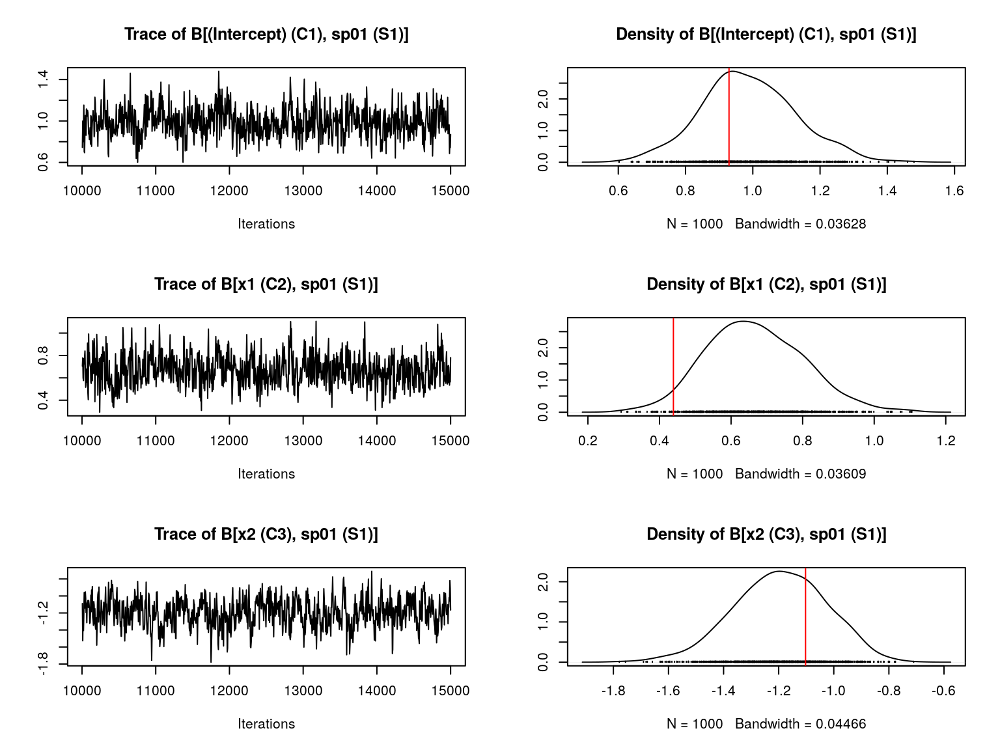
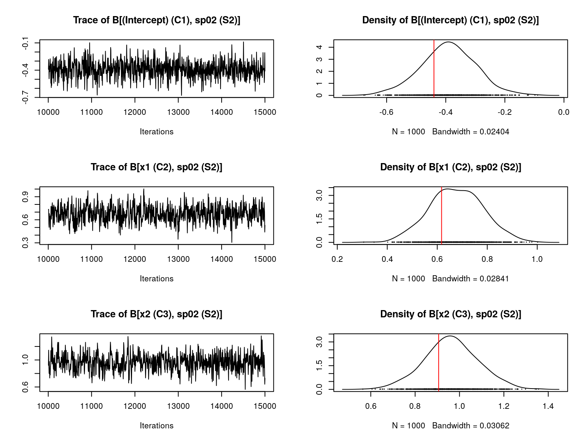
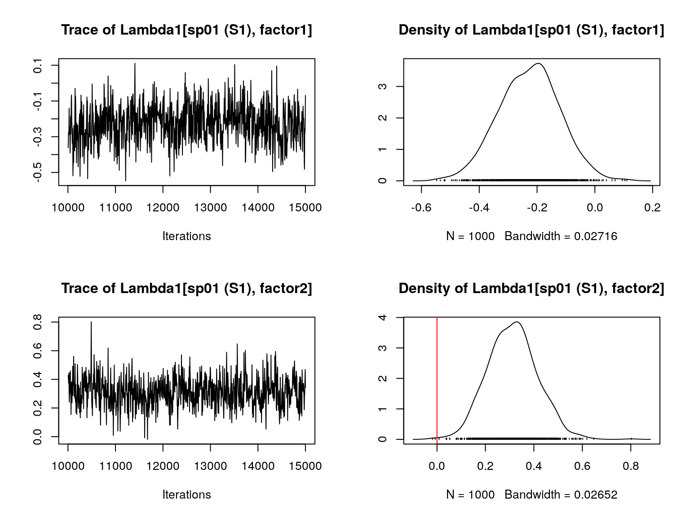
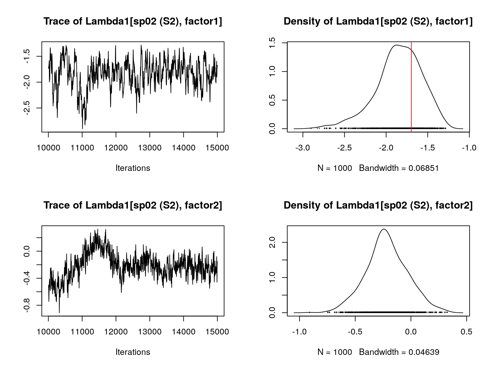
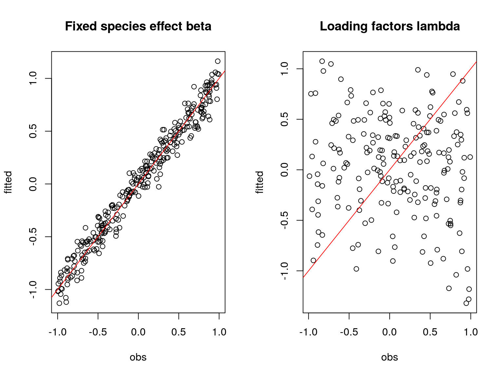
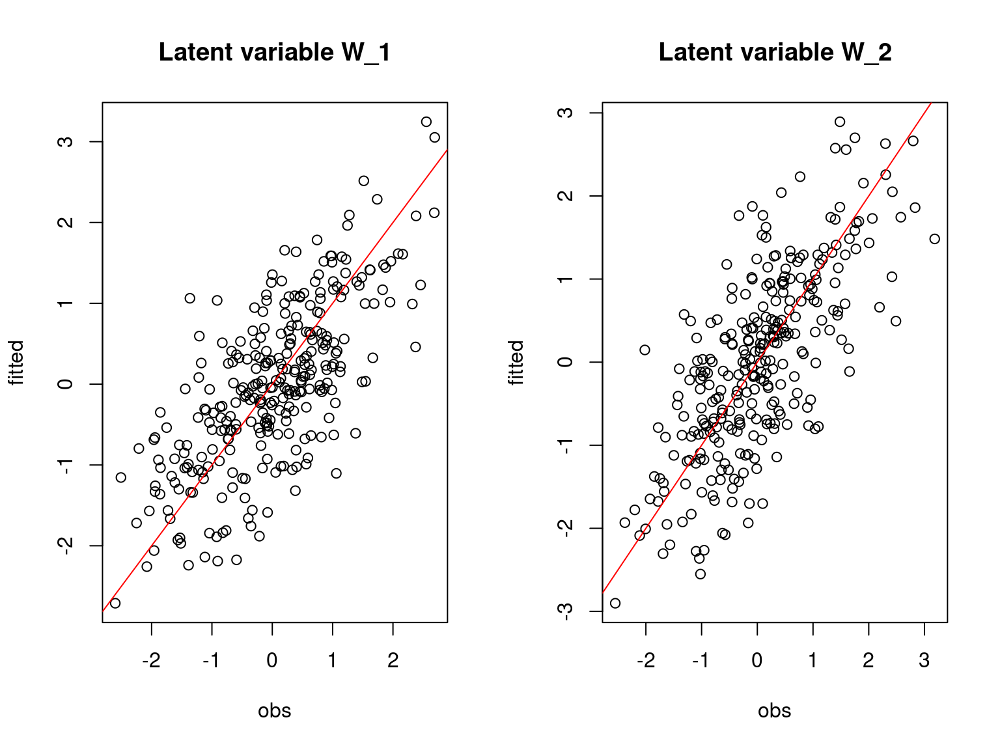
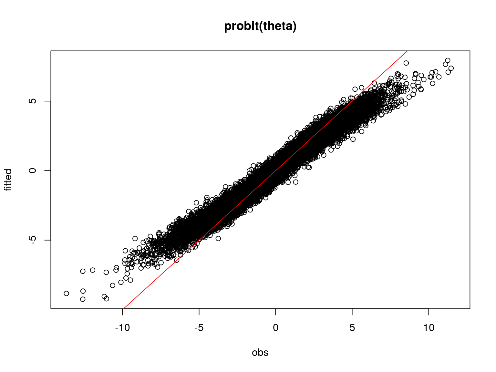
```

## Mosquitos dataset

We fit a binomial joint species distribution model, including latent variables, from the [`mosquitos`](https://ecology.ghislainv.fr/jSDM/reference/mosquitos.html) dataset using `Hmsc()` function to perform binomial probit regression.

```{r Hmsc-mosquito, eval=FALSE}
# Import center and reduce Mosquito dataset
data(mosquitos, package="jSDM")
head(mosquitos)
Env_Mosquitos <- mosquitos[,17:29]
Env_Mosquitos <- cbind(scale(Env_Mosquitos[,1:4]), Env_Mosquitos[,5:13])
PA_Mosquitos <- mosquitos[,1:16]

# Define the model 
studyDesign <- data.frame(sample=as.factor(1:nrow(PA_Mosquitos)))
rL <- HmscRandomLevel(units=studyDesign$sample)
rL <- setPriors(rL, nfMax=2, nfMin=2)
# Fit the model 
T1<-Sys.time() 
mod <- Hmsc(Y=PA_Mosquitos, XData=as.data.frame(Env_Mosquitos), XFormula=~., XScale = FALSE,
            distr="probit", studyDesign=studyDesign,
            ranLevels=list("sample"=rL))
mod_Hmsc_Mosquitos <- sampleMcmc(mod, thin=5, samples=1000, transient = 10000, nChains = 1)
T2<-Sys.time() 
T_Hmsc_Mosquitos=difftime(T2,T1, units="secs")

# Predicted probit(theta) 
theta_latent_Mosquitos  <- apply(computePredictedValues(mod_Hmsc_Mosquitos),c(1,2),mean)
probit_theta_latent_Mosquitos  <- qnorm(theta_latent_Mosquitos)

# Deviance 
logL=0
for (i in 1:nrow(PA_Mosquitos)){
  for (j in 1:ncol(PA_Mosquitos)){
    logL=logL + dbinom(PA_Mosquitos [i,j],1,theta_latent_Mosquitos[i,j],1)  
  }
}
Deviance_Hmsc_Mosquitos  <- -2*logL

save(T_Hmsc_Mosquitos, mod_Hmsc_Mosquitos,
     probit_theta_latent_Mosquitos, Deviance_Hmsc_Mosquitos,
     file="jSDM_Hmsc_cache/Hmsc_Mosquitos.RData")
```

## Eucalypts dataset

We fit a binomial joint species distribution model, including latent variables, from the [`eucalypts`](https://ecology.ghislainv.fr/jSDM/reference/eucalypts.html) dataset using `Hmsc()` function to perform binomial probit regression.

```{r Hmsc-eucalypts, eval=FALSE}
# Import center and reduce Eucalypts dataset
data(eucalypts, package="jSDM")
head(eucalypts)
Env_Eucalypts <- cbind(scale(eucalypts[,c("Rockiness","VallyBotFlat","PPTann", "cvTemp","T0")]),eucalypts[,c("Sandiness","Loaminess")])
PA_Eucalypts <- eucalypts[,1:12]
Env_Eucalypts <- Env_Eucalypts[rowSums(PA_Eucalypts) != 0,]
# Remove sites where none species was recorded
PA_Eucalypts<- PA_Eucalypts[rowSums(PA_Eucalypts) != 0,]

# Define the model 
studyDesign <- data.frame(sample=as.factor(1:nrow(PA_Eucalypts)))
rL <- HmscRandomLevel(units=studyDesign$sample)
rL <- setPriors(rL, nfMax=2, nfMin=2)
# Fit the model 
T1<-Sys.time() 
mod <- Hmsc(Y=PA_Eucalypts, XData=as.data.frame(Env_Eucalypts), XFormula=~., XScale = FALSE,
            distr="probit", studyDesign=studyDesign,
            ranLevels=list("sample"=rL))
mod_Hmsc_Eucalypts <- sampleMcmc(mod, thin=5, samples=1000, transient = 10000, nChains = 1)
T2<-Sys.time() 
T_Hmsc_Eucalypts=difftime(T2,T1, units="secs")

# Predicted probit(theta) 
theta_latent_Eucalypts  <- apply(computePredictedValues(mod_Hmsc_Eucalypts),c(1,2),mean)
probit_theta_latent_Eucalypts  <- qnorm(theta_latent_Eucalypts)

# Deviance 
logL=0
for (i in 1:nrow(PA_Eucalypts)){
  for (j in 1:ncol(PA_Eucalypts)){
    logL=logL + dbinom(PA_Eucalypts[i,j],1,theta_latent_Eucalypts[i,j],1)  
  }
}
Deviance_Hmsc_Eucalypts  <- -2*logL

save(T_Hmsc_Eucalypts, mod_Hmsc_Eucalypts,
     probit_theta_latent_Eucalypts, Deviance_Hmsc_Eucalypts,
     file="jSDM_Hmsc_cache/Hmsc_Eucalypts.RData")
```

## Frogs dataset

We fit a binomial joint species distribution model, including latent variables, from the [`frogs`](https://ecology.ghislainv.fr/jSDM/reference/frogs.html) dataset using `Hmsc()` function to perform binomial probit regression.

```{r Hmsc-frogs, eval=FALSE}
# Import center and reduce Frogs dataset
data(frogs, package="jSDM")
head(frogs)
Env_Frogs <- cbind(scale(frogs[,"Covariate_1"]),frogs[,"Covariate_2"],
                   scale(frogs[,"Covariate_3"]))
colnames(Env_Frogs) <- colnames(frogs[,1:3])
PA_Frogs <- frogs[,4:12]

# Define the model 
studyDesign <- data.frame(sample=as.factor(1:nrow(PA_Frogs)))
rL <- HmscRandomLevel(units=studyDesign$sample)
rL <- setPriors(rL, nfMax=2, nfMin=2)
# Fit the model 
T1<-Sys.time() 
mod <- Hmsc(Y=PA_Frogs, XData=as.data.frame(Env_Frogs), XFormula=~., XScale = FALSE,
            distr="probit", studyDesign=studyDesign,
            ranLevels=list("sample"=rL))
mod_Hmsc_Frogs <- sampleMcmc(mod, thin=5, samples=1000, transient = 10000, nChains = 1)
T2<-Sys.time() 
T_Hmsc_Frogs=difftime(T2,T1, units="secs")

# Predicted probit(theta) 
theta_latent_Frogs  <- apply(computePredictedValues(mod_Hmsc_Frogs),c(1,2),mean)
probit_theta_latent_Frogs  <- qnorm(theta_latent_Frogs)

# Deviance 
logL=0
for (i in 1:nrow(PA_Frogs)){
  for (j in 1:ncol(PA_Frogs)){
    logL=logL + dbinom(PA_Frogs [i,j],1,theta_latent_Frogs[i,j],1)  
  }
}
Deviance_Hmsc_Frogs  <- -2*logL

save(T_Hmsc_Frogs, mod_Hmsc_Frogs,
     probit_theta_latent_Frogs, Deviance_Hmsc_Frogs,
     file="jSDM_Hmsc_cache/Hmsc_Frogs.RData")
```

## Fungi dataset

We fit a binomial joint species distribution model, including latent variables, from the [`fungi`](https://ecology.ghislainv.fr/jSDM/reference/fungi.html) dataset using `Hmsc()` function to perform binomial probit regression.

```{r Hmsc-fungi, eval=FALSE}

# Import center and reduce fungi dataset
data(fungi, package="jSDM")
Env_Fungi <- cbind(scale(fungi[,c("diam","epi","bark")]),
                   fungi[,c("dc1","dc2","dc3","dc4","dc5",
                            "quality3","quality4","ground3","ground4")])
colnames(Env_Fungi) <- c("diam","epi","bark","dc1","dc2","dc3","dc4","dc5",
                         "quality3","quality4","ground3","ground4")
PA_Fungi <- fungi[,c("antser","antsin","astfer","fompin","hetpar","junlut",
                     "phefer","phenig","phevit","poscae","triabi")]
Env_Fungi <- Env_Fungi[rowSums(PA_Fungi) != 0,]
# Remove sites where none species was recorded
PA_Fungi<- PA_Fungi[rowSums(PA_Fungi) != 0,]

# Define the model 
studyDesign <- data.frame(sample=as.factor(1:nrow(PA_Fungi)))
rL <- HmscRandomLevel(units=studyDesign$sample)
rL <- setPriors(rL, nfMax=2, nfMin=2)
# Fit the model 
T1<-Sys.time() 
mod <- Hmsc(Y=PA_Fungi, XData=as.data.frame(Env_Fungi), XFormula=~., XScale = FALSE,
            distr="probit", studyDesign=studyDesign,
            ranLevels=list("sample"=rL))
mod_Hmsc_Fungi <- sampleMcmc(mod, thin=5, samples=1000, transient = 10000, nChains = 1)
T2<-Sys.time() 
T_Hmsc_Fungi=difftime(T2,T1, units="secs")

# Predicted probit(theta) 
theta_latent_Fungi  <- apply(computePredictedValues(mod_Hmsc_Fungi),c(1,2),mean)
probit_theta_latent_Fungi  <- qnorm(theta_latent_Fungi)

# Deviance 
logL=0
for (i in 1:nrow(PA_Fungi)){
  for (j in 1:ncol(PA_Fungi)){
    logL=logL + dbinom(PA_Fungi[i,j],1,theta_latent_Fungi[i,j],1)  
  }
}
Deviance_Hmsc_Fungi  <- -2*logL

save(T_Hmsc_Fungi, mod_Hmsc_Fungi,
     probit_theta_latent_Fungi, Deviance_Hmsc_Fungi,
     file="jSDM_Hmsc_cache/Hmsc_Fungi.RData")
```

## Birds dataset

We fit a binomial joint species distribution model  latent variables from the [`birds`](https://ecology.ghislainv.fr/jSDM/reference/birds.html) dataset using `Hmsc()` function to perform binomial probit regression.

```{r Hmsc-birds, eval=FALSE}
# Birds dataset
data("birds")
PA_Birds <- birds[,1:158]
# Remove species with less than 5 presences
rare_sp <- which(apply(PA_Birds>0, 2, sum) < 5) 
PA_Birds <- PA_Birds[, -rare_sp]
# Transform presence-absence data with multiple visits per site into binary data
PA_Birds[PA_Birds > 0] <- 1
# Scale environmental variables 
Env_Birds <- data.frame(scale(birds[,c("elev","rlength","forest")]))


# Define the model 
studyDesign <- data.frame(sample=as.factor(1:nrow(PA_Birds)))
rL <- HmscRandomLevel(units=studyDesign$sample)
rL <- setPriors(rL, nfMax=2, nfMin=2)
# Fit the model 
T1<-Sys.time() 
mod <- Hmsc(Y=PA_Birds, XData=as.data.frame(Env_Birds), XFormula=~., XScale = FALSE,
            distr="probit", studyDesign=studyDesign,
            ranLevels=list("sample"=rL))
mod_Hmsc_Birds <- sampleMcmc(mod, thin=5, samples=1000, transient = 10000, nChains = 1)
T2<-Sys.time() 
T_Hmsc_Birds=difftime(T2,T1, units="secs")

# Predicted probit(theta) 
theta_latent_Birds  <- apply(computePredictedValues(mod_Hmsc_Birds),c(1,2),mean)
probit_theta_latent_Birds  <- qnorm(theta_latent_Birds)

# Deviance
logL=0
for (i in 1:nrow(PA_Birds)){
  for (j in 1:ncol(PA_Birds)){
    logL= logL + dbinom(PA_Birds[i,j],1,theta_latent_Birds[i,j],1)  
  }
}
Deviance_Hmsc_Birds <- -2*logL
save(T_Hmsc_Birds, mod_Hmsc_Birds,
     probit_theta_latent_Birds, Deviance_Hmsc_Birds,
     file="jSDM_Hmsc_cache/Hmsc_Birds.RData")
```

## Mites dataset

We fit a joint species distribution model, including latent variables, from the [`mites`](https://ecology.ghislainv.fr/jSDM/reference/mites.html) abundance dataset using `Hmsc()` function to perform a poisson log-linear regression.

```{r Hmsc-mites, eval=FALSE}
# Import center and reduce mites dataset
data(mites, package="jSDM")
# data.obs
PA_Mites <- mites[,1:35]
# Remove species with less than 10 presences
rare_sp <- which(apply(PA_Mites>0, 2, sum) < 10) 
PA_Mites <- PA_Mites[, -rare_sp]
# Normalized continuous variables
Env_Mites  <- cbind(scale(mites[,c("density","water")]),
                    mites[,c("substrate", "shrubs", "topo")])
mf.suit <- model.frame(formula=~., data=as.data.frame(Env_Mites))
X_Mites <- model.matrix(attr(mf.suit,"terms"), data=mf.suit)

# Define the model 
studyDesign <- data.frame(sample=as.factor(1:nrow(PA_Mites)))
rL <- HmscRandomLevel(units=studyDesign$sample)
rL <- setPriors(rL, nfMax=2, nfMin=2)
# Fit the model 
T1<-Sys.time() 
mod <- Hmsc(Y=PA_Mites, XData=as.data.frame(Env_Mites), XFormula=~., XScale=FALSE,
            distr="poisson", studyDesign=studyDesign,
            ranLevels=list("sample"=rL))
mod_Hmsc_Mites <- sampleMcmc(mod, thin=5, samples=1000, transient = 10000, nChains = 1)
T2 <- Sys.time()
T_Hmsc_Mites <- difftime(T2,T1, units="secs")

# Predicted probit(theta) 
theta_latent_Mites  <- apply(computePredictedValues(mod_Hmsc_Mites),c(1,2),mean)
log_theta_latent_Mites  <- log(theta_latent_Mites)

# Deviance
logL=0
for (i in 1:nrow(PA_Mites)){
  for (j in 1:ncol(PA_Mites)){
    logL=logL + dpois(PA_Mites[i,j],theta_latent_Mites[i,j],1)  
  }
}
Deviance_Hmsc_Mites <- -2*logL

save(T_Hmsc_Mites, mod_Hmsc_Mites,
     log_theta_latent_Mites, Deviance_Hmsc_Mites,
     file="jSDM_Hmsc_cache/Hmsc_Mites.RData")
```


# Package `jSDM`

In a second step, we fit the same joint species distribution models from each of the previous datasets using the `jSDM` package.

## Simulated dataset

We fit a binomial joint species distribution model, including latent variables, from the simulated dataset using the `jSDM_binomial_probit()` function to perform binomial probit regression.

```{r jSDM-simulation}
load("jSDM_Hmsc_cache/Hmsc_simulation.RData")
np <- ncol(X)
library(jSDM)
# Fit the model
T1<-Sys.time() 
mod_jSDM_sim <- jSDM_binomial_probit(
  # Chains
  burnin=10000, mcmc=5000, thin=5,
  # Response variable
  presence_data=Y, 
  # Explanatory variables 
  site_formula=~x1+x2,   
  site_data=X,
  # Model specification
  n_latent=2, site_effect="none",
  # Starting values
  beta_start=0,
  lambda_start=0, W_start=0,
  # Priors 
  mu_beta=0, V_beta=c(10,rep(1,np-1)),
  mu_lambda=0, V_lambda=1,
  # Various 
  seed=123, verbose=1)
T2<-Sys.time() 
T_jSDM_sim=difftime(T2,T1, units="secs")

# RMSE
SE=(theta-mod_jSDM_sim$theta_latent)^2
RMSE_jSDM_sim=sqrt(sum(SE/(nsite*nsp)))

save(T_jSDM_sim, mod_jSDM_sim, RMSE_jSDM_sim,
     file="jSDM_Hmsc_cache/jSDM_simulation.RData")
```

```{r jSDM-simulation-plot}
load(file="jSDM_Hmsc_cache/jSDM_simulation.RData")
load(file="jSDM_Hmsc_cache/Hmsc_simulation.RData")
# ===================================================
# Result analysis
# ===================================================

# Trace and density plot of MCMC chains of parameters to visually evaluate convergence 
## Fixed species effect beta
np <- ncol(X)
mean_beta <- matrix(0,nsp,np)
par(mfrow=c(ncol(X),2))
for (j in 1:nsp) {
  for (p in 1:ncol(X)) {
    mean_beta[j,p] <-mean(mod_jSDM_sim$mcmc.sp[[paste0("sp_",j)]][,p])
    if (j < 3){
      coda::traceplot(coda::as.mcmc(mod_jSDM_sim$mcmc.sp[[paste0("sp_",j)]][,p]),
                      main=paste("Trace of ", colnames(mod_jSDM_sim$mcmc.sp
                                         [[paste0("sp_",j)]])[p],", species : ",j))
      coda::densplot(coda::as.mcmc(mod_jSDM_sim$mcmc.sp[[paste0("sp_",j)]][,p]), 
                     main=paste("Density of ", colnames(mod_jSDM_sim$mcmc.sp
                                         [[paste0("sp_",j)]])[p],", species : ",j))
      abline(v=beta.target[p,j],col='red')
    }
  }
}

## factor loadings lambda_j
mean_lambda <- matrix(0,nsp,nl)
par(mfrow=c(nl,2))
for (j in 1:nsp) {
  for (l in 1:nl) {
    mean_lambda[j,l] <-mean(mod_jSDM_sim$mcmc.sp[[paste0("sp_",j)]][,ncol(X)+l])
    
    if (j < 3){
      coda::traceplot(coda::as.mcmc(mod_jSDM_sim$mcmc.sp[[paste0("sp_",j)]][,ncol(X)+l]),
                      main=paste("Trace of", colnames(mod_jSDM_sim$mcmc.sp
                                         [[paste0("sp_",j)]])[ncol(X)+l],", species : ",j))
      coda::densplot(coda::as.mcmc(mod_jSDM_sim$mcmc.sp[[paste0("sp_",j)]][,ncol(X)+l]), 
                     main=paste("Density of", colnames(mod_jSDM_sim$mcmc.sp
                                         [[paste0("sp_",j)]])[ncol(X)+l],", species : ",j))
      abline(v=lambda.target[l,j],col='red')
    }
  }
}
par(mfrow=c(1,2))
plot(t(beta.target),mean_beta, xlab="obs", ylab="fitted", 
     main="Fixed species effect beta")
abline(a=0,b=1,col='red')
plot(t(lambda.target),mean_lambda, xlab="obs", ylab="fitted", 
     main="Loading factors lambda")
abline(a=0,b=1,col='red')

## W latent variables
par(mfrow=c(1,2))
for (l in 1:nl) {
  plot(W[,l],apply(mod_jSDM_sim$mcmc.latent[[paste0("lv_",l)]],2,mean),
       main=paste0("Latent variable W_", l), xlab="obs", ylab="fitted")
  abline(a=0,b=1,col='red')
}

SE=(theta-mod_jSDM_sim$theta_latent)^2
RMSE_jSDM_sim=sqrt(sum(SE/(nsite*nsp)))

## Deviance
plot(mod_jSDM_sim$mcmc.Deviance, main="Deviance")

#= Predictions
## probit_theta
par(mfrow=c(1,1))
plot(probit_theta,mod_jSDM_sim$probit_theta_latent,
     xlab="obs",ylab="fitted", main="probit(theta)")
abline(a=0,b=1,col='red')

# ## theta
# plot(pnorm(probit_theta),mod_jSDM_sim$theta_latent,
#      xlab="obs",ylab="fitted", main="theta")
# abline(a=0,b=1,col='red')
```


```{r jSDM-simulation-plot2, echo=FALSE, out.width=800, eval=TRUE}
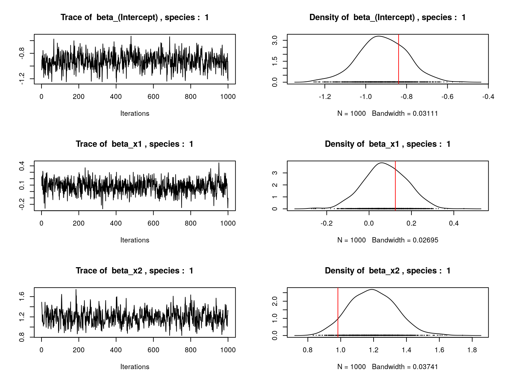
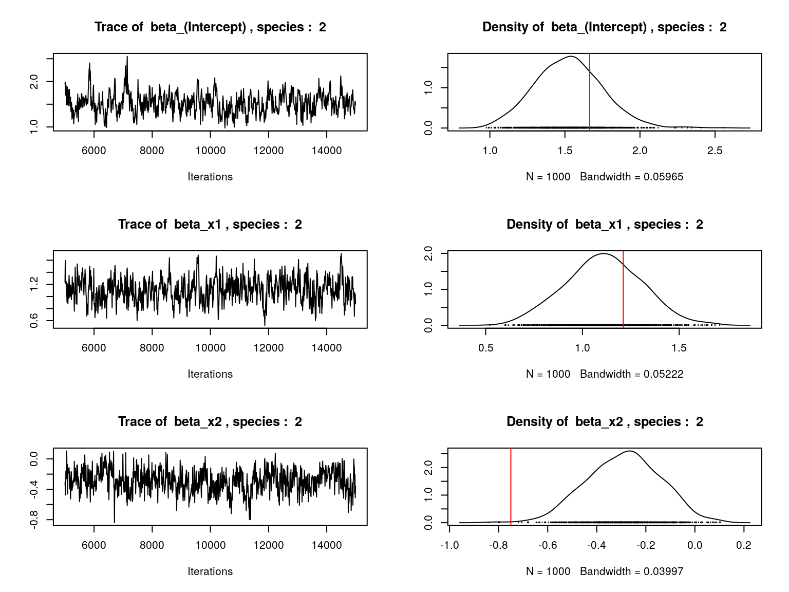
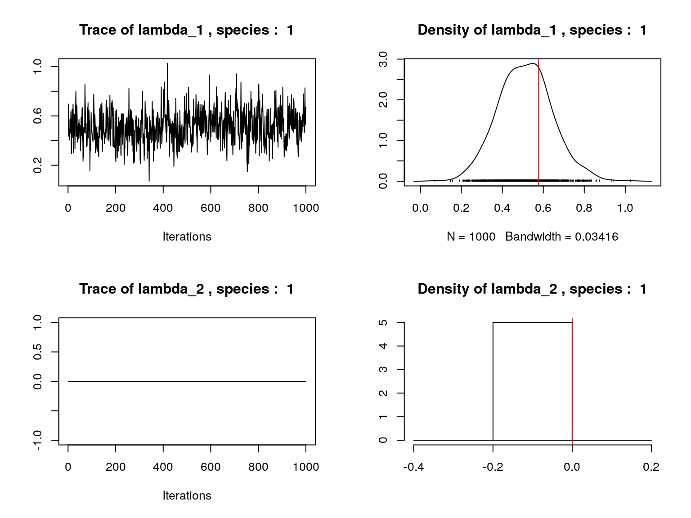
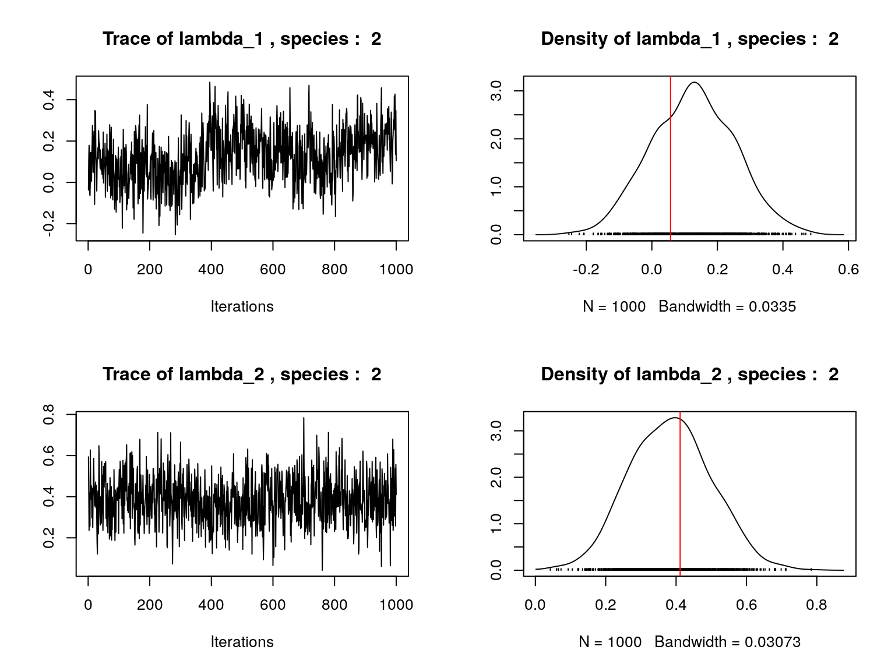
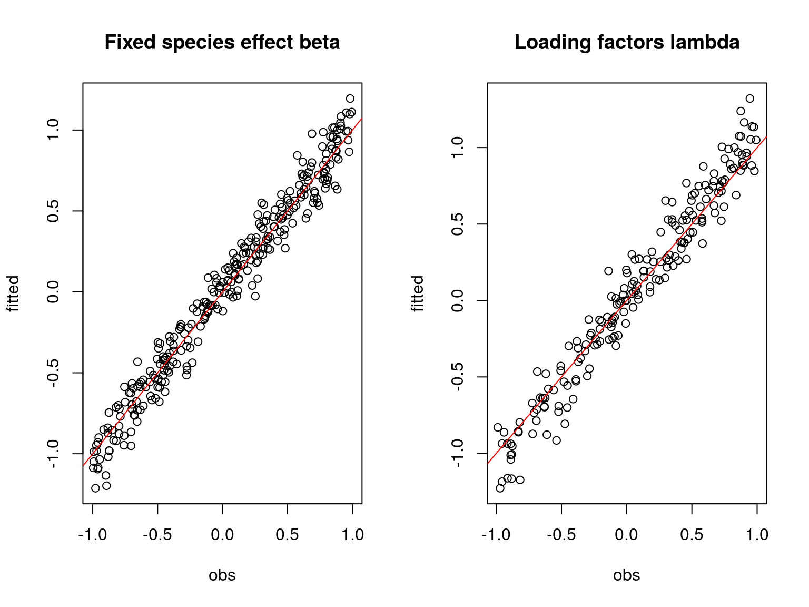
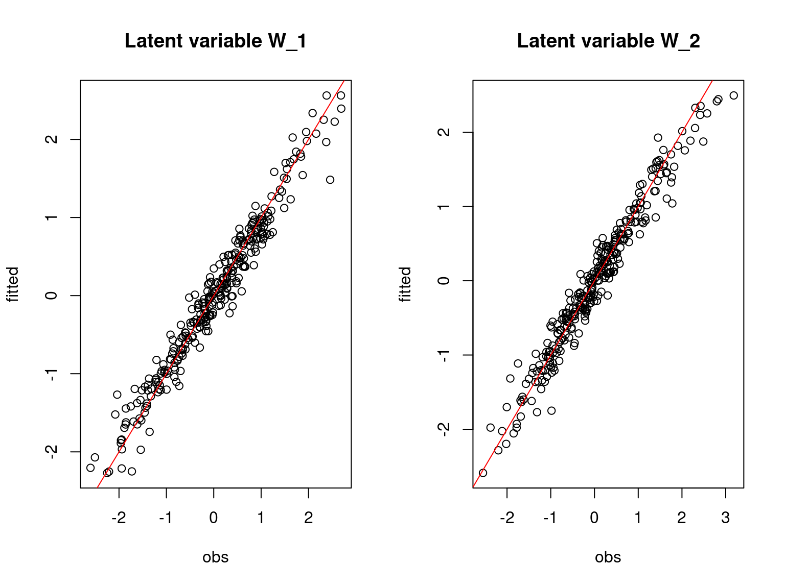
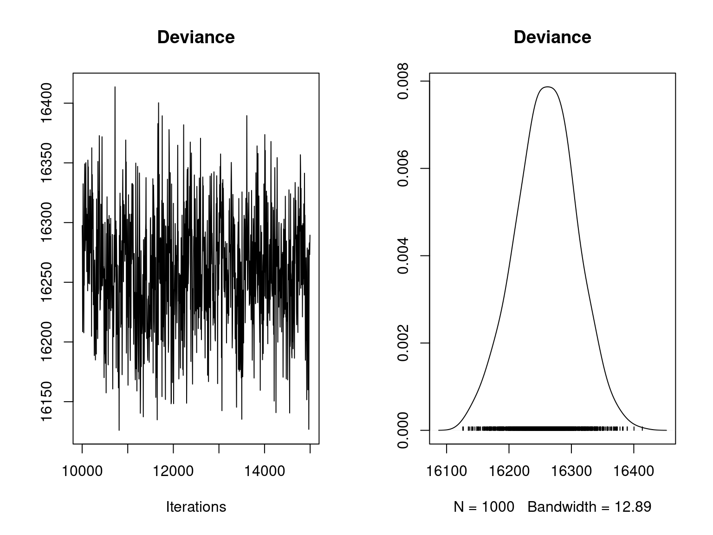
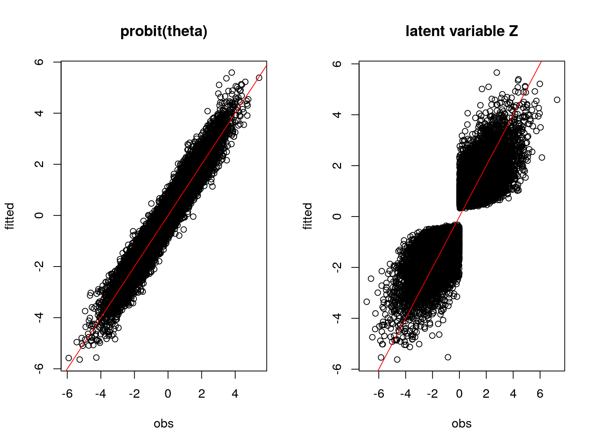
```

## Mosquitos dataset

We fit a binomial joint species distribution model, including latent variables, from the [`mosquitos`](https://ecology.ghislainv.fr/jSDM/reference/mosquitos.html) dataset using `jSDM_binomial_probit()` function to perform binomial probit regression.

```{r jSDM-mosquitos }
# Fit the model
T1 <- Sys.time()
mod_jSDM_Mosquitos <- jSDM_binomial_probit(
  # Chains 
  burnin=10000, mcmc=5000, thin=5,
  # Response variable 
  presence_data=PA_Mosquitos, 
  # Explanatory variables 
  site_formula=~.,   
  site_data=Env_Mosquitos,
  # Model specification
  site_effect="none", n_latent=2,
  # Starting values 
  beta_start=0,
  lambda_start=0, W_start=0,
  # Priors
  mu_beta=0, V_beta = c(10,rep(1,ncol(X_Mosquitos)-1)),
  mu_lambda=0, V_lambda=1,
  # Various 
  seed=123, verbose=1)
T2 <- Sys.time()
T_jSDM_Mosquitos <- difftime(T2,T1, units="secs")
save(T_jSDM_Mosquitos, mod_jSDM_Mosquitos,
     file="jSDM_Hmsc_cache/jSDM_Mosquitos.RData")
```

## Eucalypts dataset

We fit a binomial joint species distribution model, including latent variables, from the [`eucalypts`](https://ecology.ghislainv.fr/jSDM/reference/eucalypts.html) dataset using `jSDM_binomial_probit()` function to perform binomial probit regression.

```{r jSDM-eucalypts }
# Fit the model
T1 <- Sys.time()
mod_jSDM_Eucalypts <- jSDM_binomial_probit(
  # Chains
  burnin=10000, mcmc=5000, thin=5,
  # Response variable 
  presence_data=PA_Eucalypts,
  # Explanatory variables 
  site_formula=~.,   
  site_data=Env_Eucalypts,
  # Model specification
  n_latent=2, site_effect="none",
  # Starting values 
  beta_start=0,
  lambda_start=0, W_start=0,
  # Priors
  mu_beta=0, V_beta = c(10,rep(1,ncol(X_Eucalypts)-1)),
  mu_lambda=0, V_lambda=1,
  # Various 
  seed=123, verbose=1)
T2 <- Sys.time()
T_jSDM_Eucalypts <- difftime(T2,T1, units="secs")
save(T_jSDM_Eucalypts, mod_jSDM_Eucalypts,
     file="jSDM_Hmsc_cache/jSDM_Eucalypts.RData")
```

## Frogs dataset

We fit a binomial joint species distribution model, including latent variables, from the [`frogs`](https://ecology.ghislainv.fr/jSDM/reference/frogs.html) dataset using `jSDM_binomial_probit()` function to perform binomial probit regression.

```{r jSDM-frogs }
# Fit the model 
T1 <- Sys.time()
mod_jSDM_Frogs <- jSDM_binomial_probit(
  # Chains
  burnin=10000, mcmc=5000, thin=5,
  # Response variable 
  presence_data=as.matrix(PA_Frogs), 
  # Explanatory variables 
  site_formula=~.,   
  site_data=as.data.frame(Env_Frogs),
  # Model specification 
  n_latent=2, site_effect="none",
  # Starting values 
  beta_start=0,
  lambda_start=0, W_start=0,
  # Priors 
  mu_beta=0, V_beta = c(10,rep(1,ncol(X_Frogs)-1)),
  mu_lambda=0, V_lambda=1,
  # Various 
  seed=123, verbose=1)
T2 <- Sys.time()
T_jSDM_Frogs <- difftime(T2,T1, units="secs")
save(T_jSDM_Frogs, mod_jSDM_Frogs,
     file="jSDM_Hmsc_cache/jSDM_Frogs.RData")
```

## Fungi dataset

We fit a binomial joint species distribution model, including latent variables, from the [`fungi`](https://ecology.ghislainv.fr/jSDM/reference/fungi.html) dataset using `jSDM_binomial_probit()` function to perform binomial probit regression.

```{r jSDM-fungi }
# Fit the model
T1 <- Sys.time()
mod_jSDM_Fungi <- jSDM_binomial_probit(
  # Chains 
  burnin=10000, mcmc=5000, thin=5,
  # Response variable 
  presence_data=PA_Fungi, 
  # Explanatory variables 
  site_formula=~.,   
  site_data=Env_Fungi,
  # Model specification
  n_latent=2, site_effect="none",
  # Starting values 
  beta_start=0,
  lambda_start=0, W_start=0,
  mu_beta=0, V_beta = c(10,rep(1,ncol(X_Fungi)-1)),
  mu_lambda=0, V_lambda=1,
  # Various 
  seed=123, verbose=1)
T2 <- Sys.time()
T_jSDM_Fungi <- difftime(T2,T1, units="secs")
save(T_jSDM_Fungi, mod_jSDM_Fungi,
     file="jSDM_Hmsc_cache/jSDM_Fungi.RData")
```

## Birds dataset

We fit a binomial joint species distribution model including latent variables, from the [`birds`](https://ecology.ghislainv.fr/jSDM/reference/birds.html) dataset using `jSDM_binomial_probit()` function to perform binomial probit regression.

```{r jSDM-birds}
# Birds dataset
data("birds")
PA_Birds <- birds[,1:158]
# Remove species with less than 5 presences
rare_sp <- which(apply(PA_Birds>0, 2, sum) < 5) 
PA_Birds <- PA_Birds[, -rare_sp]
# Transform presence-absence data with multiple visits per site into binary data
PA_Birds[PA_Birds > 0] <- 1
# Scale environmental variables 
Env_Birds <- data.frame(scale(birds[,c("elev","rlength","forest")]))

# Fit the model
T1 <- Sys.time()
mod_jSDM_Birds <- jSDM_binomial_probit(
  # Chains 
  burnin=10000, mcmc=5000, thin=5,
  # Response variable 
  presence_data=PA_Birds, 
  # Explanatory variables 
  site_formula=~.,   
  site_data=Env_Birds,
  # Model specification
  n_latent=2, site_effect="none",
  # Starting values 
  beta_start=0,
  lambda_start=0, W_start=0,
  # Priors 
  mu_beta=0, V_beta = c(10,rep(1,ncol(X_Birds)-1)),
  mu_lambda=0, V_lambda=1,
  # Various 
  seed=123, verbose=1)
T2 <- Sys.time()
T_jSDM_Birds <- difftime(T2,T1, units="secs")
save(T_jSDM_Birds, mod_jSDM_Birds,
     file="jSDM_Hmsc_cache/jSDM_Birds.RData")
```


## Mites dataset

We fit a joint species distribution model, including latent variables, from the [`mites`](https://ecology.ghislainv.fr/jSDM/reference/mites.html) abundance dataset using `jSDM_poisson_log()` function to perform a poisson log-linear regression. 

```{r jSDM-mites}
# Fit the model
T1 <- Sys.time()
mod_jSDM_Mites <- jSDM_poisson_log(
  # Chains 
  burnin=10000, mcmc=5000, thin=5,
  # Response variable 
  count_data=PA_Mites, 
  # Explanatory variables 
  site_formula=~.,   
  site_data=Env_Mites,
  # Model specification
  n_latent=2, site_effect="none",
  # Starting values 
  beta_start=0,
  lambda_start=0, W_start=0,
  # Priors 
  mu_beta=0, V_beta=c(10,rep(1,ncol(X_Mites)-1)),
  mu_lambda=0, V_lambda=1,
  # Various 
  ropt=0.44,
  seed=123, verbose=1)
T2 <- Sys.time()
T_jSDM_Mites <- difftime(T2,T1, units="secs")
save(T_jSDM_Mites, mod_jSDM_Mites,
     file="jSDM_Hmsc_cache/jSDM_Mites.RData")
```

# Comparison

Then we compare the compilation time and the results obtained with each package.  

```{r load-fitted-models, echo=FALSE, include=FALSE}
# Simulated dataset
load(file="jSDM_Hmsc_cache/Hmsc_simulation.RData")
load(file="jSDM_Hmsc_cache/jSDM_simulation.RData")
# Mosquitos dataset
load(file="jSDM_Hmsc_cache/Hmsc_Mosquitos.RData")
load(file="jSDM_Hmsc_cache/jSDM_Mosquitos.RData")
# Eucalypts dataset
load(file="jSDM_Hmsc_cache/Hmsc_Eucalypts.RData")
load(file="jSDM_Hmsc_cache/jSDM_Eucalypts.RData")
# Frogs dataset 
load(file="jSDM_Hmsc_cache/Hmsc_Frogs.RData")
load(file="jSDM_Hmsc_cache/jSDM_Frogs.RData")
# Fungi dataset 
load(file="jSDM_Hmsc_cache/Hmsc_Fungi.RData")
load(file="jSDM_Hmsc_cache/jSDM_Fungi.RData")
# Birds dataset
load(file="jSDM_Hmsc_cache/Hmsc_Birds.RData")
load(file="jSDM_Hmsc_cache/jSDM_Birds.RData")
# Mites dataset
load(file="jSDM_Hmsc_cache/Hmsc_Mites.RData")
load(file="jSDM_Hmsc_cache/jSDM_Mites.RData")

# Deviance computation 
logL=0
for (i in 1:nrow(Y)){
  for (j in 1:ncol(Y)){
    theta <- pnorm(mod_jSDM_sim$probit_theta_latent[i,j])
    logL=logL + dbinom(Y[i,j],1,theta,1)  
  }
}
Deviance_jSDM_sim<- -2*logL
logL=0

for( suffix in c("Mosquitos","Eucalypts","Frogs","Fungi","Birds")){
logL=0
for (i in 1:nrow(eval(parse(text=paste0("PA_", suffix)), env=.GlobalEnv))){
  for (j in 1:ncol(eval(parse(text=paste0("PA_", suffix)), env=.GlobalEnv))){
    theta <- pnorm(eval(parse(text=paste0("mod_jSDM_", suffix, "$probit_theta_latent[i,j]")), env=.GlobalEnv))
    logL=logL + dbinom(eval(parse(text=paste0("PA_", suffix)), env=.GlobalEnv)[i,j],1,theta,1)  
  }
}
assign(paste0("Deviance_jSDM_", suffix), -2*logL)
}

logL=0
for (i in 1:nrow(PA_Mites)){
  for (j in 1:ncol(PA_Mites)){
    logL=logL + dpois(PA_Mites[i,j],mod_jSDM_Mites$theta_latent[i,j],1)  
  }
}
Deviance_jSDM_Mites <- -2*logL

save(T_jSDM_sim, Deviance_jSDM_sim, RMSE_jSDM_sim, RMSE_Hmsc_sim, T_Hmsc_sim, Deviance_Hmsc_sim, T_jSDM_Mosquitos, Deviance_jSDM_Mosquitos ,T_jSDM_Eucalypts, Deviance_jSDM_Eucalypts, T_jSDM_Frogs, Deviance_jSDM_Frogs,T_jSDM_Fungi, Deviance_jSDM_Fungi, T_jSDM_Birds, Deviance_jSDM_Birds, T_jSDM_Mites, Deviance_jSDM_Mites, T_Hmsc_Mosquitos, Deviance_Hmsc_Mosquitos, T_Hmsc_Eucalypts, Deviance_Hmsc_Eucalypts, T_Hmsc_Frogs, Deviance_Hmsc_Frogs, T_Hmsc_Fungi, Deviance_Hmsc_Fungi, T_Hmsc_Birds, Deviance_Hmsc_Birds, T_Hmsc_Mites, Deviance_Hmsc_Mites,
     file="jSDM_Hmsc_files/jSDM-Hmsc-comparison.rda")
```

## Compilation time and deviance 

```{r time-deviance, echo=FALSE, eval=TRUE, out.width=900}

load("jSDM_Hmsc_files/jSDM-Hmsc-comparison.rda")
result <- data.frame(matrix(NA,5,7),row.names=c("Compilation time Hmsc (secondes)","Compilation time jSDM (secondes)", "Deviance Hmsc", "Deviance jSDM",""))
colnames(result) <- c("Simulated","Mosquitos","Eucalypts","Frogs","Fungi","Birds","Mites") 
result[1,]=c(T_Hmsc_sim, T_Hmsc_Mosquitos, T_Hmsc_Eucalypts, T_Hmsc_Frogs, T_Hmsc_Fungi,
             T_Hmsc_Birds, T_Hmsc_Mites)
result[2,]=c(T_jSDM_sim, T_jSDM_Mosquitos, T_jSDM_Eucalypts, T_jSDM_Frogs,T_jSDM_Fungi,
             T_jSDM_Birds, T_jSDM_Mites)
result[3,] <- c(Deviance_Hmsc_sim, Deviance_Hmsc_Mosquitos, Deviance_Hmsc_Eucalypts, 
                Deviance_Hmsc_Frogs, Deviance_Hmsc_Fungi,
                Deviance_Hmsc_Birds, Deviance_Hmsc_Mites)
result[4,] <- c(Deviance_jSDM_sim,Deviance_jSDM_Mosquitos, 
                Deviance_jSDM_Eucalypts,Deviance_jSDM_Frogs, 
                Deviance_jSDM_Fungi, Deviance_jSDM_Birds,
                Deviance_jSDM_Mites)
min_ratio <- round(min(as.numeric(result[1,]/result[2,])))
max_ratio <- round(max(as.numeric(result[1,]/result[2,])))
result <- apply(result,c(1,2),round, 0)
sp_pictures <- c("figures/des.jpg",
                 "figures/Mosquitos_.jpg","figures/Eucalyptus_.jpg",
                 "figures/Frogs_.jpg","figures/Fungi_.jpg",
                 "figures/birds.jpg",
                 "figures/oribatid-mites.png")
result[5,] <- sprintf('{height="80px" width="80px"}',sp_pictures)
kable(result)%>%
  kable_styling(bootstrap_options="striped",latex_options=c("HOLD_position","striped"), full_width=FALSE)
```

`jSDM` is **`r min_ratio` to `r max_ratio`** times faster than `Hmsc`.

## Root-Mean-Square Error (RMSE) for simulated data

Computed for the probabilities of presences $\theta_{ij}$ on the simulated data-set.

```{r RMSE, eval=TRUE, echo=FALSE}

result <- data.frame(matrix(NA,1,2),row.names=  c("RMSE"))
colnames(result) <- c("Hmsc","jSDM")
result$Hmsc <- RMSE_Hmsc_sim
result$jSDM <- RMSE_jSDM_sim
kable(result, digits=3) %>%
  kable_styling(bootstrap_options = "striped", 
                latex_options= c("HOLD_position","striped"),
                full_width = FALSE)
```

## Estimated  Parameters

### Simulated dataset

```{r jSDM-Hmsc-simulation, echo=FALSE}
np <- ncol(X)
print(paste(nrow(Y),"sites and ",ncol(Y)," species"),quote = FALSE)
# species fixed effect beta
Hmsc_beta <- t(getPostEstimate(hM=mod_Hmsc_sim, parName='Beta')$mean)
jSDM_beta <- matrix(0,nsp,np)
for (j in 1:nsp){
  for (p in 1:np){
    jSDM_beta[j,p] <- mean(mod_jSDM_sim$mcmc.sp[[paste0("sp_",j)]][,p])
  }
}
par(mfrow=c(1,2))
plot(Hmsc_beta,jSDM_beta, xlab="fitted by Hmsc", ylab="fitted by jSDM", main="Fixed species effect beta")
abline(a=0,b=1,col='red')

# factor loadings lambda
jSDM_lambda <- matrix(0,nsp,nl)
for (j in 1:nsp){
  for (l in 1:nl){
    jSDM_lambda[j,l] <- mean(mod_jSDM_sim$mcmc.sp[[paste0("sp_",j)]][,np+l])
  }
}
Hmsc_lambda <- t(getPostEstimate(hM=mod_Hmsc_sim, parName='Lambda')$mean)

plot(Hmsc_lambda,jSDM_lambda, xlab="fitted by Hmsc", ylab="fitted by jSDM", main="Loading factors lambda")
abline(a=0,b=1,col='red')

# Ws
Hmsc_lvs <- getPostEstimate(hM=mod_Hmsc_sim, parName='Eta')$mean
jSDM_lvs <- matrix(0,nsite,nl)
for (l in 1:nl){
  jSDM_lvs[,l] <- colMeans(mod_jSDM_sim$mcmc.latent[[paste0("lv_",l)]])
}
plot(Hmsc_lvs, jSDM_lvs, xlab="fitted by Hmsc", ylab="fitted by jSDM", main="Latent variables W")
abline(a=0,b=1,col='red')

# W.Lambda
plot(Hmsc_lvs %*% t(Hmsc_lambda) , jSDM_lvs %*% t(jSDM_lambda), xlab="fitted by Hmsc", ylab="fitted by jSDM", main="W.Lambda")
abline(a=0,b=1,col='red') 

# Residual Covariance Matrix
codaObject <- Hmsc::convertToCodaObject(mod_Hmsc_sim, start=1)
n.mcmc <- mod_Hmsc_sim$samples
nsp <- mod_Hmsc_sim$ns
Tau.cov.arr <- matrix(NA,n.mcmc,nsp^2)
for(t in 1:n.mcmc) { 
  lv.coefs <- matrix(codaObject$Lambda[[1]][[1]][t,],nrow=nsp)
  Tau.mat <- lv.coefs %*% t(lv.coefs) + diag(nsp)
  Tau.cov.arr[t,] <- as.vector(Tau.mat) 
}
Hmsc_Sigma <- matrix(apply(Tau.cov.arr,2,mean),nsp)
#Hmsc_R <- Hmsc::computeAssociations(mod_Hmsc_sim)[[1]]$mean
jSDM_Sigma <- jSDM::get_residual_cor(mod_jSDM_sim)$cov.mean
Sigma.target <- t(lambda.target) %*% lambda.target + diag(nsp)
RMSE_Sigma_jSDM <- sqrt(sum((Sigma.target-jSDM_Sigma)^2)/(nsp*nsp))
RMSE_Sigma_Hmsc <- sqrt(sum((Sigma.target-Hmsc_Sigma)^2)/(nsp*nsp))
par(mfrow=c(1,1))
plot(Sigma.target,Hmsc_Sigma, col='blue',main=expression(paste("Residual covariance matrix ",Sigma)), xlab="obs", ylab="fitted")
points(Sigma.target,jSDM_Sigma, col=scales::alpha('black',alpha = 0.6))
legend("topleft",pch="o",bty="n",
       c(paste("fitted by jSDM, RMSE: ",round(RMSE_Sigma_jSDM,2)),
         paste("fitted by Hmsc, RMSE: ", round(RMSE_Sigma_Hmsc,2))),
       col=c("black","blue"))
abline(a=0,b=1, col='red')

# Predictions 
par(mfrow=c(1,1))
plot(probit_theta_latent_sim, mod_jSDM_sim$probit_theta_latent, xlab="fitted by Hmsc", ylab="fitted by jSDM", main="Predicted probit(theta)")
abline(a=0,b=1,col='red')
```

```{r jSDM-Hmsc-simulation-plot, echo=FALSE, eval=TRUE, out.width=800}
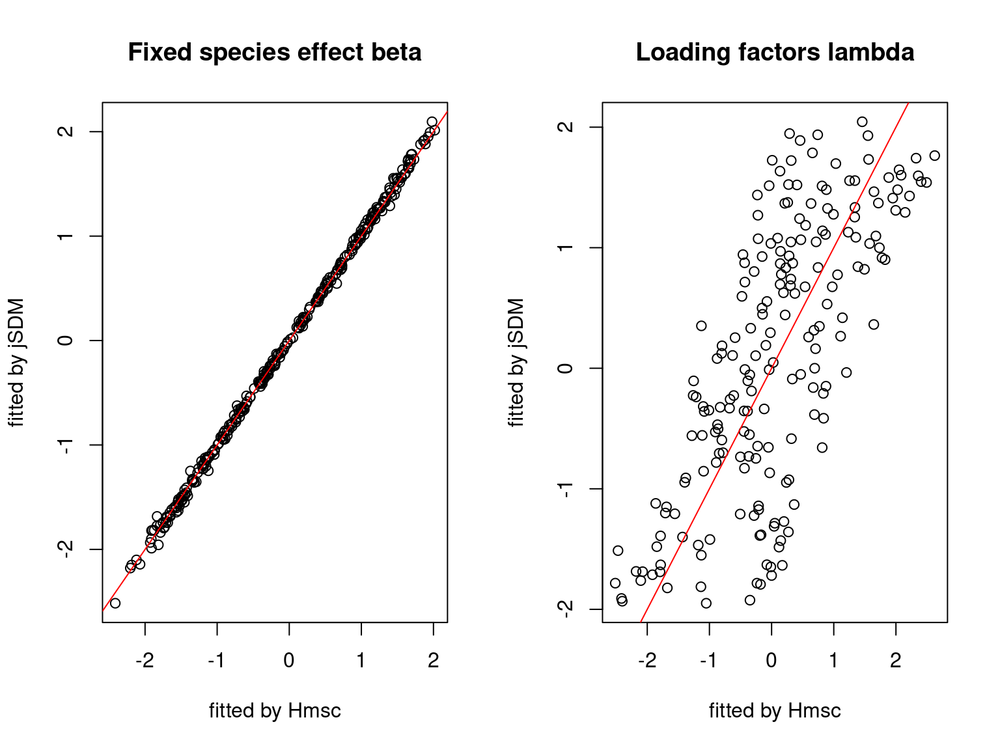
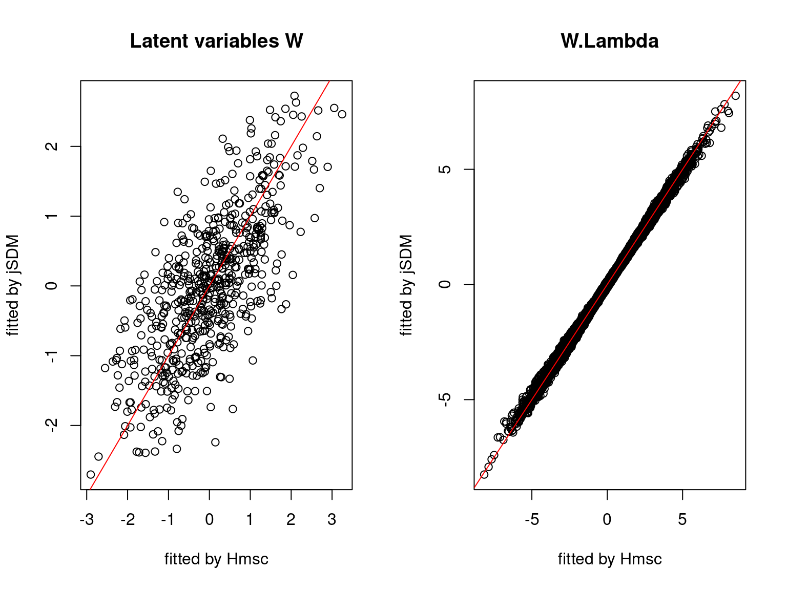
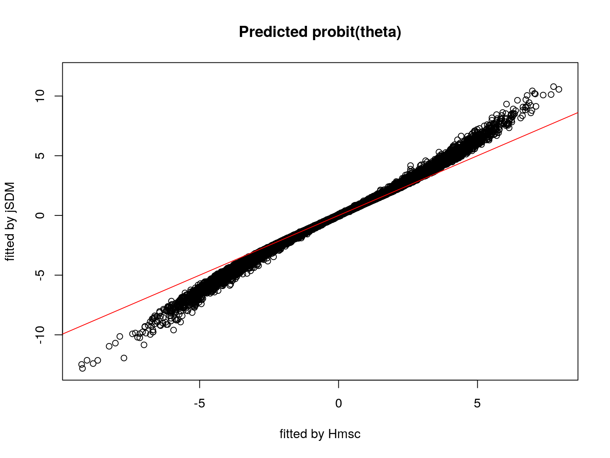
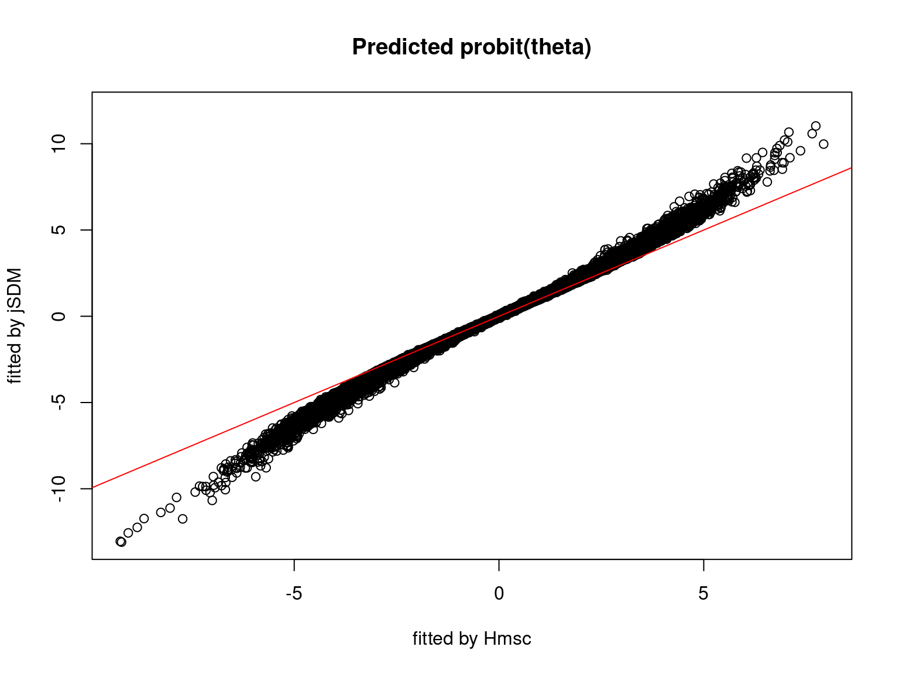
```

### Mosquitos dataset

```{r jSDM-Hmsc-mosquitos, echo=FALSE}
# Import center and reduce Mosquito dataset
data(mosquitos, package="jSDM")
PA_Mosquitos <- mosquitos[,1:16]

print(paste(nrow(PA_Mosquitos),"sites and ",ncol(PA_Mosquitos)," species"),quote = FALSE)
nsp <- ncol(mod_jSDM_Mosquitos$model_spec$presence_data)
nsite <- nrow(mod_jSDM_Mosquitos$model_spec$presence_data)
nl <- mod_jSDM_Mosquitos$model_spec$n_latent
np <- nrow(mod_jSDM_Mosquitos$model_spec$beta_start)

# species fixed effect beta
jSDM_beta <- matrix(0,nsp,np)
for (j in 1:nsp){
  jSDM_beta[j,] <- apply(mod_jSDM_Mosquitos$mcmc.sp[[paste0("sp_",j)]],2,mean)[1:np]
}
par(mfrow=c(1,2))
Hmsc_beta <- t(getPostEstimate(hM=mod_Hmsc_Mosquitos, parName='Beta')$mean)

plot(Hmsc_beta,jSDM_beta, xlab="fitted by Hmsc", ylab="fitted by jSDM", main="Fixed species effect beta")
abline(a=0,b=1,col='red')

# factor loadings lambda
jSDM_lambda <- matrix(0,nsp,nl)
for (j in 1:nsp){
  jSDM_lambda[j,] <- apply(mod_jSDM_Mosquitos$mcmc.sp[[paste0("sp_",j)]],2,mean)[(np+1):(np+nl)]
}
Hmsc_lambda <- t(getPostEstimate(hM=mod_Hmsc_Mosquitos, parName='Lambda')$mean)

plot(Hmsc_lambda,jSDM_lambda, xlab="fitted by Hmsc", ylab="fitted by jSDM", main="Loading factors lambda")
abline(a=0,b=1,col='red')

# Ws
jSDM_lvs <- matrix(0,nsite,nl)
for (l in 1:nl){
  jSDM_lvs[,l] <- apply(mod_jSDM_Mosquitos$mcmc.latent[[paste0("lv_",l)]],2,mean)
}
Hmsc_lvs <- getPostEstimate(hM=mod_Hmsc_Mosquitos, parName='Eta')$mean
plot(Hmsc_lvs, jSDM_lvs, xlab="fitted by Hmsc", ylab="fitted by jSDM", main="Latent variables W")
abline(a=0,b=1,col='red')

# W.Lambda
plot(Hmsc_lvs %*% t(Hmsc_lambda) , jSDM_lvs %*% t(jSDM_lambda), xlab="fitted by Hmsc", ylab="fitted by jSDM", main="W.Lambda")
abline(a=0,b=1,col='red') 

# Residual covariance Matrix
codaObject <- Hmsc::convertToCodaObject(mod_Hmsc_Mosquitos, start=1)
n.mcmc <- mod_Hmsc_Mosquitos$samples
Tau.cov.arr <- matrix(NA,n.mcmc,nsp^2)
for(t in 1:n.mcmc) { 
  lv.coefs <- matrix(codaObject$Lambda[[1]][[1]][t,],nrow=nsp)
  Tau.mat <- lv.coefs %*% t(lv.coefs) + diag(nsp)
  Tau.cov.arr[t,] <- as.vector(Tau.mat) 
}
Hmsc_Sigma <- matrix(apply(Tau.cov.arr,2,mean),nsp)
#Hmsc_R <- Hmsc::computeAssociations(mod_Hmsc_Mosquitos)[[1]]$mean
jSDM_Sigma <- jSDM::get_residual_cor(mod_jSDM_Mosquitos)$cov.mean
par(mfrow=c(1,1))
plot(Hmsc_Sigma,jSDM_Sigma,main=expression(paste("Residual covariance matrix ",Sigma)), xlab="fitted by Hmsc", ylab="fitted by jSDM")
abline(a=0,b=1, col='red')

# Predictions 
par(mfrow=c(1,1))
plot(probit_theta_latent_Mosquitos, mod_jSDM_Mosquitos$probit_theta_latent, xlab="fitted by Hmsc", ylab="fitted by jSDM", main="Predicted probit(theta)")
abline(a=0,b=1,col='red')
```


```{r jSDM-Hmsc-mosquitos-plot, echo=FALSE, eval=TRUE, out.width=800}
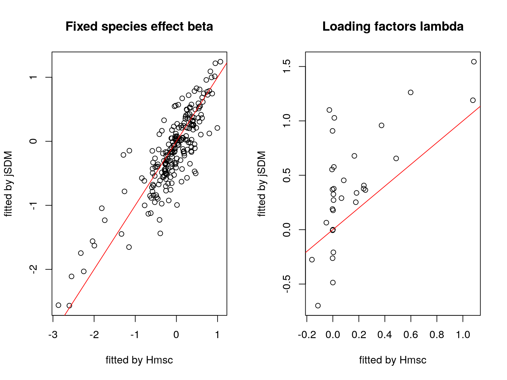
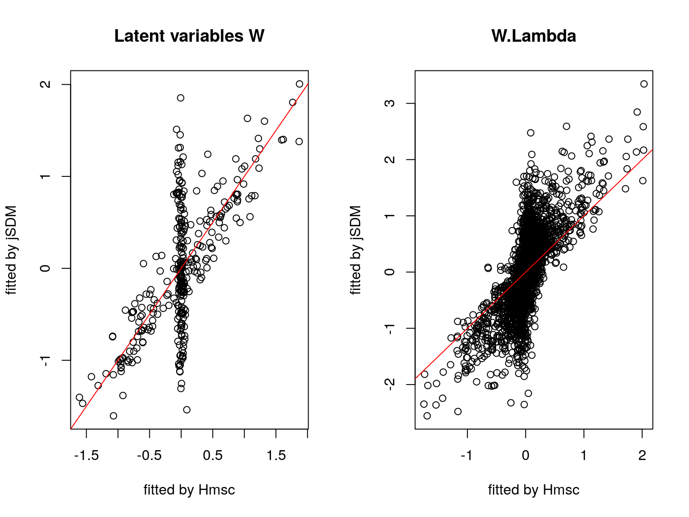
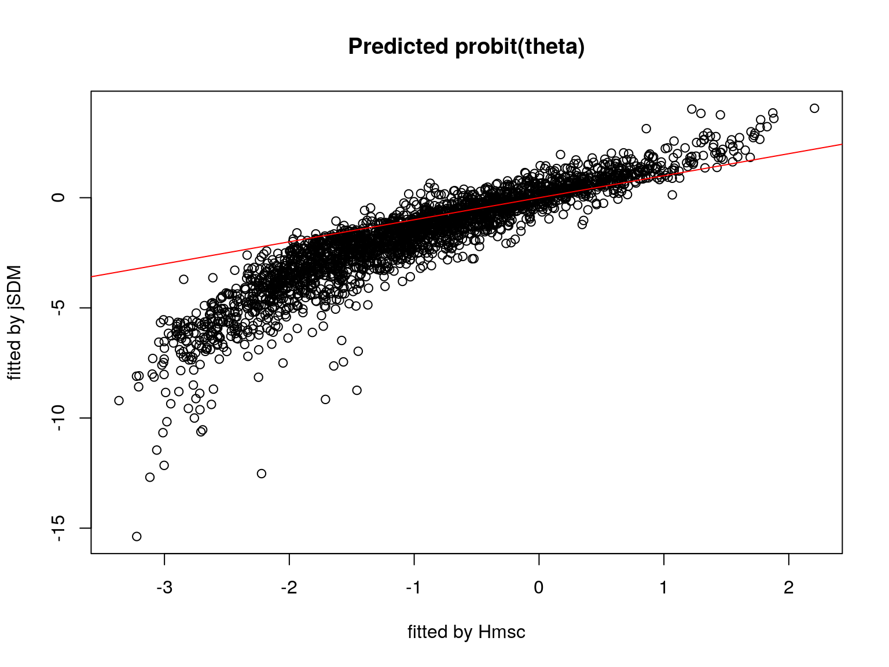
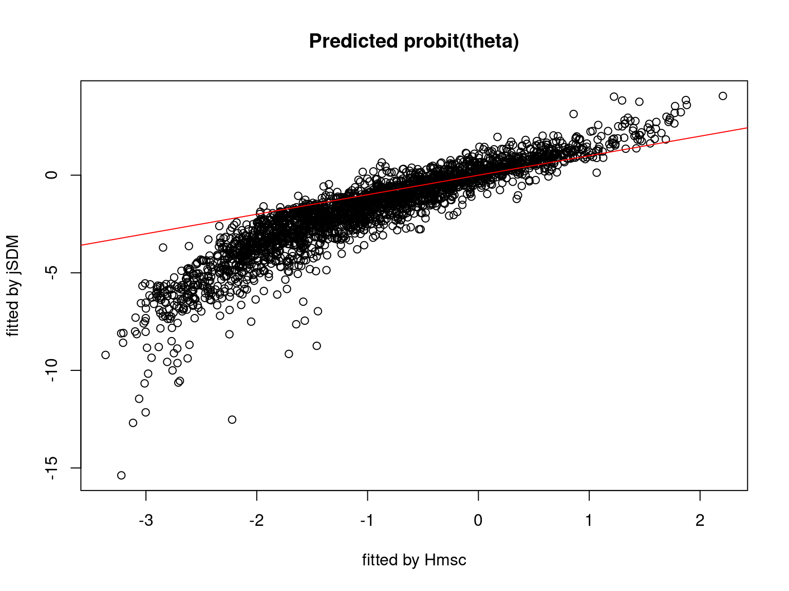
```

### Eucalypts dataset

```{r jSDM-Hmsc-Eucalypts, echo=FALSE}
# Import center and reduce Eucalypts dataset
data(eucalypts, package="jSDM")
PA_Eucalypts <- eucalypts[,1:12]
# Remove sites where none species was recorded
PA_Eucalypts<- PA_Eucalypts[rowSums(PA_Eucalypts) != 0,]
print(paste(nrow(PA_Eucalypts),"sites and ",ncol(PA_Eucalypts)," species"),quote = FALSE)
nsp <- ncol(mod_jSDM_Eucalypts$model_spec$presence_data)
nsite <- nrow(mod_jSDM_Eucalypts$model_spec$presence_data)
nl <- mod_jSDM_Eucalypts$model_spec$n_latent
np <- nrow(mod_jSDM_Eucalypts$model_spec$beta_start)

# species fixed effect beta
jSDM_beta <- matrix(0,nsp,np)
for (j in 1:nsp){
  jSDM_beta[j,] <- apply(mod_jSDM_Eucalypts$mcmc.sp[[paste0("sp_",j)]],2,mean)[1:np]
}
par(mfrow=c(1,2))
Hmsc_beta <- t(getPostEstimate(hM=mod_Hmsc_Eucalypts, parName='Beta')$mean)

plot(Hmsc_beta,jSDM_beta, xlab="fitted by Hmsc", ylab="fitted by jSDM", main="Fixed species effect beta")
abline(a=0,b=1,col='red')

# factor loadings lambda
jSDM_lambda <- matrix(0,nsp,nl)
for (j in 1:nsp){
  jSDM_lambda[j,] <- apply(mod_jSDM_Eucalypts$mcmc.sp[[paste0("sp_",j)]],2,mean)[(np+1):(np+nl)]
}
Hmsc_lambda <- t(getPostEstimate(hM=mod_Hmsc_Eucalypts, parName='Lambda')$mean)

plot(Hmsc_lambda,jSDM_lambda, xlab="fitted by Hmsc", ylab="fitted by jSDM", main="Loading factors lambda")
abline(a=0,b=1,col='red')

# Ws
jSDM_lvs <- matrix(0,nsite,nl)
for (l in 1:nl){
  jSDM_lvs[,l] <- apply(mod_jSDM_Eucalypts$mcmc.latent[[paste0("lv_",l)]],2,mean)
}
Hmsc_lvs <- getPostEstimate(hM=mod_Hmsc_Eucalypts, parName='Eta')$mean
plot(Hmsc_lvs, jSDM_lvs, xlab="fitted by Hmsc", ylab="fitted by jSDM", main="Latent variables W")
abline(a=0,b=1,col='red')

# W.Lambda
plot(Hmsc_lvs %*% t(Hmsc_lambda) , jSDM_lvs %*% t(jSDM_lambda), xlab="fitted by Hmsc", ylab="fitted by jSDM", main="W.Lambda")
abline(a=0,b=1,col='red') 

# Residual covariance Matrix
codaObject <- Hmsc::convertToCodaObject(mod_Hmsc_Eucalypts, start=1)
n.mcmc <- mod_Hmsc_Eucalypts$samples
Tau.cov.arr <- matrix(NA,n.mcmc,nsp^2)
for(t in 1:n.mcmc) { 
  lv.coefs <- matrix(codaObject$Lambda[[1]][[1]][t,],nrow=nsp)
  Tau.mat <- lv.coefs %*% t(lv.coefs) + diag(nsp)
  Tau.cov.arr[t,] <- as.vector(Tau.mat) 
}
Hmsc_Sigma <- matrix(apply(Tau.cov.arr,2,mean),nsp)
#Hmsc_R <- Hmsc::computeAssociations(mod_Hmsc_Eucalypts)[[1]]$mean
jSDM_Sigma <- jSDM::get_residual_cor(mod_jSDM_Eucalypts)$cov.mean
par(mfrow=c(1,1))
plot(Hmsc_Sigma,jSDM_Sigma,main=expression(paste("Residual covariance matrix ",Sigma)), xlab="fitted by Hmsc", ylab="fitted by jSDM")
abline(a=0,b=1, col='red')

# Predictions 
par(mfrow=c(1,1))
plot(probit_theta_latent_Eucalypts, mod_jSDM_Eucalypts$probit_theta_latent, xlab="fitted by Hmsc", ylab="fitted by jSDM", main="Predicted probit(theta)")
abline(a=0,b=1,col='red')
```

```{r jSDM-Hmsc-Eucalypts-plot, echo=FALSE, eval=TRUE, out.width=800}
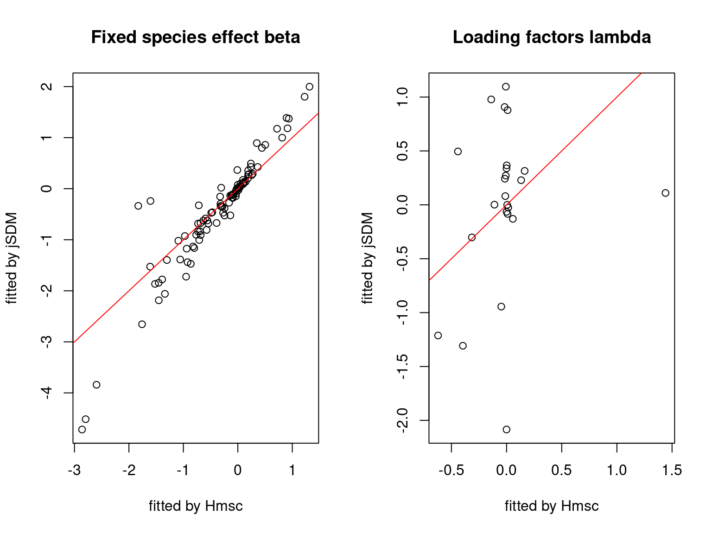
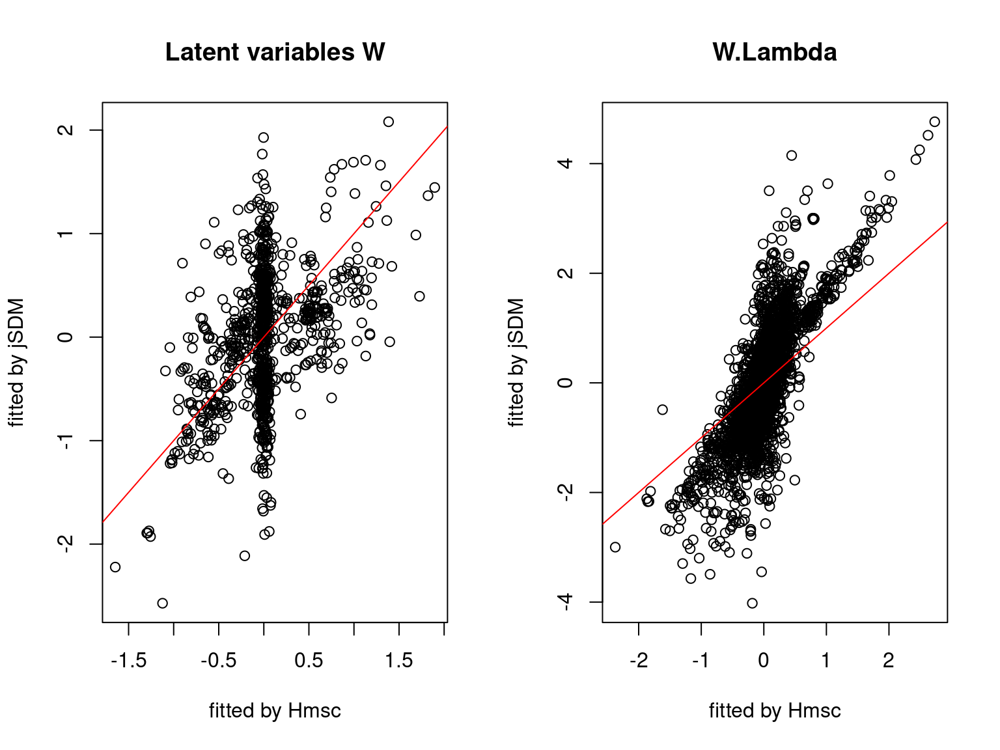
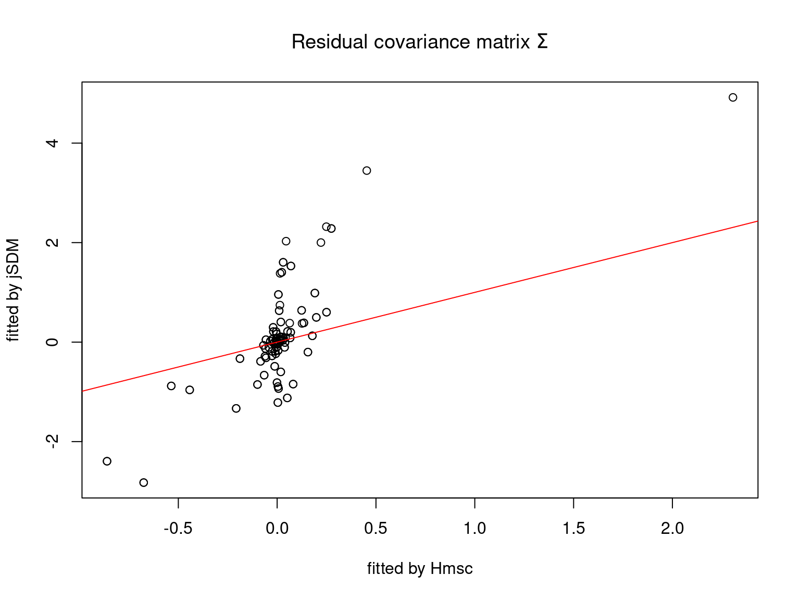
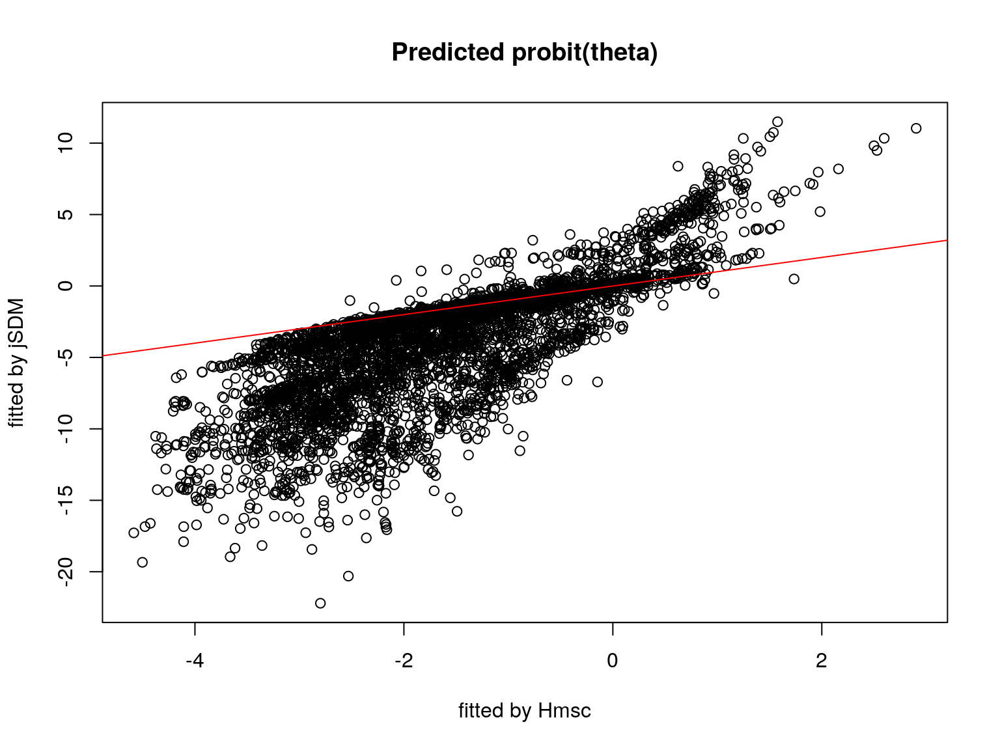
```

### Frogs dataset

```{r jSDM-Hmsc-frogs,echo=FALSE}
# Import center and reduce Frogs dataset
data(frogs, package="jSDM")
PA_Frogs <- frogs[,4:12]

print(paste(nrow(PA_Frogs),"sites and ",ncol(PA_Frogs)," species"),quote = FALSE)
nsp <- ncol(mod_jSDM_Frogs$model_spec$presence_data)
nsite <- nrow(mod_jSDM_Frogs$model_spec$presence_data)
nl <- mod_jSDM_Frogs$model_spec$n_latent
np <- nrow(mod_jSDM_Frogs$model_spec$beta_start)

# species fixed effect beta
jSDM_beta <- matrix(0,nsp,np)
for (j in 1:nsp){
  jSDM_beta[j,] <- apply(mod_jSDM_Frogs$mcmc.sp[[paste0("sp_",j)]],2,mean)[1:np]
}
Hmsc_beta <- t(getPostEstimate(hM=mod_Hmsc_Frogs, parName='Beta')$mean)
par(mfrow=c(1,2))
plot(Hmsc_beta,jSDM_beta, xlab="fitted by Hmsc", ylab="fitted by jSDM", main="Fixed species effect beta")
abline(a=0,b=1,col='red')

# factor loadings lambda
jSDM_lambda <- matrix(0,nsp,nl)
for (j in 1:nsp){
  jSDM_lambda[j,] <- apply(mod_jSDM_Frogs$mcmc.sp[[paste0("sp_",j)]],2,mean)[(np+1):(np+nl)]
}
Hmsc_lambda <- t(getPostEstimate(hM=mod_Hmsc_Frogs, parName='Lambda')$mean)

plot(Hmsc_lambda,jSDM_lambda, xlab="fitted by Hmsc", ylab="fitted by jSDM", main="Loading factors lambda")
abline(a=0,b=1,col='red')

# Ws
jSDM_lvs <- matrix(0,nsite,nl)
for (l in 1:nl){
  jSDM_lvs[,l] <- apply(mod_jSDM_Frogs$mcmc.latent[[paste0("lv_",l)]],2,mean)
}
Hmsc_lvs <- getPostEstimate(hM=mod_Hmsc_Frogs, parName='Eta')$mean
plot(Hmsc_lvs, jSDM_lvs, xlab="fitted by Hmsc", ylab="fitted by jSDM", main="Latent variables W")
abline(a=0,b=1,col='red')

# W.Lambda
plot(Hmsc_lvs %*% t(Hmsc_lambda) , jSDM_lvs %*% t(jSDM_lambda), xlab="fitted by Hmsc", ylab="fitted by jSDM", main="W.Lambda")
abline(a=0,b=1,col='red') 

# Residual covariance Matrix
codaObject <- Hmsc::convertToCodaObject(mod_Hmsc_Frogs, start=1)
n.mcmc <- mod_Hmsc_Frogs$samples
Tau.cov.arr <- matrix(NA,n.mcmc,nsp^2)
for(t in 1:n.mcmc) { 
  lv.coefs <- matrix(codaObject$Lambda[[1]][[1]][t,],nrow=nsp)
  Tau.mat <- lv.coefs %*% t(lv.coefs) + diag(nsp)
  Tau.cov.arr[t,] <- as.vector(Tau.mat) 
}
Hmsc_Sigma <- matrix(apply(Tau.cov.arr,2,mean),nsp)
#Hmsc_R <- Hmsc::computeAssociations(mod_Hmsc_Frogs)[[1]]$mean
jSDM_Sigma <- jSDM::get_residual_cor(mod_jSDM_Frogs)$cov.mean
par(mfrow=c(1,1))
plot(Hmsc_Sigma,jSDM_Sigma,main=expression(paste("Residual covariance matrix ",Sigma)), xlab="fitted by Hmsc", ylab="fitted by jSDM")
abline(a=0,b=1, col='red')

# Predictions 
par(mfrow=c(1,1))
plot(probit_theta_latent_Frogs, mod_jSDM_Frogs$probit_theta_latent, xlab="fitted by Hmsc", ylab="fitted by jSDM", main="Predicted probit(theta)")
abline(a=0,b=1,col='red')
```

```{r jSDM-Hmsc-frogs-plot, echo=FALSE, out.width=800, eval=TRUE}
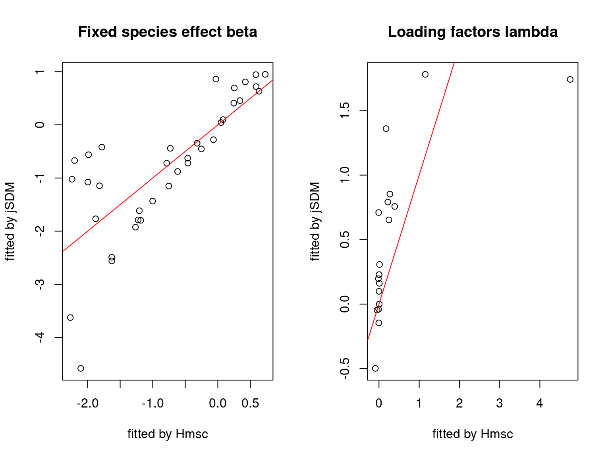
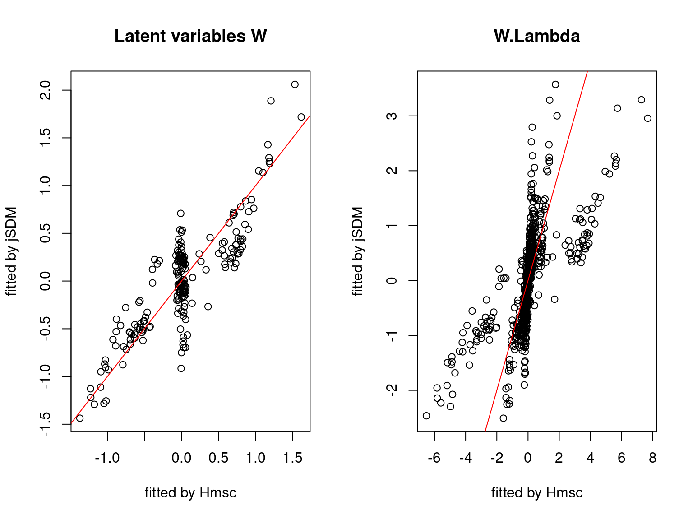
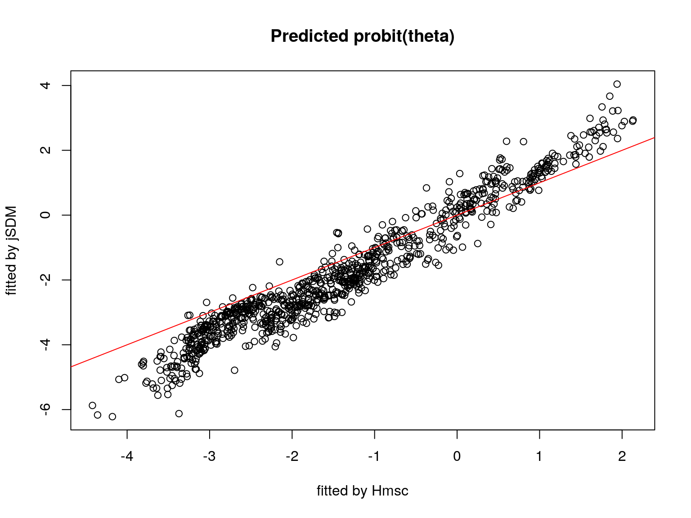
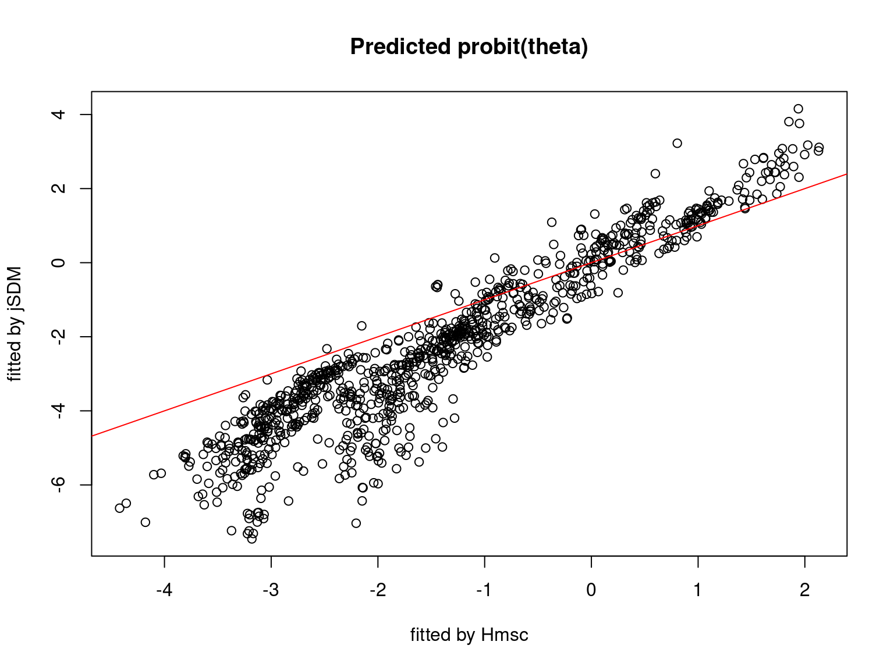
```

### Fungi dataset

```{r jSDM-Hmsc-fungi, echo=FALSE}
# Import center and reduce fungi dataset
data(fungi, package="jSDM")
Env_Fungi <- cbind(scale(fungi[,c("diam","epi","bark")]),
                   fungi[,c("dc1","dc2","dc3","dc4","dc5",
                            "quality3","quality4","ground3","ground4")])
colnames(Env_Fungi) <- c("diam","epi","bark","dc1","dc2","dc3","dc4","dc5",
                         "quality3","quality4","ground3","ground4")
PA_Fungi <- fungi[,c("antser","antsin","astfer","fompin","hetpar","junlut",
                     "phefer","phenig","phevit","poscae","triabi")]
Env_Fungi <- Env_Fungi[rowSums(PA_Fungi) != 0,]
# Remove sites where none species was recorded
PA_Fungi<- PA_Fungi[rowSums(PA_Fungi) != 0,]

print(paste(nrow(PA_Fungi),"sites and ",ncol(PA_Fungi)," species"),quote = FALSE)
nsp <- ncol(mod_jSDM_Fungi$model_spec$presence_data)
nsite <- nrow(mod_jSDM_Fungi$model_spec$presence_data)
nl <- mod_jSDM_Fungi$model_spec$n_latent
np <- nrow(mod_jSDM_Fungi$model_spec$beta_start)

par(mfrow=c(1,2))
# species fixed effect beta
jSDM_beta <- matrix(0,nsp,np)
for (j in 1:nsp){
  jSDM_beta[j,] <- apply(mod_jSDM_Fungi$mcmc.sp[[paste0("sp_",j)]],2,mean)[1:np]
}
Hmsc_beta <- t(getPostEstimate(hM=mod_Hmsc_Fungi, parName='Beta')$mean)
par(mfrow=c(1,2))
plot(Hmsc_beta,jSDM_beta, xlab="fitted by Hmsc", ylab="fitted by jSDM", main="Fixed species effect beta")
abline(a=0,b=1,col='red')

# factor loadings lambda
jSDM_lambda <- matrix(0,nsp,nl)
for (j in 1:nsp){
  jSDM_lambda[j,] <- apply(mod_jSDM_Fungi$mcmc.sp[[paste0("sp_",j)]],2,mean)[(np+1):(np+nl)]
}
Hmsc_lambda <- t(getPostEstimate(hM=mod_Hmsc_Fungi, parName='Lambda')$mean)

plot(Hmsc_lambda,jSDM_lambda, xlab="fitted by Hmsc", ylab="fitted by jSDM", main="Loading factors lambda")
abline(a=0,b=1,col='red')

# Ws
jSDM_lvs <- matrix(0,nsite,nl)
for (l in 1:nl){
  jSDM_lvs[,l] <- apply(mod_jSDM_Fungi$mcmc.latent[[paste0("lv_",l)]],2,mean)
}
Hmsc_lvs <- getPostEstimate(hM=mod_Hmsc_Fungi, parName='Eta')$mean
plot(Hmsc_lvs, jSDM_lvs, xlab="fitted by Hmsc", ylab="fitted by jSDM", main="Latent variables W")
abline(a=0,b=1,col='red')

# W.Lambda
plot(Hmsc_lvs %*% t(Hmsc_lambda) , jSDM_lvs %*% t(jSDM_lambda), xlab="fitted by Hmsc", ylab="fitted by jSDM", main="W.Lambda")
abline(a=0,b=1,col='red') 

# Residual covariance Matrix
codaObject <- Hmsc::convertToCodaObject(mod_Hmsc_Fungi, start=1)
n.mcmc <- mod_Hmsc_Fungi$samples
Tau.cov.arr <- matrix(NA,n.mcmc,nsp^2)
for(t in 1:n.mcmc) { 
  lv.coefs <- matrix(codaObject$Lambda[[1]][[1]][t,],nrow=nsp)
  Tau.mat <- lv.coefs %*% t(lv.coefs) + diag(nsp)
  Tau.cov.arr[t,] <- as.vector(Tau.mat) 
}
Hmsc_Sigma <- matrix(apply(Tau.cov.arr,2,mean),nsp)
#Hmsc_R <- Hmsc::computeAssociations(mod_Hmsc_Fungi)[[1]]$mean
jSDM_Sigma <- jSDM::get_residual_cor(mod_jSDM_Fungi)$cov.mean
par(mfrow=c(1,1))
plot(Hmsc_Sigma,jSDM_Sigma,main=expression(paste("Residual covariance matrix ",Sigma)), xlab="fitted by Hmsc", ylab="fitted by jSDM")
abline(a=0,b=1, col='red')

# Predictions 
par(mfrow=c(1,1))
plot(probit_theta_latent_Fungi, mod_jSDM_Fungi$probit_theta_latent, xlab="fitted by Hmsc", ylab="fitted by jSDM", main="Predicted probit(theta)")
abline(a=0,b=1,col='red')
```


```{r jSDM-Hmsc-fungi-plot, echo=FALSE, out.width=800, eval=TRUE}
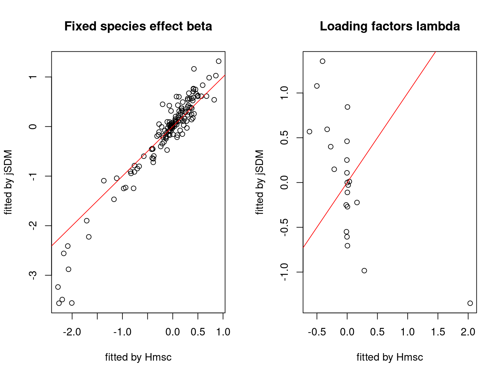
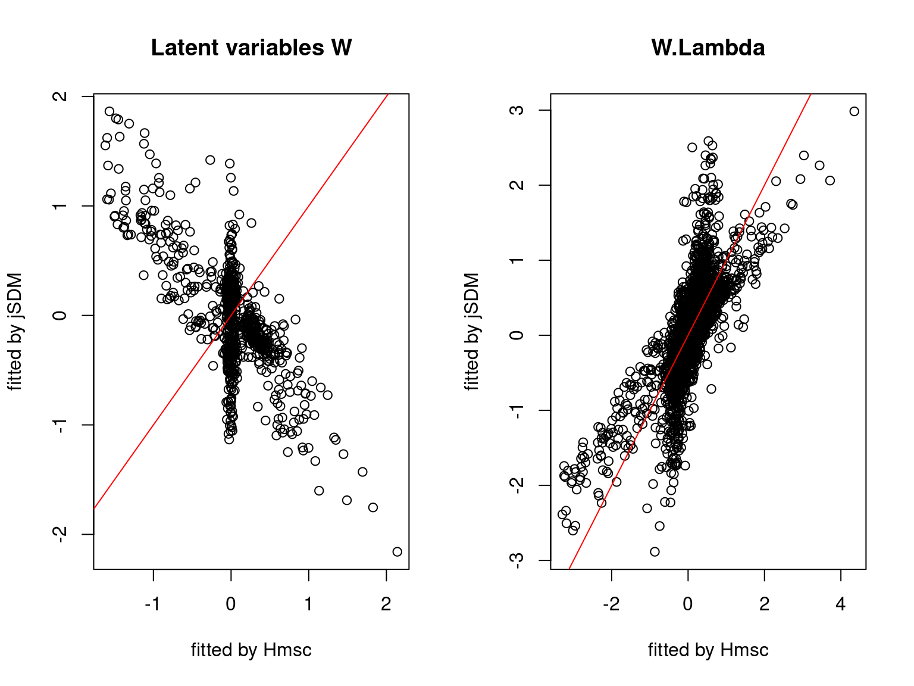
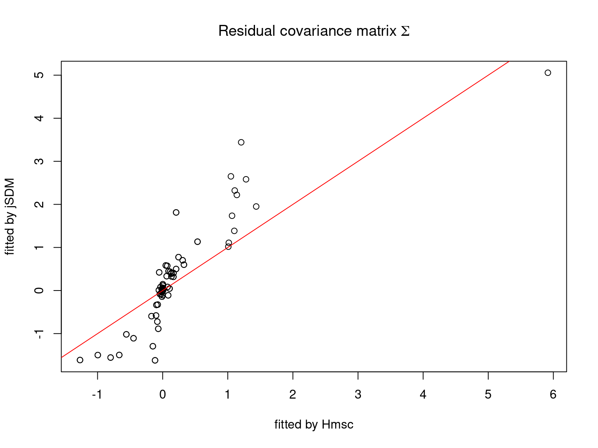
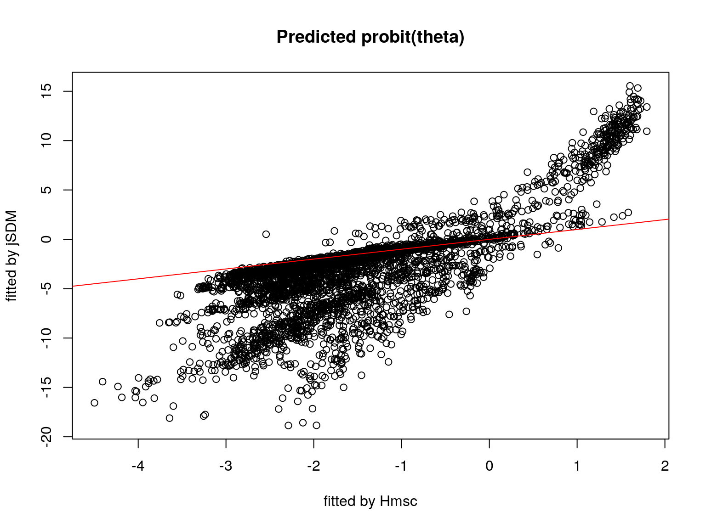
```

### Birds dataset

```{r jSDM-Hmsc-birds, echo=FALSE}
nsp <- ncol(mod_jSDM_Birds$model_spec$beta_start)
nsite <- nrow(mod_jSDM_Birds$model_spec$W_start)
print(paste(nsite,"sites and ",nsp," species"),quote = FALSE)
nl <- mod_jSDM_Birds$model_spec$n_latent
np <- nrow(mod_jSDM_Birds$model_spec$beta_start)

# species fixed effect beta
jSDM_beta <- matrix(0,nsp,np)
for (j in 1:nsp){
  jSDM_beta[j,] <- apply(mod_jSDM_Birds$mcmc.sp[[paste0("sp_",j)]],2,mean)[1:np]
}
Hmsc_beta <- t(getPostEstimate(hM=mod_Hmsc_Birds, parName='Beta')$mean)
par(mfrow=c(1,2))
plot(Hmsc_beta,jSDM_beta, xlab="fitted by Hmsc", ylab="fitted by jSDM", main="Fixed species effect beta")
abline(a=0,b=1,col='red')

# factor loadings lambda
jSDM_lambda <- matrix(0,nsp,nl)
for (j in 1:nsp){
  jSDM_lambda[j,] <- apply(mod_jSDM_Birds$mcmc.sp[[paste0("sp_",j)]],2,mean)[(np+1):(np+nl)]
}
Hmsc_lambda <- t(getPostEstimate(hM=mod_Hmsc_Birds, parName='Lambda')$mean)

plot(Hmsc_lambda,jSDM_lambda, xlab="fitted by Hmsc", ylab="fitted by jSDM", main="Loading factors lambda")
abline(a=0,b=1,col='red')

# Ws
jSDM_lvs <- matrix(0,nsite,nl)
for (l in 1:nl){
  jSDM_lvs[,l] <- apply(mod_jSDM_Birds$mcmc.latent[[paste0("lv_",l)]],2,mean)
}
Hmsc_lvs <- getPostEstimate(hM=mod_Hmsc_Birds, parName='Eta')$mean
plot(Hmsc_lvs, jSDM_lvs, xlab="fitted by Hmsc", ylab="fitted by jSDM", main="Latent variables W")
abline(a=0,b=1,col='red')

# W.Lambda
plot(Hmsc_lvs %*% t(Hmsc_lambda) , jSDM_lvs %*% t(jSDM_lambda), xlab="fitted by Hmsc", ylab="fitted by jSDM", main="W.Lambda")
abline(a=0,b=1,col='red') 

# Residual covariance Matrix
codaObject <- Hmsc::convertToCodaObject(mod_Hmsc_Birds, start=1)
n.mcmc <- mod_Hmsc_Birds$samples
Tau.cov.arr <- matrix(NA,n.mcmc,nsp^2)
for(t in 1:n.mcmc) { 
  lv.coefs <- matrix(codaObject$Lambda[[1]][[1]][t,],nrow=nsp)
  Tau.mat <- lv.coefs %*% t(lv.coefs) + diag(nsp)
  Tau.cov.arr[t,] <- as.vector(Tau.mat) 
}
Hmsc_Sigma <- matrix(apply(Tau.cov.arr,2,mean),nsp)
#Hmsc_R <- Hmsc::computeAssociations(mod_Hmsc_Birds)[[1]]$mean
jSDM_Sigma <- jSDM::get_residual_cor(mod_jSDM_Birds)$cov.mean
par(mfrow=c(1,1))
plot(Hmsc_Sigma,jSDM_Sigma,main=expression(paste("Residual covariance matrix ",Sigma)), xlab="fitted by Hmsc", ylab="fitted by jSDM")
abline(a=0,b=1, col='red')

# Predictions 
par(mfrow=c(1,1))
plot(c(probit_theta_latent_Birds), mod_jSDM_Birds$probit_theta_latent, xlab="fitted by Hmsc", ylab="fitted by jSDM", main="probit(theta)")
abline(a=0,b=1,col='red')
```


```{r jSDM-Hmsc-birds-plot, echo=FALSE, out.width=800, eval=TRUE}
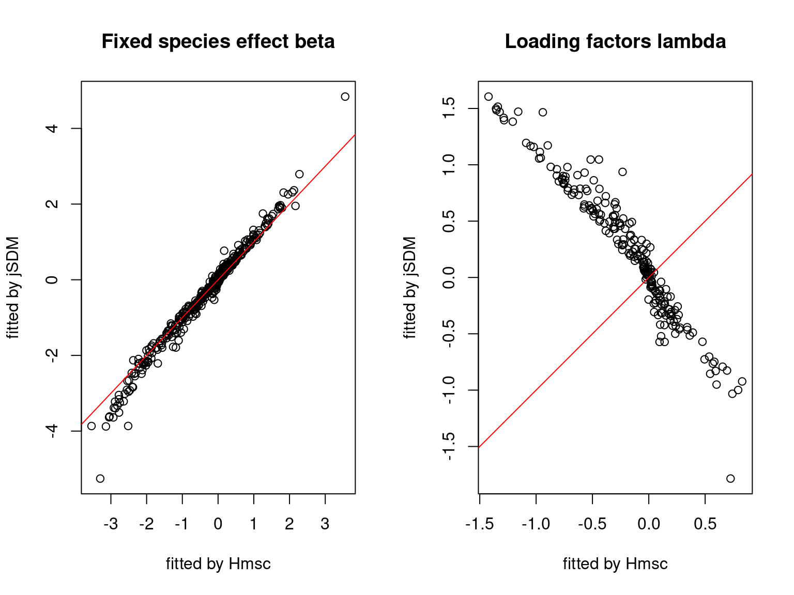
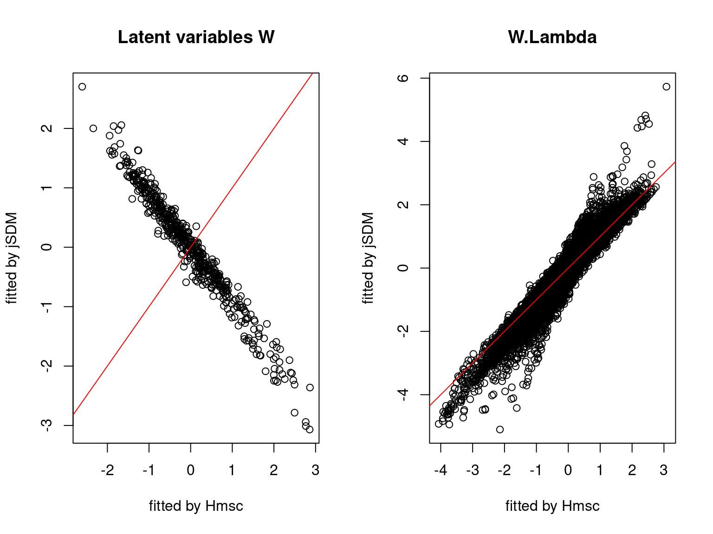
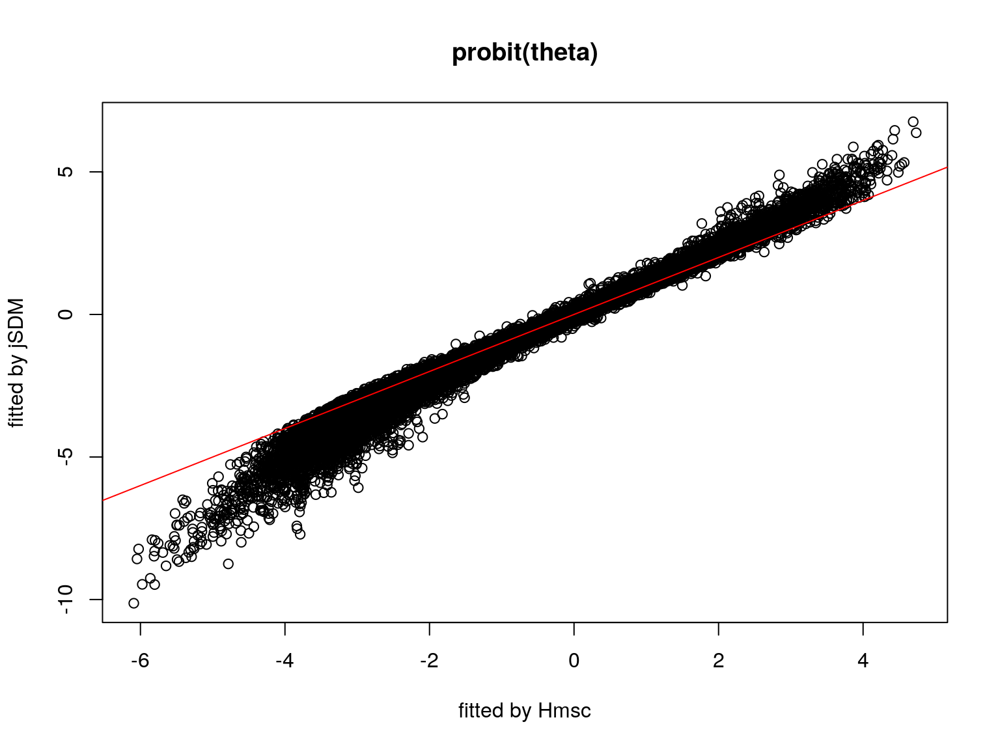
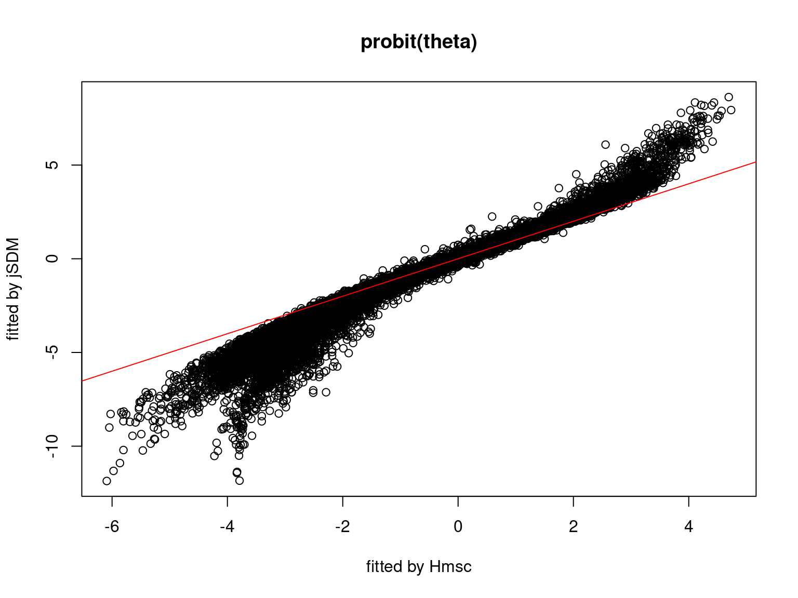
```

### Mites dataset

```{r jSDM-Hmsc-mites, echo=FALSE}
# Remove species with less than 10 presences
rare_sp <- which(apply(PA_Mites>0, 2, sum) < 10)
if(length(rare_sp)!=0) PA_Mites <- PA_Mites[, -rare_sp]
print(paste(nrow(PA_Mites),"sites and ",ncol(PA_Mites)," species"),quote = FALSE)
nsp <- ncol(mod_jSDM_Mites$model_spec$count_data)
nsite <- nrow(mod_jSDM_Mites$model_spec$count_data)
nl <- mod_jSDM_Mites$model_spec$n_latent
np <- nrow(mod_jSDM_Mites$model_spec$beta_start)

# species fixed effect beta
jSDM_beta <- matrix(0,nsp,np)
for (j in 1:nsp){
  jSDM_beta[j,] <- apply(mod_jSDM_Mites$mcmc.sp[[paste0("sp_",j)]],2,mean)[1:np]
}
Hmsc_beta <- t(getPostEstimate(hM=mod_Hmsc_Mites, parName='Beta')$mean)
par(mfrow=c(1,2))
plot(Hmsc_beta,jSDM_beta, xlab="fitted by Hmsc", ylab="fitted by jSDM", main="Fixed species effect beta")
abline(a=0,b=1,col='red')

# factor loadings lambda
jSDM_lambda <- matrix(0,nsp,nl)
for (j in 1:nsp){
  jSDM_lambda[j,] <- apply(mod_jSDM_Mites$mcmc.sp[[paste0("sp_",j)]],2,mean)[(np+1):(np+nl)]
}
Hmsc_lambda <- t(getPostEstimate(hM=mod_Hmsc_Mites, parName='Lambda')$mean)

plot(Hmsc_lambda,jSDM_lambda, xlab="fitted by Hmsc", ylab="fitted by jSDM", main="Loading factors lambda")
abline(a=0,b=1,col='red')

# Ws
jSDM_lvs <- matrix(0,nsite,nl)
for (l in 1:nl){
  jSDM_lvs[,l] <- apply(mod_jSDM_Mites$mcmc.latent[[paste0("lv_",l)]],2,mean)
}
Hmsc_lvs <- getPostEstimate(hM=mod_Hmsc_Mites, parName='Eta')$mean
plot(Hmsc_lvs, jSDM_lvs, xlab="fitted by Hmsc", ylab="fitted by jSDM", main="Latent variables W")
abline(a=0,b=1,col='red')

# W.Lambda
plot(Hmsc_lvs %*% t(Hmsc_lambda) , jSDM_lvs %*% t(jSDM_lambda), xlab="fitted by Hmsc", ylab="fitted by jSDM", main="W.Lambda")
abline(a=0,b=1,col='red') 

# Residual covariance Matrix
codaObject <- Hmsc::convertToCodaObject(mod_Hmsc_Mites, start=1)
n.mcmc <- mod_Hmsc_Mites$samples
Tau.cov.arr <- matrix(NA,n.mcmc,nsp^2)
for(t in 1:n.mcmc) { 
  lv.coefs <- matrix(codaObject$Lambda[[1]][[1]][t,],nrow=nsp)
  Tau.mat <- lv.coefs %*% t(lv.coefs) + diag(nsp)
  Tau.cov.arr[t,] <- as.vector(Tau.mat) 
}
Hmsc_Sigma <- matrix(apply(Tau.cov.arr,2,mean),nsp)
#Hmsc_R <- Hmsc::computeAssociations(mod_Hmsc_Mites)[[1]]$mean
jSDM_Sigma <- jSDM::get_residual_cor(mod_jSDM_Mites)$cov.mean
par(mfrow=c(1,1))
plot(Hmsc_Sigma,jSDM_Sigma,main=expression(paste("Residual covariance matrix ",Sigma)), xlab="fitted by Hmsc", ylab="fitted by jSDM")
abline(a=0,b=1, col='red')


# Predictions 
par(mfrow=c(1,1))
plot(log_theta_latent_Mites, mod_jSDM_Mites$log_theta_latent, xlab="fitted by Hmsc", ylab="fitted by jSDM", main="log(theta)")
abline(a=0,b=1,col='red')
```


```{r jSDM-Hmsc-mites-plot, echo=FALSE, out.width=800, eval=TRUE}
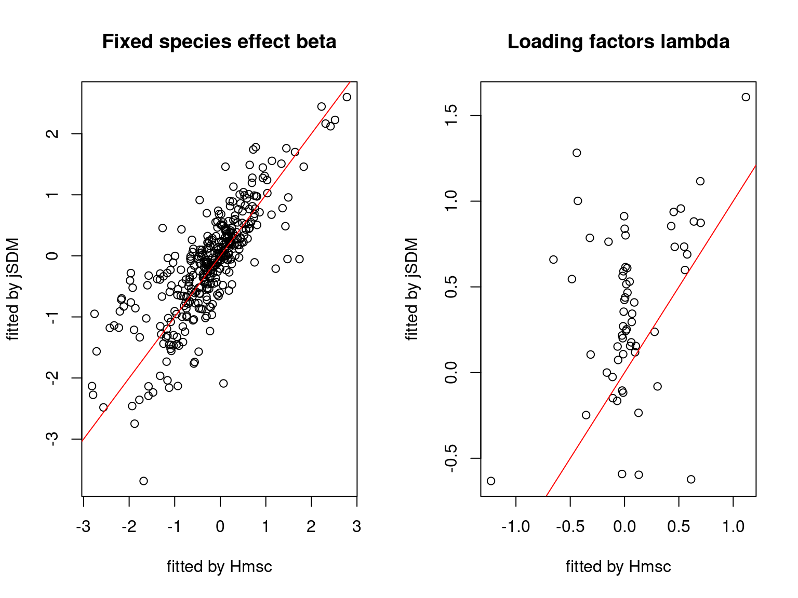
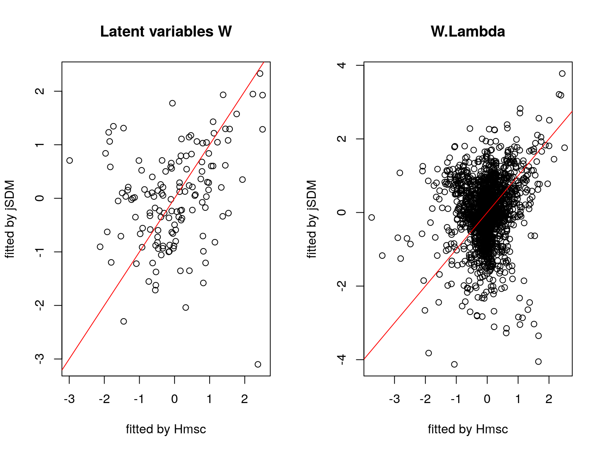
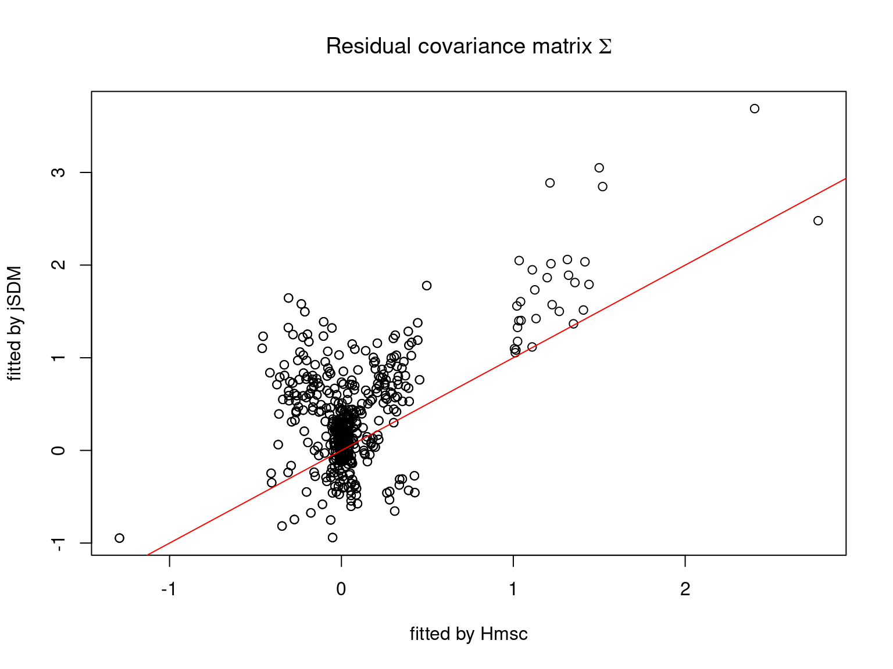
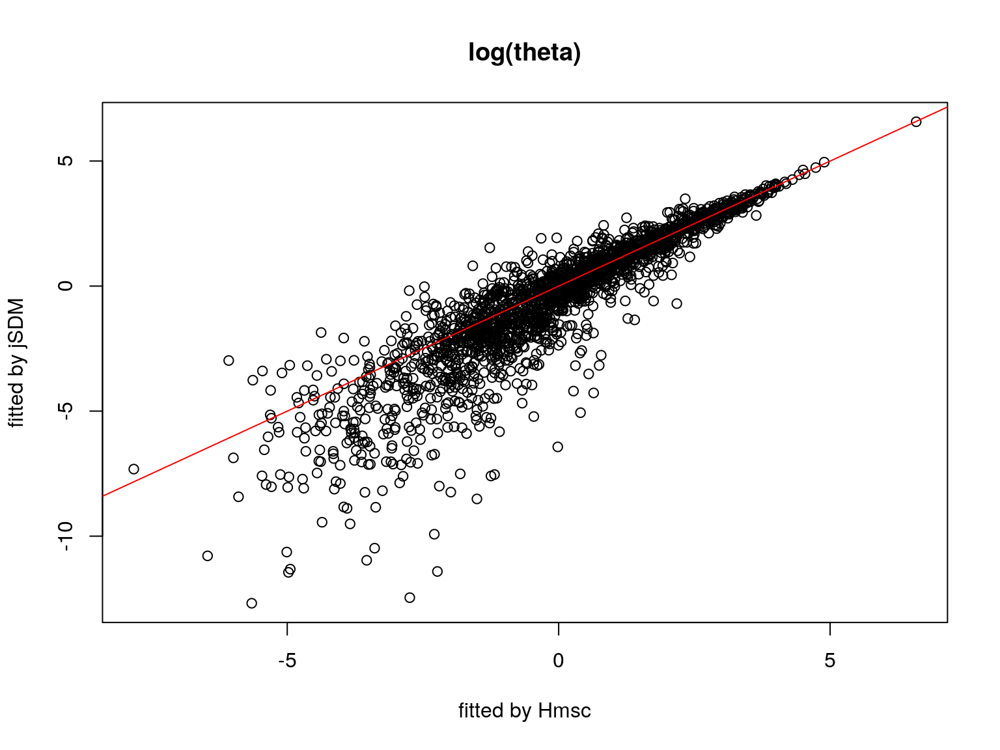
```

