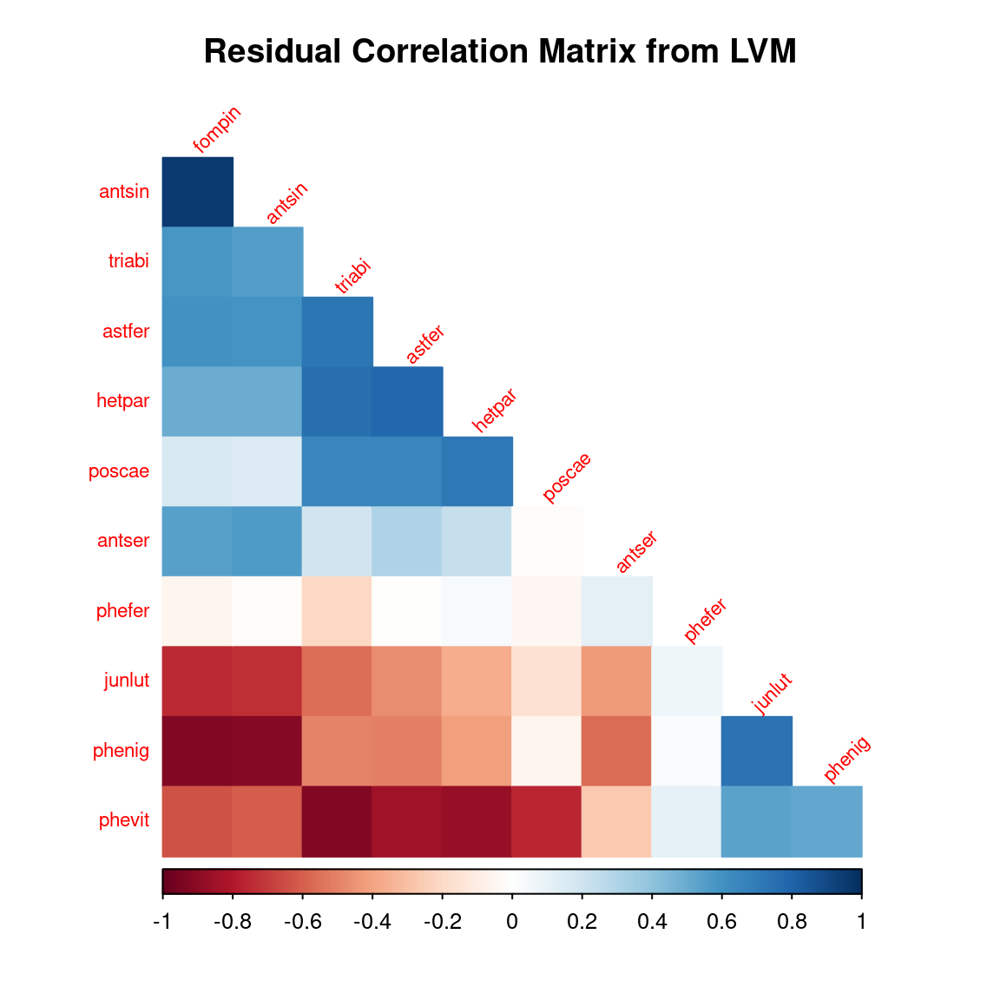
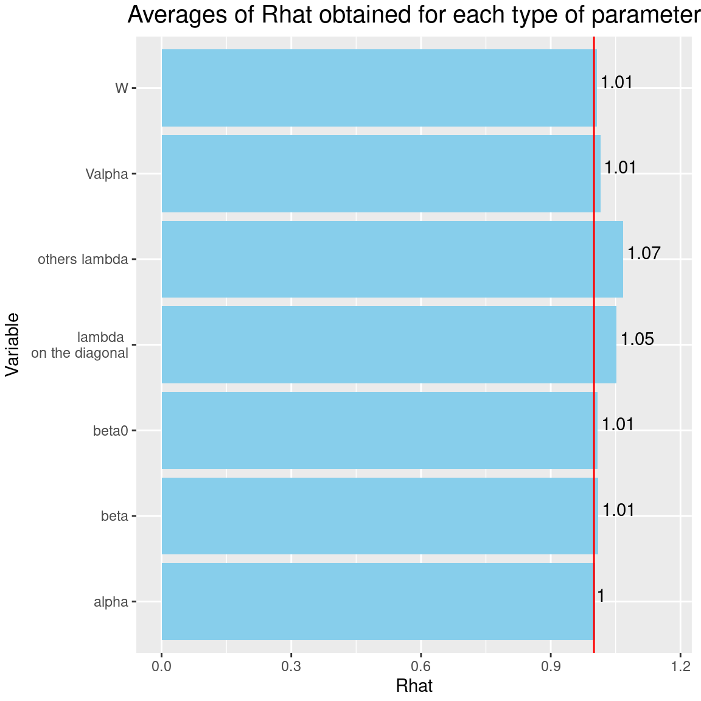
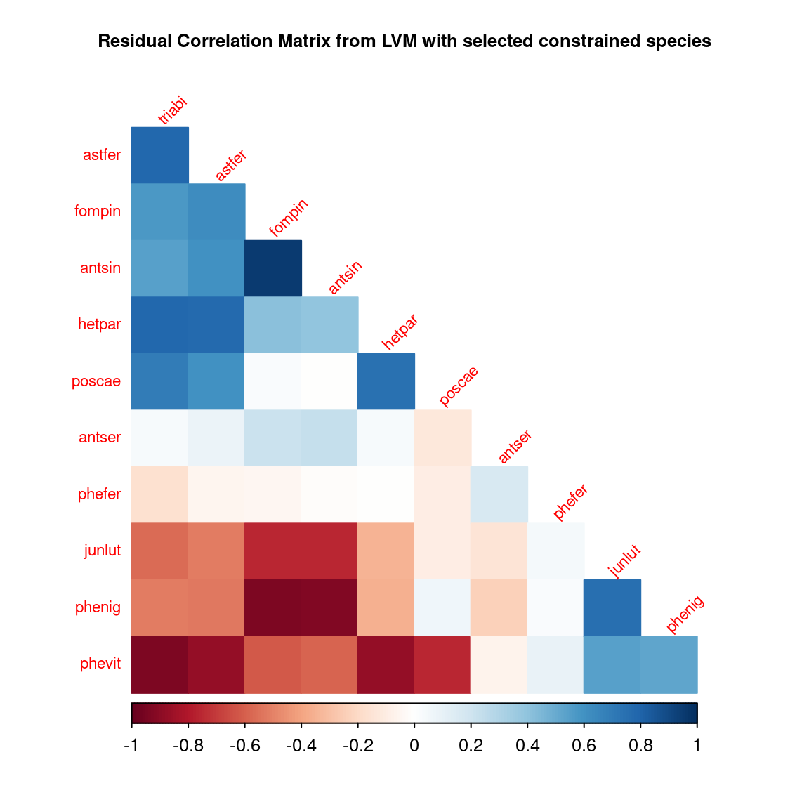

 
```{r setup, include=FALSE}
knitr::opts_chunk$set(
fig.align = "center",
fig.width = 6, fig.height = 6,
cache = TRUE,
collapse = TRUE,
comment = "#>",
highlight = TRUE,
eval = FALSE
)
```

# Load librairies 

```{r library, eval=TRUE}
# ===================================================
# Load libraries
# ===================================================
library(ggplot2)
library(coda)
library(parallel)
library(doParallel)
library(jSDM)
library(kableExtra)
```

# Model definition 

Referring to the models used in the articles @Warton2015 and @Albert1993, we define the following model :

$$ \mathrm{probit}(\theta_{ij}) =\alpha_i + \beta_{0j}+X_i.\beta_j+ W_i.\lambda_j $$

- Link function probit: $\mathrm{probit}: q \rightarrow \Phi^{-1}(q)$ where $\Phi$ correspond to the distribution function of the reduced centered normal distribution.

- Response variable: $Y=(y_{ij})^{i=1,\ldots,nsite}_{j=1,\ldots,nsp}$ with:

$$y_{ij}=\begin{cases}
0 & \text{ if species $j$ is absent on the site $i$}\\
1 &  \text{ if species  $j$ is present on the site $i$}.
\end{cases}$$

- Latent variable $z_{ij} = \alpha_i + \beta_{0j} + X_i.\beta_j + W_i.\lambda_j + \epsilon_{i,j}$, with $\forall (i,j) \ \epsilon_{ij} \sim \mathcal{N}(0,1)$ and such that:

$$y_{ij}=\begin{cases}
1 & \text{if} \ z_{ij} > 0 \\
0 &  \text{otherwise.}
\end{cases}$$

It can be easily shown that: $y_{ij} \sim \mathcal{B}ernoulli(\theta_{ij})$. 

- Latent variables: $W_i=(W_i^1,\ldots,W_i^q)$ where $q$ is the number of latent variables considered, which has to be fixed by the user (by default $q=2$).
We assume that $W_i \sim \mathcal{N}(0,I_q)$ and we define the associated coefficients: $\lambda_j=(\lambda_j^1,\ldots, \lambda_j^q)'$. We use a prior distribution $\mathcal{N}(0,10)$ for all lambdas not concerned by constraints to $0$ on upper diagonal and to strictly positive values on diagonal. 

- Explanatory variables: bioclimatic data about each site. $X=(X_i)_{i=1,\ldots,nsite}$ with $X_i=(x_i^1,\ldots,x_i^p)\in \mathbb{R}^p$ where $p$ is the number of bioclimatic variables considered.
The corresponding regression coefficients for each species $j$ are noted : $\beta_j=(\beta_j^1,\ldots,\beta_j^p)'$.

- $\beta_{0j}$ correspond to the intercept for species $j$ which is assumed to be a fixed effect. We use a prior distribution $\mathcal{N}(0,10)$ for all betas. 

- $\alpha_i$ represents the random effect of site $i$ such as $\alpha_i \sim \mathcal{N}(0,V_{\alpha})$ and we assume that $V_{\alpha} \sim \mathcal {IG}(\text{shape}=0.5, \text{rate}=0.005)$ as prior distribution by default. 


# Occurrence data-set

(ref:cap-fungi) **Fungi** [@Wilkinson2019].

```{r frog-picture, echo=FALSE, out.width=400, out.height=300, fig.cap="(ref:cap-fungi)", eval=TRUE}
knitr::include_graphics("figures/Fungi_.jpg")
```

This data-set is available in the [`jSDM-package`](https://ecology.ghislainv.fr/jSDM/reference/jSDM-package.html) R package. It can be loaded with the `data()` command. The [`fungi`](https://ecology.ghislainv.fr/jSDM/reference/fungi.html) dataset is in "wide" format: each line is a site and the occurrence data are in columns. A site is characterized by its x-y geographical coordinates twelve covariates. 

```{r Fungi-data, eval=TRUE}
library(jSDM)
# frogs data
data(fungi, package="jSDM")
head(fungi)
```

We rearrange the data in two data-sets: a first one for the presence-absence observations for each species (columns) at each site (rows), and a second one for the site characteristics.

We also normalize the continuous explanatory variables to facilitate MCMC convergence. 

```{r arranging-Fungi-data, eval=TRUE}
# Fungi data-set
data(fungi, package="jSDM")
PA_Fungi <- fungi[,c("antser","antsin","astfer","fompin","hetpar","junlut",
                     "phefer","phenig","phevit","poscae","triabi")]

# Normalized continuous variables
Env_Fungi <- cbind(scale(fungi[,c("diam","epi","bark")]),
                   fungi[,c("dc1","dc2","dc3","dc4","dc5",
                            "quality3","quality4","ground3","ground4")])
colnames(Env_Fungi) <- c("diam","epi","bark","dc1","dc2","dc3","dc4","dc5",
                         "quality3","quality4","ground3","ground4")
# Remove sites where none species was recorded
Env_Fungi <- Env_Fungi[rowSums(PA_Fungi) != 0,]
PA_Fungi<- PA_Fungi[rowSums(PA_Fungi) != 0,]
```

# Fitting JSDM with the species on first columns constrained

## Parameter inference

As a first step we use the `jSDM_binomial_probit()` function to fit the JSDM in parallel to obtain four MCMC chains of parameters. 

```{r jSDM-probit}
## Make a cluster for parallel MCMCs
nchains <- 4
ncores <- nchains ## One core for each MCMC chains
clust <- makeCluster(ncores)
registerDoParallel(clust)

# Seeds
seed_mcmc <- c(12, 123, 1234, 12345)

# Model
mod_Fungi <-
  foreach (i = 1:nchains) %dopar% {
    # Inferring model parameters
    mod <- jSDM::jSDM_binomial_probit(# Chains
                                      burnin=5000,
                                      mcmc=10000,
                                      thin=10,
                                      # Response variable 
                                      presence_data = PA_Fungi, 
                                      # Explanatory variables 
                                      site_formula = ~.,   
                                      site_data = Env_Fungi,
                                      # Model specification 
                                      n_latent=2, 
                                      site_effect="random",
                                      # Starting values
                                      alpha_start=0,
                                      beta_start=0,
                                      lambda_start=0, 
                                      W_start=0,
                                      V_alpha=1, 
                                      # Priors
                                      shape=0.1, 
                                      rate=0.1,
                                      mu_beta=0, 
                                      V_beta=1,
                                      mu_lambda=0,
                                      V_lambda=1,
                                      # Other
                                      seed = seed_mcmc[i],
                                      verbose = 0
    )
    return(mod)
  }
# Stop cluster
stopCluster(clust)
```

## The Gelman–Rubin convergence diagnostic

### Definition 

The Gelman–Rubin diagnostic evaluates MCMC convergence by analyzing the difference between multiple Markov chains. The convergence is assessed by comparing the estimated between-chains and within-chain variances for each model parameter. Large differences between these variances indicate nonconvergence. See @Gelman1992 and @Brooks1998 for the detailed description of the method.

Suppose we have $M$ chains, each of length $N$, although the chains may be of different lengths. The same-length assumption simplifies the formulas and is used for convenience. For a model parameter $\theta$, let $\left(\theta_{𝑚t}\right)_{t=1}^N$ be the $𝑚$th simulated chain, $𝑚=1,\dots,𝑀$. Let $\hat{\theta}_𝑚=\frac{1}{N}\sum\limits_{t=1}^N \hat{\theta}_{mt}$ and $\hat{\sigma}^2_𝑚=\frac{1}{N-1}\sum\limits_{t=1}^N (\hat{\theta}_{mt}-\hat{\theta}_𝑚)^2$ be the sample posterior mean and variance of the $𝑚$th chain, and let the overall sample posterior mean be $\hat{\theta}=\frac{1}{𝑀}\sum\limits_{m=1}^𝑀 \hat{\theta}_m$.

The between-chains and within-chain variances are given by
$$B=\frac{N}{M-1}\sum\limits_{m=1}^𝑀 (\hat{\theta}_m - \hat{\theta})^2$$
$$W=\frac{1}{M}\sum\limits_{m=1}^𝑀\hat{\sigma}^2_m$$

 Under certain stationarity conditions, the pooled variance : 
 
 $$\hat{V}=\frac{N-1}{N}W + \frac{M+1}{MN}B$$
 
is an unbiased estimator of the marginal posterior variance of $\theta$ (@Gelman1992). The potential scale reduction factor (PSRF) is defined to be the ratio of $\hat{𝑉}$ and $𝑊$. If the $𝑀$ chains have converged to the target posterior distribution, then PSRF should be close to 1. The article @Brooks1998 corrected the original PSRF by accounting for sampling variability as follows:
$$ \hat{R}= \sqrt{\frac{\hat{d}+3}{\hat{d}+1}\frac{\hat{V}}{W}}$$

where $\hat{d}$  is the degrees of freedom estimate of a $𝑡$ distribution.

PSRF estimates the potential decrease in the between-chains variability $𝐵$ with respect to the within-chain variability $𝑊$. If $\hat{R}$ is large, then longer simulation sequences are expected to either decrease $𝐵$ or increase $𝑊$ because the simulations have not yet explored the full posterior distribution. As the article @Brooks1998 have suggested, if $\hat{R} < 1.2$ for all model parameters, one can be fairly confident that convergence has been reached. Otherwise, longer chains or other means for improving the convergence may be needed. Even more reassuring is to apply the more stringent condition $\hat{R} < 1.1$.

### Compute $\hat{R}$  

We evaluate the convergence of the MCMC output in which four parallel chains are run (with starting values that are over dispersed relative to the posterior distribution).
Convergence is diagnosed when the four chains have ‘forgotten’ their initial values, and the output from all chains is indistinguishable.
If the convergence diagnostic gives values of potential scale reduction factor (PSRF) or $\hat{R}$
substantially above 1, its indicates lack of convergence.

```{r jSDM-model-convergence}
# Number of latent variables 
n_latent <- mod_Fungi[[1]]$model_spec$n_latent
# Results from list to mcmc.list format
burnin <- mod_Fungi[[1]]$model_spec$burnin
ngibbs <- burnin + mod_Fungi[[1]]$model_spec$mcmc
thin <-  mod_Fungi[[1]]$model_spec$thin
require(coda)
arr2mcmc <- function(x) {
  return(mcmc(as.data.frame(x),
              start=burnin+1 , end=ngibbs, thin=thin))
}
mcmc_list_alpha <- mcmc.list(lapply(lapply(mod_Fungi,"[[","mcmc.alpha"), arr2mcmc))
mcmc_list_V_alpha <- mcmc.list(lapply(lapply(mod_Fungi,"[[","mcmc.V_alpha"), arr2mcmc))
mcmc_list_V_alpha <- mcmc.list(lapply(lapply(mod_Fungi,"[[","mcmc.V_alpha"), arr2mcmc))
mcmc_list_param <- mcmc.list(lapply(lapply(mod_Fungi,"[[","mcmc.sp"), arr2mcmc))
mcmc_list_lv <- mcmc.list(lapply(lapply(mod_Fungi,"[[","mcmc.latent"), arr2mcmc))
mcmc_list_beta <- mcmc_list_param[,grep("beta",colnames(mcmc_list_param[[1]]))]
mcmc_list_beta0 <- mcmc_list_beta[,grep("Intercept", colnames(mcmc_list_beta[[1]]))]
mcmc_list_lambda <- mcmc.list(
  lapply(mcmc_list_param[, grep("lambda", 
                                     colnames(mcmc_list_param[[1]]),
                                     value=TRUE)], arr2mcmc))
mcmc_list_Deviance <-  mcmc.list(lapply(lapply(mod_Fungi,"[[","mcmc.Deviance"), arr2mcmc))
# Rhat
psrf_alpha <- mean(gelman.diag(mcmc_list_alpha, multivariate=FALSE)$psrf[,2])
psrf_V_alpha <- gelman.diag(mcmc_list_V_alpha)$psrf[,2]
psrf_beta0 <- mean(gelman.diag(mcmc_list_beta0)$psrf[,2])
psrf_beta <- mean(gelman.diag(mcmc_list_beta[,grep("Intercept", colnames(mcmc_list_beta[[1]]), invert=TRUE)])$psrf[,2])
psrf_lambda_diag <- mean(gelman.diag(mcmc_list_lambda[,c(1, n_latent+2)])$psrf[,2])
# mean(psrf, na.rm=TRUE) because zeros on upper triangular Lambda matrix give NaN in psrf
psrf_lambda_others <- mean(gelman.diag(mcmc_list_lambda[,-c(1, n_latent+2)],
                                       multivariate=FALSE)$psrf[,2],
                           na.rm=TRUE)
psrf_lv <- mean(gelman.diag(mcmc_list_lv)$psrf[,2])
Rhat <- data.frame(Rhat=c(psrf_alpha, psrf_V_alpha, psrf_beta0, psrf_beta,
                          psrf_lambda_diag, psrf_lambda_others, psrf_lv),
                   Variable=c("alpha", "Valpha", "beta0", "beta",
                              "lambda \n on the diagonal", "others lambda", "W"))
# Barplot
library(ggplot2)
ggplot(Rhat, aes(x=Variable, y=Rhat)) + 
  ggtitle("Averages of Rhat obtained for each type of parameter") +
  theme(plot.title = element_text(hjust = 0.5, size=15)) +
  theme(plot.margin = margin(t = 0.1, r = 0.2, b = 0.1, l = 0.1,"cm")) +
  geom_bar(fill="skyblue", stat = "identity") +
  geom_text(aes(label=round(Rhat,2)), vjust=0, hjust=-0.1) +
  ylim(0, max(Rhat$Rhat)+0.1) +
  geom_hline(yintercept=1, color='red') +
  coord_flip() 
```

```{r jSDM-model-convergence-plot, echo=FALSE, out.width=700, eval=TRUE}

```

It can be seen that the $\hat{R}$'s associated with the factor loadings $\lambda$ are well above 1, which indicates a lack of convergence for these parameters, even after $15000$ iterations including $5000$ burn-in. 

## Analysis of the results

### Representation of results

We visually evaluate the convergence of MCMCs by representing the trace and density *a posteriori* of some estimated parameters. 

```{r plot-results-probit}
np <- nrow(mod_Fungi[[1]]$model_spec$beta_start)
nchains <- length(mod_Fungi)
## beta_j of the first two species 
par(mfrow=c(2,2))
plot(mcmc_list_beta[,1:(2*np)],
     auto.layout=FALSE)
## lambda_j of the first two species 
n_latent <- mod_Fungi[[1]]$model_spec$n_latent
par(mfrow=c(2,2))
plot(mcmc_list_lambda[,1:(2*n_latent)],
     auto.layout=FALSE)
## Latent variables W_i for the first two sites
par(mfrow=c(2,2))
nsite <- ncol(mod_Fungi[[1]]$mcmc.alpha)
plot(mcmc_list_lv[, c(1:2, 1:2 + nsite)],
     auto.layout=FALSE)

## alpha_i of the first two sites
plot(mcmc_list_alpha[,1:2])

## V_alpha
par(mfrow=c(2,2))
plot(mcmc_list_V_alpha,
     auto.layout=FALSE)
## Deviance
plot(mcmc_list_Deviance,
     auto.layout=FALSE)

## probit_theta
par(mfrow=c(1,2))
hist(mod_Fungi[[1]]$probit_theta_latent,
     col=1,
     main = "Predicted probit theta",
     xlab ="predicted probit theta")
for(i in 2:nchains){
hist(mod_Fungi[[i]]$probit_theta_latent,
     add=TRUE, col=i)
}
# occurrence probabilities theta
hist(mod_Fungi[[1]]$theta_latent,
     col=1, main = "Predicted theta",
     xlab ="predicted theta")
for(i in 2:nchains){
hist(mod_Fungi[[i]]$theta_latent,
     add=TRUE, col=i)
}
```

```{r plot-results-probit2, echo=FALSE, out.width=700, eval=TRUE}
knitr::include_graphics(paste0("jSDM_binomial_probit_sp_constrained_files/figure-html/plot-results-probit-", 1:20, ".png"))
```

Overall, the traces and the densities of the parameters indicate the convergence of the algorithm. Indeed, we observe on the traces that the values oscillate around averages without showing an upward or downward trend and we see that the densities are quite smooth and for the most part of Gaussian form, except for the factor loadings $lambda$.  
In fact the values estimated for $lambda$ differ between the four chains and within each chain, the traces of these parameters oscillate very strongly showing upward or downward trends and we see that the densities are not of Gaussian form, as expected.  

This lack of convergence can be explained by the arbitrary choice of the species constrained to have positive values of $\lambda$ as being the first ones in the presence-absence data set. Indeed, the constrained species are supposed to be the ones that structure themselves most clearly on each latent axis but by arbitrarily choosing them this is not necessarily the case.

### Matrice of residual correlations 

After fitting the jSDM with latent variables, the **full species residual correlation matrix** $R=(R_{ij})^{i=1,\ldots, nspecies}_{j=1,\ldots, nspecies}$ can be derived from the covariance in the latent variables such as : 
$$\Sigma_{ij} = \begin{cases}
\lambda_i .\lambda_j^T & \text{ if } i \neq j \\
\lambda_i .\lambda_j^T + 1 & \text{ if } i=j
\end{cases}$$, then we compute correlations from covariances :
$$R_{i,j} = \frac{\Sigma_{ij}}{\sqrt{\Sigma _{ii}\Sigma _{jj}}}$$.

We use the `get_residual_cor()` function to compute the residual correlation matrix $R$ for each chain and we  and display the average of the $R$ matrices for all chains:

```{r correlation-matrix-probit}
nsp <- ncol(mod_Fungi[[1]]$model_spec$beta_start)
# Average residual correlation matrix on the four mcmc chains
R <- matrix(0, nsp, nsp)
for(i in 1:nchains){
R <- R + get_residual_cor(mod_Fungi[[i]])$cor.mean/nchains
}
colnames(R) <- rownames(R) <- colnames(PA_Fungi)
R.reorder <- corrplot::corrMatOrder(R, order = "FPC", hclust.method = "average")
corrplot::corrplot(R[R.reorder, R.reorder],  diag = F, type = "lower",
                   method = "color",  mar = c(1,1,3,1),
                   tl.srt = 45, tl.cex = 0.7,
                   title = "Residual Correlation Matrix from LVM")
```

```{r correlation-matrix-plot, echo=FALSE, out.width=700, eval=TRUE}

```

# Fitting JSDM with the chosen constrained species 

## Parameter inference

As a second step we use the `jSDM_binomial_probit_sp_constrained()` function to fit the JSDM in parallel to obtain four MCMC chains of parameters.  

This function returns the fitted JSDM considering as constrained species to positivity on the diagonal of the $\Lambda$ matrix those that maximize on each latent axis the $\hat{R}$s computed from the factor loadings $\lambda$ of the first JSDM adjusted with the constrained species arbitrarily chosen as the first of the response matrix. 

```{r jSDM-probit-ord}
# Model
# Inferring model parameters
mod_Fungi_ord <- jSDM::jSDM_binomial_probit_sp_constrained(# Chains
                                                           ncores=4,
                                                           nchains=4,
                                                           # Iteration
                                                           burnin=5000,
                                                           mcmc=10000,
                                                           thin=10,
                                                           # Response variable 
                                                           presence_data = PA_Fungi, 
                                                           # Explanatory variables 
                                                           site_formula = ~.,   
                                                           site_data = Env_Fungi,
                                                           # Model specification 
                                                           n_latent=2, 
                                                           site_effect="random",
                                                           # Starting values
                                                           alpha_start=0,
                                                           beta_start=0,
                                                           lambda_start=0, 
                                                           W_start=0,
                                                           V_alpha=1, 
                                                           # Priors
                                                           shape=0.1, 
                                                           rate=0.1,
                                                           mu_beta=0, 
                                                           V_beta=1,
                                                           mu_lambda=0,
                                                           V_lambda=1,
                                                           # Other
                                                           seed = seed_mcmc[i],
                                                           verbose = 0
)
```

## The Gelman–Rubin convergence diagnostic

### Compute $\hat{R}$  

We evaluate the convergence of the MCMC output in which four parallel chains are run (with starting values that are over dispersed relative to the posterior distribution).
Convergence is diagnosed when the four chains have ‘forgotten’ their initial values, and the output from all chains is indistinguishable.
If the convergence diagnostic gives values of potential scale reduction factor (PSRF) or $\hat{R}$
substantially above 1, its indicates lack of convergence.

```{r Rhat-ord}
# Results from list to mcmc.list format
burnin <- mod_Fungi_ord[[1]]$model_spec$burnin
ngibbs <- burnin + mod_Fungi_ord[[1]]$model_spec$mcmc
thin <-  mod_Fungi_ord[[1]]$model_spec$thin
require(coda)
arr2mcmc <- function(x) {
  return(mcmc(as.data.frame(x),
              start=burnin+1 , end=ngibbs, thin=thin))
}
mcmc_list_alpha <- mcmc.list(lapply(lapply(mod_Fungi_ord,"[[","mcmc.alpha"), arr2mcmc))
mcmc_list_V_alpha <- mcmc.list(lapply(lapply(mod_Fungi_ord,"[[","mcmc.V_alpha"), arr2mcmc))
mcmc_list_param <- mcmc.list(lapply(lapply(mod_Fungi_ord,"[[","mcmc.sp"), arr2mcmc))
mcmc_list_lv <- mcmc.list(lapply(lapply(mod_Fungi_ord,"[[","mcmc.latent"), arr2mcmc))
mcmc_list_beta <- mcmc_list_param[,grep("beta",colnames(mcmc_list_param[[1]]))]
mcmc_list_beta0 <- mcmc_list_beta[,grep("Intercept", colnames(mcmc_list_beta[[1]]))]
mcmc_list_lambda <- mcmc.list(
  lapply(mcmc_list_param[, grep("lambda", 
                                     colnames(mcmc_list_param[[1]]),
                                     value=TRUE)], arr2mcmc))
# Rhat
psrf_alpha <- mean(gelman.diag(mcmc_list_alpha, multivariate=FALSE)$psrf[,2])
psrf_V_alpha <- gelman.diag(mcmc_list_V_alpha)$psrf[,2]
psrf_beta0 <- mean(gelman.diag(mcmc_list_beta0)$psrf[,2])
psrf_beta <- mean(gelman.diag(mcmc_list_beta[,grep("Intercept", colnames(mcmc_list_beta[[1]]),invert=TRUE)])$psrf[,2])
id_sp_constrained <- NULL
for(l in 1:n_latent){
id_sp_constrained <- c(id_sp_constrained,
                       grep(mod_Fungi_ord[[1]]$sp_constrained[l], 
                            varnames(mcmc_list_lambda)))
}
psrf_lambda_diag <- mean(gelman.diag(
  mcmc_list_lambda[,id_sp_constrained],
  multivariate=FALSE)$psrf[,2],
  na.rm=TRUE)
# mean(psrf, na.rm=TRUE) because zeros on upper triangular Lambda matrix give NaN in psrf
psrf_lambda_others <- mean(gelman.diag(mcmc_list_lambda[,-id_sp_constrained],
                                       multivariate=FALSE)$psrf[,2])
psrf_lv <- mean(gelman.diag(mcmc_list_lv)$psrf[,2])
Rhat <- data.frame(Rhat=c(psrf_alpha, psrf_V_alpha, psrf_beta0, psrf_beta,
                          psrf_lambda_diag, psrf_lambda_others, psrf_lv),
                   Variable=c("alpha", "Valpha", "beta0", "beta",
                              "lambda \n on the diagonal", "others lambda", "W"))
# Barplot
library(ggplot2)
ggplot(Rhat, aes(x=Variable, y=Rhat)) + 
  ggtitle("Averages of Rhat obtained for each type of parameter") +
  theme(plot.title = element_text(hjust = 0.5, size=15)) + 
  theme(plot.margin = margin(t = 0.1, r = 0.2, b = 0.1, l = 0.1,"cm")) +
  geom_bar(fill="skyblue", stat = "identity") +
  geom_text(aes(label=round(Rhat,2)), vjust=0, hjust=-0.1) +
  ylim(0, max(Rhat$Rhat)+0.1) +
  geom_hline(yintercept=1, color='red') +
  coord_flip() 
```

```{r Rhat-ord-plot, echo=FALSE, out.width=700, eval=TRUE}

```

It can be seen that the $\hat{R}$'s associated with the factor loadings $\lambda$ are much closer to 1 than previously after the same number of iterations. Consequently the convergence of factor loadings has improved by selecting the constrained species.

## Analysis of the results

### Representation of results

We visually evaluate the convergence of MCMCs by representing the trace and density *a posteriori* of some estimated parameters. 

```{r plot-results-probit-ord}
np <- nrow(mod_Fungi_ord[[1]]$model_spec$beta_start)
n_latent <- mod_Fungi_ord[[1]]$model_spec$n_latent
nchains <- length(mod_Fungi_ord)
## beta_j of the first two species and the species constrained 
par(mfrow=c(2,2))
plot(mcmc_list_beta[,1:(2*np)],
     auto.layout=FALSE)
for(l in 1:n_latent){
par(mfrow=c(2,2))
plot(mcmc_list_beta[, grep(mod_Fungi_ord[[1]]$sp_constrained[l],
                           varnames(mcmc_list_beta))],
     auto.layout=FALSE)
}
## lambda_j of the first two species and the species constrained 
par(mfrow=c(2,2))
plot(mcmc_list_lambda[,1:(2*n_latent)],
     auto.layout=FALSE)
for(l in 1:n_latent){
par(mfrow=c(2,2))
plot(mcmc_list_lambda[, grep(mod_Fungi_ord[[1]]$sp_constrained[l],
                             varnames(mcmc_list_lambda))],
     auto.layout=FALSE)
}
## Latent variables W_i for the first two sites
par(mfrow=c(2,2))
nsite <- ncol(mod_Fungi_ord[[1]]$mcmc.alpha)
plot(mcmc_list_lv[, c(1:2, 1:2 + nsite)],
     auto.layout=FALSE)

## alpha_i of the first two sites
plot(mcmc_list_alpha[,1:2])

## V_alpha
par(mfrow=c(2,2))
plot(mcmc_list_V_alpha,
     auto.layout=FALSE)
## Deviance
plot(mcmc_list_Deviance,
     auto.layout=FALSE)

## probit_theta
par(mfrow=c(1,2))
hist(mod_Fungi_ord[[1]]$probit_theta_latent,
     col=1,
     main = "Predicted probit theta",
     xlab ="predicted probit theta")
for(i in 2:nchains){
hist(mod_Fungi_ord[[i]]$probit_theta_latent,
     add=TRUE, col=i)
}
# occurrence probabilities theta
hist(mod_Fungi_ord[[1]]$theta_latent,
     col=1, main = "Predicted theta",
     xlab ="predicted theta")
for(i in 2:nchains){
hist(mod_Fungi_ord[[i]]$theta_latent,
     add=TRUE, col=i)
}
```

```{r plot-results-probit-ord2, echo=FALSE, out.width=700, eval=TRUE}
knitr::include_graphics(paste0("jSDM_binomial_probit_sp_constrained_files/figure-html/plot-results-probit-ord-", 1:36, ".png"))
```

Overall, the traces and the densities of the parameters indicate the convergence of the algorithm. Indeed, we observe on the traces that the values oscillate around averages without showing an upward or downward trend and we see that the densities are quite smooth and for the most part of Gaussian form, even for the factor loadings $lambda$ constrained to be positive.  

### Matrice of residual correlations 

After fitting the jSDM with latent variables, the **full species residual correlation matrix** $R=(R_{ij})^{i=1,\ldots, nspecies}_{j=1,\ldots, nspecies}$ can be derived from the covariance in the latent variables such as : 
$$\Sigma_{ij} = \begin{cases}
\lambda_i .\lambda_j^T & \text{ if } i \neq j \\
\lambda_i .\lambda_j^T + 1 & \text{ if } i=j
\end{cases}$$, then we compute correlations from covariances :
$$R_{i,j} = \frac{\Sigma_{ij}}{\sqrt{\Sigma _{ii}\Sigma _{jj}}}$$.

We use the `get_residual_cor()` function to compute the residual correlation matrix $R$ for each chain and we  and display the average of the $R$ matrices for all chains:

```{r correlation-matrix-ord}
nsp <- ncol(mod_Fungi_ord[[1]]$model_spec$beta_start)
# Average residual correlation matrix on the four mcmc chains
R <- matrix(0, nsp, nsp)
for(i in 1:nchains){
R <- R + get_residual_cor(mod_Fungi_ord[[i]])$cor.mean/nchains
}
colnames(R) <- rownames(R) <- colnames(PA_Fungi)
R.reorder <- corrplot::corrMatOrder(R, order = "FPC", hclust.method = "average")
corrplot::corrplot(R[R.reorder,R.reorder],  diag = F, type = "lower",
                   method = "color",  mar = c(1,1,3,1),
                   tl.srt = 45, tl.cex = 0.7,
                   title = "Residual Correlation Matrix from LVM with selected constrained species")
```

```{r correlation-matrix-ord-plot, echo=FALSE, out.width=700, eval=TRUE}

```

# References