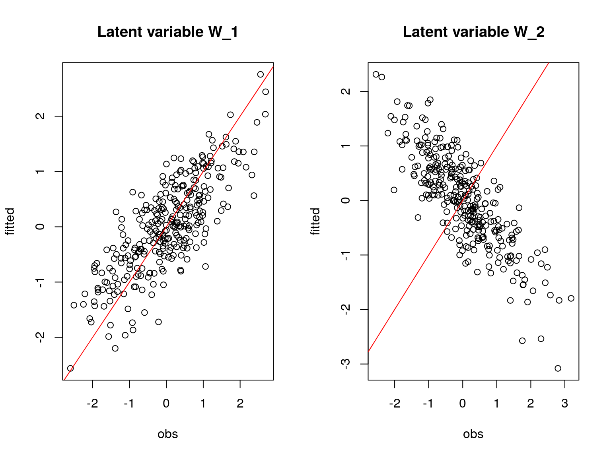
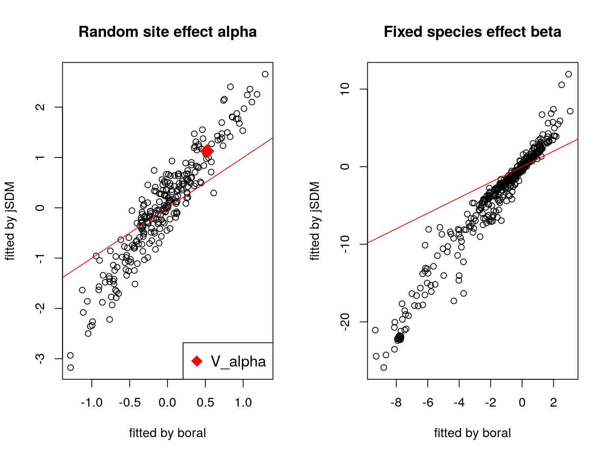

  
```{r setup, include=FALSE}
knitr::opts_chunk$set(
fig.align="center",
fig.width=8, fig.height=6,
cache=FALSE,
collapse=TRUE,
comment="#>",
highlight=TRUE,
eval=FALSE
)
```

# Data-sets

```{r data-sets, echo=FALSE}
#setwd("~/Documents/jSDM/vignettes/")
# Mosquitos dataset
data("mosquitos")
Env_Mosquitos <- mosquitos[,17:29]
mf.suit <- model.frame(formula=~., data=as.data.frame(Env_Mosquitos))
X_Mosquitos <- model.matrix(attr(mf.suit,"terms"), data=mf.suit)
# Eucalypts dataset
data("eucalypts")
Env_Eucalypts <- cbind(scale(eucalypts[,c("Rockiness","VallyBotFlat","PPTann", "cvTemp","T0")]),eucalypts[,c("Sandiness","Loaminess")])
mf.suit <- model.frame(formula=~., data=as.data.frame(Env_Eucalypts))
X_Eucalypts <- model.matrix(attr(mf.suit,"terms"), data=mf.suit)
# Frogs dataset
data("frogs")
Env_Frogs <- cbind(scale(frogs[,"Covariate_1"]),frogs[,"Covariate_2"],scale(frogs[,"Covariate_3"]))
mf.suit <- model.frame(formula=~., data=as.data.frame(Env_Frogs))
X_Frogs <- model.matrix(attr(mf.suit,"terms"), data=mf.suit)
# Fungi dataset
data("fungi")
Env_Fungi <- cbind(scale(fungi[,c("diam","epi","bark")]),fungi[,c("dc1","dc2","dc3","dc4","dc5","quality3","quality4","ground3","ground4")])
mf.suit <- model.frame(formula=~., data=as.data.frame(Env_Fungi))
X_Fungi <- model.matrix(attr(mf.suit,"terms"), data=mf.suit)
# Birds dataset
data("birds")
Env_Birds <- data.frame(cbind(scale(birds[,c("elev","rlength","forest")])))
mf.suit <- model.frame(formula=~., data=as.data.frame(Env_Birds))
X_Birds <- model.matrix(attr(mf.suit,"terms"), data=mf.suit)
# Mites dataset
data("mites")
# Normalized continuous variables
Env_Mites  <- cbind(scale(mites[,c("density","water")]), mites[,c("substrate", "shrubs", "topo")])
mf.suit <- model.frame(formula=~., data=as.data.frame(Env_Mites))
X_Mites <- model.matrix(attr(mf.suit,"terms"), data=mf.suit)

datasets <- data.frame(matrix(NA,8,7),row.names=c("n.site","n.species","n.latent","n.X.coefs", "n.obs", "n.param", "n.mcmc",""))
colnames(datasets) <- c("Simulated","Mosquitos","Eucalypts","Frogs","Fungi","Birds","Mites") 
datasets["n.site",] <- c(300,nrow(frogs),nrow(eucalypts), nrow(frogs), nrow(fungi), nrow(birds), nrow(mites))
datasets["n.X.coefs",] <- c(3,ncol(X_Mosquitos),ncol(X_Eucalypts),ncol(X_Frogs),ncol(X_Fungi),ncol(X_Birds), ncol(X_Mites))
datasets["n.species",] <- c(100,c(ncol(frogs),ncol(eucalypts), ncol(frogs), ncol(fungi), ncol(birds), ncol(mites))-c(ncol(Env_Mosquitos),ncol(Env_Eucalypts),ncol(Env_Frogs),ncol(Env_Fungi),ncol(Env_Birds), ncol(Env_Mites)))
datasets["n.latent",] <- 2
datasets["n.mcmc",] <- 35000
datasets["n.param",] <- datasets["n.site",]*(1+datasets["n.latent",])+1+datasets["n.species",]*(1+datasets["n.X.coefs",]+datasets["n.latent",])-1
datasets["n.obs",] <- datasets["n.site",]*datasets["n.species",] 
sp_pictures <- c("figures/des.jpg",
                 "figures/Mosquitos_.jpg","figures/Eucalyptus_.jpg",
                 "figures/Frogs_.jpg","figures/Fungi_.jpg",
                 "figures/birds.jpg",
                 "figures/oribatid-mites.png")
datasets["",] <- sprintf('{height="100px" width="100px"}',sp_pictures)
knitr::kable(datasets, booktabs=TRUE) %>%
		kableExtra::kable_styling(latex_options=c("HOLD_position","striped"), full_width=FALSE) 
```

```{r datasets-table, echo=FALSE, eval=TRUE, out.width=900}
knitr::include_graphics("figures/datasets.png")
```

# Package boral

## Simulated dataset

300 sites et 100 species with as parameters :

```{r simulated-data, echo=TRUE}

# Toy example : 
nsp <- 100
nsite <- 300
np <- 3
nl <- 2
seed <- 123
set.seed(seed)

# Ecological process (suitability)
x1 <- rnorm(nsite,0,1)
x2 <- rnorm(nsite,0,1)
X <- cbind(rep(1,nsite),x1,x2)
# Simulation of parameters
W <- cbind(rnorm(nsite,0,1),rnorm(nsite,0,1))
data=cbind (X,W)
beta.target <- t(matrix(runif(nsp*np,-2,2), byrow=TRUE, nrow=nsp))
l.zero <- 0
l.diag <- runif(2,0,2)
l.other <- runif(nsp*2-3,-2,2)
lambda.target <- t(matrix(c(l.diag[1],l.zero,l.other[1],l.diag[2],l.other[-1]), byrow=T, nrow=nsp))
param.target <- rbind(beta.target,lambda.target)
param.target=rbind(beta.target,lambda.target)
V_alpha.target=0.5
V=1
alpha.target <- rnorm(nsite,0,sqrt(V_alpha.target))

# Simulation of response data with probit link
probit_theta=X %*% beta.target + W %*% lambda.target + alpha.target
e=matrix(rnorm(nsp*nsite,0,sqrt(V)),nsite,nsp)
Z_true <- probit_theta + e
Y=matrix (NA, nsite,nsp)
for (i in 1:nsite){
  for (j in 1:nsp){
    if ( Z_true[i,j] > 0) {Y[i,j] <- 1}
    else {Y[i,j] <- 0}
  }
}
```

- $\beta_{target}$:

```{r beta, eval=TRUE, echo=FALSE}
library(jSDM)
library(knitr)
library(kableExtra)
load(file="jSDM_boral_cache/boral_simulation.RData")
colnames(beta.target) <- paste(rep("sp",nsp),1:nsp,sep="")
kable(beta.target[,1:15], digits=1)%>%
  kable_styling(bootstrap_options="striped",latex_options=c("HOLD_position","striped"), position="center", full_width=FALSE)
```

- $\lambda_{target}$:

```{r lambda, eval=TRUE,echo=FALSE}
colnames(lambda.target) <- paste(rep("sp",nsp),1:nsp,sep="")
kable(lambda.target[,1:15], digits=1)%>%
  kable_styling(bootstrap_options="striped",latex_options=c("HOLD_position","striped"), position="center", full_width=FALSE)
```

- $V_{\alpha}$: 

```{r V_alpha, eval=TRUE, echo=FALSE}
V_alpha.target
```

```{r boral-simulation}
library(boral)
T1<-Sys.time() 
mod_boral_sim <- boral(y=Y, X=X[,-1], lv.control=list(num.lv=nl), family="binomial", row.eff="random", hypparams=c(100,10,100,30), mcmc.control=list(n.burnin=10000, n.iteration=15000,n.thin=5,seed=123))
T2<-Sys.time() 
T_boral_sim=difftime(T2, T1)

# Predicted probit(theta) 
probit_theta_pred_sim=mod_boral_sim$row.coefs$ID1$mean + X[,-1] %*% t(mod_boral_sim$X.coefs.mean)  + mod_boral_sim$lv.coefs.mean[,"beta0"] + mod_boral_sim$lv.mean%*%t(mod_boral_sim$lv.coefs.mean[,-1])
# RMSE
SE=(probit_theta-probit_theta_pred_sim)^2
RMSE_boral_sim=sqrt(sum(SE/(nsite*nsp)))
# Deviance 
logL=0
for (i in 1:nsite){
  for (j in 1:nsp){
    theta <- pnorm(probit_theta_pred_sim[i,j])
    logL=logL + dbinom(Y[i,j],1,theta,1)  
  }
}
Deviance_boral_sim <- -2*logL

save(np, nl, nsp, nsite, beta.target, lambda.target, alpha.target, 
     V_alpha.target, X, W, probit_theta, Z_true, Y, T_boral_sim,
     mod_boral_sim, probit_theta_pred_sim,
     RMSE_boral_sim, Deviance_boral_sim,
     file="jSDM_boral_cache/boral_simulation.RData")
```

```{r boral-simulation-plot}
load(file="jSDM_boral_cache/boral_simulation.RData")

## Fixed species effect beta
par(mfrow=c(1,2))
plot(t(beta.target),cbind(mod_boral_sim$lv.coefs.mean[,1], mod_boral_sim$X.coefs.mean), xlab="beta target", ylab="means of estimated beta") 
abline(a=0,b=1,col='red')
## factor loadings lambda_j
plot(t(lambda.target),mod_boral_sim$lv.coefs.mean[,-1], xlab="lambda target", ylab="means of estimated lambda") 
abline(a=0,b=1,col='red')
## Latent variable W 
par(mfrow=c(1,2))
for (l in 1:nl) {
  plot(W[,l],mod_boral_sim$lv.mean[,l], main=paste0("Latent variable W_", l), xlab="obs", ylab="fitted")
  abline(a=0,b=1,col='red')
}
## alpha 
par(mfrow=c(1,1))
plot(alpha.target, mod_boral_sim$row.coefs$ID1$mean, xlab="obs", ylab="fitted")
abline(a=0,b=1,col='red')
points(V_alpha.target, mod_boral_sim$row.sigma$ID1["mean"], pch=17, col='blue', cex=1.5)
legend("topleft", legend="V_alpha", pch=17, col='blue')
title("Random site effect alpha and its variance")

## Prediction
# probit_theta_pred 
plot(probit_theta,probit_theta_pred_sim, main="probit(theta)", xlab ="obs", ylab="fitted")
abline(a=0,b=1,col='red')
```


```{r boral-simulation-plot2, echo=FALSE, eval=TRUE, out.width=900}
knitr::include_graphics("jSDM_boral_files/boral-simulation-plot-1.png")
knitr::include_graphics("jSDM_boral_files/boral-simulation-plot-2.png")
knitr::include_graphics("jSDM_boral_files/boral-simulation-plot-3.png")
knitr::include_graphics("jSDM_boral_files/boral-simulation-plot-4.png")
```
## Mosquitos dataset

```{r boral-mosquito, eval=FALSE}
# Import center and reduce Mosquito dataset
data(mosquitos, package="jSDM")
head(mosquitos)
Env_Mosquitos <- mosquitos[,17:29]
Env_Mosquitos <- cbind(scale(Env_Mosquitos[,1:4]), Env_Mosquitos[,5:13])
PA_Mosquitos <- mosquitos[,1:16]

# Fit the model 
T1 <- Sys.time()
mod_boral_Mosquitos <- boral(y=PA_Mosquitos, X=Env_Mosquitos, lv.control=list(num.lv=2), family="binomial", row.eff="random", hypparams=c(100,10,100,30), mcmc.control=list(n.burnin=10000, n.iteration=15000,n.thin=5,seed=123))
T2 <- Sys.time()
T_boral_Mosquitos <- difftime(T2,T1)

# Predicted probit(theta) 
probit_theta_pred_Mosquitos=mod_boral_Mosquitos$row.coefs[[1]]$mean + as.matrix(Env_Mosquitos) %*% t(mod_boral_Mosquitos$X.coefs.mean)  + mod_boral_Mosquitos$lv.coefs.mean[,"beta0"] + mod_boral_Mosquitos$lv.mean%*%t(mod_boral_Mosquitos$lv.coefs.mean[,-1])

# Deviance
logL=0
for (i in 1:nrow(PA_Mosquitos)){
  for (j in 1:ncol(PA_Mosquitos)){
    theta <- pnorm(probit_theta_pred_Mosquitos[i,j])
    logL=logL + dbinom(PA_Mosquitos[i,j],1,theta,1)  
  }
}
Deviance_boral_Mosquitos <- -2*logL

save(T_boral_Mosquitos, mod_boral_Mosquitos,
     probit_theta_pred_Mosquitos, Deviance_boral_Mosquitos,
     file="jSDM_boral_cache/boral_Mosquitos.RData")
```


## Eucalypts dataset

```{r boral-eucalypts, eval=FALSE}
# Import center and reduce Eucalypts dataset
data(eucalypts, package="jSDM")
head(eucalypts)
Env_Eucalypts <- cbind(scale(eucalypts[,c("Rockiness","VallyBotFlat","PPTann", "cvTemp","T0")]),eucalypts[,c("Sandiness","Loaminess")])
PA_Eucalypts <- eucalypts[,1:12]

# Fit the model 
T1 <- Sys.time()
mod_boral_Eucalypts <- boral(y=PA_Eucalypts, X=Env_Eucalypts, lv.control=list(num.lv=2), family="binomial", row.eff="random", hypparams=c(100,10,100,30), mcmc.control=list(n.burnin=10000, n.iteration=15000,n.thin=5,seed=123))
T2 <- Sys.time()
T_boral_Eucalypts <- difftime(T2,T1)

# Predicted probit(theta) 
probit_theta_pred_Eucalypts=mod_boral_Eucalypts$row.coefs[[1]]$mean + as.matrix(Env_Eucalypts) %*% t(mod_boral_Eucalypts$X.coefs.mean)  + mod_boral_Eucalypts$lv.coefs.mean[,"beta0"] + mod_boral_Eucalypts$lv.mean%*%t(mod_boral_Eucalypts$lv.coefs.mean[,-1])

# Deviance
logL=0
for (i in 1:nrow(PA_Eucalypts)){
  for (j in 1:ncol(PA_Eucalypts)){
    theta <- pnorm(probit_theta_pred_Eucalypts[i,j])
    logL=logL + dbinom(PA_Eucalypts[i,j],1,theta,1)  
  }
}
Deviance_boral_Eucalypts <- -2*logL

save(T_boral_Eucalypts, mod_boral_Eucalypts,
     probit_theta_pred_Eucalypts, Deviance_boral_Eucalypts,
     file="jSDM_boral_cache/boral_Eucalypts.RData")
```

## Frogs dataset

```{r boral-frogs, eval=FALSE}
# Import center and reduce Frogs dataset
data(frogs, package="jSDM")
head(frogs)
Env_Frogs <- cbind(scale(frogs[,"Covariate_1"]),frogs[,"Covariate_2"],scale(frogs[,"Covariate_3"]))
colnames(Env_Frogs) <- colnames(frogs[,1:3])
PA_Frogs <- frogs[,4:12]

# Fit the model
T1 <- Sys.time()
mod_boral_Frogs <- boral(y=PA_Frogs, X=Env_Frogs, lv.control=list(num.lv=2), family="binomial", row.eff="random", hypparams=c(100,10,100,30), mcmc.control=list(n.burnin=10000, n.iteration=15000,n.thin=5,seed=123))
T2 <- Sys.time()
T_boral_Frogs <- difftime(T2,T1)

# Predicted probit(theta) 
probit_theta_pred_Frogs=mod_boral_Frogs$row.coefs[[1]]$mean + as.matrix(Env_Frogs) %*% t(mod_boral_Frogs$X.coefs.mean)  + mod_boral_Frogs$lv.coefs.mean[,"beta0"] + mod_boral_Frogs$lv.mean%*%t(mod_boral_Frogs$lv.coefs.mean[,-1])

# Deviance
logL=0
for (i in 1:nrow(PA_Frogs)){
  for (j in 1:ncol(PA_Frogs)){
    theta <- pnorm(probit_theta_pred_Frogs[i,j])
    logL=logL + dbinom(PA_Frogs[i,j],1,theta,1)  
  }
}
Deviance_boral_Frogs <- -2*logL

save(T_boral_Frogs, mod_boral_Frogs,
     probit_theta_pred_Frogs, Deviance_boral_Frogs,
     file="jSDM_boral_cache/boral_Frogs.RData")
```

## Fungi dataset

```{r boral-fungi, eval=FALSE}

# Import center and reduce fungi dataset
data(fungi, package="jSDM")
Env_Fungi <- cbind(scale(fungi[,c("diam","epi","bark")]),fungi[,c("dc1","dc2","dc3","dc4","dc5","quality3","quality4","ground3","ground4")])
colnames(Env_Fungi) <- c("diam","epi","bark","dc1","dc2","dc3","dc4","dc5","quality3","quality4","ground3","ground4")
PA_Fungi <- fungi[,c("antser","antsin","astfer","fompin","hetpar","junlut","phefer","phenig","phevit","poscae","triabi")]

# Fit the model 
T1 <- Sys.time()
mod_boral_Fungi <- boral(y=PA_Fungi, X=Env_Fungi, lv.control=list(num.lv=2), family="binomial", row.eff="random", hypparams=c(100,10,100,30), mcmc.control=list(n.burnin=10000, n.iteration=15000,n.thin=5,seed=123))
T2 <- Sys.time()
T_boral_Fungi <- difftime(T2,T1)

# Predicted probit(theta) 
probit_theta_pred_Fungi=mod_boral_Fungi$row.coefs[[1]]$mean + as.matrix(Env_Fungi) %*% t(mod_boral_Fungi$X.coefs.mean)  + mod_boral_Fungi$lv.coefs.mean[,"beta0"] + mod_boral_Fungi$lv.mean%*%t(mod_boral_Fungi$lv.coefs.mean[,-1])

# Deviance
logL=0
for (i in 1:nrow(PA_Fungi)){
  for (j in 1:ncol(PA_Fungi)){
    theta <- pnorm(probit_theta_pred_Fungi[i,j])
    logL=logL + dbinom(PA_Fungi[i,j],1,theta,1)  
  }
}
Deviance_boral_Fungi <- -2*logL

save(T_boral_Fungi, mod_boral_Fungi,
     probit_theta_pred_Fungi, Deviance_boral_Fungi,
     file="jSDM_boral_cache/boral_Fungi.RData")
```

## Birds dataset

```{r boral-birds, eval=FALSE}
# Import center and reduce birds dataset
data(birds, package="jSDM")
# data.obs
PA_Birds <- birds[,1:158]
# Normalized continuous variables
Env_Birds <- data.frame(cbind(scale(birds[,c("elev","rlength","forest")]), birds[,"nsurvey"]))
colnames(Env_Birds) <- c("elev","rlength","forest","nsurvey")
mf.suit <- model.frame(formula=~elev+rlength+forest-1, data=Env_Birds)
X_Birds <- model.matrix(attr(mf.suit,"terms"), data=mf.suit)

# Fit the model 
T1 <- Sys.time()
# Number of trials by site impossible to specify, trial.size either equal to a single element, or a vector of length equal to the number of columns in y
mod_boral_Birds <- boral(y=PA_Birds, X=X_Birds, lv.control=list(num.lv=2), family="binomial", trial.size=max(Env_Birds$nsurvey), row.eff="random", hypparams=c(100,10,100,30), mcmc.control=list(n.burnin=10000, n.iteration=15000,n.thin=5,seed=123))
T2 <- Sys.time()
T_boral_Birds <- difftime(T2,T1)

# Predicted probit(theta) 
probit_theta_pred_Birds=mod_boral_Birds$row.coefs[[1]]$mean + as.matrix(X_Birds) %*% t(mod_boral_Birds$X.coefs.mean)  + mod_boral_Birds$lv.coefs.mean[,"beta0"] + mod_boral_Birds$lv.mean%*%t(mod_boral_Birds$lv.coefs.mean[,-1])

# Deviance
logL=0
for (i in 1:nrow(PA_Birds)){
  for (j in 1:ncol(PA_Birds)){
    theta <- min(pnorm(probit_theta_pred_Birds[i,j]),0.9999999999999999)
    logL= logL + dbinom(PA_Birds[i,j],3,theta,1)  
  }
}
Deviance_boral_Birds <- -2*logL

save(T_boral_Birds, mod_boral_Birds,
     probit_theta_pred_Birds, Deviance_boral_Birds,
     file="jSDM_boral_cache/boral_Birds.RData")
```

## Mites dataset

```{r boral-mites, eval=FALSE}
# Import center and reduce mites dataset
data(mites, package="jSDM")
# data.obs
PA_Mites <- mites[,1:35]
# Normalized continuous variables
Env_Mites  <- cbind(scale(mites[,c("density","water")]), mites[,c("substrate", "shrubs", "topo")])
mf.suit <- model.frame(formula=~., data=as.data.frame(Env_Mites))
X_Mites <- model.matrix(attr(mf.suit,"terms"), data=mf.suit)
# Fit the model 
T1 <- Sys.time()
mod_boral_Mites <- boral(y=PA_Mites, X=X_Mites[,-1], lv.control=list(num.lv=2), family="poisson", row.eff="random", hypparams=c(100,10,100,30), mcmc.control=list(n.burnin=10000, n.iteration=15000,n.thin=5,seed=123))
T2 <- Sys.time()
T_boral_Mites <- difftime(T2,T1)

# Predicted probit(theta) 
log_theta_pred_Mites=mod_boral_Mites$row.coefs[[1]]$mean + as.matrix(X_Mites[,-1]) %*% t(mod_boral_Mites$X.coefs.mean)  + mod_boral_Mites$lv.coefs.mean[,"beta0"] + mod_boral_Mites$lv.mean%*%t(mod_boral_Mites$lv.coefs.mean[,-1])

# Deviance
logL=0
for (i in 1:nrow(PA_Mites)){
  for (j in 1:ncol(PA_Mites)){
    theta <- exp(log_theta_pred_Mites[i,j])
    logL=logL + dpois(PA_Mites[i,j], theta,1)  
  }
}
Deviance_boral_Mites <- -2*logL

save(T_boral_Mites, mod_boral_Mites,
     log_theta_pred_Mites, Deviance_boral_Mites,
     file="jSDM_boral_cache/boral_Mites.RData")
```


# Package jSDM

## Simulated dataset

```{r jSDM-simulation }
library(jSDM)
# Fit the model
T1<-Sys.time() 
mod_jSDM_sim <- jSDM_binomial_probit_block(
  # Chains
  burnin=10000, mcmc=5000, thin=5,
  # Response variable
  presence_site_sp=Y, 
  # Explanatory variables 
  site_suitability=~x1+x2,   
  site_data=X,
  # Model specification
  n_latent=2, site_effect="random",
  # Starting values
  alpha_start=0, beta_start=0,
  lambda_start=0, W_start=0,
  V_alpha=1, 
  # Priors 
  shape=0.5, rate=0.0005,
  mu_beta=0, V_beta=100 ,
  mu_lambda=0, V_lambda=10,
  # Various 
  seed=1234, verbose=1)
T2<-Sys.time() 
T_jSDM_sim=difftime(T2, T1)

# RMSE
SE=(probit_theta-mod_jSDM_sim$probit_theta_pred)^2
RMSE_jSDM_sim=sqrt(sum(SE/(nsite*nsp)))

save(T_jSDM_sim, mod_jSDM_sim, RMSE_jSDM_sim,
     file="jSDM_boral_cache/jSDM_simulation.RData")
```

```{r jSDM-simulation-plot}
load(file="jSDM_boral_cache/jSDM_simulation.RData")
load(file="jSDM_boral_cache/boral_simulation.RData")
# ===================================================
# Result analysis
# ===================================================

## Fixed species effect beta
np <- ncol(X)
mean_beta <- matrix(0,nsp,np)
par(mfrow=c(ncol(X),2))
for (j in 1:nsp) {
  for (p in 1:ncol(X)) {
    mean_beta[j,p] <-mean(mod_jSDM_sim$mcmc.sp[[paste0("sp_",j)]][j,p])
    if (j < 3){
      coda::traceplot(coda::as.mcmc(mod_jSDM_sim$mcmc.sp[[paste0("sp_",j)]][,p]))
      coda::densplot(coda::as.mcmc(mod_jSDM_sim$mcmc.sp[[paste0("sp_",j)]][,p]), 
                     main=paste(colnames(mod_jSDM_sim$mcmc.sp[[paste0("sp_",j)]])[p],", species : ",j))
      abline(v=beta.target[p,j],col='red')
    }
  }
}

## factor loadings lambda_j
mean_lambda <- matrix(0,nsp,nl)
par(mfrow=c(nl,2))
for (j in 1:nsp) {
  for (l in 1:nl) {
    mean_lambda[j,l] <-mean(mod_jSDM_sim$mcmc.sp[[paste0("sp_",j)]][j,ncol(X)+l])
    
    if (j < 3){
      coda::traceplot(coda::as.mcmc(mod_jSDM_sim$mcmc.sp[[paste0("sp_",j)]][,ncol(X)+l]))
      coda::densplot(coda::as.mcmc(mod_jSDM_sim$mcmc.sp[[paste0("sp_",j)]][,ncol(X)+l]), 
                     main=paste(colnames(mod_jSDM_sim$mcmc.sp[[paste0("sp_",j)]])[ncol(X)+l],", species : ",j))
      abline(v=lambda.target[l,j],col='red')
    }
  }
}
par(mfrow=c(1,2))
plot(t(beta.target),mean_beta, xlab="obs", ylab="fitted", 
     main="Fixed species effect beta")
abline(a=0,b=1,col='red')
plot(t(lambda.target),mean_lambda, xlab="obs", ylab="fitted", 
     main="Loading factors lambda")
abline(a=0,b=1,col='red')

## W latent variables
par(mfrow=c(1,2))
for (l in 1:nl) {
  plot(W[,l],apply(mod_jSDM_sim$mcmc.latent[[paste0("lv_",l)]],2,mean), main=paste0("Latent variable W_", l), xlab="obs", ylab="fitted")
  abline(a=0,b=1,col='red')
}

## V_alpha
par(mfrow=c(1,2))
coda::traceplot(mod_jSDM_sim$mcmc.V_alpha, main="V_alpha")
coda::densplot(mod_jSDM_sim$mcmc.V_alpha, main="V_alpha")
abline(v=V_alpha.target,col='red')

## alpha
par(mfrow=c(1,1))
plot(alpha.target,apply(mod_jSDM_sim$mcmc.alpha,2,mean), xlab= "obs", ylab="fitted", main="Random site effect alpha")
abline(a=0,b=1,col='red')


## Deviance
plot(mod_jSDM_sim$mcmc.Deviance, main="Deviance")

#= Predictions
## probit_theta
par(mfrow=c(1,2))
plot(probit_theta,mod_jSDM_sim$probit_theta_pred, xlab="obs",ylab="fitted", main="probit(theta)")
abline(a=0,b=1,col='red')
## Z
plot(Z_true,mod_jSDM_sim$Z_latent, xlab="obs", ylab="fitted", main="latent variable Z")
abline(a=0,b=1,col='red')
```


```{r jSDM-simulation-plot2, echo=FALSE, eval=TRUE, out.width=900}
knitr::include_graphics("jSDM_boral_files/jSDM-simulation-plot-1.png")
knitr::include_graphics("jSDM_boral_files/jSDM-simulation-plot-2.png")
knitr::include_graphics("jSDM_boral_files/jSDM-simulation-plot-3.png")
knitr::include_graphics("jSDM_boral_files/jSDM-simulation-plot-4.png")
knitr::include_graphics("jSDM_boral_files/jSDM-simulation-plot-5.png")

knitr::include_graphics("jSDM_boral_files/jSDM-simulation-plot-7.png")
knitr::include_graphics("jSDM_boral_files/jSDM-simulation-plot-8.png")
knitr::include_graphics("jSDM_boral_files/jSDM-simulation-plot-9.png")
knitr::include_graphics("jSDM_boral_files/jSDM-simulation-plot-10.png")

```

## Mosquitos dataset

```{r jSDM-mosquitos }
# Fit the model
T1 <- Sys.time()
mod_jSDM_Mosquitos <- jSDM_binomial_probit_block(
  # Chains 
  burnin=10000, mcmc=5000, thin=5,
  # Response variable 
  presence_site_sp=PA_Mosquitos, 
  # Explanatory variables 
  site_suitability=~.,   
  site_data=Env_Mosquitos,
  # Model specification
  site_effect="random", n_latent=2,
  # Starting values 
  alpha_start=0, beta_start=0,
  lambda_start=0, W_start=0,
  V_alpha=1,
  # Priors 
  shape=0.5, rate=0.0005,
  mu_beta=0, V_beta=100 ,
  mu_lambda=0, V_lambda=10,
  # Various 
  seed=1234, verbose=1)
T2 <- Sys.time()
T_jSDM_Mosquitos <- difftime(T2,T1)
save(T_jSDM_Mosquitos, mod_jSDM_Mosquitos,
     file="jSDM_boral_cache/jSDM_Mosquitos.RData")
```

## Eucalypts dataset

```{r jSDM-eucalypts }
# Fit the model
T1 <- Sys.time()
mod_jSDM_Eucalypts <- jSDM_binomial_probit_block(
  # Chains
  burnin=10000, mcmc=5000, thin=5,
  # Response variable 
  presence_site_sp=PA_Eucalypts,
  # Explanatory variables 
  site_suitability=~.,   
  site_data=Env_Eucalypts,
  # Model specification
  n_latent=2, site_effect="random",
  # Starting values 
  alpha_start=0, beta_start=0,
  lambda_start=0, W_start=0,
  V_alpha=1,
  # Priors 
  shape=0.5, rate=0.0005,
  mu_beta=0, V_beta=100 ,
  mu_lambda=0, V_lambda=10,
  # Various 
  seed=1234, verbose=1)
T2 <- Sys.time()
T_jSDM_Eucalypts <- difftime(T2,T1)
save(T_jSDM_Eucalypts, mod_jSDM_Eucalypts,
     file="jSDM_boral_cache/jSDM_Eucalypts.RData")
```

## Frogs dataset

```{r jSDM-frogs }
# Fit the model 
T1 <- Sys.time()
mod_jSDM_Frogs <- jSDM_binomial_probit_block(
  # Chains
  burnin=10000, mcmc=5000, thin=5,
  # Response variable 
  presence_site_sp=as.matrix(PA_Frogs), 
  # Explanatory variables 
  site_suitability=~.,   
  site_data=as.data.frame(Env_Frogs),
  # Model specification 
  n_latent=2, site_effect="random",
  # Starting values 
  alpha_start=0, beta_start=0,
  lambda_start=0, W_start=0,
  V_alpha=1,
  # Priors 
  shape=0.5, rate=0.0005,
  mu_beta=0, V_beta=100,
  mu_lambda=0, V_lambda=10,
  # Various 
  seed=1234, verbose=1)
T2 <- Sys.time()
T_jSDM_Frogs <- difftime(T2,T1)
save(T_jSDM_Frogs, mod_jSDM_Frogs,
     file="jSDM_boral_cache/jSDM_Frogs.RData")
```

## Fungi dataset

```{r jSDM-fungi }
# Fit the model
T1 <- Sys.time()
mod_jSDM_Fungi <- jSDM_binomial_probit_block(
  # Chains 
  burnin=10000, mcmc=5000, thin=5,
  # Response variable 
  presence_site_sp=PA_Fungi, 
  # Explanatory variables 
  site_suitability=~.,   
  site_data=Env_Fungi,
  # Model specification
  n_latent=2, site_effect="random",
  # Starting values 
  alpha_start=0, beta_start=0,
  lambda_start=0, W_start=0,
  V_alpha=1,
  # Priors 
  shape=0.5, rate=0.0005,
  mu_beta=0, V_beta=100 ,
  mu_lambda=0, V_lambda=10,
  # Various 
  seed=1234, verbose=1)
T2 <- Sys.time()
T_jSDM_Fungi <- difftime(T2,T1)
save(T_jSDM_Fungi, mod_jSDM_Fungi,
     file="jSDM_boral_cache/jSDM_Fungi.RData")
```

## Birds dataset

```{r jSDM-birds }
# Fit the model
T1 <- Sys.time()
mod_jSDM_Birds <- jSDM_binomial_logit(
  # Chains 
  burnin=10000, mcmc=5000, thin=5,
  # Response variable 
  presence_site_sp=PA_Birds, 
  # Explanatory variables 
  site_suitability=~elev+rlength+forest,   
  site_data=Env_Birds,
  trials= Env_Birds$nsurvey, 
  # Model specification
  n_latent=2, site_effect="random",
  # Starting values 
  alpha_start=0, beta_start=0,
  lambda_start=0, W_start=0,
  V_alpha=1,
  # Priors 
  shape=0.5, rate=0.0005,
  mu_beta=0, V_beta=100 ,
  mu_lambda=0, V_lambda=10,
  # Various 
  ropt=0.44,
  seed=1234, verbose=1)
T2 <- Sys.time()
T_jSDM_Birds <- difftime(T2,T1)
save(T_jSDM_Birds, mod_jSDM_Birds,
     file="jSDM_boral_cache/jSDM_Birds.RData")
```


## Mites dataset

```{r jSDM-mites }
# Fit the model
T1 <- Sys.time()
mod_jSDM_Mites <- jSDM_poisson_log(
  # Chains 
  burnin=10000, mcmc=5000, thin=5,
  # Response variable 
  presence_site_sp=PA_Mites, 
  # Explanatory variables 
  site_suitability=~.,   
  site_data=Env_Mites,
  # Model specification
  n_latent=2, site_effect="random",
  # Starting values 
  alpha_start=0, beta_start=0,
  lambda_start=0, W_start=0,
  V_alpha=1,
  # Priors 
  shape=0.5, rate=0.0005,
  mu_beta=0, V_beta=100 ,
  mu_lambda=0, V_lambda=10,
  # Various 
  ropt=0.44,
  seed=1234, verbose=1)
T2 <- Sys.time()
T_jSDM_Mites <- difftime(T2,T1)
save(T_jSDM_Mites, mod_jSDM_Mites,
     file="jSDM_boral_cache/jSDM_Mites.RData")
```

# Comparison

```{r load-fitted-models, echo=FALSE, include=FALSE}
library(jSDM)
library(boral)
# Simulated dataset
load(file="jSDM_boral_cache/boral_simulation.RData")
load(file="jSDM_boral_cache/jSDM_simulation.RData")
# Mosquitos dataset
load(file="jSDM_boral_cache/boral_Mosquitos.RData")
load(file="jSDM_boral_cache/jSDM_Mosquitos.RData")
# Eucalypts dataset
load(file="jSDM_boral_cache/boral_Eucalypts.RData")
load(file="jSDM_boral_cache/jSDM_Eucalypts.RData")
# Frogs dataset 
load(file="jSDM_boral_cache/boral_Frogs.RData")
load(file="jSDM_boral_cache/jSDM_Frogs.RData")
# Fungi dataset 
load(file="jSDM_boral_cache/boral_Fungi.RData")
load(file="jSDM_boral_cache/jSDM_Fungi.RData")
# Birds dataset
load(file="jSDM_boral_cache/boral_Birds.RData")
load(file="jSDM_boral_cache/jSDM_Birds.RData")
# Mites dataset
load(file="jSDM_boral_cache/boral_Mites.RData")
load(file="jSDM_boral_cache/jSDM_Mites.RData")
Deviance_jSDM_sim<- mean(mod_jSDM_sim$mcmc.Deviance)
Deviance_jSDM_Mosquitos <- mean(mod_jSDM_Mosquitos$mcmc.Deviance)
Deviance_jSDM_Eucalypts <- mean(mod_jSDM_Eucalypts$mcmc.Deviance)
Deviance_jSDM_Frogs <- mean(mod_jSDM_Frogs$mcmc.Deviance)
Deviance_jSDM_Fungi <- mean(mod_jSDM_Fungi$mcmc.Deviance)
Deviance_jSDM_Birds <- mean(mod_jSDM_Birds$mcmc.Deviance)
Deviance_jSDM_Mites <- mean(mod_jSDM_Mites$mcmc.Deviance)
save(T_jSDM_sim, Deviance_jSDM_sim, RMSE_jSDM_sim, RMSE_boral_sim, T_boral_sim, Deviance_boral_sim, T_jSDM_Mosquitos, Deviance_jSDM_Mosquitos ,T_jSDM_Eucalypts, Deviance_jSDM_Eucalypts, T_jSDM_Frogs, Deviance_jSDM_Frogs,T_jSDM_Fungi, Deviance_jSDM_Fungi, T_jSDM_Birds, Deviance_jSDM_Birds, T_jSDM_Mites, Deviance_jSDM_Mites, T_boral_Mosquitos, Deviance_boral_Mosquitos, T_boral_Eucalypts, Deviance_boral_Eucalypts, T_boral_Frogs, Deviance_boral_Frogs, T_boral_Fungi, Deviance_boral_Fungi, T_boral_Birds, Deviance_boral_Birds, T_boral_Mites, Deviance_boral_Mites,
file="jSDM_boral_cache/jSDM-boral-comparison.rda")
save(RMSE_jSDM_sim, RMSE_boral_sim, file="jSDM_boral_files/RMSE.rda")
```

## Compilation time and deviance 

```{r time, echo=FALSE}
result <- data.frame(matrix(NA,5,7),row.names=c("Compilation time boral (secondes)","Compilation time jSDM (secondes)", "Deviance boral", "Deviance jSDM",""))
colnames(result) <- c("Simulated","Mosquitos","Eucalypts","Frogs","Fungi","Birds","Mites") 
result[1,]=c(T_boral_sim, T_boral_Mosquitos, T_boral_Eucalypts, T_boral_Frogs, T_boral_Fungi,
             T_boral_Birds, T_boral_Mites)
result[2,]=c(T_jSDM_sim, T_jSDM_Mosquitos, T_jSDM_Eucalypts, T_jSDM_Frogs,T_jSDM_Fungi,
             T_jSDM_Birds, T_jSDM_Mites)
result[3,] <- c(Deviance_boral_sim, Deviance_boral_Mosquitos, Deviance_boral_Eucalypts, 
                Deviance_boral_Frogs, Deviance_boral_Fungi,
                Deviance_boral_Birds, Deviance_boral_Mites)
result[4,] <- c(Deviance_jSDM_sim,Deviance_jSDM_Mosquitos, 
                Deviance_jSDM_Eucalypts,Deviance_jSDM_Frogs, 
                Deviance_jSDM_Fungi, Deviance_jSDM_Birds,
                Deviance_jSDM_Mites)
min_ratio <- round(min(as.numeric(result[1,]/result[2,])))
max_ratio <- round(max(as.numeric(result[1,]/result[2,])))
result <- apply(result,c(1,2),round, 0)
sp_pictures <- c("figures/des.jpg",
                 "figures/Mosquitos_.jpg","figures/Eucalyptus_.jpg",
                 "figures/Frogs_.jpg","figures/Fungi_.jpg",
                 "figures/birds.jpg",
                 "figures/oribatid-mites.png")
result[5,] <- sprintf('{height="100px" width="100px"}',sp_pictures)
kable(result)%>%
  kable_styling(bootstrap_options="striped",latex_options=c("HOLD_position","striped"), position="center", full_width=FALSE)
```

```{r time-deviance-table, echo=FALSE, eval=TRUE, out.width=900}
knitr::include_graphics("figures/time-deviance.png")
```

jSDM is 3 to 210 times faster than boral/jags.

## Root-Mean-Square Error (RMSE) for simulated data
Computed for $\text{probit}(\theta_{ij})$ with the simulated data-set.
```{r RMSE, eval=TRUE, echo=FALSE}
#setwd("~/Documents/jSDM/vignettes/")
load(file="jSDM_boral_files/RMSE.rda")
result <- data.frame(matrix(NA,1,2),row.names=  c("RMSE"))
colnames(result) <- c("boral","jSDM")
result$boral <- RMSE_boral_sim
result$jSDM <- RMSE_jSDM_sim
kable(result, digits =1) %>%
  kable_styling(bootstrap_options = "striped", full_width = F, position="left")
```

## Estimated  Parameters

### Simulated dataset

300 sites 100 species.

```{r jSDM-boral-simulation, echo=FALSE}
np <- ncol(X)
# Alpha et V_alpha
par(mfrow=c(1,2))
plot(mod_boral_sim$row.coefs$ID1$mean,apply(mod_jSDM_sim$mcmc.alpha,2,mean), xlab="fitted by boral", ylab="fitted by jSDM", main="Random site effect alpha")
abline(a=0,b=1,col='red')
points(mod_boral_sim$row.sigma$ID1["mean"],apply(mod_jSDM_sim$mcmc.V_alpha,2,mean),
       pch=18, col ='red',cex=2.5)
legend("bottomright", legend=c("V_alpha"), pch =18 , col ='red',pt.cex =2, cex=1.2)
# species fixed effect beta
jSDM_beta <- matrix(0,nsp,np)
for (j in 1:nsp){
  for (p in 1:np){
    jSDM_beta[j,p] <- mean(mod_jSDM_sim$mcmc.sp[[paste0("sp_",j)]][,p])
  }
}
boral_beta <- cbind(mod_boral_sim$lv.coefs.mean[,"beta0"],mod_boral_sim$X.coefs.mean)

plot(boral_beta,jSDM_beta, xlab="fitted by boral", ylab="fitted by jSDM", main="Species fixed effect beta")
abline(a=0,b=1,col='red')

# factor loadings lambda
jSDM_lambda <- matrix(0,nsp,nl)
for (j in 1:nsp){
  for (l in 1:nl){
    jSDM_lambda[j,l] <- mean(mod_jSDM_sim$mcmc.sp[[paste0("sp_",j)]][,np+l])
  }
}
boral_lambda <- mod_boral_sim$lv.coefs.mean[,-1]

plot(boral_lambda,jSDM_lambda, xlab="fitted by boral", ylab="fitted by jSDM", main="Loading factors lambda")
abline(a=0,b=1,col='red')

# Ws
jSDM_lvs <- matrix(0,nsite,nl)
for (l in 1:nl){
  jSDM_lvs[,l] <- colMeans(mod_jSDM_sim$mcmc.latent[[paste0("lv_",l)]])
}
plot(mod_boral_sim$lv.mean, jSDM_lvs, xlab="fitted by boral", ylab="fitted by jSDM", main="Latent variables W")
abline(a=0,b=1,col='red')

# Predictions 
par(mfrow=c(1,1))
plot(probit_theta_pred_sim, mod_jSDM_sim$probit_theta_pred, xlab="fitted by boral", ylab="fitted by jSDM", main="Predicted probit(theta)")
abline(a=0,b=1,col='red')
```

```{r jSDM-boral-simulation-plot, echo=FALSE, eval=TRUE, out.width=900}
knitr::include_graphics("jSDM_boral_files/jSDM-boral-simulation-1.png")
knitr::include_graphics("jSDM_boral_files/jSDM-boral-simulation-2.png")
knitr::include_graphics("jSDM_boral_files/jSDM-boral-simulation-3.png")
```

### Mosquitos dataset

```{r jSDM-boral-mosquitos, echo=FALSE}
# Import center and reduce Mosquito dataset
data(mosquitos, package="jSDM")
PA_Mosquitos <- mosquitos[,1:16]

print(paste(nrow(PA_Mosquitos),"sites and ",ncol(PA_Mosquitos)," species"),quote = FALSE)
nsp <- ncol(mod_jSDM_Mosquitos$model_spec$presences)
nsite <- nrow(mod_jSDM_Mosquitos$model_spec$presences)
nl <- mod_jSDM_Mosquitos$model_spec$n_latent
np <- nrow(mod_jSDM_Mosquitos$model_spec$beta_start)
# Alpha et V_alpha
par(mfrow=c(1,2))
plot(mod_boral_Mosquitos$row.coefs[[1]]$mean,apply(mod_jSDM_Mosquitos$mcmc.alpha,2,mean), xlab="fitted by boral", ylab="fitted by jSDM", main="Random site effect alpha")
abline(a=0,b=1,col='red')
points(mod_boral_Mosquitos$row.sigma$ID1["mean"],apply(mod_jSDM_Mosquitos$mcmc.V_alpha,2,mean), pch=18, col ='red',cex=2.5)
legend("bottomright", legend=c("V_alpha"), pch =18 , col ='red',pt.cex =2, cex=1.2)

# species fixed effect beta
jSDM_beta <- matrix(0,nsp,np)
for (j in 1:nsp){
  jSDM_beta[j,] <- apply(mod_jSDM_Mosquitos$mcmc.sp[[paste0("sp_",j)]],2,mean)[1:np]
}
boral_beta <- cbind(mod_boral_Mosquitos$lv.coefs.mean[,"beta0"],mod_boral_Mosquitos$X.coefs.mean)

plot(boral_beta,jSDM_beta, xlab="fitted by boral", ylab="fitted by jSDM", main="Fixed species effect beta")
abline(a=0,b=1,col='red')

# factor loadings lambda
jSDM_lambda <- matrix(0,nsp,nl)
for (j in 1:nsp){
  jSDM_lambda[j,] <- apply(mod_jSDM_Mosquitos$mcmc.sp[[paste0("sp_",j)]],2,mean)[(np+1):(np+nl)]
}
boral_lambda <- mod_boral_Mosquitos$lv.coefs.mean[,-1]

plot(boral_lambda,jSDM_lambda, xlab="fitted by boral", ylab="fitted by jSDM", main="Fixed species effect lambda")
abline(a=0,b=1,col='red')

# Ws
jSDM_lvs <- matrix(0,nsite,nl)
for (l in 1:nl){
  jSDM_lvs[,l] <- apply(mod_jSDM_Mosquitos$mcmc.latent[[paste0("lv_",l)]],2,mean)
}
plot(mod_boral_Mosquitos$lv.mean, jSDM_lvs, xlab="fitted by boral", ylab="fitted by jSDM", main="Latent variables W")
abline(a=0,b=1,col='red')
# Predictions 
par(mfrow=c(1,1))
plot(probit_theta_pred_Mosquitos, mod_jSDM_Mosquitos$probit_theta_pred, xlab="fitted by boral", ylab="fitted by jSDM", main="Predicted probit(theta)")
abline(a=0,b=1,col='red')
```


```{r jSDM-boral-mosquitos-plot, echo=FALSE, eval=TRUE, out.width=900}
knitr::include_graphics("jSDM_boral_files/jSDM-boral-mosquitos-1.png")
knitr::include_graphics("jSDM_boral_files/jSDM-boral-mosquitos-2.png")
knitr::include_graphics("jSDM_boral_files/jSDM-boral-mosquitos-3.png")
```

### Eucalypts dataset

```{r jSDM-boral-Eucalypts, echo=FALSE}
# Import center and reduce Eucalypts dataset
data(eucalypts, package="jSDM")
PA_Eucalypts <- eucalypts[,1:12]
print(paste(nrow(PA_Eucalypts),"sites and ",ncol(PA_Eucalypts)," species"),quote = FALSE)
nsp <- ncol(mod_jSDM_Eucalypts$model_spec$presences)
nsite <- nrow(mod_jSDM_Eucalypts$model_spec$presences)
nl <- mod_jSDM_Eucalypts$model_spec$n_latent
np <- nrow(mod_jSDM_Eucalypts$model_spec$beta_start)
# Alpha et V_alpha
par(mfrow=(c(1,2)))
plot(mod_boral_Eucalypts$row.coefs$ID1$mean,apply(mod_jSDM_Eucalypts$mcmc.alpha,2,mean), xlab="fitted by boral", ylab="fitted by jSDM", main="Random site effect alpha")
abline(a=0,b=1,col='red')
points(mod_boral_Eucalypts$row.sigma$ID1["mean"],apply(mod_jSDM_Eucalypts$mcmc.V_alpha,2,mean),
       pch=18, col ='red',cex=2.5)
legend("bottomright", legend=c("V_alpha"), pch =18 , col ='red',pt.cex =2, cex=1.2)

# species fixed effect beta
jSDM_beta <- matrix(0,nsp,np)
for (j in 1:nsp){
  jSDM_beta[j,] <- apply(mod_jSDM_Eucalypts$mcmc.sp[[paste0("sp_",j)]],2,mean)[1:np]
}
boral_beta <- cbind(mod_boral_Eucalypts$lv.coefs.mean[,"beta0"],mod_boral_Eucalypts$X.coefs.mean)

plot(boral_beta,jSDM_beta, xlab="fitted by boral", ylab="fitted by jSDM", main="Fixed species effect beta")
abline(a=0,b=1,col='red')

# factor loadings lambda
jSDM_lambda <- matrix(0,nsp,nl)
for (j in 1:nsp){
  jSDM_lambda[j,] <- apply(mod_jSDM_Eucalypts$mcmc.sp[[paste0("sp_",j)]],2,mean)[(np+1):(np+nl)]
}
boral_lambda <- mod_boral_Eucalypts$lv.coefs.mean[,-1]

plot(boral_lambda,jSDM_lambda, xlab="fitted by boral", ylab="fitted by jSDM", main="Fixed species effect lambda")
abline(a=0,b=1,col='red')

# Ws
jSDM_lvs <- matrix(0,nsite,nl)
for (l in 1:nl){
  jSDM_lvs[,l] <- apply(mod_jSDM_Eucalypts$mcmc.latent[[paste0("lv_",l)]],2,mean)
}
plot(mod_boral_Eucalypts$lv.mean, jSDM_lvs, xlab="fitted by boral", ylab="fitted by jSDM", main="Latent variables W")
abline(a=0,b=1,col='red')

# Predictions 
par(mfrow=c(1,1))
plot(probit_theta_pred_Eucalypts, mod_jSDM_Eucalypts$probit_theta_pred, xlab="fitted by boral", ylab="fitted by jSDM", main="Predicted probit(theta)")
abline(a=0,b=1,col='red')
```

```{r jSDM-boral-Eucalypts-plot, echo=FALSE, eval=TRUE, out.width=900}
knitr::include_graphics("jSDM_boral_files/jSDM-boral-Eucalypts-1.png")
knitr::include_graphics("jSDM_boral_files/jSDM-boral-Eucalypts-2.png")
knitr::include_graphics("jSDM_boral_files/jSDM-boral-Eucalypts-3.png")
```

### Frogs dataset

```{r jSDM-boral-frogs,echo=FALSE}
# Import center and reduce Frogs dataset
data(frogs, package="jSDM")
PA_Frogs <- frogs[,4:12]

print(paste(nrow(PA_Frogs),"sites and ",ncol(PA_Frogs)," species"),quote = FALSE)
nsp <- ncol(mod_jSDM_Frogs$model_spec$presences)
nsite <- nrow(mod_jSDM_Frogs$model_spec$presences)
nl <- mod_jSDM_Frogs$model_spec$n_latent
np <- nrow(mod_jSDM_Frogs$model_spec$beta_start)
# Alpha et V_alpha
par(mfrow=c(1,2))
plot(mod_boral_Frogs$row.coefs[[1]]$mean,apply(mod_jSDM_Frogs$mcmc.alpha,2,mean), xlab="fitted by boral", ylab="fitted by jSDM", main="Random site effect alpha")
abline(a=0,b=1,col='red')
points(mod_boral_Frogs$row.sigma$ID1["mean"],apply(mod_jSDM_Frogs$mcmc.V_alpha,2,mean),
       pch=18, col ='red',cex=2.5)
legend("bottomright", legend=c("V_alpha"), pch =18 , col ='red',pt.cex =2, cex=1.2)

# species fixed effect beta
jSDM_beta <- matrix(0,nsp,np)
for (j in 1:nsp){
  jSDM_beta[j,] <- apply(mod_jSDM_Frogs$mcmc.sp[[paste0("sp_",j)]],2,mean)[1:np]
}
boral_beta <- cbind(mod_boral_Frogs$lv.coefs.mean[,"beta0"],mod_boral_Frogs$X.coefs.mean)

plot(boral_beta,jSDM_beta, xlab="fitted by boral", ylab="fitted by jSDM", main="Fixed species effect beta")
abline(a=0,b=1,col='red')

# factor loadings lambda
jSDM_lambda <- matrix(0,nsp,nl)
for (j in 1:nsp){
  jSDM_lambda[j,] <- apply(mod_jSDM_Frogs$mcmc.sp[[paste0("sp_",j)]],2,mean)[(np+1):(np+nl)]
}
boral_lambda <- mod_boral_Frogs$lv.coefs.mean[,-1]

plot(boral_lambda,jSDM_lambda, xlab="fitted by boral", ylab="fitted by jSDM", main="Fixed species effect lambda")
abline(a=0,b=1,col='red')

# Ws
jSDM_lvs <- matrix(0,nsite,nl)
for (l in 1:nl){
  jSDM_lvs[,l] <- apply(mod_jSDM_Frogs$mcmc.latent[[paste0("lv_",l)]],2,mean)
}
plot(mod_boral_Frogs$lv.mean, jSDM_lvs, xlab="fitted by boral", ylab="fitted by jSDM", main="Latent variables W")
abline(a=0,b=1,col='red')

# Predictions 
par(mfrow=c(1,1))
plot(probit_theta_pred_Frogs, mod_jSDM_Frogs$probit_theta_pred, xlab="fitted by boral", ylab="fitted by jSDM", main="Predicted probit(theta)")
abline(a=0,b=1,col='red')
```

```{r jSDM-boral-frogs-plot, echo=FALSE, eval=TRUE, out.width=900}
knitr::include_graphics("jSDM_boral_files/jSDM-boral-frogs-1.png")
knitr::include_graphics("jSDM_boral_files/jSDM-boral-frogs-2.png")
knitr::include_graphics("jSDM_boral_files/jSDM-boral-frogs-3.png")
```

### Fungi dataset

```{r jSDM-boral-fungi, echo=FALSE}
# Import center and reduce fungi dataset
data(fungi, package="jSDM")
PA_Fungi <- fungi[,c("antser","antsin","astfer","fompin","hetpar","junlut","phefer","phenig","phevit","poscae","triabi")]

print(paste(nrow(PA_Fungi),"sites and ",ncol(PA_Fungi)," species"),quote = FALSE)
nsp <- ncol(mod_jSDM_Fungi$model_spec$presences)
nsite <- nrow(mod_jSDM_Fungi$model_spec$presences)
nl <- mod_jSDM_Fungi$model_spec$n_latent
np <- nrow(mod_jSDM_Fungi$model_spec$beta_start)
# Alpha et V_alpha
par(mfrow=c(1,2))
plot(mod_boral_Fungi$row.coefs[[1]]$mean,apply(mod_jSDM_Fungi$mcmc.alpha,2,mean), xlab="fitted by boral", ylab="fitted by jSDM", main="Random site effect alpha")
abline(a=0,b=1,col='red')
points(mod_boral_Fungi$row.sigma$ID1["mean"],apply(mod_jSDM_Fungi$mcmc.V_alpha,2,mean),
       pch=18, col ='red',cex=2.5)
legend("bottomright", legend=c("V_alpha"), pch =18 , col ='red',pt.cex =2, cex=1.2)

# species fixed effect beta
jSDM_beta <- matrix(0,nsp,np)
for (j in 1:nsp){
  jSDM_beta[j,] <- apply(mod_jSDM_Fungi$mcmc.sp[[paste0("sp_",j)]],2,mean)[1:np]
}
boral_beta <- cbind(mod_boral_Fungi$lv.coefs.mean[,"beta0"],mod_boral_Fungi$X.coefs.mean)

plot(boral_beta,jSDM_beta, xlab="fitted by boral", ylab="fitted by jSDM", main="Fixed species effect beta")
abline(a=0,b=1,col='red')

# factor loadings lambda
jSDM_lambda <- matrix(0,nsp,nl)
for (j in 1:nsp){
  jSDM_lambda[j,] <- apply(mod_jSDM_Fungi$mcmc.sp[[paste0("sp_",j)]],2,mean)[(np+1):(np+nl)]
}
boral_lambda <- mod_boral_Fungi$lv.coefs.mean[,-1]

plot(boral_lambda,jSDM_lambda, xlab="fitted by boral", ylab="fitted by jSDM", main="Fixed species effect lambda")
abline(a=0,b=1,col='red')

# Ws
jSDM_lvs <- matrix(0,nsite,nl)
for (l in 1:nl){
  jSDM_lvs[,l] <- apply(mod_jSDM_Fungi$mcmc.latent[[paste0("lv_",l)]],2,mean)
}
plot(mod_boral_Fungi$lv.mean, jSDM_lvs, xlab="fitted by boral", ylab="fitted by jSDM", main="Latent variables W")
abline(a=0,b=1,col='red')
# Predictions 
par(mfrow=c(1,1))
plot(probit_theta_pred_Fungi, mod_jSDM_Fungi$probit_theta_pred, xlab="fitted by boral", ylab="fitted by jSDM", main="Predicted probit(theta)")
abline(a=0,b=1,col='red')
```


```{r jSDM-boral-fungi-plot, echo=FALSE, eval=TRUE, out.width=900}
knitr::include_graphics("jSDM_boral_files/jSDM-boral-fungi-1.png")
knitr::include_graphics("jSDM_boral_files/jSDM-boral-fungi-2.png")
knitr::include_graphics("jSDM_boral_files/jSDM-boral-fungi-3.png")
```

### Birds dataset

```{r jSDM-boral-birds, echo=FALSE}
# Import center and reduce birds dataset
data(birds, package="jSDM")
# data.obs
PA_Birds <- birds[,1:158]

print(paste(nrow(PA_Birds),"sites and ",ncol(PA_Birds)," species"),quote = FALSE)
nsp <- ncol(mod_jSDM_Birds$model_spec$presences)
nsite <- nrow(mod_jSDM_Birds$model_spec$presences)
nl <- mod_jSDM_Birds$model_spec$n_latent
np <- nrow(mod_jSDM_Birds$model_spec$beta_start)
# Alpha et V_alpha
par(mfrow=c(1,2))
plot(mod_boral_Birds$row.coefs[[1]]$mean,apply(mod_jSDM_Birds$mcmc.alpha,2,mean), xlab="fitted by boral", ylab="fitted by jSDM", main="Random site effect alpha")
abline(a=0,b=1,col='red')
points(mod_boral_Birds$row.sigma$ID1["mean"],apply(mod_jSDM_Birds$mcmc.V_alpha,2,mean),
       pch=18, col ='red',cex=2.5)
legend("bottomright", legend=c("V_alpha"), pch =18 , col ='red',pt.cex =2, cex=1.2)

# species fixed effect beta
jSDM_beta <- matrix(0,nsp,np)
for (j in 1:nsp){
  jSDM_beta[j,] <- apply(mod_jSDM_Birds$mcmc.sp[[paste0("sp_",j)]],2,mean)[1:np]
}
boral_beta <- cbind(mod_boral_Birds$lv.coefs.mean[,"beta0"],mod_boral_Birds$X.coefs.mean)

plot(boral_beta,jSDM_beta, xlab="fitted by boral", ylab="fitted by jSDM", main="Fixed species effect beta")
abline(a=0,b=1,col='red')

# factor loadings lambda
jSDM_lambda <- matrix(0,nsp,nl)
for (j in 1:nsp){
  jSDM_lambda[j,] <- apply(mod_jSDM_Birds$mcmc.sp[[paste0("sp_",j)]],2,mean)[(np+1):(np+nl)]
}
boral_lambda <- mod_boral_Birds$lv.coefs.mean[,-1]

plot(boral_lambda,jSDM_lambda, xlab="fitted by boral", ylab="fitted by jSDM", main="Fixed species effect lambda")
abline(a=0,b=1,col='red')

# Ws
jSDM_lvs <- matrix(0,nsite,nl)
for (l in 1:nl){
  jSDM_lvs[,l] <- apply(mod_jSDM_Birds$mcmc.latent[[paste0("lv_",l)]],2,mean)
}
plot(mod_boral_Birds$lv.mean, jSDM_lvs, xlab="fitted by boral", ylab="fitted by jSDM", main="Latent variables W")
abline(a=0,b=1,col='red')
# Predictions 
par(mfrow=c(1,1))
plot(logit(pnorm(probit_theta_pred_Birds)), logit(mod_jSDM_Birds$theta_latent), xlab="fitted by boral", ylab="fitted by jSDM", main="logit(theta)")
abline(a=0,b=1,col='red')
```


```{r jSDM-boral-birds-plot, echo=FALSE, eval=TRUE, out.width=900}

knitr::include_graphics("jSDM_boral_files/jSDM-boral-birds-2.png")
knitr::include_graphics("jSDM_boral_files/jSDM-boral-birds-3.png")
```

### Mites dataset

```{r jSDM-boral-mites, echo=FALSE}
# Import center and reduce mites dataset
data(mites, package="jSDM")
# data.obs
PA_Mites <- mites[,1:35]
  
print(paste(nrow(PA_Mites),"sites and ",ncol(PA_Mites)," species"),quote = FALSE)
nsp <- ncol(mod_jSDM_Mites$model_spec$presences)
nsite <- nrow(mod_jSDM_Mites$model_spec$presences)
nl <- mod_jSDM_Mites$model_spec$n_latent
np <- nrow(mod_jSDM_Mites$model_spec$beta_start)
# Alpha et V_alpha
par(mfrow=c(1,2))
plot(mod_boral_Mites$row.coefs$ID1$mean,apply(mod_jSDM_Mites$mcmc.alpha,2,mean), xlab="fitted by boral", ylab="fitted by jSDM", main="Random site effect alpha")
abline(a=0,b=1,col='red')
points(mod_boral_Mites$row.sigma$ID1["mean"],apply(mod_jSDM_Mites$mcmc.V_alpha,2,mean),
       pch=18, col ='red',cex=2.5)
legend("bottomright", legend=c("V_alpha"), pch =18 , col ='red',pt.cex =2, cex=1.2)

# species fixed effect beta
jSDM_beta <- matrix(0,nsp,np)
for (j in 1:nsp){
  jSDM_beta[j,] <- apply(mod_jSDM_Mites$mcmc.sp[[paste0("sp_",j)]],2,mean)[1:np]
}
boral_beta <- cbind(mod_boral_Mites$lv.coefs.mean[,"beta0"],mod_boral_Mites$X.coefs.mean)

plot(boral_beta,jSDM_beta, xlab="fitted by boral", ylab="fitted by jSDM", main="Fixed species effect beta")
abline(a=0,b=1,col='red')

# factor loadings lambda
jSDM_lambda <- matrix(0,nsp,nl)
for (j in 1:nsp){
  jSDM_lambda[j,] <- apply(mod_jSDM_Mites$mcmc.sp[[paste0("sp_",j)]],2,mean)[(np+1):(np+nl)]
}
boral_lambda <- mod_boral_Mites$lv.coefs.mean[,-1]

plot(boral_lambda,jSDM_lambda, xlab="fitted by boral", ylab="fitted by jSDM", main="Fixed species effect lambda")
abline(a=0,b=1,col='red')

# Ws
jSDM_lvs <- matrix(0,nsite,nl)
for (l in 1:nl){
  jSDM_lvs[,l] <- apply(mod_jSDM_Mites$mcmc.latent[[paste0("lv_",l)]],2,mean)
}
plot(mod_boral_Mites$lv.mean, jSDM_lvs, xlab="fitted by boral", ylab="fitted by jSDM", main="Latent variables W")
abline(a=0,b=1,col='red')
# Predictions 
par(mfrow=c(1,1))
plot(log_theta_pred_Mites, log(mod_jSDM_Mites$theta_latent), xlab="fitted by boral", ylab="fitted by jSDM", main="log(theta)")
abline(a=0,b=1,col='red')
```


```{r jSDM-boral-mites-plot, echo=FALSE, eval=TRUE, out.width=900}
knitr::include_graphics("jSDM_boral_files/jSDM-boral-mites-1.png")
knitr::include_graphics("jSDM_boral_files/jSDM-boral-mites-2.png")
knitr::include_graphics("jSDM_boral_files/jSDM-boral-mites-3.png")
```

