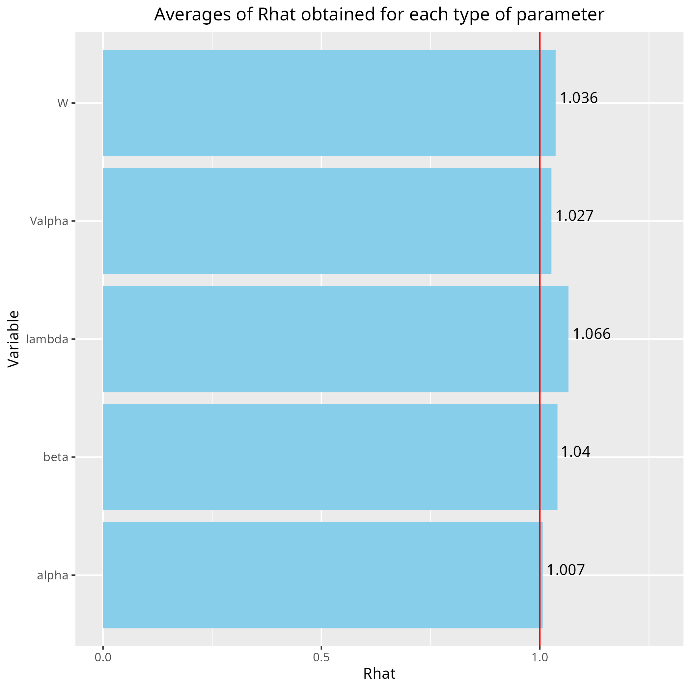

 
```{r setup, include=FALSE}
library(knitr)
library(kableExtra)
knitr::opts_chunk$set(
fig.align = "center",
fig.width = 6, fig.height = 6,
cache = TRUE,
collapse = TRUE,
comment = "#>",
eval=FALSE,
highlight = TRUE
)
```

# Generating data for a Hierarchical Gaussian Linear Regression

## Binomial model for presence-absence data

We consider a latent variable model (LVM) to account for species co-occurrence on all sites [@Warton2015]. 

$$y_{ij} \sim \mathcal{B}ernoulli(\theta_{ij})$$

$$ \mathrm{g}(\theta_{ij}) =\alpha_i + X_i\beta_j + W_i\lambda_j $$

- $\mathrm{g}(\cdot)$: Link function probit.
- $\alpha_i$: Site random effect with $\alpha_i \sim \mathcal{N}(0, V_{\alpha})$. Corresponds to a mean suitability for site $i$.
- $X_i$: Vector of explanatory variables for site $i$ (including intercept).
- $\beta_j$: Effects of the explanatory variables on the probability of presence of species $j$.
- $W_i$: Vector of random latent variables for site $i$. $W_i \sim N(0, 1)$. The number of latent variables must be fixed by the user (default to 2).
- $\lambda_j$: Effects of the latent variables on the probability of presence of species $j$. Also known as "factor loadings" [@Warton2015].

This model is equivalent to a multivariate GLMM $\mathrm{g}(\theta_{ij}) =\alpha_i + X_i.\beta_j + u_{ij}$, where $u_{ij} \sim \mathcal{N}(0, \Sigma)$ with the constraint that the variance-covariance matrix $\Sigma = \Lambda \Lambda^{\prime}$, where $\Lambda$ is the full matrix of factor loadings, with the $\lambda_j$ as its columns. 

## Data-set simulation 

We generate presence-absence data following this generalized multivariate linear model with a probit link function, which includes latent variables and random site effect. 

```{r simulated-data, eval=TRUE}
# Variables
n_species <- 30
n_sites <- 100
n_p <- 3  # Number of explanatory variables (including intercept)
n_q <- 2  # Number of latent variables
V_alpha_target <- 0.1  # Variance of random site effects
seed <- 1234

# Set seed
set.seed(seed)

# Explanatory variables X
x <- matrix(rnorm(n_sites * (n_p - 1), 0, 1), nrow=n_sites, ncol=(n_p - 1))
X <- cbind(rep(1, n_sites), x)
colnames(X) <- c("Intercept", paste0("x", 1:(n_p-1)))
rownames(X) <- paste("site", 1:n_sites, sep="_")

# Latent factors W
W <- matrix(rnorm(n_sites * n_q, 0, 1), nrow=n_sites, ncol=n_q)

# Fixed species effect beta 
beta_target <- matrix(runif(n_species * n_p, -1, 1), nrow=n_p, ncol=n_species)

# Factor loadings lambda  
mat0 <- matrix(runif(n_species * n_q, -1, 1), nrow=n_q, ncol=n_species)
axis_imp <- seq(n_q, 1, -1)  ## Decreasing importance of the latent axis
mat <- mat0 * axis_imp
lambda_target <- matrix(0, n_q, n_species)
lambda_target[upper.tri(mat, diag=TRUE)] <- mat[upper.tri(mat, diag=TRUE)]
# Large positive values on the diagonal
diag(lambda_target) <- n_q:1

# Random site effect alpha
alpha_target <- rnorm(n_sites, mean=0, sd=sqrt(V_alpha_target))

# Simulation of response data with probit link
# Latent variable Z
e <- matrix(rnorm(n_species * n_sites, 0, 1), n_sites, n_species)
probit_theta <- alpha_target + X %*% beta_target + W %*% lambda_target
Z <- probit_theta + e
# Presence-absence matrix Y
Y <- matrix(0, n_sites, n_species)
Y[Z > 0] <- 1
Y <- data.frame(Y)
colnames(Y) <- paste("sp", 1:n_species, sep="_")
rownames(Y) <- paste("site", 1:n_sites, sep="_")
```

# Fitting joint Species Distribution Models in parallel

We simulate in parallel two Monte-Carlo Markov chains (MCMC) of parameters values for this binomial model, using the R packages  `doParallel` and `foreach` in a first step and the `snow` and `snowfall` packages in a second step. 

## Using `doParallel` and `foreach`

We estimate the model parameters with the function `jSDM_binomial_probit()`. 

```{r chains-probit-1}
# Loading libraries
library(jSDM)
library(parallel)
library(doParallel)

# Make a cluster for parallel MCMCs
n_chains <- 4
n_cores <- n_chains ## One core for each MCMC chains
clust <- makeCluster(n_cores)
registerDoParallel(clust)

# Starting parameters 
alpha_start <- c(-0.2, -0.1, 0.1, 0.2)
beta_start <- c(-1, -0.5, 0.5, 1)
W_start <- c(-0.2, -0.1, 0.1, 0.2)
V_alpha_start <- c(0.01, 0.05, 0.1, 0.2)

# Starting parameters for lambda
## First option
mat <- replicate(n_chains, matrix(runif(n_q*n_species, min=-0.1, max=0.1), nrow=n_q), simplify=FALSE)
form_lambda_start <- function(mat, n_species, n_q) {
  r <- matrix(0, n_q, n_species)
  r[upper.tri(mat, diag=TRUE)] <- mat[upper.tri(mat, diag=TRUE)]
  diag(r) <- (n_q:1) * runif(1, min=1, max=2)
  return(r)
}
lambda_start <- lapply(mat, form_lambda_start, n_species=n_species, n_q=n_q)
# Second option
# lambda_start <- rep(0, n_chains)

# Seeds
seed_mcmc <- c(1234, 2134, 3214, 4231)
```

```{r mod-probit-1}
# Model
mod_probit_1 <-
  foreach(i=1:nchains) %dopar% {
    # Infering model parameters
    mod <- jSDM::jSDM_binomial_probit(
      # Iterations
      burnin=1000, mcmc=1000, thin=1,
      # Data
      presence_data=Y,
      site_data=X[, -1],
      site_formula=~.,
      # Model specification 
      n_latent=n_q,
      site_effect="random",
      # Priors
      mu_beta=0, V_beta=1,
      mu_lambda=0, V_lambda=1,
      shape_Valpha=0.5, 
      rate_Valpha=0.0005,
      # Starting values
      beta_start=beta_start[i],
      lambda_start=lambda_start[[i]],
      W_start=W_start[i],
      alpha_start=alpha_start[i],
      V_alpha=V_alpha_start[i],
      # Other
      seed=seed_mcmc[i],
      verbose = 1
    )
    return(mod)
  }
# Stop cluster
stopCluster(clust)
```

```{r save-output-content}
# Output content
n_chains <- length(mod_probit_1)
mod <- mod_probit_1[[1]]
str_mod <- paste(capture.output(str(mod, max.level = 1)), collapse="\n")
save(n_chains, str_mod, file="jSDM_in_parallel_files/output.rda")
```

```{r show-output-content, eval=TRUE}
# Show output content
load("jSDM_in_parallel_files/output.rda")
cat("number of chains :", n_chains,"\n")
cat("content of each chain :", str_mod,"\n")
```


# Evaluation of MCMC convergence 

## The Gelman–Rubin convergence diagnostic

### Definition 

The Gelman–Rubin diagnostic evaluates MCMC convergence by analyzing the difference between multiple Markov chains. The convergence is assessed by comparing the estimated between-chains and within-chain variances for each model parameter. Large differences between these variances indicate non convergence. See @Gelman1992 and @Brooks1998 for the detailed description of the method.

Suppose we have $M$ chains, each of length $N$, although the chains may be of different lengths. The same-length assumption simplifies the formulas and is used for convenience. For a model parameter $\theta$, let $\left(\theta_{𝑚t}\right)_{t=1}^N$ be the $𝑚$th simulated chain, $𝑚=1,\dots,𝑀$.  
Let $\hat{\theta}_𝑚=\frac{1}{N}\sum\limits_{t=1}^N \hat{\theta}_{mt}$ and $\hat{\sigma}^2_𝑚=\frac{1}{N-1}\sum\limits_{t=1}^N (\hat{\theta}_{mt}-\hat{\theta}_𝑚)^2$ be the sample posterior mean and variance of the $𝑚$th chain, and let the overall sample posterior mean be $\hat{\theta}=\frac{1}{𝑀}\sum\limits_{m=1}^𝑀 \hat{\theta}_m$.

The between-chains and within-chain variances are given by
$$B=\frac{N}{M-1}\sum\limits_{m=1}^𝑀 (\hat{\theta}_m - \hat{\theta})^2$$
$$W=\frac{1}{M}\sum\limits_{m=1}^𝑀\hat{\sigma}^2_m$$

Under certain stationarity conditions, the pooled variance : 
 
$$\hat{V}=\frac{N-1}{N}W + \frac{M+1}{MN}B$$
 
is an unbiased estimator of the marginal posterior variance of $\theta$ (@Gelman1992). The potential scale reduction factor (PSRF) is defined to be the ratio of $\hat{𝑉}$ and $𝑊$. If the $𝑀$ chains have converged to the target posterior distribution, then PSRF should be close to 1. The article @Brooks1998 corrected the original PSRF by accounting for sampling variability as follows:
$$\hat{R}= \sqrt{\frac{\hat{d}+3}{\hat{d}+1}\frac{\hat{V}}{W}}$$

where $\hat{d}$  is the degrees of freedom estimate of a $𝑡$ distribution.

PSRF estimates the potential decrease in the between-chains variability $𝐵$ with respect to the within-chain variability $𝑊$. If $\hat{R}$ is large, then longer simulation sequences are expected to either decrease $𝐵$ or increase $𝑊$ because the simulations have not yet explored the full posterior distribution. As the article @Brooks1998 have suggested, if $\hat{R} < 1.2$ for all model parameters, one can be fairly confident that convergence has been reached. Otherwise, longer chains or other means for improving the convergence may be needed. Even more reassuring is to apply the more stringent condition $\hat{R} < 1.1$.

### Compute $\hat{R}$

We evaluate the convergence of the MCMC output in which four parallel chains are run (with starting values that are over dispersed relative to the posterior distribution).
Convergence is diagnosed when the four chains have ‘forgotten’ their initial values, and the output from all chains is indistinguishable.
If the convergence diagnostic gives values of potential scale reduction factor (PSRF) or $\hat{R}$ substantially above 1, its indicates lack of convergence.

```{r MCMC-convergence-randsite-lv, echo=TRUE}
mod_probit <- mod_probit_1
burnin <- mod_probit[[1]]$model_spec$burnin
ngibbs <- burnin + mod_probit[[1]]$model_spec$mcmc
thin <-  mod_probit[[1]]$model_spec$thin
require(coda)
arr2mcmc <- function(x) {
  return(mcmc(as.data.frame(x),
              start=burnin+1 , end=ngibbs, thin=thin))
}

# MCMC lists
mcmc_list_alpha <- mcmc.list(lapply(lapply(mod_probit,"[[","mcmc.alpha"), arr2mcmc))
mcmc_list_V_alpha <- mcmc.list(lapply(lapply(mod_probit,"[[","mcmc.V_alpha"), arr2mcmc))
mcmc_list_lv <- mcmc.list(lapply(lapply(mod_probit,"[[","mcmc.latent"), arr2mcmc))
mcmc_list_deviance <- mcmc.list(lapply(lapply(mod_probit,"[[","mcmc.Deviance"), arr2mcmc))
mcmc_list_param <- mcmc.list(lapply(lapply(mod_probit,"[[","mcmc.sp"), arr2mcmc))
mcmc_list_lambda <- mcmc.list(lapply(mcmc_list_param[,grep("lambda", 
                                                           colnames(mcmc_list_param[[1]]),
                                                           value=TRUE)], arr2mcmc))
mcmc_list_deviance <- mcmc.list(lapply(lapply(mod_probit,"[[","mcmc.Deviance"), arr2mcmc))
nsamp <- nrow(mcmc_list_alpha[[1]])

# psrf gelman indice 
psrf_alpha <- mean(gelman.diag(mcmc_list_alpha,
                               multivariate=FALSE)$psrf[,2])
psrf_V_alpha <- gelman.diag(mcmc_list_V_alpha)$psrf[,2]
psrf_beta <- mean(gelman.diag(mcmc_list_param[, grep("beta", colnames(mcmc_list_param[[1]]))],
                              multivariate=FALSE)$psrf[,2])
psrf_lambda <- mean(gelman.diag(mcmc_list_lambda,
                                multivariate=FALSE)$psrf[,2], na.rm=TRUE)
psrf_lv <- mean(gelman.diag(mcmc_list_lv,
                            multivariate=FALSE)$psrf[,2 ])
save(psrf_lambda, psrf_lv, psrf_alpha, psrf_V_alpha, psrf_beta,
     file="jSDM_in_parallel_cache/psrf.rda")

Rhat <- data.frame(Rhat=c(psrf_alpha, psrf_V_alpha, psrf_beta, psrf_lambda, psrf_lv),
                   Variable=c("alpha", "Valpha", "beta", "lambda", "W"))

# Barplot
library(ggplot2)
ggplot(Rhat, aes(x=Variable, y=Rhat)) + 
  ggtitle("Averages of Rhat obtained for each type of parameter") +
  theme(plot.title = element_text(hjust = 0.5, size=13)) +
  geom_bar(fill="skyblue", stat = "identity") +
  geom_text(aes(label=round(Rhat,3)), vjust=0, hjust=-0.1) +
  geom_hline(yintercept=1, color='red') +
  ylim(0, max(Rhat$Rhat)+0.2) +
  coord_flip()
```

```{r Rhat-plot, echo=FALSE, out.width=700, eval=TRUE}

```

We can see that the $\hat{R}$ are very close to 1 for the species effects $\beta$, the site effects $\alpha$ and their variance $V_{alpha}$. The $\hat{R}$ obtained for the latent variables $W$ and the factor loadings $\lambda$ are also very close to 1. We can therefore be fairly confident that convergence has been achieved for all the parameters.

# Representation of results

We visually evaluate the convergence of MCMCs by representing the trace and density *a posteriori* of some estimated parameters.

```{r est-probit}
## Plot trace and posterior distributions 
# for two first species
par(mfrow=c(2,2), cex.main=0.9)
plot(mcmc_list_param[,1:((n_p+n_q)*2)],
     auto.layout=FALSE)
# for two first sites 
plot(mcmc_list_lv[,c(1:2,n_sites+1:2)],
     auto.layout=FALSE)
par(mfrow=c(2,2))
coda::traceplot(mcmc_list_V_alpha)
coda::densplot(mcmc_list_V_alpha)
abline(v=V_alpha.target, col='red')
legend("topright", legend="V_alpha.target",
       lwd=1, col='red', cex=0.7, bty="n")
plot(mcmc_list_alpha[,c(1,2)],
     auto.layout=FALSE)
# Deviance 
plot(mcmc_list_deviance,
     auto.layout=FALSE)
```

```{r est-probit-plot, echo=FALSE, out.width=800, eval=TRUE}
knitr::include_graphics(paste0("jSDM_in_parallel_files/figure-html/est-probit-", 1:9, ".png"))
```

Overall, the traces and the densities of the parameters indicate the convergence of the algorithm. Indeed, we observe on the traces that the values oscillate around averages without showing an upward or downward trend and we see that the densities are quite smooth and for the most part of Gaussian form.

# Accuracy of predictions 

We evaluate the accuracy of the estimated parameters by plotting them against the parameters used to simulate the data-set.

```{r obs-fitted}
## Predictive posterior mean for each observation
n_chains <- length(mod_probit)

# Species effects beta and factor loadings lambda
par(mfrow=c(1,2))
for (i in 1:n_chains){
  param <- matrix(unlist(lapply(mod_probit[[i]]$mcmc.sp,colMeans)), nrow=n_species, byrow=T)
  if(i==1){
    plot(t(beta_target), param[,1:n_p],
         main="species effect beta",
         xlab ="obs", ylab ="fitted")
    abline(a=0,b=1,col='red')
  }
  else{
    points(t(beta_target), param[,1:n_p], col=2:n_chains)
  }
}
for (i in 1:n_chains){
  param <- matrix(unlist(lapply(mod_probit[[i]]$mcmc.sp,colMeans)), nrow=n_species, byrow=T)
  if (i==1){
    plot(t(lambda_target), param[,(n_p+1):(n_p+n_q)],
         main="factor loadings lambda",
         xlab ="obs", ylab ="fitted")
    abline(a=0,b=1,col='red')
  } else {
    points(t(lambda_target), param[,(n_p+1):(n_p+n_q)],
           col=2:n_chains)
  }
}

# W latent variables
par(mfrow=c(1,2))
mean_W <- matrix(0, n_sites,n_q)
for (l in 1:n_q) {
  for (i in 1:n_chains){
    mean_W[,l] <- summary(mod_probit[[i]]$mcmc.latent[[paste0("lv_",l)]])[[1]][,"Mean"]
    
    if (i==1){
      plot(W[,l], mean_W[,l],
           main = paste0("Latent variable W_", l),
           xlab ="obs", ylab ="fitted")
      abline(a=0,b=1,col='red')
    }
    else{
      points(W[,l], mean_W[,l],col=2:n_chains)
    }
  }
}

# W.lambda
par(mfrow=c(1,2))
for (i in 1:n_chains){
  if (i==1){
    plot(W%*%lambda_target,mean_W%*%t(param[,(n_p+1):(n_p+n_q)]),
         main = "W.lambda",
         xlab ="obs", ylab ="fitted")
    abline(a=0,b=1,col='red')
  }
  else{
    points(W%*%lambda_target,mean_W%*%t(param[,(n_p+1):(n_p+n_q)])
           ,col=2:n_chains)
  }
}

#= Random site effect alpha 
plot(alpha_target, colMeans(mod_probit[[1]]$mcmc.alpha),
     xlab ="obs", ylab ="fitted", main="site effect alpha")
for (i in 2:n_chains){
  points(alpha_target, colMeans(mod_probit[[i]]$mcmc.alpha), col=2:n_chains)
}
abline(a=0,b=1,col='red')

#= Predictions 
par(mfrow=c(1,2))
plot(probit_theta, mod_probit[[1]]$probit_theta_latent,
     main="probit(theta)",xlab="obs",ylab="fitted")
for (i in 2:n_chains){
  ## probit(tetha)
  points(probit_theta, mod_probit[[i]]$probit_theta_latent,col=c(2:n_chains))
}
abline(a=0,b=1,col='red')
## Z
plot(Z, mod_probit[[1]]$Z_latent,
     main="Z_latent", xlab="obs", ylab="fitted")
for (i in 2:n_chains){
  points(Z, mod_probit[[i]]$Z_latent, col=2:n_chains)
}
abline(a=0,b=1,col='red')
```

```{r obs-fitted-plot, echo=FALSE, out.width=800, eval=TRUE}
knitr::include_graphics(paste0("jSDM_in_parallel_files/figure-html/obs-fitted-", 1:4, ".png"))
```

On the above figures, the estimated parameters are close to the expected values if the points are near the red line representing the identity function ($y=x$). 

# References
