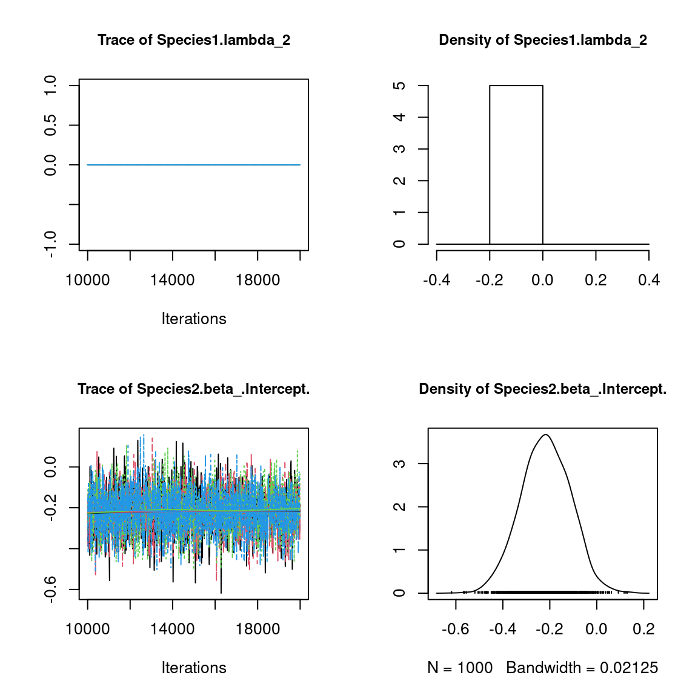
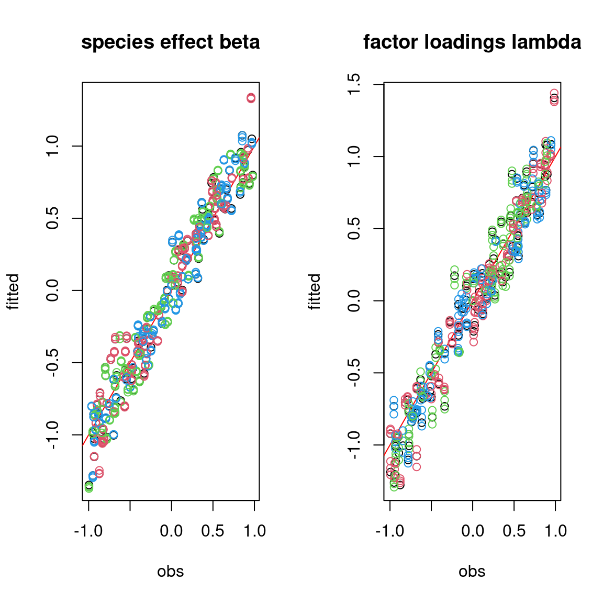

 
```{r setup, include=FALSE}
library(knitr)
library(kableExtra)
knitr::opts_chunk$set(
fig.align = "center",
fig.width = 6, fig.height = 6,
cache = TRUE,
collapse = TRUE,
comment = "#>",
eval=FALSE,
highlight = TRUE
)
```

# Generating data for a Hierarchical Gaussian Linear Regression

## Binomial model for presence-absence data

We consider a latent variable model (LVM) to account for species co-occurrence on all sites [@Warton2015]. 

$$y_{ij} \sim \mathcal{B}ernoulli(\theta_{ij})$$

$$ \mathrm{g}(\theta_{ij}) =\alpha_i + X_i\beta_j + W_i\lambda_j $$

- $\mathrm{g}(\cdot)$: Link function probit.
- $\alpha_i$: Site random effect with $\alpha_i \sim \mathcal{N}(0, V_{\alpha})$. Corresponds to a mean suitability for site $i$.
- $X_i$: Vector of explanatory variables for site $i$ (including intercept).
- $\beta_j$: Effects of the explanatory variables on the probability of presence of species $j$.
- $W_i$: Vector of random latent variables for site $i$. $W_i \sim N(0, 1)$. The number of latent variables must be fixed by the user (default to 2).
- $\lambda_j$: Effects of the latent variables on the probability of presence of species $j$. Also known as "factor loadings" [@Warton2015].

This model is equivalent to a multivariate GLMM $\mathrm{g}(\theta_{ij}) =\alpha_i + X_i.\beta_j + u_{ij}$, where $u_{ij} \sim \mathcal{N}(0, \Sigma)$ with the constraint that the variance-covariance matrix $\Sigma = \Lambda \Lambda^{\prime}$, where $\Lambda$ is the full matrix of factor loadings, with the $\lambda_j$ as its columns. 

## Data-set simulation 

We generate presence-absence data following this generalized multivariate linear model with a probit link function, which includes latent variables and random site effect. 

```{r load-jSDM}
#=================
#== load libraries
library(jSDM)
```

```{r simulated-data}
#==================
#== Data simulation
#= Number of sites
nsite <- 210

#= Set seed for repeatability
seed <- 123
set.seed(seed)

#= Number of species
nsp <- 70

#= Number of latent variables
n_latent <- 2

#= Ecological process (suitability)
x1 <- rnorm(nsite,0,1)
x2 <- rnorm(nsite,0,1)
X <- cbind(rep(1,nsite),x1,x2)
np <- ncol(X)
#= Latent variables W
W <- cbind(rnorm(nsite,0,1),rnorm(nsite,0,1))
data <- cbind (X,W)
#= Fixed species effect beta 
beta.target <- t(matrix(runif(nsp*ncol(X),-1,1),
                        byrow=TRUE, nrow=nsp))
#= Factor loading lambda  
l.zero <- 0
l.diag <- runif(2,0,1)
l.other <- runif(nsp*n_latent-3,-1,1)
lambda.target <- t(matrix(c(l.diag[1],l.zero,
                            l.other[1],l.diag[2],l.other[-1]), byrow=TRUE, nrow=nsp))
param.target <- rbind(beta.target,lambda.target)
#= Variance of random site effect 
V_alpha.target <- 0.5
#= Random site effect 
alpha.target <- rnorm(nsite,0,sqrt(V_alpha.target))
#= probit(theta)
probit_theta <- X%*%beta.target + W%*%lambda.target + alpha.target
# Latent variable Z 
e <- matrix(rnorm(nsp*nsite,0,1),nsite,nsp)
Z_true <- probit_theta + e
# Presence-absence matrix Y
Y <- matrix (NA, nsite,nsp)
for (i in 1:nsite){
  for (j in 1:nsp){
    if ( Z_true[i,j] > 0) {Y[i,j] <- 1}
    else {Y[i,j] <- 0}
  }
}

colnames(Y) <- paste0("Species", 1:nsp)
save(Y, Z_true, alpha.target, V_alpha.target, beta.target, probit_theta
     ,X, lambda.target, np , nsite, nsp, n_latent, W
     ,file="jSDM_in_parallel_files/sim_data.rda")
```

We look at the number of observations per site.

```{r presence-data, eval=TRUE}

load("jSDM_in_parallel_files/sim_data.rda")
head(Y)
# Number of observations per site
nobs_site <- apply(Y, 1, sum)
nobs_site
# Number of observations per species
nobs_sp <- apply(Y, 2, sum)
nobs_sp

# Remove species with less than 5 presences
rare_sp <- which(apply(Y, 2, sum) < 5) 
if(length(rare_sp)!=0){
  Y <- Y[, -rare_sp]
  probit_theta <- probit_theta[, -rare_sp]
  Z_true <- Z_true[, -rare_sp] 
  nsp <- ncol(Y)
  nsp
  nsite <- nrow(Y)
  nsite
}
```

# Fitting joint Species Distribution Models in parallel

We simulate in parallel two Monte-Carlo Markov chains (MCMC) of parameters values for this binomial model, using the R packages  `doParallel` and `foreach` in a first time and `snow` and `snowfall` in a second time. 

## Using `doParallel` and `foreach`

We estimate the model parameters with the function `jSDM_binomial_probit()`. 

```{r chains-probit-1}

library(jSDM)
library(parallel)
library(doParallel)
## Make a cluster for parallel MCMCs
nchains <- 2
ncores <- nchains ## One core for each MCMC chains
clust <- makeCluster(ncores)
registerDoParallel(clust)

# Number of latent variables
n_latent <- 2

# Starting parameters 
lambda_start <- c(-1,1)
beta_start <- c(-1,1)
W_start <- c(0.1,-0.1)
alpha_start <- c(-0.5, 0.5)
V_alpha_start <- c(1, 0.5)
#formatting of starting parameters
#and constraints on lambda generated by the function 
# Seeds
seed_mcmc <- c(1234, 4321)
```


```{r mod-probit-1}
# Model
mod_probit_1 <-
  foreach (i = 1:nchains) %dopar% {
    # Infering model parameters
    mod <- jSDM::jSDM_binomial_probit(
      # Iterations
      burnin=10000, mcmc=10000, thin=10,
      # Data
      presence_data=Y,
      site_data = X[,-1],
      site_formula = ~.,
      # Model specification 
      n_latent=n_latent,
      site_effect="random",
      # Priors
      V_beta = 1,
      mu_beta = 0,
      mu_lambda = 0,
      V_lambda= 1,
      shape=0.5, 
      rate=0.0005,
      # Starting values
      beta_start = beta_start[i],
      lambda_start = lambda_start[i],
      W_start=W_start[i],
      alpha_start = alpha_start[i],
      V_alpha = V_alpha_start[i],
      # Other
      seed = seed_mcmc[i],
      verbose = 1
    )
    return(mod)
  }
# Stop cluster
# stopCluster(clust)
```

## Using `snow` and `snowfall`

```{r chains-probit-2}
## load libraries

library(snow)
library(snowfall)

## Setting the number of CPUs to be 2
sfInit(parallel=TRUE, cpus=2)

## Assigning the jSDM library to each CPU
sfLibrary(jSDM)

# Number of latent variables
n_latent <- 2

# Starting parameters 
# formatting of starting parameters
# and constraints on lambda generated by the function 
lambda_start <- c(-0.5, 0.5)
beta_start <- c(-0.5,0.5)
W_start <- c(0.2,-0.2)
alpha_start <- c(-0.2, 0.2)
V_alpha_start <- c(0.2, 0.7)

# Seeds
seed_mcmc <- c(123, 321)

# list of data and starting parameters 
listData <- list(Y=Y, X=X[,-1], beta_start, lambda_start, W_start, alpha_start, V_alpha_start, seed_mcmc)
```


```{r mod-probit-2}

## Defining the function that will run MCMC on each CPU
# Arguments:
# i - will be 1 or 2
mod.MCMChregress <- function (i,listData) {
  # data
  Y <- listData[[1]]
  X <- listData[[2]]
  beta_start <- listData[[3]]
  lambda_start <- listData[[4]]
  W_start <- listData[[5]]
  alpha_start <- listData[[6]]
  V_alpha_start <- listData[[7]]
  seed_mcmc <- listData[[8]]
  # Infering model parameters
  mod <- jSDM_binomial_probit(
    # Iterations
    burnin=10000, mcmc=10000, thin=10,
    # Data
    presence_data=Y,
    site_data = X,
    site_formula = ~.,
    # Model specification 
    n_latent=2,
    site_effect="random",
    # Priors
    V_beta = 1,
    mu_beta = 0,
    mu_lambda = 0,
    V_lambda= 1,
    shape=0.5, 
    rate=0.0005,
    # Starting values
    beta_start = beta_start[i],
    lambda_start = lambda_start[i],
    W_start = W_start[i],
    alpha_start = alpha_start[i],
    V_alpha = V_alpha_start[i],
    # Other
    seed = seed_mcmc[i],
    verbose = 1
  )
  return(mod)
}# Starting parameters 

## Calling the sfLapply function that will run on each of the CPUs
mod_probit_2 <- sfLapply(1:2, fun=mod.MCMChregress, listData=listData)

## Stop cluster
#sfStop()
# Output
n_chains <- length(c(mod_probit_1, mod_probit_2))
mod <- mod_probit_1[[1]]
str_mod <- paste(capture.output(str(mod, max.level = 1)), collapse="\n")
save(n_chains, str_mod, file="jSDM_in_parallel_files/output.rda")
```

```{r output-probit, eval=TRUE}
load("jSDM_in_parallel_files/output.rda")
cat("number of chains :", n_chains,"\n")
cat("content of each chain :", str_mod,"\n")
```

# Evaluation of MCMC convergence 

We evaluate the convergence of the MCMC output in which four parallel chains are run with starting values that are overdispersed relative to the posterior distribution.
Convergence is diagnosed when the four chains have ‘forgotten’ their initial values, and the output from all chains is indistinguishable.
If the convergence diagnostic gives values of potential scale reduction factor or psrf
substantially above 1, its indicates lack of convergence.

```{r MCMC-convergence-randsite-lv, echo=TRUE}
require(coda)
arr2mcmc <- function(x) {
  return(mcmc(as.data.frame(x)))
}
mod_probit <- c(mod_probit_1,mod_probit_2)
# MCMC lists
mcmc_list_alpha <- mcmc.list(lapply(lapply(mod_probit,"[[","mcmc.alpha"), arr2mcmc))
mcmc_list_V_alpha <- mcmc.list(lapply(lapply(mod_probit,"[[","mcmc.V_alpha"), arr2mcmc))
mcmc_list_lv <- mcmc.list(lapply(lapply(mod_probit,"[[","mcmc.latent"), arr2mcmc))
mcmc_list_centered_lv <- mcmc.list(lapply(lapply(mcmc_list_lv, scale, scale=FALSE),arr2mcmc))
mcmc_list_deviance <- mcmc.list(lapply(lapply(mod_probit,"[[","mcmc.Deviance"), arr2mcmc))
mcmc_list_param <- mcmc.list(lapply(lapply(mod_probit,"[[","mcmc.sp"), arr2mcmc))
mcmc_list_centered_lambda <- mcmc.list(lapply(lapply(mcmc_list_param[,grep("lambda", grep("sp_1.lambda_2", colnames(mcmc_list_param[[1]]), invert=TRUE, value=TRUE),value=TRUE)], scale, scale=FALSE),arr2mcmc))
mcmc_list_deviance <- mcmc.list(lapply(lapply(mod_probit,"[[","mcmc.Deviance"), arr2mcmc))
nsamp <- nrow(mcmc_list_alpha[[1]])
# psrf gelman indice 
psrf_alpha <- gelman.diag(mcmc_list_alpha, transform=TRUE)$mpsrf
#max(gelman.diag(mcmc_list_alpha, multivariate = FALSE)$psrf)
psrf_V_alpha <- gelman.diag(mcmc_list_V_alpha)$psrf
psrf_beta <- gelman.diag(mcmc_list_param[,grep("beta",colnames(mcmc_list_param[[1]]))])$mpsrf
psrf_lambda <- gelman.diag(mcmc_list_centered_lambda)$mpsrf
psrf_lv <- gelman.diag(mcmc_list_centered_lv)$mpsrf
save(psrf_lambda, psrf_lv, psrf_alpha, psrf_V_alpha, psrf_beta,
     file="jSDM_in_parallel_files/psrf.rda")
```

```{r psrf, echo=FALSE, eval=TRUE}

load("jSDM_in_parallel_files/psrf.rda")
# display gelman indice :  potential scale reduction factor or psrf
cat("psrf centered latent variables:", psrf_lv, "\n")
cat("psrf centered lambda:", psrf_lambda, "\n")
cat("psrf alpha:", psrf_alpha, "\n")
cat("psrf V_alpha:", psrf_V_alpha[1], "\n")
cat("psrf beta:", psrf_beta, "\n")
```


# Representation of results

```{r est-probit}
## Plot trace and posterior distributions 
# for two first species
plot(mcmc_list_param[,1:((np+n_latent)*2)])
# for two first sites 
plot(mcmc_list_lv[,c(1:2,nsite+1:2)])
par(mfrow=c(1,2))
coda::traceplot(mcmc_list_V_alpha)
coda::densplot(mcmc_list_V_alpha)
abline(v=V_alpha.target, col='red')
legend("topright", legend="V_alpha.target",
       lwd=1,col='red', cex=0.6, bty="n")

plot(mcmc_list_alpha[,c(1,2)])
# Deviance 
plot(mcmc_list_deviance)
```

```{r est-probit-plot, echo=FALSE, out.width=800, eval=TRUE}
knitr::include_graphics("jSDM_in_parallel_files/figure-html/est-probit-1.png")
knitr::include_graphics("jSDM_in_parallel_files/figure-html/est-probit-2.png")

knitr::include_graphics("jSDM_in_parallel_files/figure-html/est-probit-4.png")
knitr::include_graphics("jSDM_in_parallel_files/figure-html/est-probit-5.png")

knitr::include_graphics("jSDM_in_parallel_files/figure-html/est-probit-7.png")
```

# Accuracy of predictions 

```{r obs-fitted}
## Predictive posterior mean for each observation
nchains <- length(mod_probit)
# Species effects beta and factor loadings lambda
par(mfrow=c(1,2))
for (i in 1:nchains){
  param <- matrix(unlist(lapply(mod_probit[[i]]$mcmc.sp,colMeans)), nrow=nsp, byrow=T)
  if(i==1){
    plot(t(beta.target), param[,1:np],
         main="species effect beta",
         xlab ="obs", ylab ="fitted")
    abline(a=0,b=1,col='red')
  }
  else{
    points(t(beta.target), param[,1:np], col=2:nchains)
  }
}
for (i in 1:nchains){
  param <- matrix(unlist(lapply(mod_probit[[i]]$mcmc.sp,colMeans)), nrow=nsp, byrow=T)
  if (i==1){
    plot(t(lambda.target), param[,(np+1):(np+n_latent)],
         main="factor loadings lambda",
         xlab ="obs", ylab ="fitted")
    abline(a=0,b=1,col='red')
  } else {
    points(t(lambda.target), param[,(np+1):(np+n_latent)],
           col=2:nchains)
  }
}
## W latent variables
par(mfrow=c(1,2))
mean_W <- matrix(0,nsite,n_latent)
for (l in 1:n_latent) {
  for (i in 1:nchains){
    mean_W[,l] <- summary(mod_probit[[i]]$mcmc.latent[[paste0("lv_",l)]])[[1]][,"Mean"]
    
    if (i==1){
      plot(W[,l], mean_W[,l],
           main = paste0("Latent variable W_", l),
           xlab ="obs", ylab ="fitted")
      abline(a=0,b=1,col='red')
    }
    else{
      points(W[,l], mean_W[,l],col=2:nchains)
    }
  }
}

#= W.lambda
par(mfrow=c(1,2))
for (i in 1:nchains){
  if (i==1){
    plot(W%*%lambda.target,mean_W%*%t(param[,(np+1):(np+n_latent)]),
         main = "W.lambda",
         xlab ="obs", ylab ="fitted")
    abline(a=0,b=1,col='red')
  }
  else{
    points(W%*%lambda.target,mean_W%*%t(param[,(np+1):(np+n_latent)])
           ,col=2:nchains)
  }
}

#= Random site effect alpha 
plot(alpha.target, colMeans(mod_probit[[1]]$mcmc.alpha),
     xlab ="obs", ylab ="fitted", main="site effect alpha")
for (i in 2:nchains){
  points(alpha.target, colMeans(mod_probit[[i]]$mcmc.alpha), col=2:nchains)
}
abline(a=0,b=1,col='red')

#= Predictions 
par(mfrow=c(1,2))
plot(probit_theta, mod_probit[[1]]$probit_theta_latent,
     main="probit(theta)",xlab="obs",ylab="fitted")
for (i in 2:nchains){
  ## probit(tetha)
  points(probit_theta, mod_probit[[i]]$probit_theta_latent,col=c(2:nchains))
}
abline(a=0,b=1,col='red')
## Z
plot(Z_true, mod_probit[[1]]$Z_latent,
     main="Z_latent", xlab="obs", ylab="fitted")
for (i in 2:nchains){
  points(Z_true, mod_probit[[i]]$Z_latent, col=2:nchains)
}
abline(a=0,b=1,col='red')
```

```{r obs-fitted-plot, echo=FALSE, out.width=800, eval=TRUE}

knitr::include_graphics("jSDM_in_parallel_files/figure-html/obs-fitted-2.png")
knitr::include_graphics("jSDM_in_parallel_files/figure-html/obs-fitted-3.png")
knitr::include_graphics("jSDM_in_parallel_files/figure-html/obs-fitted-4.png")
```

# References
