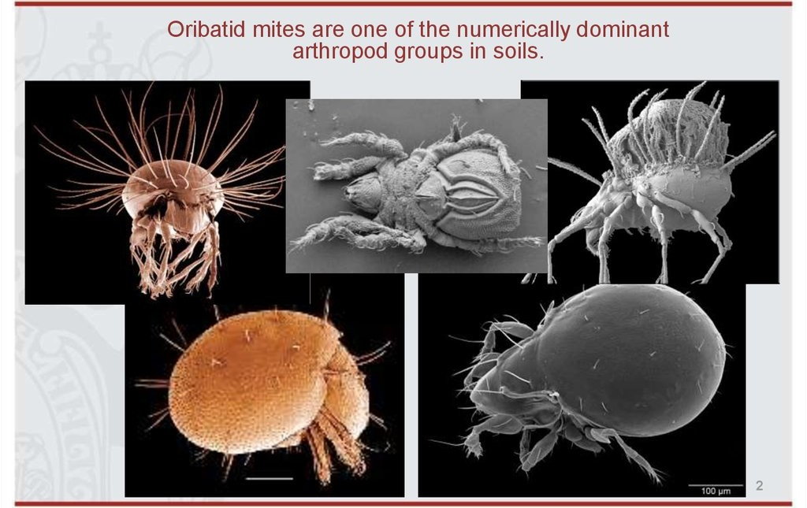

 
```{r setup, include=FALSE}
knitr::opts_chunk$set(
fig.align = "center",
fig.width = 6, fig.height = 6,
cache = FALSE,
collapse = TRUE,
comment = "#>",
highlight = TRUE
)
```


# Definition of the model 

$$ \mathrm{log}(\theta_{ij}) =\alpha_i + \beta_{0j}+X_i.\beta_j+ W_i.\lambda_j $$
     
- Link function logarithm : $\mathrm{log}: p \rightarrow \log(p)$. 

- Response variable: $Y=(y_{ij})^{i=1,\ldots,nsite}_{j=1,\ldots,nsp}$ with:

$$y_{ij} \sim \mathcal{P}oisson(\theta_{ij})$$. 

$$y_{ij}=\begin{cases}
    0 & \text{if species $j$ has been observed as absent at site $i$}\\
    n &  \text{if $n$ individuals of the species $j$ have been observed at the site $i$}.
    \end{cases}$$
    
- Latent variables: $W_i=(W_i^1,\ldots,W_i^q)$ where $q$ is the number of latent variables considered, which has to be fixed by the user (by default q=2).
We assume that $W_i \sim \mathcal{N}(0,I_q)$ and we define the associated coefficients: $\lambda_j=(\lambda_j^1,\ldots, \lambda_j^q)'$. We use a prior distribution $\mathcal{N}(0,10)$ for all lambdas not concerned by constraints to $0$ on upper diagonal and to strictly positive values on diagonal. 

- Explanatory variables: bioclimatic data about each site. $X=(X_i)_{i=1,\ldots,nsite}$ with $X_i=(x_i^1,\ldots,x_i^p)\in \mathbb{R}^p$ where $p$ is the number of bioclimatic variables considered.
The corresponding regression coefficients for each species $j$ are noted : $\beta_j=(\beta_j^1,\ldots,\beta_j^p)'$.

- $\beta_{0j}$ correspond to the intercept for species $j$ which is assume to be a fixed effect. We use a prior distribution $\mathcal{N}(0,100)$ for all betas. 

- $\alpha_i$ represents the random effect of site $i$ such as $\alpha_i \sim \mathcal{N}(0,V_{\alpha})$ and we assumed that $V_{\alpha} \sim \mathcal {IG}(\text{shape}=0.5, \text{rate}=0.005)$ as prior distribution by default. 

# Abundance data-set

(ref:cap-mites) **_Oribatid mites_** [@Borcard1994].

```{r mites-picture, echo=FALSE, out.width=500, out.height=400, fig.cap="(ref:cap-mites)"}

```

This data-set is available in the `jSDM` R package. It can be loaded with the `data` command. The \link{\code{mites}} data-set is in "wide" format: each line is a site and the abundance data are in columns.

This example data set is composed of 70 cores of mostly Sphagnum mosses collected on the territory of the Station de biologie des Laurentides of Université de Montréal, Québec, Canada in June 1989. 

The whole sampling area was 2.5 m x 10 m in size and thirty-five taxa were recognized as species, though many were not given a species name, owing to the incomplete stage of systematic knowledge of the North American Oribatid fauna.

The data set comprises the abundances of 35 morphospecies, 5 substrate and micritopographic variables, and the x-y Cartesian coordinates of the 70 sampling sites. 

See Borcard et al. (1992, 1994) for details.


```{r mites-data}
library(jSDM)
# mites data
data(mites, package="jSDM")
head(mites)
```

We rearrange the data in two data-sets: a first one for the abundance observations for each species (columns) at each site (rows), and a second one for the site characteristics.

We also normalize the continuous explicative variables to facilitate MCMC convergence. 

```{r arranging-mites-data}
# data.obs
PA_mites <- mites[,1:35]
# Remove species with less than 10 presences
rare_sp <- which(apply(PA_mites >0, 2, sum) < 10) 
PA_mites <- PA_mites[, -rare_sp]
# Normalized continuous variables
Env_mites  <- cbind(scale(mites[,c("density","water")]), mites[,c("substrate", "shrubs", "topo")])
str(Env_mites)
```

# Parameter inference

We use the `jSDM_poisson_log()` function to fit the jSDM (increase the number of iterations to achieve convergence). 

```{r jSDM-log}
mod_mites_jSDM_log <- jSDM_poisson_log(
  # Chains
  burnin=1000, mcmc=1000, thin=1,
  # Response variable 
  presence_site_sp=PA_mites, 
  # Explanatory variables 
  site_suitability = ~.,   
  site_data = Env_mites,
  # Model specification 
  n_latent=2, site_effect="random",
  # Starting values
  alpha_start=0, beta_start=0,
  lambda_start=0, W_start=0,
  V_alpha=1, 
  # Priors
  shape=0.5, rate=0.0005,
  mu_beta=0, V_beta=100,
  mu_lambda=0, V_lambda=10,
  # Various 
  ropt=0.44,
  seed=1234, verbose=1)
```

# Analysis of the results

```{r plot-results-log}
np <- nrow(mod_mites_jSDM_log$model_spec$beta_start)

## beta_j of the first species
par(mfrow=c(3,2))
for (p in 1:np) {
  coda::traceplot(coda::as.mcmc(mod_mites_jSDM_log$mcmc.sp[[paste0("sp_",1)]][,p]))
  coda::densplot(coda::as.mcmc(mod_mites_jSDM_log$mcmc.sp[[paste0("sp_",1)]][,p]), 
                 main = paste(colnames(mod_mites_jSDM_log$mcmc.sp[[paste0("sp_",1)]])[p],
                              ", species : ",1))
}

## lambda_j of the first two species
n_latent <- mod_mites_jSDM_log$model_spec$n_latent
par(mfrow=c(2,2))
for (j in 1:2) {
  for (l in 1:n_latent) {
    coda::traceplot(mod_mites_jSDM_log$mcmc.sp[[paste0("sp_",j)]][,np+l])
    coda::densplot(mod_mites_jSDM_log$mcmc.sp[[paste0("sp_",j)]][,np+l], 
                   main = paste(colnames(mod_mites_jSDM_log$mcmc.sp[[paste0("sp_",j)]])
                                [np+l], ", species : ",j))
  }
}
## Latent variables W_i for the first two sites
par(mfrow=c(2,2))
for (l in 1:n_latent) {
  for (i in 1:2) {
  coda::traceplot(mod_mites_jSDM_log$mcmc.latent[[paste0("lv_",l)]][,i],
                  main = paste0("Latent variable W_", l, ", site ", i))
  coda::densplot(mod_mites_jSDM_log$mcmc.latent[[paste0("lv_",l)]][,i],
                 main = paste0("Latent variable W_", l, ", site ", i))
  }
}

## alpha_i of the first two sites
plot(coda::as.mcmc(mod_mites_jSDM_log$mcmc.alpha[,1:2]))

## V_alpha
par(mfrow=c(2,2))
coda::traceplot(mod_mites_jSDM_log$mcmc.V_alpha)
coda::densplot(mod_mites_jSDM_log$mcmc.V_alpha)
## Deviance
coda::traceplot(mod_mites_jSDM_log$mcmc.Deviance)
coda::densplot(mod_mites_jSDM_log$mcmc.Deviance)

## probit_theta
par (mfrow=c(2,1))
hist(log(mod_mites_jSDM_log$theta_latent), main = "Predicted log theta", xlab ="predicted log theta")
hist(mod_mites_jSDM_log$theta_latent, main = "Predicted theta", xlab ="predicted theta")
```

# Matrice of correlations 

 After fitting the jSDM with latent variables, the **fullspecies residual correlation matrix** $R=(R_{ij})^{i=1,\ldots, nspecies}_{j=1,\ldots, nspecies}$ can bederived from the covariance in the latent variables such as : 
 $$\Sigma_{ij} = \begin{cases}
 \lambda_i .\lambda_j^T & \text{ if } i \neq j \\
  \lambda_i .\lambda_j^T + 1 & \text{ if } i=j
 \end{cases}$$, then we compute correlations from covariances :
  $$R_{i,j} = \frac{\Sigma_{ij}}{\sqrt{\Sigma _{ii}\Sigma _{jj}}}$$.

```{r correlation-matrix-log}
plot_residual_cor(mod_mites_jSDM_log, tl.cex=0.5)
```

# Predictions 

We use the `predict()` S3 method on the `mod_mites_jSDM_log` object of class `jSDM` to compute the mean (or expectation) of the posterior distributions obtained and get the expected values of model's parameters.

```{r predictions-log}
# Sites and species concerned by predictions :
## 35 sites among the 70
Id_sites <- sample.int(nrow(PA_mites), 35)
## 20 species among the 30 
Id_species <- sample(colnames(PA_mites),20)
# Simulate new observations of covariates on those sites 
simdata <- matrix(nrow=35, ncol = ncol(mod_mites_jSDM_log$model_spec$site_data))
colnames(simdata) <- colnames(mod_mites_jSDM_log$model_spec$site_data)
rownames(simdata) <- Id_sites
simdata <- as.data.frame(simdata)
simdata$density <- rnorm(35)
simdata$water <- rnorm(35)
simdata$substrate <- sample(c("inter", "litter", "peat", "sph1", "sph2", "sph3", "sph4"), 35, replace=T)
simdata$shrubs <- sample(c("none","many", "few"), 35, replace=T)
simdata$topo <- sample(c("blanket","hummock"), 35, replace=T)

# Predictions 
theta_pred <- predict(mod_mites_jSDM_log, newdata=simdata, Id_species=Id_species,
						   Id_sites=Id_sites, type="mean")
hist(theta_pred, main="Predicted theta with simulated data", xlab="predicted theta")
```

# References
